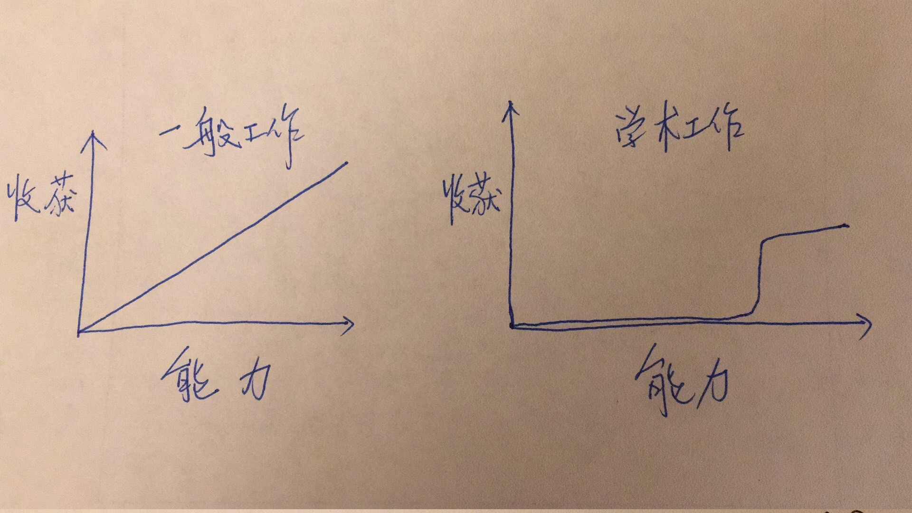

- [email](./email.md)

# Career

> how to become a programmer, software engineer, to be continued

软技能：代码之外的生存指南

[这十一条程序员必备软技能，你一定要知道](https://mp.weixin.qq.com/s?__biz=MzkyODE5NjU2Mw==&mid=2247484693&idx=1&sn=2fa7d5fe4e1d386ac07f07f3faee69b1&chksm=c21d37a9f56abebf0f0250a5ca3e230e11be62eed5e7b273fa5b220d6886e9e7a753a2467e7b&scene=21#wechat_redirect)

1. 转变心态：打工人 -> 企业 「如何经验好我们自己这个企业」；

2. 1. 你能提供怎样的服务，如何“营销”这项服务。
    2. **集中精力成为专家，专门为某一类型客户提供专业的整体服务**，作为一名软件开发人员，最好专注于某一类客户，才能找到好的工作。

3. 处理人际关系：

4. 1. 大多数人都渴望提升自己的存在感，希望自己受到更多的关注，所以尽可能做到不要忽略任何人
    2. 永远不要批评别人，批评别人永远是最低效的手段，谁希望自己被批评呢
    3. 换位思考，尝试着从对方的角度想问题，去理解对方
    4. 避免争吵，《人性的弱点》中经典的一句：据我所知，普天之下解决争吵的灵丹妙药只有一个，那就是避免争吵，像躲避响尾蛇和地震一样的远离争吵。
    5. 尝试认输，甚至站在对手一边。

5. 求职：内推instead of直接投简历

6. 1. 一直阅读技术书籍和博客文章，花时间提升自己的专业技能
    2. 拓展社交网络
    3. 不想换工作也可以出去面试，积累经验 && 认识不足

7. 通才VS专才：T型人才（在一个方向上做到精通然后横向扩展）是行业需要的。

    其中横向拓展更多是借势，只需保持技术敏感性，多关注一点社区在发生的事，就可以事半功倍。纵向发展则要靠自己坚持，或者说，筛选出自己容易坚持的方向。

8. 技术公司和拥有技术人员的公司 is totally different. 两者对技术人员的态度有明显区别。尽可能选择前者。

9. 晋升：

    1. 承担责任：从长远看：是否应该承担更多责任时，正确的选择永远是接受它。
    2. 引人注目：不止埋头做事，还要让别人知道。（周报，演讲，发表意见，定期和领导，老板见面）
    3. 能力出众：努力学习。
    4. 解决问题：别人解决不了的问题你能解决，团队没有你不行。

10. 简历：pay，找专业的人做专业的事。给关系好的招聘人员或有经验的面试官看。

8. 自我营销：在专业论坛上写文章，演讲，视频，参与开源社区。**善于利用社交媒体**

9. 高效学习，补齐知识短板：

    1. 改进重复劳动。
    2. 回答不出的面试题。
    3. 没有完全理解的概念。
    4. 在哪些工作上花费了大量时间。

    action：记录，不要害怕提问。

10. 谈薪：始于求职之前，自我营销越好，声望越高，谈薪就越容易。

我们的公司是海军陆战队，不是和平队。平静的生活不属于我们。像我们这样的创业公司，每天都要为了生存而与巨头对抗。我们是偏执狂，时时刻刻感到生存受威胁。加入我们，你必须有战斗心态。——Frank Slootman, CEO of SnowFlake

《四千周》

**人生大约有4000周**，将那么有限的人生，用来追求效率是错误的。

但是实际上，**你的效率越高，只会得到更多的工作。**

全世界都注意到了，你完成任务的速度有多快，开始向你推送更多的事情。你回复工作邮件越快，只会让你收到更多的工作邮件，因为你的同事现在都习惯了你的快速回复。

这里的关键是，**世界给你提供的工作量实际上是无限的。**

你原以为，多年来努力提高生产力和效率，应该会让你过上悠闲的生活，但你最终得到的可能只是倦怠。

生活中有无限的事情要做。你越想在有限的日子里塞满的东西越多，你就越会觉得自己输了。

解决办法就是，**不要把提高效率当作自己的目标**，你要**找出那些对你重要的事情**，把它们放在更优先的位置，学会**享受现在，不要把快乐推迟到未来。**

《23年还要来美国转码吗？》

不用纠结，现在大家说的都是根据当下都信息推测，谁知道未来会怎样。想做就去做。人生很长，都是一系列随机事件的结果，来美转码，可能也只是一件随机事件而已，就问自己想不想吧。

10年前我出国留学的时候，导师一直劝我不要去美国，因为刚刚金融危机,美国要不行了。然后就是十年黄金发展期。

有句话说得好，是金子总会发光的。那么在大数定理下，在不断的尝试下，虽然有可能短时期有一点点不顺，但是长期来看，而是总会回归到均值，只要不断尝试。

这种角色就叫做平台工程，他负责评估、采购、整合各种云服务，作为自身的基础设施，并在外部云服务基础上构建自己的平台，让开发工程师能够在其上自助服务，将自己的代码投入生产。

[关于PhD的思考 – 桑弧蓬矢射四方 – iphyer's Blog Website](https://iphyer.github.io/blog/2017/06/21/phd/)

**最最重要的要求是，做学术你必须要有智力自信。**

其实我自己学物理的最大体会就是时刻感到一种无力感，智力的碾压感，聪明人太多的感觉。

但是如果你走学术路，请放下侥幸，你必须是和这样一批人进行竞争。

学术工作的收益曲线(用收入衡量)和个人能力大致是这样的:

本质上，这是因为学术工作是一种精英主义的领域，你不成为这个领域的前列，你的生活会非常惨烈。

科研有千种不好，但是敌不过一个好，你感兴趣。是你发自内心的兴趣，不是父母的期望，不是那美国绿卡，不是更好的物质条件，这些你读个 CS 硕士项目都能够得到，而且更好。

如果你真的知道自己想要什么，你就不会花钱找一个地方，只为了坐下来背书。许多人对自己应该做什么，毫无想法，迷茫困惑，不知道怎么才能改变现状，但是**又觉得必须做一些事**，所以才选择**参加考试，然后安慰自己**，我没有浪费时间。这样是不行的， **考试根本不是出路。如果你不知道人生怎么办，就算考过了，你依然不知道。** 很多证书对于求职根本没用，在企业的眼里，资历是靠经历和项目证明的，不是靠证书。退一步说，如果某张证书确实有用，也会因为成千上万的人去考，而很快贬值。我的建议就是，不要去参加考试，而要努力寻找那些你有兴趣去做、并且能够为此获得收入的事情。

我们都习惯于装扮记忆和当下，掩盖那些不愉快的过往和不完美的自己。有些错误和缺陷，不被发现，也就不需要修正和填补，就能让装扮好的思维顺理成章的流淌下去。一旦我们被质疑提醒，不得不重新审视过往与当下，那些装扮与掩饰的努力就会前功尽弃。当你可以用一种自嘲的心态看待自己时，基本上，也就没什么质疑可以动摇你的信心。

大多数人都高估了他们一天能做的事情，但低估了他们一年能做的事情。

自信很重要。我认识的最成功的人，几乎都自信到妄想的地步。这是因为如果你不相信自己，就很难产生跟别人不一样的想法，而逆向的想法恰恰是创造大多数成功的地方。

[MotherDuck: Big Data is Dead](https://motherduck.com/blog/big-data-is-dead/)

\> ruanyifeng issue 244

from a main engineer of Google BigQuery

1. OLAP is a different situation, there is a massive shift from on-premise to cloud.
2. 企业的数据并没有想象中那么多，100GB是data warehouse的正确数量级。确实有一些公司有大量的数据，但是他们非常少——`power-law distribution`。
3. 存储和计算正在分离。 大数据包含"数据存储"和"数据计算"两个方面，如果放在一个系统里面处理，确实很难。但是，这两方面现在已经能够脱钩，变成两个独立系统，各自都能独立扩展。这意味着，"数据计算"不受"数据存储"（数据库大小）的限制，反之依然。因此，大数据作为单一问题就不存在了，变成了海量存储和大型计算两个问题。

2022.2.14 talk with gyz：

1. 要有一个focus，比如云，比如DB。简历直接投到recruiter，不是官网上那种general的内推，这需要你跟那个组做的东西非常match，能力强的可以考虑准备两份简历，根据申请的岗位决定投递哪一份。（像Apple实习只会收跟Apple有关系的人）
2. ng选offer的优先考量：移民政策是否友好。比如Google的移民政策就非常好，H1B和绿卡两条线并行。
3. 大厂 VS 小厂：稳定 VS 做的东西有意思
4. 实习经历是可以伪造的，但GitHub link，paper不可以。
5. 民主国家的政策有滞后性。
6. MISC：湾区攒钱还是可以的；没有感受到CMU找工的帮助特别大；INI男女比1：1也找不到npy的🤡，因为太忙了，但是总归能找到🐶。

喜形于色，是职场大忌。

“亲近你的朋友，更要亲近你的敌人。”

还有一点就是，无论别人怎么认为你，你一定要相信自己。不仅仅是读博士，在人生中任何阶段都一样，只有你知道自己的全部真相，别人看到的都是片面的，不是你的全貌，任何人都不会比你更了解自己。

改简历是弱者的任务。[ref](https://trinkle23897.github.io/assets/images/eecsresume-f74db8b326eaabac3817d2852c9a217eba306d10958fc218cad17392384ecd34.png)

build things that interest me, excite me, and impact people. from skyzh

[史上最难2023 NG找工感悟](https://www.1point3acres.com/bbs/thread-955268-1-1.html)

1. 英语英语，好好练英语！没错，一定要好好练英语。在三年工作➕一个实习➕这次多个面试中，我发现对于国人来讲一个很大的缺陷是英语和沟通。练好英语学会表达远比会写两个leetcode重要
2. 语言沟通外，技术就是最重要的。对于学生来讲，扎实的打基础，上硬核的的课，认真的写代码做项目，理解概念。对于感兴趣的部分增加学习内容，了解前沿技术。主动学习，加深理解，上手实践，这才是一个tech人该花时间做的。因此，沉下心来，认真上课，仔细选想上的课，大多时候没必要为了gpa选个水课，毫无意义，纯属浪费时间金钱。
3. 明白自己要什么。确实我对大厂很有期待，但在startup三年后，我其实觉得我并不会适合大厂。其实intern的公司整体对我来讲很合适。因为我觉得我想要有scope。我希望我做的东西能有potential，我可以接触到一家公司的business的核心环节，跟别的组合作交流。我表达了我自己的一些career的想法后，他很直接说我应该去一个mid size公司，这样才有足够的scope同时能学习，在大厂刚进去的scope太有限了。

[程序员酒后吐真言](http://www.ruanyifeng.com/blog/2021/06/drunk-post-of-a-programmer.html)

（1）职业发展的最好方法是换公司。

（2）技术栈不重要。技术领域有大约 10-20 条核心原则，重要的是这些原则，技术栈只是落实它们的方法。你如果不熟悉某个技术栈，不需要过度担心。

（3）工作和人际关系是两回事。有一些公司，我交到了好朋友，但是工作得并不开心；另一些公司，我没有与任何同事建立友谊，但是工作得很开心。

（4）我总是对经理实话实说。怕什么？他开除我？我会在两周内找到一份新工作。

（5）如果一家公司的工程师超过 100 人，它的期权可能在未来十年内变得很有价值。对于工程师人数很少的公司，期权一般都是毫无价值。

（6）好的代码是初级工程师可以理解的代码。伟大的代码可以被第一年的 CS 专业的新生理解。

（7）作为一名工程师，最被低估的技能是记录。说真的，如果有人可以教我怎么写文档，我会付钱，也许是 1000 美元。

（8）网上的口水战，几乎都无关紧要，别去参与。

（9）如果我发现自己是公司里面最厉害的工程师，那就该离开了。

（10）我们应该雇佣更多的实习生，他们很棒。那些精力充沛的小家伙用他们的想法乱搞。如果他们公开质疑或批评某事，那就更好了。我喜欢实习生。

（11）技术栈很重要。如果你使用 Python 或 C++ 语言，就会忍不住想做一些非常不同的事情。因为某些工具确实擅长某些工作。

（12）如果你不确定自己想做什么东西，请使用 Java。这是一种糟糕的编程语言，但几乎无所不能。

（13）对于初学者来说，最赚钱的编程语言是 SQL，干翻所有其他语言。你只了解 SQL 而不会做其他事情，照样赚钱。人力资源专家的年薪？也许5万美元。懂 SQL 的人力资源专家？9万美元。

（14）测试很重要，但 TDD （测试驱动的开发）几乎变成了一个邪教。

（15） 政府单位很轻松，但并不像人们说的那样好。对于职业生涯早期到中期的工程师，12 万美元的年薪 + 各种福利 + 养老金听起来不错，但是你将被禁锢在深奥的专用工具里面，离开政府单位以后，这些知识就没用了。我非常尊重政府工作人员，但说真的，这些地方的工程师，年龄中位数在 50 岁以上是有原因的。

（16）再倒一杯酒。

（17）大多数头衔都无关紧要，随便什么公司都可以有首席工程师。

（18）手腕和背部的健康问题可不是开玩笑的，好的设备值得花钱。

（19）当一个软件工程师，最好的事情是什么？你可以结识很多想法相同的人，大家互相交流，不一定有相同的兴趣，但是对方会用跟你相同的方式思考问题，这很酷。

（20）有些技术太流行，我不得不用它。我心里就会很讨厌这种技术，但会把它推荐给客户，比如我恨 Jenkins，但把它推荐给新客户，我不觉得做错了。

（21）成为一名优秀的工程师意味着了解最佳实践，成为高级工程师意味着知道何时打破最佳实践。

（22）发生事故时，如果周围的人试图将责任归咎于外部错误或底层服务中断，那么是时候离开这家公司，继续前进了。

（23）我遇到的最好的领导，同意我的一部分观点，同时耐心跟我解释，为什么不同意我的另一部分观点。我正在努力成为像他们一样的人。

（24）算法和数据结构确实重要，但不应该无限夸大，尤其是面试的时候。我没见过药剂师面试时，还要测试有机化学的细节。这个行业的面试过程有时候很糟糕。

（25）做自己喜欢的事情并不重要，不要让我做讨厌的事情更重要。

（26）越接近产品，就越接近推动收入增长。无论工作的技术性如何，只要它接近产品，我都感到越有价值。

（27）即使我平时用 Windows 工作，Linux 也很重要。为什么？因为服务器是 Linux 系统，你最终在 Linux 系统上工作。

（28）人死了以后，你想让代码成为你的遗产吗？如果是那样，就花很多时间在代码上面吧，因为那是你的遗产。但是，如果你像我一样，更看重与家人、朋友和生活中其他人相处的时光，而不是写的代码，那就别对它太在意。

（29）我挣的钱还不错，对此心存感激，但还是需要省钱。

（30）糟糕，我没酒了。

一个人的命运，当然要靠自己奋斗，但是也要考虑历史的进程。

初级工程师关心编写软件。他们重视代码质量，采用最佳实践，投入大量时间学习新技术，最终目标是创建优雅、高性能、可维护的软件。高级工程师关心构建系统。对他们来说，创建软件只是一个步骤。他们首先质疑是否需要构建软件，询问它会解决什么问题，以及为什么解决这些问题很重要，然后询问谁将使用该软件和使用规模，并且考虑软件将在哪里运行以及如何监控，还决定如何衡量软件是否真正解决了它应该解决的问题。

我问题里的"胶水"能力其实就是一个人编程素养的综合体现。一个合格的工程师应该是用最低的资源实现最大的效益，所以所谓的造不造轮子只是一个具体决策而非一种死磕的价值观。但是无论是造轮子还是用轮子, 对我而言有一个天条就是, 我必须对我使用的轮子有足够了解我才能去使用它，如果没有，我就必须花力气去了解他。否则，很容易就成为一种API程序员, 比如你可能用各类API实现了一个人脸识别的App，然而事实上你对人脸识别技术一无所知。不出问题还能装装逼，出了问题就跪了。

所以我理解的轮子, 只是为了简化我的体力劳动或辅助我的智力劳动, 但如果替代了我的智力劳动, 让我纯粹做了体力劳动那就没意思了。当然仅就个人学习过程而言, 进了公司自然目标和境况都不同了也不是个人能够决定的了的了。

苏老师之前说过一件事情：*”CS*的核心竞争力有三个会被重点考虑：*1. paper*；*2.* 比赛名次；*3. github repo* 三位数*star”*

1. github能够较为公正地展现自己以往经历，以及社区的一些反馈，所有内容所有人都可见
2. 人少，没什么人在卷GitHub profile
3. 运营开源项目既能够锻炼自己的代码工程能力，又能锻炼自己的交流能力（虽然都是书面的），而这些都是工作所真实需要的（感觉这个是master拿L4的必要条件之一）
4. 也是最重要的一点，我想通过开源来实现自己的impact和人生价值，为社区做出自己微小的贡献

是不是一定要那么多加班？这本书说，也不是。加班多的一个因素是，公司没有好好珍惜员工的时间，打断工作的事情特别多，最典型的举措就是开放式办公室，使得人们互相干扰。员工因此不得不加班，因为在正常时间内无法完成工作。作者认为，公司应该创造条件，让员工全身心投入工作，不要拖到夜深人静时才能没有打扰。

if you want to make progress stop making lying to yourself

当你愿意坦白承认你的选择、行动、恐惧背后令人不安的事实，你就接近自由了。

雇主最看重的是解决问题的技能，而不是编程语言的熟练程度、调试能力和系统设计。

新程序员犯下的最大错误就是专注于学习语法，而不是学习如何解决问题。

*Don't assume anyone in the company will care for your self-arranged further education. Having a PhD or not makes a difference as a new hire, but not later. ——* [*https://blog.tomayac.com/2021/10/02/14-years-at-google/*](https://blog.tomayac.com/2021/10/02/14-years-at-google/)

https://coolshell.cn/articles/20276.html

- **做有价值的事**。这个世界对计算机人才的要求是供不应求的，所以，不要让自己为自己找各式各样的借口，让自己活在“玩玩具”、“搬砖”和“使蛮力加班”的境地。其实，我发现这世界上有能力的人并不少，但是有品味的人的确很少。**所谓的有价值，就是，别人愿付高价的，高技术门槛的，有创造力的，有颠覆性的**……
- **扩大自己的眼界，开放自己的内心**。人要变得开放，千万不要做一个狭隘的民族主义者，做一个开放的人，把目光放在全人类这个维度，不断地把自己融入到世界上，而不是把自己封闭起来，这里，**你的英文语言能力对你能不能融入世界是起决定性的作用**。开放自己的心态，正视自己的缺点，你才可能往前迈进。**你的视野决定了你的知不知道要去哪，你的开放决定了你想不想去**。
- **站在更高的维度**。面的维度会超过点的维点，空间的维度会超过面的维度，在更高维度上思考和学习，你会获得更多。**整天在焦虑那些低维度的事（比如自己的薪水、工作的地点、稳不稳定、有没有户口……），只会让你变得越来越平庸，只要你站在更高的维度（比如： 眼界有没有扩大、可能性是不是更多、竞争力是不是更强、能不能解决更大更难的问题、能创造多大的价值……），时间会让你明白那些低维度的东西全都不是事儿**。技术学习上也一样，站在学习编程语法特性的维度和站在学习编程范式、设计模式的维度是两种完全不一样的学习方式。
- **精于计算得失**。很多人其实不是很懂计算。绝大多数人都是在算计自己会失去多少，而不会算会得到多少。而一般的人也总是在算短期内会失去什么，优秀则总是会算我投入后未来会有什么样的回报，前者在算计今天，目光短浅，而后者则是舍在今天，得在明天，计算的是未来。**精于计算得失的，就懂得什么是投资，不懂的只会投机。对于赚钱，你可以投机，但是对于自己最好还是投资。**
- **勇于跳出传统的束缚**。有时候，跳出传统并不是一件很容易的事，因为大多数人都会对未知有恐惧的心理。比如：我看到很多人才都被大公司垄断了，其实，有能力的人都不需要加入大公司，有能力的人是少数，这些少数的人应该是所有的公司share着用的，这样一来，对于所有的人都是利益最大化的。这样的事现在也有，比如：律师、设计师……。但是，绝大多数有能力的技术人员是不敢走出这步。我在2015年到2016年实践过一年半，有过这些实践，做“鸡”的比“二奶”好多了，收入也好很多很多（不好意思开车了）……

1. **任务转换是需要成本的。**当你不断的进行任务转换时，在一天中你可能会丢失40%的生产力。一项研究发现，当一个人每5分钟查看一次邮箱时，他平均需要花费64秒来重新开始之前的工作。同理，当我们频繁的查看社交媒体时，很容易变得低效，难以专注于当前的任务。
2. **多任务切换还可能导致我们没有办法长时间聚焦于复杂任务**，但恰恰是这些需要极高专注力的复杂任务，帮助我们提升综合能力，实现自我价值。
3. 我们可以固定几个时间段去集中地回复信息，减少对其他任务的干扰。同样，我们也可以固定某个时间段完成复杂任务，处理时关掉所有其他的软件，让自己完全沉浸其中。
4. 我们需要无所事事，需要停止，需要给自己空白时间。事实上，**正是这些空白、无用的时光，丰富了我们的灵魂，让我们可以更自由的奔向前方。**

不要浪费你的无知。当你对一门知识毫无所知时，最容易问出简单而重要的问题。

一旦你习惯了某种现象或事物，认为它是理所当然时，思维就不知不觉受到了限制。

If you’re not worried, you need to worry. And if you’re worried, you don’t need to worry.

科研是将金钱转化为知识的过程。

创新是将知识转变为金钱的过程。

软件开发的目标不是类型安全、100%的测试覆盖率、流畅的代码逻辑、完善的开发工具、高效的系统、使用最好的编程语言、优雅的 API 设计、快速的反馈循环、编写很棒的代码等等......

软件开发的真正目标只有一个：发布解决客户问题的软件，为客户提供价值。

遗憾在电影里是主角崛起的前戏，

遗憾在生活里是让人沉沦的毒药。

人生最大的遗憾是遗憾过去的遗憾。

这个世界是第一快乐的人是不用对自己负责的人，第二快乐的人，就是从来不回头看的人。

天资拙，唯有恒破之。——曾国藩传

具体来说，就是日拱一卒，坚持不懈。

How to be Great? Just be Good, repeatedly.

Serendipity。只有自己先出现，别人才能找到你。稍后展开说。建立的 connection 越多，产生 serendipity 的机会就越多。——多交朋友

你不可能让所有人满意，总会有相反观点，忽略他们，找到自己志同道合的朋友才是关键。“If you’re not ready to be hated, you’re not ready to be famous.”

人是由自我历史构成的。每个人都有黑历史，如果自己不觉得自己过去的言论或行为“傻X”那说明自己都没有进步。自己都会认为自己有黑历史，更何况别人，所以没必要担心这个。

我用了几个月的时间，才从打击中恢复过来。我学到了一个教训：在最终完成前，交易都是不确定的。不管你多么想和对方在一起，在交易结束之前不要亮出你的牌。

另一个教训是：要有耐心，学会什么时候闭嘴。

具体一点，什么是长期主义，我可以举两三个例子：

- 保持身材
- 学会第二语言
- 保持好奇心

如何知道有更多的可选项，则需要提升自己的眼界。而提升自己的眼界，无外乎“阅历”二字：阅、历两个**动词**。读万卷书，行万里路，这八个字到任何时候都不过时。

格就回答了三个字：**低期望**。如果你对什么都有较高的期望，一生都会很痛苦，低期望就比较容易感到满足。

所以，他对于任何投资项目都是低期望，都假定不利的情况将会发生，有利的情况很可能不会出现。

我们应该做一个积极行动的悲观主义者，对未来低期望，但只要是值得的，就坚定去做。**当一个有前途的新项目出现在你面前时，不妨认定它很难成功，但是如果你相信这个项目，即便赚不到钱你也想做，那么无论如此，你要去试一下。**

（1）要有积累。不管是文字、视频、项目、代码等等，一定要有积累，要在本职工作以外，有一个东西你可以慢慢的累积下来。最开始的几年，可能都没有什么收益，但你最好还是要坚持下去。我觉得，积累是一种很强大的力量，比学习能力更重要。因为随着年龄的增长，你的学习能力是在下降的，而且行业和技术迭代比较快，一直有新东西出现，你必须不断地保持学习，这很困难。

（2）要让自己不可或缺。公司制定了很多很完善的流程和制度，目的就是为了让每一位员工都可以被替代，一旦有人离职，都可以在短时间内找到替代他的人，这样才能保持公司的正常运转。个人的策略其实就是跟公司相反，让公司不容易找到替代你的人。如果公司需要花费较长时间或者较大的成本，才能找到合适的人来替换你，那么你就是不可或缺的。

（3）要保持开放的头脑，要善于接受。每个人的见识是有局限的，世界是多元的，每一次交流都是认知的碰撞。很多人就是不善于接受别人的观点，很固执。我并不是说，让你无脑地赞同别人，而是你愿意去尝试或者验证别人的观点。这样才会给自己带来更多的机会，蛮干是没有出路的。中国大部分码农的现状是不乐观的，如果你不多去思考的话，情况可能会更加的不乐观。

在MD安德森，医生们在「研究」，他们每天六点半就上班，讨论各种各样最新的研究，围绕各种临床研究的研讨会（seminar）每天都有。患者们也在「研究」，45%的患者都会入组参加各种临床实验，他们对自己的病情、治疗方式了如指掌，亲自参与每一步的治疗决策。

「研究」意味着什么？王洁逐渐找到了答案，「研究就意味着大胆探索。」——《当一位肺癌晚期患者可以多活20个月——人物》

**只有工作是一个橡皮球**，如果工作掉在地上，它还会弹起来，**而其他四个球——家庭、健康、朋友和灵魂——都是玻璃球**，一旦掉在地上，他们就不可逆转地被破坏，甚至是碎裂，永远恢复不了原样，所以你该知道如何努力平衡你的生活了。

财富增长需要杠杆，在互联网时代，最好的杠杆就是软件和自媒体（code and media），因为他们都可以大规模复制并且边际成本接近于 0 。**English, code, write, speech, read**。这个时代复利最高的五件事。

- English，如果是复利最高的事情之一，那么以英语为母语的人具有天然的优势，但当我们学好英语后我们的优势将大于他们，毕竟这世界上超过 14 亿人都在使用中文，而英语母语者大多数不会学习第二门语言。
- Read，想要输出必须先输入，高质量的阅读是必不可少的；
- Code，写代码不仅是程序员的专属技能，现在许多岗位都可以通过代码来提升工作效率，随着 AI、低代码等的发展，未来编程会成为一件更容易的事情；
- Write 和 Speech 都是一种 Media 的形式，现在结合这两者制作视频更容易带来流量，如果输出的是 Code 方面的内容，更是绝佳的组合。

一件事“做得好”比较好，还是“做得快”比较好？

鱼和熊掌不能得兼，你怎么选择：做得好，付出的代价可能是耗时长、成本高；做得快，意味着完成度低、不是精品。

我很赞同[一篇文章](http://jsomers.net/blog/speed-matters)的结论：做得快更好。

做得快不仅可以让你在单位时间内完成更多的工作，而且 **因为你工作得很快，所以你会觉得成本低，从而倾向于做更多。**

写一篇博客，你可能需要两天。这是很高的时间成本，你觉得太贵了，于是你很少写。但是，**做好一件事的唯一方法，就是多做这件事。** 做得越快，这件事的时间成本就越低，你会愿意做得更多。

人们总是倾向于，多消费时间成本低的东西。网站很快，就会多访问；搜索很快，就会多搜索；文章很容易读懂，就会多读几篇。做得快的核心，就是要让时间成本降下来，从而多做。

XY problem：

对于X-Y Problem的意思如下：

1）有人想解决问题X
 2）他觉得Y可能是解决X问题的方法
 3）但是他不知道Y应该怎么做
 4）于是他去问别人Y应该怎么做？

简而言之，**没有去问怎么解决问题X，而是去问解决方案Y应该怎么去实现和操作**。于是乎：

1）热心的人们帮助并告诉这个人Y应该怎么搞，但是大家都觉得Y这个方案有点怪异。
 2）在经过大量地讨论和浪费了大量的时间后，热心的人终于明白了原始的问题X是怎么一回事。
 3）于是大家都发现，Y根本就不是用来解决X的合适的方案。

X-Y Problem最大的严重的问题就是：**在一个根本错误的方向上浪费他人大量的时间和精力**！

首先要看到，这不是中国独有的现象，国外互联网公司日子也不好过。流媒体平台 [Netflix](https://www.visualcapitalist.com/why-investors-tuned-out-netflix/) 和[脸书](https://www.stcn.com/stock/djjd/202202/t20220209_4137613.html)的股价，最近都是暴跌。原因是这两家公司的用户数量，历史上第一次，没有任何增加，甚至还有小幅下降。

这才是现在的最大难题：互联网用户的数量可能到头了。

以智能手机为例，它是最重要的上网设备，但是销量不断下滑，2022年第一季度全世界同比下滑了11%，中国大陆下滑了14.4%。这说明互联网可能没有新增用户了。

所以，总体上来看，互联网的爆发期确实是过去了。但是，也不能因此断定就没有风口了。因为互联网的范围太广泛，至少可以分成三个行业，各自情况非常不同。

（1）消费互联网：争夺消费者的时间和金钱，电商、直播都属于这一类。这个行业已经告别了增量时代，进入存量时代。

（2）企业互联网：为企业服务，公有云和 SaaS 工具属于这一类。据我所知，它们过去一年都活得很不错。就算宏观经济不好，如果云服务可以帮企业省钱，企业还是愿意买的。

（3）产业互联网：针对某个垂直产业的互联网应用，比如华为去年成立五大军团（煤矿军团、港口军团、光伏军团、公路军团等），就属于这一类。

综合分析上面三个互联网行业，我认为，消费互联网目前遇到了瓶颈，用户的总数到头了，但是单个用户的消费金额还是会增长，所以最多就是行业增长速度变慢了、竞争更激烈了，向上的趋势并没有改变。后面如果元宇宙有突破，依然是一个风口。

至于企业互联网和产业互联网，才刚刚起步，根本不存在用户饱和，非常看好，风口不仅没有过去，可能才刚刚起风。

所以，大家还是应该坚定信心，互联网依然大有可为。没有其他技术像它一样，再小的产品也能面向全世界用户，边际成本几乎为零。如果它不行了，其他行业恐怕更不行了。

马太效应，你能力越强，帮你的人能力也越强，到最后你的整体实力就是指数倍地强。

投资其实是一个了解自己的过程。听起来有点玄学，但我相信你经历过几次牛熊之后就会深有感触。投资，不可避免地要直面自己的缺点，贪婪与冒进可能是所有投资者最常见的缺点；慢性子（或者说有耐心的人）可能更适合长线，而急性子可能更适合短线衍生品；再比如杀伐果断的人喜欢集中仓位，而优柔寡断的人喜欢分散仓位等；这些人性的弱点每个人都有，但投射出来却各不相同。

"代码优先"程序员对编程有一个根本的误解。要知道，编程是为用户解决问题，而不是为了编写出漂亮的代码。重要的是代码能够工作，而不是代码的外观。

这是否意味着，我鼓励大家编写糟糕的代码？不在乎使用什么技术或软件？

绝对不是。

我很在乎代码！我只是认为，我们先要保证方向正确，因为我相信，只要保证代码能够解决问题，那么通过更好的产品，最终可以获得更好的代码。反过来就不成立，更好的代码未必会获得更好的产品。

我对代码的评判标准是： **如果产品不好用，代码也不会好。** 好的代码只有在它产生了一个行得通的产品时才存在。

对于强者来说，失败会激励他们。对于弱者来说，失败会使他们更加失败。

其一是所谓的「[回音壁](https://www.zhihu.com/search?q=回音壁&search_source=Entity&hybrid_search_source=Entity&hybrid_search_extra={"sourceType"%3A"article"%2C"sourceId"%3A35465550})」现象，即算法为了增强用户黏性，会迁就后者的喜好，不断猜测和推荐符合其立场和偏好的内容。这可能使用户接触的内容越来越狭窄，并强化其固有的偏见，因此是不健康的。

其二则是「信息过载」的问题。算法推荐常常被诟病的一点就在于它所采用的「瀑布流」模式：无穷无尽，刷完一屏，马上就会生成下一屏内容，让人难以自拔。

多刷一条不会带来更多意义，少看一篇也算不上任何损失。匮乏式思维的特点在于始终对错过的东西念念不忘，殊不知我们错过的东西是远远多于得到的东西的。举重明轻，如果我们都不遗憾于错过了那么多人、那么多风景，为什么反而要焦虑于没法读完每一条并无新意的新闻，纠结于无力刷遍每一条朝生暮死的热点？

我们过于容易满足于「知乎」，而忘了质问「值乎」、探讨「止乎」、反思「智乎」。
