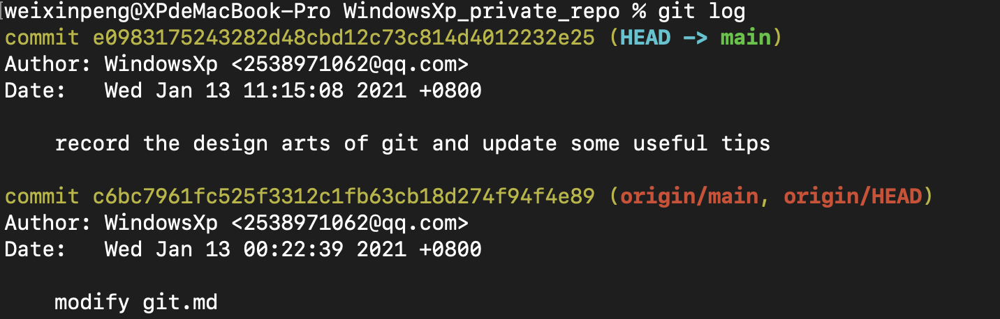
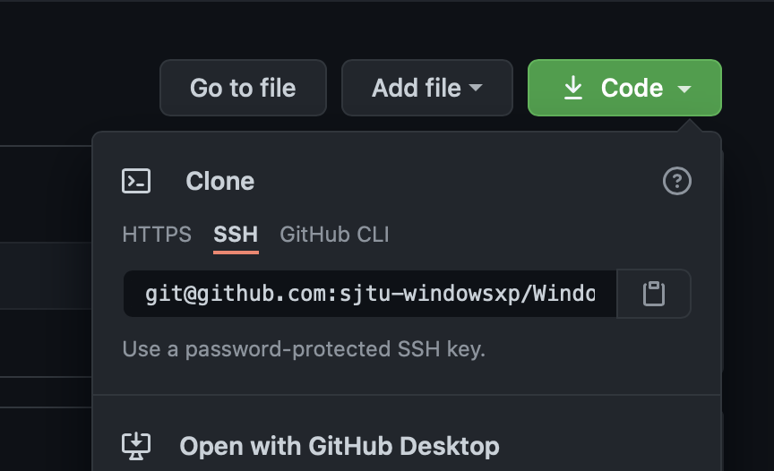
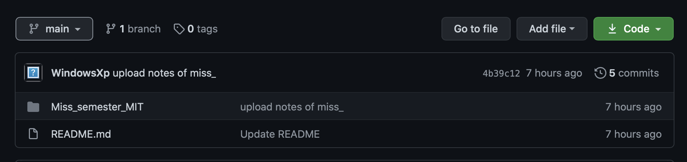
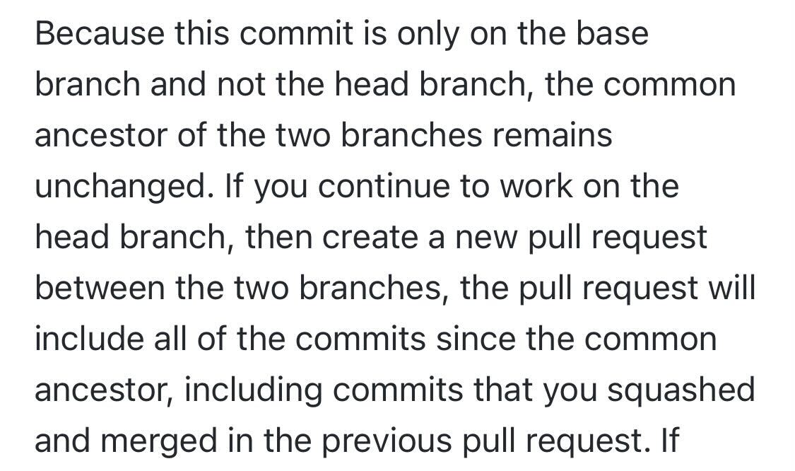

## 参考链接
[Git官网](https://git-scm.com)
[廖雪峰git教程](https://www.liaoxuefeng.com/wiki/896043488029600)
[菜鸟教程（查git命令）](https://www.runoob.com/git/git-basic-operations.html)
[gitconfig配置](https://blog.csdn.net/alex_i/article/details/105945822)

[git PRO book](https://git-scm.com/book/en/v2/)

[git flight-rules](https://github.com/k88hudson/git-flight-rules/blob/master/README_zh-CN.md)

## Git的设计哲学
```
o <-- o <-- o <-- o
            ^
             \
              --- o <-- o
```
`o` correspond to individual commits (snapshots)
A snapshot is the top-level tree that is being tracked.

Blobs, trees, and commits are unified in this way: they are all objects. When they reference other objects, they don’t actually contain them in their on-disk representation, but have a reference to them by their **hash**.
所以Git记录着各object的hash
而因为hash实在是unreadable for human，所以git使用

> human-readable names for SHA-1 hashes

e.g.`master` reference usually points to the latest commit in the main branch of development
`Head` where we currently are

>we can use `git log` to see the hash of each commit and we can notice that the references follow the hash
>

git的存储结构 in pesudocode
```
// a file is a bunch of bytes
type blob = array<byte>
// a directory contains named files and directories
type tree = map<string, tree | blob>
// a commit has parents, metadata, and the top-level tree
type commit = struct {
    parent: array<commit>
    author: string
    message: string
    snapshot: tree
}
```


## Basic workflow
> 一套比较完整的在本地修改然后push到远程仓库的流程

0. 先将本地设备的ssh公钥添加到GitHub account

1. clone
   `git clone link(SSH,HTTPS...)` 
   
   会clone到你目前所载的目录下
   
2. `cd repo` 

3. 修改

4. 查看git仓库状态
   `git status`
   
5. 将文件添加到暂存区(staging area)
   `git add [file1] [file2] ...`文件
   `git add [dir]`目录
   `git add .`所有
   
   >文件修改后(modified)，我们一般都需要进行 git add 操作，从而保存历史版本。删除后也使用add。
   6. 提交暂存区内容到本地仓个库
   `git commit [file1] [file2] ... -m [message]`选取指定文件提交
   >-m可以只写一行message，若无该参数，则会进入一个文本编辑界面写subject title body ...等等对这个commit的描述信息。
   
   `git commit -a`不执行`git add`直接提交
   
7. 可以修改提交的用户名和邮箱
   `git config --global user.name 'runoob'`
   `git config --global user.email test@runoob.com` 无`global`仅修改该仓库
   
8. 提交到远程仓库
   `git push <远程主机名> <本地分支名>:<远程分支名>`
   `git pull <远程主机名> <远程分支名>:<本地分支名>`
   >远程主机名一般叫origin，也可以自己改。这样在`git log`的时候就会不一样了。

   
   
   例：该远程分支(branch)就叫做main
   
   >我们常常见到`git push -u origin master` -u 的意思是`set upstream for git pull/status`这样以后就可以直接用 `git push`了。
   
9. 最后检查一下status
   `git status`
   显示clean
   
   >On branch main
   Your branch is up to date with 'origin/main'.
   nothing to commit, working tree clean

## commands
### remote
   1. git remote -v 查看远程仓库

   2. `git remote add <name> URL`添加远程仓库，并将本地仓库和远端仓库关联起来。
      
      >这个name只是本地对远端仓库的命名 不影响远端仓库
      
### clone

1. `git clone URL <local folder name>`可以不加`<local folder name>`这样就以远端名字创建
2. `git clone --shallow`只复制最新的snapshot，这对于一些有很长的git history的repo是极为有用的。

### push & pull & fetch

   1. `git push <remote> <local branch>:<remote branch>`将本地local branch的commit上传到远端仓库的remote branch


      >有可能产生新的branch

   2. `git pull <remote> <remote branch>`将remote branch merge进**HEAD**

      >`git pull`等于`git fetch`再`git merge`

      如果是一个remote新分支，你想要在本地也建一个新分支，应该

      ```bash
      git fetch origin remote-branch
      git checkout -b local-branch-name origin/remote-branch # In short, git checkout --track origin/remote-branch
      # or use new command switch
      git switch remote-branch
      ```

   3. `git fetch <远程主机名> <分支名>`是将远程主机的分支为分支名的最新内容拉到本地，用户在检查了以后决定是否合并到工作本机分支中。
      `git fetch`后再`git log`可以见到区别

      **`git push` --> `git fetch` --> `git pull`**
      注意可以拉取远程单独的某个分支。

      **git fetch**的作用是将远程分支下载到本地的origin/branch-name分支上。

### merge
1. fast forward
   场景：你需要修改一个master上的bug，你基于最新的master建了一个分支hotfix并进行了修改，如下图所示。
	
	修改完成后，你git checkout master然后git merge hotfix，因为hotfix是master的直接儿子，所以git处理这个merge的方式是直接将master移到hotfix上，如下图所示。这样肯定不会产生冲突。
	
	
2. recursive
   场景：你的feature分支已经与master有数个commit的不同，即发生了分叉，如下图所示。
	
	
	你完成了这个feature后要将这个feature加入master分支。于是你
	
	```
	git checkout master
	git merge iss53
	```
	此时git会根据master的最新快照，iss53的最新快照以及两者的LCA进行一个三方合并。如下图所示。
	
	并生成一个新的提交并指向它。如下图所示。
	

3. squash

    ```
            C - D - E           bugfix
          /
    A - B - F - G               master
    ```

    after `git merge --squash && git commit`

    ```
            C - D - E           bugfix
          /
    A - B - F - G - CDE         master
    ```

    > Q：为什么主分支采用squash merge，开发分支发完PR并且merge主分支后之后发PR仍然会显示这次PR前的commits呢？
    >
    > A：就拿上图的例子来考虑，master squash完CDE后，bugfix merge后结果如下
    >
    > ```
    >         C - D - E - F         bugfix
    >       /           /
    > A - B - F - G - CDE           master
    > ```
    >
    > 之后bugfix和master都又有了一些commits
    >
    > ```
    >         C - D - E - F - H - I        bugfix
    >       /           /
    > A - B - F - G - CDE - J - K          master
    > ```
    >
    > 此时如果你再发一个PR，就会发现你的commits是从C开始的。这有一点反直觉，因为I和K的LCA应该是CDE，但事实就是如此。解决方法如下：
    >
    > 1. 每次合完PR都重新从origin/main checkout一个新分支。
    >
    > 2. 如果想继续用老分支，可以rebase origin/main.
    >
    >     > 尝试了一下，rebase的话似乎本地的被squash的commit在pick commit的时候都无了，所以最终和checkout -b的效果差不多。
    >     >
    >     > PS：rebase似乎就是把commit cherry-pick一下啊

### rebase

Guideline: You can get the best of both worlds: rebase local changes before pushing to clean up your work, but never rebase anything that you’ve pushed somewhere.

#### 常用

`git rebase --abort` 停止当前rebase

`git rebase branch` 将当前branch rebase到指定branch

`git rebase --continue` 继续rebase

考虑一个分支场景：


如果采用merge的方式：`git merge experiment`，则如[git merge](#git merge)中所说，如下图所示：


如果采用rebase的方式：`git checkout experiment && git rebase master`


然后就可以通过fast-forward的方式更新master分支。

#### option

\-i (--interactive) 开启一个vim窗口，选择每一个commit是use还是squash（合并到前一个commit）等

git rebase可以直接rebase远程分支，比如`git -i rebase upstream/main`，这样的效果相当于，找到当前的HEAD和位于远程分支的上的common ancestor然后将commit加到它的后面并且将HEAD移到最新的commit。

#### cherry-pick

[ref: ruanyifeng](https://www.ruanyifeng.com/blog/2020/04/git-cherry-pick.html)

就是将指定的提交（commit）应用于其他分支

`git cherry-pick <hash>`

可以一次性转移多个提交`<hash1>, <hash2>, <hash3>`，也可以`git cherry-pick A..B `

发生冲突后，第一步`git add .`，第二步`git cherry-pick --continue`

### log

my git lg: `lg = log --pretty=format:\"%h - %Cgreen%an%Creset, %ar : %Cgreen%s%Creset\" --graph`

my git slg: `slg = log --pretty=format:\"%h - %Cgreen%an%Creset, %ar : %Cgreen%s%Creset\" --graph --stat`

查看某一位用户的commit：git log --user=username

### diff 
   1. `git diff <hash of commit> <file>`不写`<hash of commit>` means `HEAD` 将file的目前状态与某个commit进行比较
   2. `git diff <hash of commit1><hash of commit2> <file>`对比file在两个commit下的差别
      
      >we can use master or HEAD to replace the long hash string
   3. `git add -p <file>`
      then you can choose the change you want to commit by s(spilt) and decide y/n for each diff
      then you can use `git diff --cached` to show the changes you want to commit
      
      > `git diff`show all the changes

### reset

返回到某个版本，将当前的工作区的文件变成untracked。

`git reset HEAD~` undo last commit，并且将changes保留（没有add）

### restore

use `git restore <file>...` to discard changes in working directory

`git restore HEAD` 回退到HEAD处。

### tag

`git tag`: 列出已有的标签

`git tag -d name_of_tag`: 删除tag

`git push origin <tag_name>`：将tag push到远端

### stash

### commit

#### --amend

> it will remove the previous commit and add the updated one which has different hash

change files in commit:

add:`git add filename`

remove:`git rm filename`

`git commit --amend -m "this fixes the previous oopsies"` edit commit messge

`git commit --amend --no-edit`  retain the previous commit message

## others

### .gitignore

gitignore file不能忽略已经加入版本控制的文件。这时需要将其从仓库中删除再加入gitignore file。
具体可以`git rm --cached filename`再将文件写入`.gitignore`中即可。
rule:

   ```
# / 表示 当前文件所在的目录

# 忽略public下的所有目录及文件
/public/*
#不忽略/public/assets，就是特例的意思，assets文件不忽略
!/public/assets

# 忽略具体的文件

index.php

# 忽略所有的php
*.php

# 忽略 a.php b.php
[ab].php

#匹配规则和linux文件匹配一样
#以斜杠“/”开头表示目录；表示忽略一个目录
#以星号“*”通配多个字符；
#以问号“?”通配单个字符
#以方括号“[]”包含单个字符的匹配列表；
#以叹号“!”表示不忽略(跟踪)匹配到的文件或目录；
   ```
### .attributes

`./dir/**` to match all the files in the `dir` recursively

### lfs

move a file into lfs: [offcial doc](https://docs.github.com/en/repositories/working-with-files/managing-large-files/moving-a-file-in-your-repository-to-git-large-file-storage)

### fliter-repo

[repo](https://github.com/newren/git-filter-repo#simple-example-with-comparisons)

`git filter-repo --invert-paths --path $path -f` to remove a file from the repo's history.

> if you want to remove a dir, the path should be `/path/to/your/dir/` without any wild cards(such as `*`)

### submodule

[git submodule使用](https://zhuanlan.zhihu.com/p/87053283)
[git submodule官方](https://git-scm.com/book/zh/v2/Git-%E5%B7%A5%E5%85%B7-%E5%AD%90%E6%A8%A1%E5%9D%97)
在你的仓库中使用其他git仓库需要使用git submodule

### ^ VS ~

[ref tutorial](https://scarletsky.github.io/2016/12/29/tilde-and-caret-in-git/)

1. 如果一个提交有多个父提交，那么 `~` 只会找第一个父提交。
2. ^n可以找到第n个父提交。

### config

--local: default option: `.git/config`

--global: user-specific, meaning it is applied to an operating system user. `~/.gitconfig`

--system: The system level configuration file lives in a `gitconfig` file off the system root path. `$(prefix)/etc/gitconfig` on unix systems.

### Git关联多个远端仓库

[git实现本地仓库同时关联多个远程仓库（Gitee和GitHub）](https://blog.csdn.net/xiecheng1995/article/details/106570059)

```bash
git remote add name_of_remote_repo_1 ssh_link

git remote add name_of_remote_repo_2 ssh_link

git push/pull name_of_remote_repo ...
```

方法二，当需要远程仓库完全同步时使用：

[ref：本地Git仓库关联多个远程仓库的两种方法](https://zhuanlan.zhihu.com/p/82388563)

**不额外添加远程仓库，而是给现有的远程仓库添加额外的URL**。使用`git remote set-url -add <name> <url>`，给已有的名为`name`的远程仓库添加一个远程地址。这样，每次push pull就可以不用指定branch和repo name。

## branch

1. `git branch <name of the new branch>` create a new branch based on the **current working commit** 
   
   without the parameter we can see all the branches we have
   
   `git push -u origin <branch_name>`
   
1. `git branch -d <name of the new branch>` 删除本地分支
   
   `git push origin --delete <name of remote branch>` 删除远端分支
   
   `git branch -dr origin_branch` 删除本地tracking的远端分支
   
   `git branch -m old_branch_name new_branch_name` 重命名分支
   
2. `git checkout <name of the branch>`

   `git checkout <file>`可以将file变为目前HEAD的commit的状态，从而舍弃working directory的修改
   
3. `git fetch <远程仓库名> <远程分支名>`拉取远端分支。然后使用`git checkout -b <本地分支名> origin/远端分支名`切换到该分支。

4. `git merge <分支名>`将当前分支与<分支名>合并。（并不会删除任何分支）

一、开发分支（dev）上的代码达到上线的标准后，要合并到 master 分支
```
git checkout dev
git pull
git checkout master
git merge dev
git push -u origin master
```
二、当master代码改动了，需要更新开发分支（dev）上的代码
```
git checkout master 
git pull 
git checkout dev
git merge master
git push -u origin dev
```

## git workflow
### feature branch workflow
1. 在开始一个新的feature前，创建一个新的隔离的branch
	```
	git checkout -b marys-feature main
	```
	-b 意味着如果没有这个分支，就创建一个分支。
2. 在本地修改
	```
	git status
	git add
	git commit
	```
3. 将本地分支push到远端仓库
	```
	git push -u origin marys-feature
	```
   这可以作为一个备份以及你的合作者可以浏览你的commit
4. 完成feature后，将本地的所有修改push到远端。
   ```
	git push
	```
5. 然后发起一个pull request
   在pull request中，其他合作者会检查代码，提出意见。Mary会根据这些意见修改，修改的过程与第一次迭代相同，pull request会记录这个过程。
6. 当决定接受这个pull request时，即将这个feature加入main分支。
	```
	git checkout main
	git pull
	git pull origin marys-feature
	git push
	```

## git 使用规范

> wrote by gzd for our comment-overflow project

### Commit信息规范

[Reference](https://www.conventionalcommits.org/en/v1.0.0/)

#### Commit 格式

`<type>[!]: <description>`

#### type种类

- feat: **新增**功能，不一定是一个完整的用例，一个功能的一小部分也算，比如新增button的点击事件、新做了一个界面、实现了一个接口等
- fix: 修复bug
- style: 涉及美化、样式的**修改**
- docs: 修改文档
- refactor: 重构
- tweak: 调参、需求稍微变更需要的修改
- deprecate: 删除功能
- misc: 其他
- merge: 解决merge conflict

Note:

1. `!`可选，代表重要改动，一般就加在feat后，代表一个大功能的实现。
2. 如果一次commit有多种type，用`&`连接，如`feat! & refactor: xxxxxx`，但尽量多commit，每次commit都是一种type
3. description用英文写，看得懂就行，全小写，最后不加句号

### Branching规范

- 有两个branch一直存在，分别是`master`和`pre-release`，`master`只有每次迭代结束才会merge，`pre-release`在开发过程中不停的merge
- 每个人要写自己的功能时，在华为云git上(不是本地)，从`pre-release`新建分支，分支名为`<名字>-<功能>`，比如`gzd-login`。写完之后，merge到`pre-relase`，并且把这个分支删掉。后面如果因为需求改了要改这个功能，重新建分支
- 如果任何组员发现merge错，把原来的代码改没/错了，立刻告诉其他组员，其他组员等丢的代码恢复了再commit

### .gitignore

- 如果用macOS，要忽略`.DS_Store`
- 忽略IDE-specific的文件，比如`.vscode`，`.idea`
- 忽略可执行文件，因为不同系统格式不一样
- 忽略machine-specific的配置文件

### 特大文件处理

如果项目里有特别大的文件，在每次迭代时放到Release的附件里

# Git commit message at S社

> ref: https://gist.github.com/joshbuchea/6f47e86d2510bce28f8e7f42ae84c716

See how a minor change to your commit message style can make you a better programmer.

Format: `<type>(<scope>): <subject>`

`<scope>` is optional

## Example

`<type>(<scope>): <subject>`

```
feat(scope): add hat wobble
^--^ ^---^   ^------------^
|    |       |
|    |       +-> Summary in present tense.
|    |
|    +---> Scope: executor, storage, etc.
|
+-------> Type: chore, docs, feat, fix, refactor, style, or test.
```

More Examples:

- `feat`: (new feature for the user, not a new feature for build script)
- `fix`: (bug fix for the user, not a fix to a build script)
- `docs`: (changes to the documentation)
- `style`: (formatting, missing semi colons, etc; no production code change)
- `refactor`: (refactoring production code, eg. renaming a variable)
- `test`: (adding missing tests, refactoring tests; no production code change)
- `chore`: (updating grunt tasks etc; no production code change)

## workflow

1. risinglight使用的[squash and merge](https://docs.github.com/en/pull-requests/collaborating-with-pull-requests/incorporating-changes-from-a-pull-request/about-pull-request-merges#squash-and-merge-your-pull-request-commits)选项，这意味着一次PR中的所有commit会合成一个然后作为合入的commit。（commit message见文档）

   这意味着必须每个新feature都要checkout一个新分支（不然下次发PR的时候这些commit还会被纳入，因为common ancestor没变）

   

   所以每个新feature应该git fetch upstream && git checkout -b new_feature upstream/main然后再开发

2. risinglight必须要最新分支才能合入。所以以后发PR前先pull一下。

   > pull这一下忘了-s怎么办？
   >
   > `git commit --amend -s`
   >
   > `git push -f`

3. 如何添加漏了的DCO

   `git rebase -i HEAD~n`

   n是你漏的那个到HEAD的距离

   然后打开vi窗口，在漏了的那条的下面加`exec git commit --amend --no-edit -s`

   然后`git push -f`，之所以要-f是因为这会改写远端的git history，如果这个commit已经被其他人clone到本地了，那就十分危险，不过这个PR显然还没有被合入，所以在这个场景下问题不大。

### Git常用abbr

- WIP   Work in progress, do not merge yet. // 开发中

- LGTM Looks good to me. // Riview 完别人的 PR ，没有问题

- PTAL Please take a look. // 帮我看下，一般都是请别人 review 自己的 PR

- CC Carbon copy // 一般代表抄送别人的意思

- RFC  —  request for comments. // 我觉得这个想法很好, 我们来一起讨论下

- IIRC  —  if I recall correctly. // 如果我没记错

- ACK  —  acknowledgement. // 我确认了或者我接受了,我承认了

- NACK/NAK — negative acknowledgement. // 我不同意

# GitHub best practice

> [ref](https://www.datree.io/resources/github-best-practices)

selected tips

1. don't commit to the master branch

2. don't commit as a unrecognized author

    > Ensure your Git client is [configured](https://help.github.com/articles/setting-your-commit-email-address-in-git/) with the correct email address and linked to your GitHub user. 

3. lock package version
