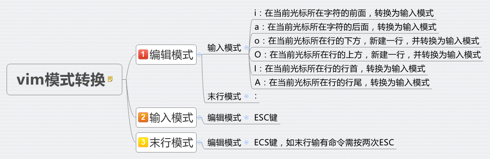

# Note of VIM
## Tips
`vimtutor zh` 进入中文介绍文档

`:help [cmd]`获取帮助

> :help c_CTRL_v 获取ctrl+[ ]的命令帮助时要如此输入

## six mode

   - Normal: for moving around a file and making edits
**type `esc` to switch from any mode to normal mode**
   - Insert: for inserting text
**enter Insert mode with `i`**

      - i 当前光标的前面
      - a 当前光标的后面
      - o 当前光标的下一行
      - O 当前光标的上一行
      - I 当前光标的行首
      - A 当前光标的行尾

- Replace mode with `R`
- Visual (plain, line, or block): for selecting blocks of text
**Visual mode with `v`**
**Visual Block mode with `<C-v>` (Ctrl-V, sometimes also written ^V)**
- Command-line: for running a command
**Command-line mode with `:`**
## commands
- :q quit (close window)
- :w save (“write”)
- :wq save and quit
- :q! 退出并丢弃进入vim以来的改动
- :e {name of file} open file for editing
- :ls show open buffers
- :help {topic} open help
- :help :w opens help for the :w command
- :help w opens help for the w movement

### history commands

`q:` in normal mode -> search and edit in the command history window -> press `Enter` and it will execute the command in the line under your cursor

## 打开多个文件
- :sp/split FILENAME 竖屏打开另一个文件
- :vs/vsplit FILENAME 横屏打开另一个文件
- vim -O FILENAME1 FILENAME2 纵向分屏打开多个文件
- vim -o FILENAME1 FILENAME2 横向分屏打开多个文件
- :qa 关闭所有 :q关闭光标所在窗口
### 在多个窗口间移动

- Ctrl + W followed by H/J/K/L

## undo and redo
- `u` undo
- `U` 恢复到改行的原始状态
- `Ctrl-r` redo
## movement

称为motion

- `hjkl` (left, down, up, right)
- `w/W` (next word)小写w将标点算作word, `b` (beginning of word), `e` (end of word)
- `0` (行首), `^` (第一个非空位置), `$` (行尾)
- `H` (屏幕顶部), `M` (屏幕中间), `L` (屏幕底部)
- `Ctrl-u` (滚动向上), `Ctrl-d` (滚动向下)
- `gg` (beginning of file), `G` (end of file)

### 文本对象

#### 分隔符文本对象

`i` (inside: 分隔符内部) 和 `a` (around: 包括分隔符)

`"` (quotes), `(` (brackets), `{` (big brackets), `t` (tag`<></>`)

#### 文本块

`i w/s/p` 当前单词/句子/段落

> 往往和c{motion}搭配

`a w/s/p` 当前单词/句子/段落带一个（它前面或后面的）空格

> 往往和d{motion}搭配

## delete
`x` 删除光标处的字符
d + 数字 + 操作对象
操作对象有：
- `w`删除到下一个的单词第一个字母
- `e`删除到这个单词的最后一个字母
- `W`与`w`有区别
- `$`删除到行尾

`数字 + dd` 删除若干行

`d + visual下选中内容` 删除选中内容

## 操作格式
          operator   [number]   motion
     其中：
       operator - 操作符，代表要做的事情，比如 d 代表删除
       [number] - 可以附加的数字，代表动作重复的次数
       motion   - 动作，代表在所操作的文本上的移动，例如 w 代表单词(word)，
                  $ 代表行末等等。
当一个操作符连续两次被调用时，它会作用于当前行。比如yy, dd, >>, gugu, etc.

## change and replace

- c + 数字 + motion
  操作对象同样有 w e \$ i(inside)等
  效果：对于w，删除光标到单词末尾并进入insert模式，对于\$，删除光标到行尾并进入insert模式

  - some shortcuts

      C: c$

      s: cl 删除光标处的字符

      S: ^c

- r + 要替换的对象
  替换光标处的对象

- R 进入替换模式，此时所有的输入都会替换光标处的字符
## 置入
vim会将刚删除的内容置于一个寄存器中，此时可以使用`p`将改内容添加在光标后，比如 dd + p 会将这一行粘贴在光标所在行的下方

## 查找 匹配 替换
- Ctrl + G 显示当前文件的状态信息及光标所在的行号
- 输入行号 + G 转到该行
- / + 字符串 搜索该字符串 n搜索下一个位置 N搜索上一个位置
- ? + 字符串 从后往前查找，此时n与N都会反向
- \* search the word under the cursor
- f + char 查找下一个char，并将光标转到该位置 F查找上一个char，并将光标移到该位置
- % 寻找光标处括号的配对
- :`s/old/new` 可以将该行第一个old替换为new
- `:s/old/new/g` 可以将该行所有old替换为new
- `:<start_line>,<end_line>s/old/new/` 其中 #,# 代表首尾两行的行号。
- `:%s/old/new/g` 替换整个文件中的所有匹配串
- `:%s/old/new/gc` 替换整个文件中的所有匹配串并逐个询问

### regex

> [vim regex](http://vimregex.com/)

在range characters中无法使用metacharacter，得用`[:digit:]`, `[:alpha:]`, etc.

e.g. `[-\w]\+` should be `[-_[:alnum:]]\+` or `[-_A-Za-z]\+`

匹配多种pattern

`pattern1\|pattern2`

## 重复

- ; 重复上一次的`f`操作
    - `,`反向查找上次的`f{char}`

- . 重复上一次的修改操作

## 与外部交互
- `:!command` 使用一些shell中的命令
- `:w FILENAME` 可将当前 VIM 中正在编辑的文件保存到名为 FILENAME 的文件中。
- 在visual模式下使用`:w FILENAME` 会将选中的文本保存至 FILENAME中
- `:r FILENAME`可提取磁盘文件 FILENAME 并将其插入到当前文件的光标位置后面。
- `:r !command` 可以读取command命令的输出并把它放在当前光标的后面

## 复制粘贴

- y{motion}: 复制; 或者在visual中复制。

    p/P: paste after/before the cursor

    yy 复制一行

### 寄存器

默认使用无名寄存器，使用`"{register}`的方式指定寄存器。
- ": 无名寄存器。
- a-z: 有名寄存器。
- 0: 复制专用寄存器。
- \* / +: 系统寄存器。
- \_: 黑洞寄存器。
- /: 上次查找的模式。

## 设置

- `:set 内容`有点类似临时设置，可以在`/.virmc`文件中修改全局设置。

  > example:`:set ic`设置查找时忽略大小写
  >
  > `:set hls is`将查找到的文本高亮
  >
  > `:noh`将查找到的文本去除高亮

### indent

1. `set shiftwidth=$var`
2. v -> select lines you want to add indent
3. `>`

# 设置vim的中英文切换
## 对于VSCODE VIM
参考了这篇回答[如何解决VSCode Vim中文输入法切换问题？](https://www.zhihu.com/question/303850876/answer/540324790)
注意：我的英文键盘是com.apple.keylayout.ABC因此我的配置是：
```
"vim.autoSwitchInputMethod.enable": true,
"vim.autoSwitchInputMethod.defaultIM": "com.apple.keylayout.ABC",
"vim.autoSwitchInputMethod.obtainIMCmd": "/usr/local/bin/im-select",
"vim.autoSwitchInputMethod.switchIMCmd": "/usr/local/bin/im-select {im}",
```
也可见`settings.json`
## 对于VIM in terminal
使用[coc.nvim](https://github.com/neoclide/coc.nvim)插件中的[coc-imselect extension](https://github.com/neoclide/coc-imselect)
## 对于MACVIM
<del>暂时不知道:cry::cry::cry:</del>
设置完terminal中的vim后，重启MacVIM即可。

# plug manager

我使用[vim-plug](https://github.com/junegunn/vim-plug)来管理vim的插件。

`:PlugInstall`:安装插件

`:PlugUpdate`:更新插件

# further study of vim

- [vim-china hello-vim](https://github.com/vim-china/hello-vim)
- [vim.org](https://www.vim.org)
- [苦练一年后总结的 Vim 使用技巧，送你，拿好了！](https://zhuanlan.zhihu.com/p/294938381)
