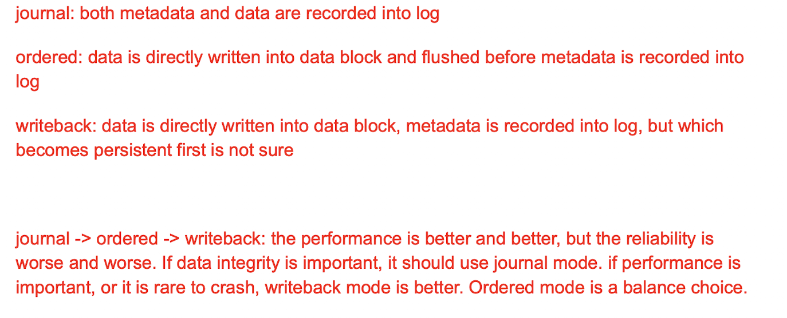
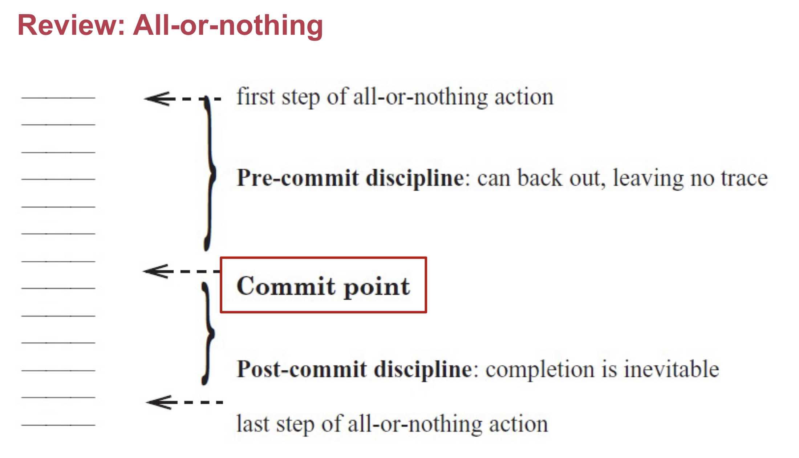
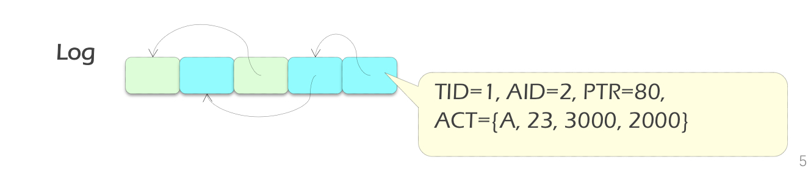
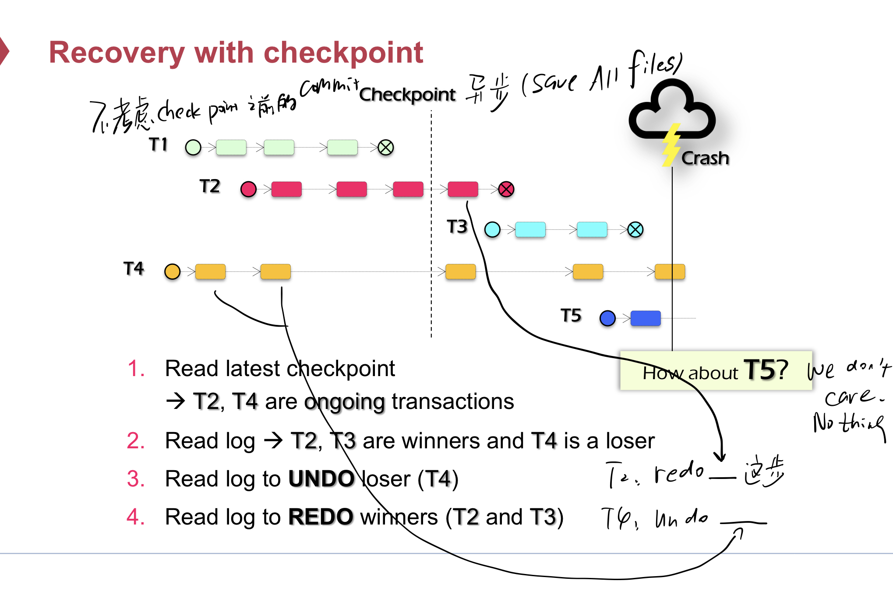
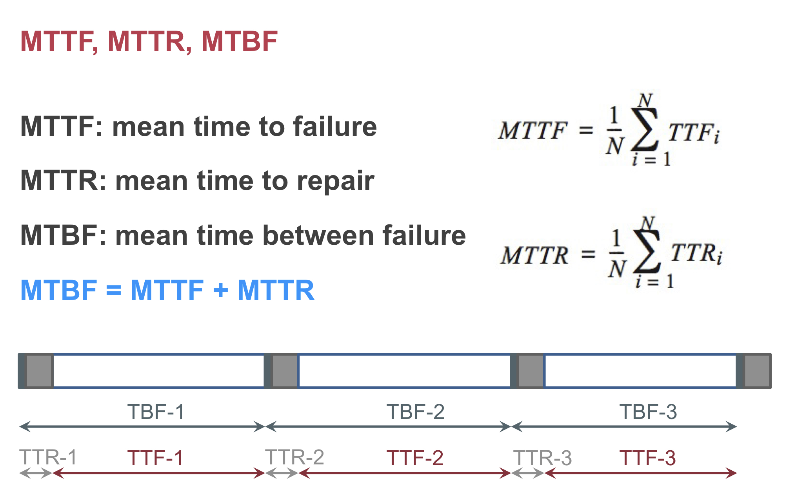
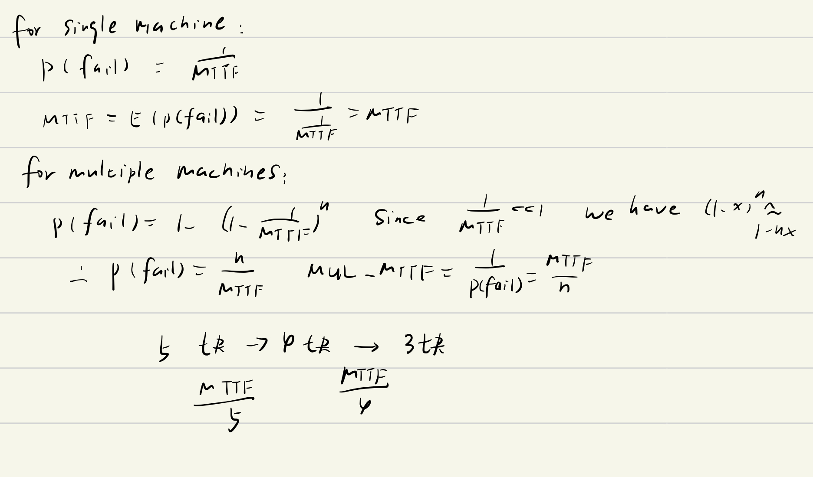

# crash ---- consistency

1. fsck
2. journaling

# Logging/Journaling FS

write ahead log: In a system using WAL, all modifications are written to a [log](https://en.wikipedia.org/wiki/Database_log) before they are applied. Usually both redo and undo information is stored in the log.

- crash before commit: no data is changed
- crash after commit: redo changes in the journal

> 保证all or nothing

发现有commit的log时，recover时可以根据在journal中的log再做一遍。

Ext4 Data Journaling mode：

## overview

origin：因为disk有cache，在Jm后flush，在Jc后flush，当M写完后，可以视为checkpoint，将这个log truncate了。

优化，去除Jm后的flush，导致D，Jm，Jc一起写，仍能保证Jc persist后整个事务能做完：在commit信息中增加D，M的sum Or hash。重启后检查sum or hash，相同（已经commit），redo，不同（没有commit），undo。

---

# atomicity

> all or nothing
>
> 只需要考虑一系列操作的是否发生，不用考虑**部分**发生

commit point与事务中显示的commit操作不同，这个commit point不一定是显示的，只是经过这个point即使crash，整个事务也能做完。

# shadow copy

先对一个临时文件操作，操作结束后将临时文件rename到原文件。

原子性由rename决定，rename的原子性由FS保证（journaling）

在commit point时crash：

- 写disk上的一个sector是all-or-nothing

## cons

- only works well for single file
- x multiple files and directories
- 任何小改动就要复制整个文件

# Redo Log & Undo Log

## transaction

**需要保证 ACID**

begin（事务开始）

commit（事务提交）

after commit “ALL”

before commit “NOTHING”

「The `begin ... commit` is called **transaction**」

## log

begin ... commit 中的内容被记录在log中（append only，且不同的事务会交织）

> 保证了A&C

### do-undo-redo protocol

#### log content

1. transaction ID
2. action ID
3. pointer to previous record
4. Action（file name，offset，old&new value）（读log可以没有）

#### log rules

1. WAL(write ahead log protocol)，先写log到disk，再写persistent state（修改数据的值）。

2. commit时，在log结尾append一个commit record

#### recovery rules

1. travel from end to start
2. mark all transaction's log record CMT log and ABORT log(没有commit的record)
3. undo abort logs from **end to start**
4. redo cmt logs from **start to end**

### checkpoint

- 避免log size太大

- 避免从blank阶段恢复（很慢）

  从checkpoint恢复即可，因为checkpoint会记录a list of all transaction in process and pointers to their most recent log records。

CKBT_ROOT指向文件中的最后一个checkpoint，在这之前的log可以删除。

#### How

1. wait直到progress中没有transaction（-> action(transaction中的一步)）
2. 写一个CKPT record到log
3. 保存所有文件save all files
4. 原子的保存checkpoint通过更新CKBT_ROOT pointer

e.g.

logging protocol above is undo-redo logging,即log既有要undo的操作也有要redo的操作。

参考handson理解一下redo-undo log

`type: UPDATE action_id: 3 variable: studentC redo: "2900" undo: "3000"`

直接记录redo和undo的结果。

# MTTF & avaliablity

MTTR

total maintenance time / total number of repairs

MTBF

MTTF

# Isolation

序列化ideal: **让并行执行的T1，T2，...，TN 似乎按照某个顺序执行**

比如让一幅图的执行效果和某种顺序执行的效果相同。

different types

- final-state

- conflict

- view

  final written state和中间读状态在一些顺序执行下都是相同的

## 生成Conflict-Serializable schedule

### 2PL

two-phase lock：原始语义：开始放锁后就不能拿锁，能保证没有conflict graph。

strong two-phase lock：访问数据前拿锁，TX commit后放锁。保证isolation。

实现：在TX的read和write函数中实现拿锁放锁。

优化：

在lock point之后开始放读锁。

cons：deadlock

new data

### OCC

#### phase1

read data into read set

buffer write into write set

#### phase2

检查read-set中是否有任何数据被modify了

#### phase3

abort or commit（install the write set）

2和3应该在critical section中执行，所以需要加锁。

1. 全局锁。
2. 2pl，只要对write-set的数据加锁即可。

cons：false abort
