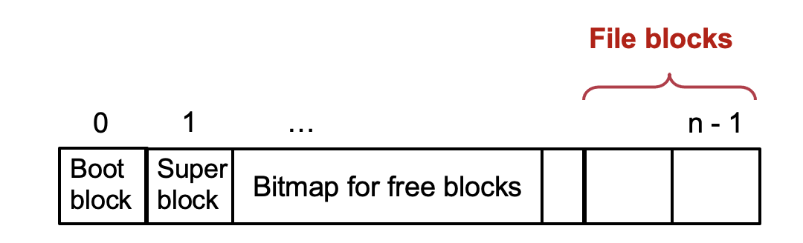
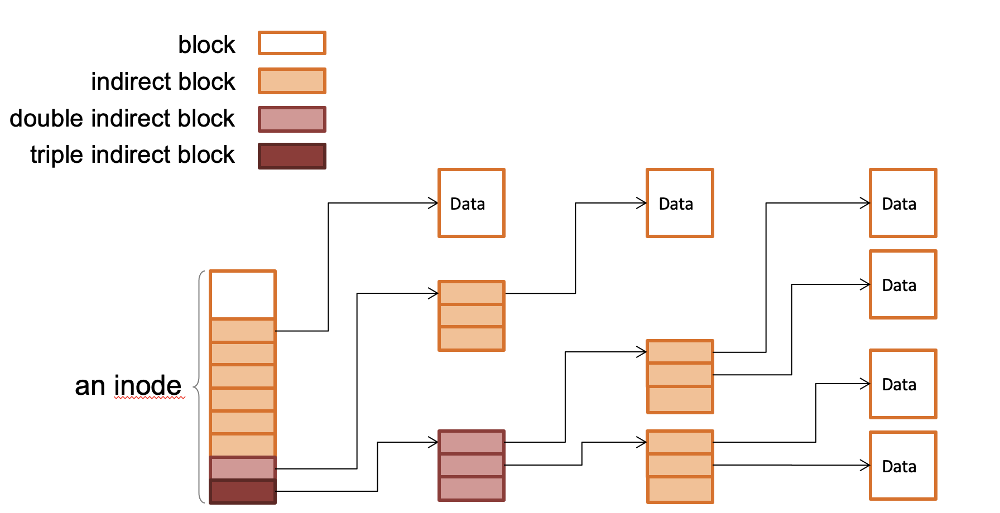
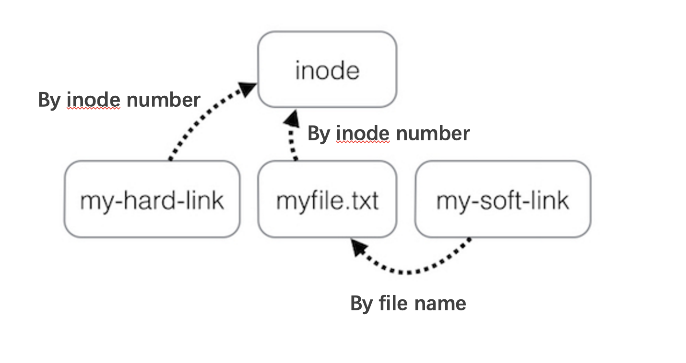
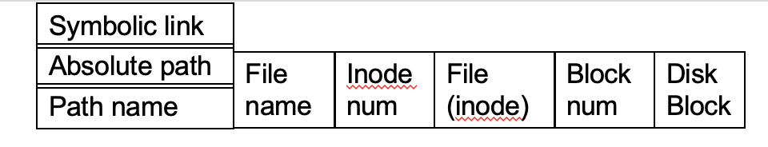
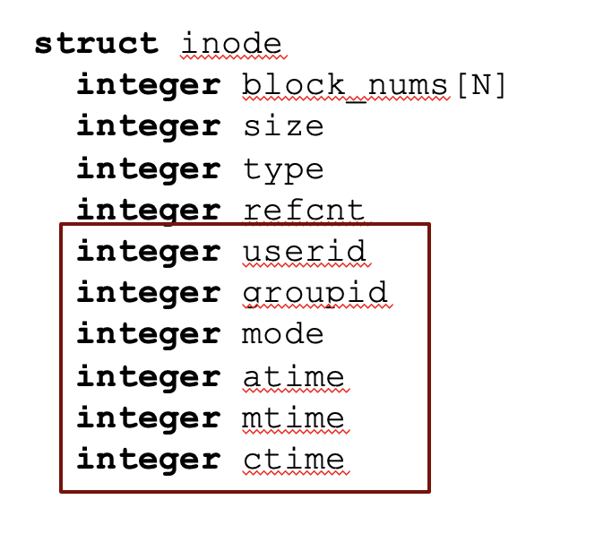

# File System

File 1. durable 2. has a name

File system和disk driver都属于kernel。

## A Naive File System

每个文件占据连续的blocks（4kb）

使用block index作为file name。

cons：文件大小变化，copy会改变文件名...

## inode-based file system

### 1 block layer

**Mapping：block number & block在disk上的数据**

每个文件系统有一个superblock，记录了block的size，free blocks的数量，

#### super block

> 每个file system有一个super block。
>
> 当文件系统挂载时内核读取super block的信息。

- file sys block的大小
- free block的数量
- file sys的其他元数据，比如root inode的位置，最长filename。

#### Block size

**trade off**

too small & too big

#### track free blocks

使用Bitmap



### 2 File layer

**Mapping：block index number（blocks_num中的index，可以通过offset（文件中某个字符的offset）和blocksize算出来） & block number**

#### inode(index node)

存储文件的元数据

```
struct inode
	integer blocks_num[N]
	integer size
```


> 当文件很大时，会采用类似页表的方式存储
>
> 

### 3 inode number Layer

**mapping：inode number & inode**

通过inode table。


#### inode table

在storage上的一个固定位置。**inode number就是inode table的index**

So far，给定一个file的inode number以及一个offset，就可以找到这个offset在disk上的data。

> How:
>
> inode_number => inode_table[inode_number]
>
> ↓
>
> inode => block_index = offset/block_size => blocks_num[block_index]
>
> ↓
>
> block_number
>
> ↓
>
> block

**因此inode number完全可以operate一个文件。**

however，inode number不方便记忆，而且在不同的存储设备上会发生改变。

### 4 File name layer

**Mapping：filename（string）& inode number**

```
struct inode
	integer blocks_num[N]
	integer size
	integer type // file or directory
```

#### Mapping table

| File name | inode number |
| :-------: | :----------: |
| hello.txt |      13      |

### 5 Path Name layer

一个目录下面也有可能包含其他目录（因为在inode这层目录与文件是相同的）

#### link

shortcut for long names

为一个inode number创建多个文件名。

#### unlink

移除filename到inode number的组合。

```
struct inode
	integer blocks_num[N]
	integer size
	integer type
	integer refcnt // how many filename ref this inode, delete the file when it's 0
```

- 不能创建指向目录的hard link 除了`.`和`..`

- 不能够创建跨文件系统的hard link

原因见下

[hard link VS soft link](#hard link VS soft link)

#### rename

1. unlink(to_name) -> link(from_name, to_name) -> unlink(from_name)

2. link(from_name, to_name) -> unlink(from_name)

### 6 Absolute Path name path layer

对所有user都存在的universal context，方便文件分享。

'/'root directory inode number是1

### 7 Symbolic link layer

```bash
ln -s /path/to/file_or_directory path/to/symlink
readlink path/to/symlink
ls -l symlink #也可以查看软链接指向的内容
```

#### hard link VS soft link



[hard link VS soft link](https://ostechnix.com/explaining-soft-link-and-hard-link-in-linux-with-examples/)

soft link其实新建立一个文件并存储文件路径（因此可以为一个不存在的path or file建立soft link，因此可以指向directory或者跨文件系统），而hard link是在directory中增加一个entry，使用同一个inode。因此肯定不能跨文件系统，而若指向另一个目录，会导致loop（虽然symbolic link也会），还有一个隐患就是ppt上提到的（导致一块inode没有被删掉，但是再也无法访问了），看了下面两个帖子，感觉主要是你**无法区分hard link和真正的directory**，所以一些命令比如du之类的就会挂掉，但symbolic可以被区分。

[1. 为什么unix中不支持symbolic link](https://unix.stackexchange.com/questions/22394/why-are-hard-links-to-directories-not-allowed-in-unix-linux)

[2. Why are hard links not allowed for directories?](https://askubuntu.com/questions/210741/why-are-hard-links-not-allowed-for-directories)

> soft link:
>
> - can cross the file system,
> - allows you to link between directories,
> - has **different inode number** and file permissions than original file,
> - permissions will not be updated,
> - has only the path of the original file, not the contents.
>
> hard link:
>
> - can't cross the file system boundaries (i.e. A hardlink can only work on the same filesystem),
> - can't link directories,
> - has the same inode number and permissions of original file,
> - permissions will be updated if we change the permissions of source file,
> - has the actual contents of original file, so that you still can view the contents, even if the original file moved or removed.

### overview





- atime last access
- mtime last modification 修改数据
- ctime last change of inode 修改metadata

# VFS

> Virtual File System
>
> We use VFS(Virtual Filesystem Switch) in Linux to introduce this concept.

## motivation

计算机系统存在多种文件系统，不同文件系统在存储设备上使用不同的数据结构和方法。为了对上提供uniform接口，VFS定义了一系列**内存数据结构**。并要求底层不同文件系统提供指定的方法（实现相应的函数指针）