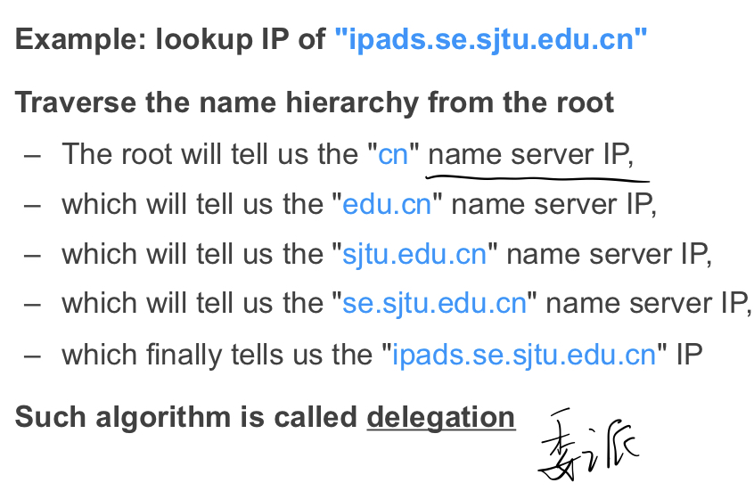
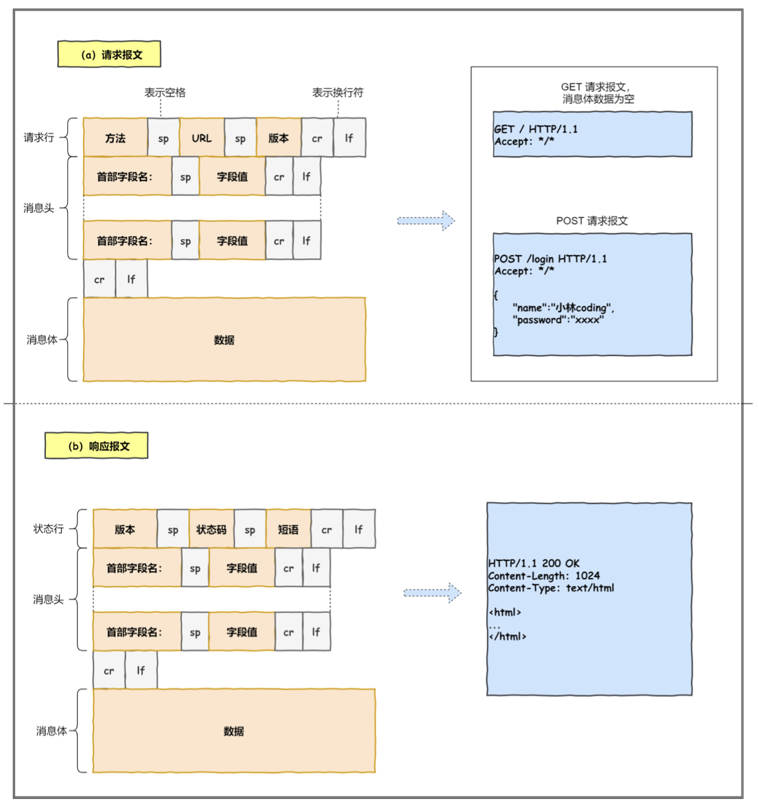
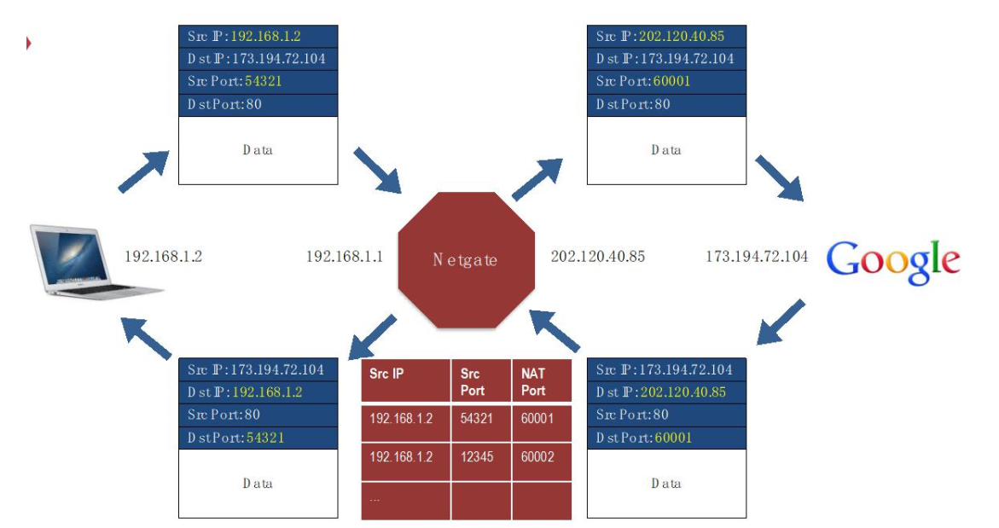
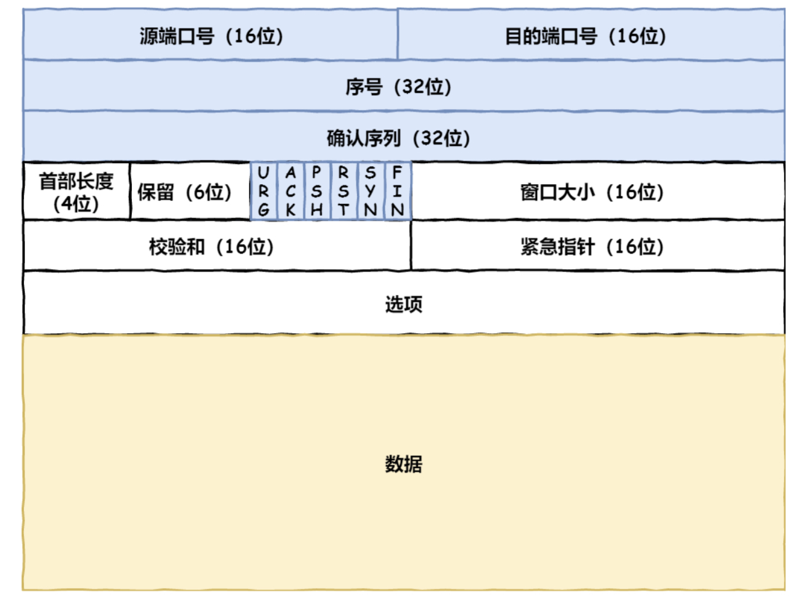
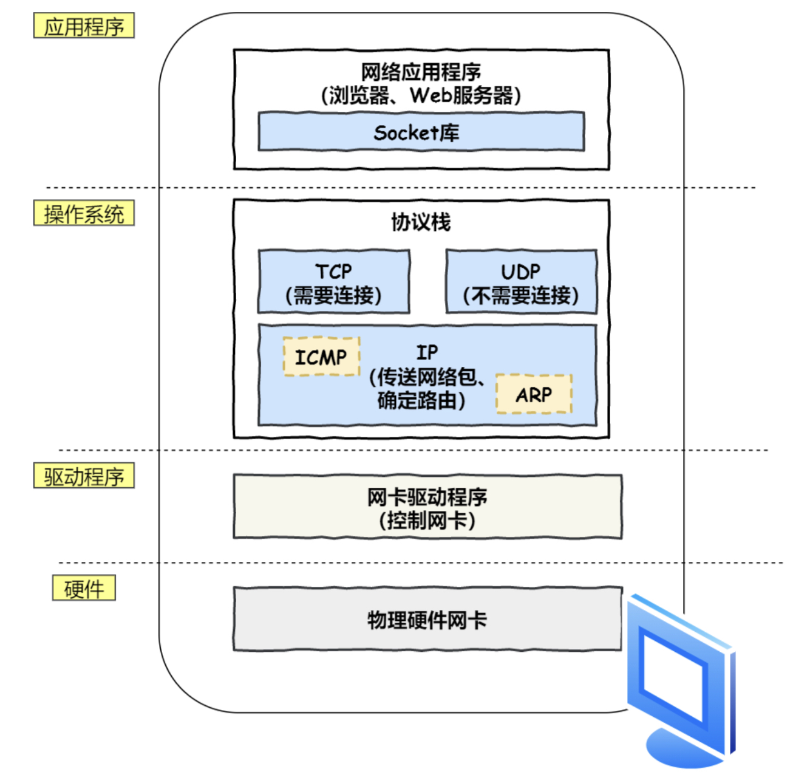

# Computer Network

## Abbr

1. FQDN(Fully Qualified Domain name):
   FQDN = Hostname + Domain name

   >e.g. 一个公司申请了域名`comp.com`，这时候有一台主机名为web，则可以使用`web.comp.com`得到这个主机IP。若还有两台提供邮件和OA服务的主机cmail，oa，则这时候可以用以下FQDN：
   >`cmail.comp.com`
   >`oa.comp.com`

   Linux/MacOS下 /etc/hosts文件的配置
   `ip fqdn [alias]...`
   第一列为主机ip地址，第二列为主机fqdn地址，第三列以后为别名，可以省略，否则至少要包含hostname`

## Q&A

1. [What is Port](https://blog.csdn.net/cto_51/article/details/10086745)

2. [127.0.0.1与localhost与本机IP的区别](https://blog.csdn.net/weixin_36185028/article/details/79855383)

3. 浏览器中输入URL之后发生了什么？

   What is URL? DNS解析。发送http数据包，经过TCP层，IP层然后发给网卡。

## URL

统一资源定位符 URL(Uniform Resource Locator)

`[协议类型]://[访问资源需要的凭证信息]@[服务器地址]:[端口号]/[资源层级UNIX文件路径][文件名]?[查询]#[片段ID]`

## DNS

域名 Domain name : 由一串用点分隔的名字组成的Internet上某一台计算机或计算机组的名称。

DNS(Damain name system) : 互联网的一项服务，因为IP地址不方便记忆，因此人们设计出域名，并通过DNS将IP地址与域名相互映射。

### DNS解析

先问本地DNS服务器。根域的dns服务器保存在互联网中所有的DNS服务器中。

## HTTP

根据Web服务器和文件名生成HTTP请求。

## IP

IP地址 : 因特网上的每台计算机和其它设备都规定了一个唯一的地址，叫做“IP地址”。

### NAT

NAT : 同个公司，家庭，教师内主机对外通信时，把私有IP转换为公有IP地址。

> 所以你使用百度搜索本机IP查到的IP是公网IP，而通过`设置`，`ifconfig`，`python socket`等得到的是局域网IP，也就是路由器给你分配的IP。

#### private IP address

[What is a private IP address](https://whatismyipaddress.com/private-ip)

- **192.168.0.0 – 192.168.255.255** (65,536 IP addresses)
- **172.16.0.0 – 172.31.255.255** (1,048,576 IP addresses)
- **10.0.0.0 – 10.255.255.255** (16,777,216 IP addresses)

## TCP

> HTTP是基于TCP协议传输的。

### 三次握手

- 第一次握手：Client将SYN置1，随机产生一个初始序列号seq发送给Server，进入SYN_SENT状态；
- 第二次握手：Server收到Client的SYN=1之后，知道客户端请求建立连接，将自己的SYN置1，ACK置1，产生一个acknowledge number=sequence number+1，并随机产生一个自己的初始序列号，发送给客户端；进入SYN_RCVD状态；
- 第三次握手：客户端检查acknowledge number是否为序列号+1，ACK是否为1，检查正确之后将自己的ACK置为1，产生一个acknowledge number=服务器发的序列号+1，发送给服务器；进入ESTABLISHED状态；服务器检查ACK为1和acknowledge number为序列号+1之后，也进入ESTABLISHED状态；完成三次握手，连接建立。

### package format

序号：解决包乱序的问题。

确认号：解决不丢包。

状态位：SYN：发起一个连接；ACK：回复；RST：重新连接；FIN：结束连接

窗口大小：通信双方各声明一个窗口（缓存大小）

## protocol stack

