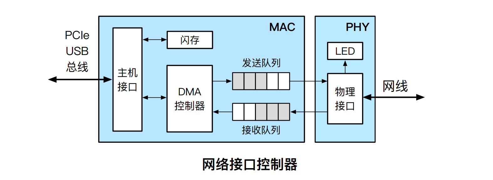

# Computer Network

## Q&A

1. [What is Port](https://blog.csdn.net/cto_51/article/details/10086745)

2. [127.0.0.1与localhost与本机IP的区别](https://blog.csdn.net/weixin_36185028/article/details/79855383)

3. 浏览器中输入URL之后发生了什么？

   What is URL? DNS解析。发送http数据包，经过TCP层，IP层然后发给网卡。

## URL

统一资源定位符 URL(Uniform Resource Locator)

`[协议类型]://[访问资源需要的凭证信息]@[服务器地址]:[端口号]/[资源层级UNIX文件路径][文件名]?[查询]#[片段ID]`

## DNS

域名 Domain name : 由一串用点分隔的名字组成的Internet上某一台计算机或计算机组的名称。

DNS(Damain name system) : 互联网的一项服务，因为IP地址不方便记忆，因此人们设计出域名，并通过DNS将IP地址与域名相互映射。

- **Apex domain** (also known as a root, bare, or naked domain)**:** the `yourcustomdomain.com` part in `www.yourcustomdomain.com`.
- **Subdomain:** domain that is part of a larger domain; `www.yourcustomdomain.com` and `app.yourcustomdomain.com` are subdomains of `yourcustomdomain.com`.

FQDN(Fully Qualified Domain name):
FQDN = Hostname + Domain name

>e.g. 一个公司申请了域名`comp.com`，这时候有一台主机名为web，则可以使用`web.comp.com`得到这个主机IP。若还有两台提供邮件和OA服务的主机cmail，oa，则这时候可以用以下FQDN：
>`cmail.comp.com`
>`oa.comp.com`

Linux/MacOS下 /etc/hosts文件的配置
`ip fqdn [alias]...`
第一列为主机ip地址，第二列为主机fqdn地址，第三列以后为别名，可以省略，否则至少要包含hostname`

### DNS解析

Unlike subdomains, apex domains don’t support CNAME records.

先问本地DNS服务器。根域的dns服务器保存在互联网中所有的DNS服务器中。

### DDNS

DDNS是通过用一个固定的域名绑定动态的**公网IP地址**，外网只需要使用这个固定域名就可以对内网的服务实现远程访问，服务器端由DDNS服务商负责运营，用户只需安装DDNS客户端即可成功实现动态域名解析。

## HTTP

根据Web服务器和文件名生成HTTP请求。

## IP

IP地址 : 因特网上的每台计算机和其它设备都规定了一个唯一的地址，叫做“IP地址”。

**IP**地址由两部分组成，即**网络号**（Netgwork ID）和**主机号**（Host ID）。 **网络号**标识的是Internet上的一个子网，而**主机号**标识的是子网中的某台**主机**。 网际地址分解成两个域后，带来了一个重要的优点：**IP**数据包从网际上的一个**网络**到达另一个**网络**时，选择路径可以基于**网络**而不是**主机**。

**A类地址**：**8位网络号**(0开头）+24位主机号，**范围：1.0.0.0 - 126.255.255.255**

**B类地址**：**16位网络号**（10开头）+16位主机号，**范围：128.0.0.0 - 191.255.255.255**

**C类地址**：**24位网络号**（110开头）+8位主机/号，**范围：192.0.0.0 - 223.255.255.255**

**D类**：组播地址，**范围：224.0.0.0 - 239.255.255.255**

**E类**：保留以后再用，**范围：240.0.0.0 - 255.255.255.255**

### private IP address

[What is a private IP address](https://whatismyipaddress.com/private-ip)

- **192.168.0.0 – 192.168.255.255** (65,536 IP addresses)
- **172.16.0.0 – 172.31.255.255** (1,048,576 IP addresses)
- **10.0.0.0 – 10.255.255.255** (16,777,216 IP addresses)

### 子网掩码

Q：如果让你判断一个IP地址：192.168.1.199的网络号和主机号分别是什么？

请问你怎么判断？你凭什么说192.168.1是网络号？199是  主机号？有什么根据吗？

但是如果我给你一个IP地址是以下（带子网掩码）形式的：

IP：192.168.1.199

子网掩码：255.255.255.0

那么根据大家公认的规则，你就可以得出这个IP的网络号和主机号了，怎么算呢？

子网掩码的长度和IP地址一样也是一串32位的二进制数字，只不过为人类的可读性和记忆性的方便，通常使用十进制数字来表示，例如把上面的IP地址和子网掩码都转换成相应的二进制就是下面这样的：

IP地址：192.168.1.199 ‐＞11000000.10101000.00000001.11000111

子网掩码：255.255.255.0 ‐＞ 11111111.11111111.11111111.00000000

子网掩码的左边是网络位，用二进制数字“1”表示，1的数目等于网络位的长度；右边是主机位，用二进制数字“0”表示，0的数目等于主机位的长度。

### NAT

NAT : 同个公司，家庭，教师内主机对外通信时，把私有IP转换为公有IP地址。

> 所以你使用百度搜索本机IP查到的IP是公网IP，而通过`设置`，`ifconfig`，`python socket`等得到的是局域网IP，也就是路由器给你分配的IP。

## TCP

> HTTP是基于TCP协议传输的。

### 三次握手

- 第一次握手：Client将SYN置1，随机产生一个初始序列号seq发送给Server，进入SYN_SENT状态；
- 第二次握手：Server收到Client的SYN=1之后，知道客户端请求建立连接，将自己的SYN置1，ACK置1，产生一个acknowledge number=sequence number+1，并随机产生一个自己的初始序列号，发送给客户端；进入SYN_RCVD状态；
- 第三次握手：客户端检查acknowledge number是否为序列号+1，ACK是否为1，检查正确之后将自己的ACK置为1，产生一个acknowledge number=服务器发的序列号+1，发送给服务器；进入ESTABLISHED状态；服务器检查ACK为1和acknowledge number为序列号+1之后，也进入ESTABLISHED状态；完成三次握手，连接建立。

### package format

序号：解决包乱序的问题。

确认号：解决不丢包。

状态位：SYN：发起一个连接；ACK：回复；RST：重新连接；FIN：结束连接

窗口大小：通信双方各声明一个窗口（缓存大小）

## protocol stack

## MAC

A **media access control address** (**MAC address**) is a [unique identifier](https://en.wikipedia.org/wiki/Unique_identifier) assigned to a [network interface controller](https://en.wikipedia.org/wiki/Network_interface_controller) (NIC) for use as a [network address](https://en.wikipedia.org/wiki/Network_address) in communications within a [network segment](https://en.wikipedia.org/wiki/Network_segment).

## NIC

Network Interface Controlloer aka. Network Adapter, Network Interface Card

集成网卡：集成在主板上。

独立网卡：需要通过总线的方式和CPU互联。

MAC控制器负责网络包的收发，PHY负责电气信号的编解码和传输。

MAC地址记录在闪存（一块只读存储区域（EEPROM））

## HTTPS

> ref: [安全背后: 浏览器是如何校验证书的](https://cjting.me/2021/03/02/how-to-validate-tls-certificate/)
>
> HTTP Over TLS，也就是使用 TLS 进行 HTTP 通信

传输层协议，因此应用层协议对它是没有感知的，HTTP, FTP, SMTP 都可以和 TLS 配合使用。

TLS建立安全连接的步骤：

1. 双方协商使用的协议版本，加密算法等细节

2. 服务器发送 证书 给客户端

3. 客户端校验证书有效性

4. 双方根据握手的一些参数生成一个对称秘钥，此后所有的内容使用这个秘钥来加密

    > 客户端用服务端的公钥加密这个对称秘钥，只有服务端能用私钥解开。

证书包含网站的各种信息，包括网站的域名，证书的有效时间，签发机构等，in which the most important are

1. the public key of the server side
2. the signature signed off by the CA

我们用CA的公钥解一下签名拿到证书的hash，再算一下证书的hash（算法也在证书里），两者比较，如果一致就说明证书没有经过篡改。 

这里其实可以做成一个信任链，比如A(root CA)签了B，B签了C。通过A可以证明B（B的public key是可信的），然后递归，B就可以证明C。

根证书签发一些中间证书，这些中间证书就可以用来签发大量的叶证书，这个过程完全可以是自动化的，就像 Let’s Encrypt 那样。即便中间证书的私钥泄露了也不要紧，可以使用根证书把它们撤销掉。

Q：拦截者不改证书改了其他东西怎么办？

A：拦截者没有server端的秘钥，所以拿不到对称秘钥，也就没法拿到之后用对称秘钥加密的东西。

