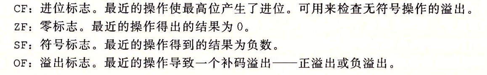
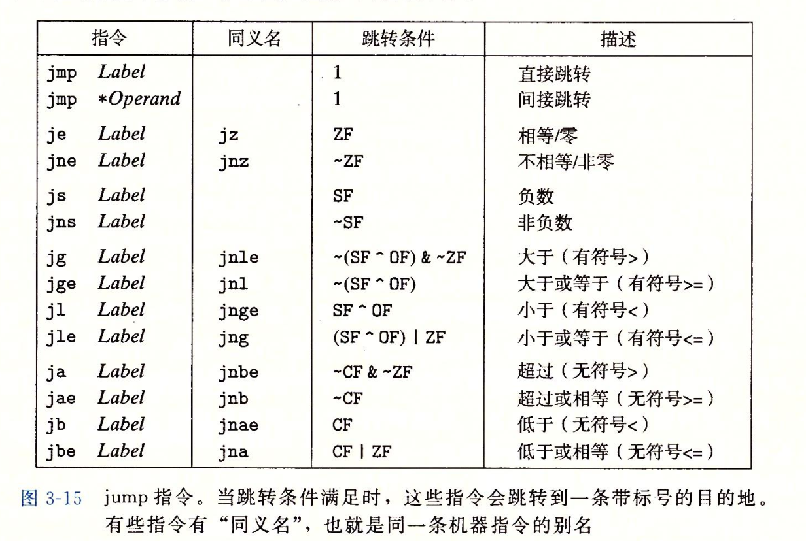
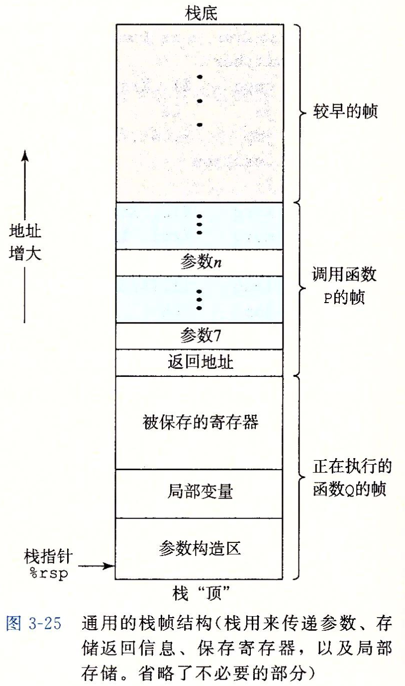
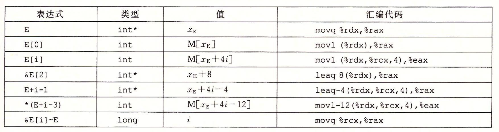

GCC   ( _G_ UN _C_ ompiler _C_ ollection)
## compile


```bash
gcc -E test.c > test-pp.c  #预处理，加入头文件，因为这一步不会生成新文件，所以要用一个新文件来存结果
gcc -S test.c #生成汇编文件
gcc -c test.c #生成机器二进制码
gcc test.c -o test #生成可执行文件 -o file 表示输出目标文件，写在后面 如果不写这个，就默认生成a.out 前面那些命令也可以使用这个
gcc -Og (-o1 -o2 -o3) ... #指定优化等级，其中-Og为最符合原始C代码的机器代码 
#若不指定优化等级，则会产生可调式代码（我觉得这才是最贴近C本身的，虽然会干很多蠢事）
#链接
gcc code1.o code2.o code3.o
-Wall #尽可能产生多的警告信息
```
## ref

### C类型大小


> 何谓地址：一个 64 位的 _unsigned long_ ，指向内存中的一个位置。而这个位置存储着一个 _字节_ （1 byte = 8 bit）

### 寄存器


### 操作数格式


> 基址和变址寄存器都必须是64位寄存器

### 数据传送


源操作数：立即数，寄存器，内存。

目的操作数：寄存器，内存。

Some constraints:

> movq只能以表示32位补码数字的立即数作为源操作数
>
> 传送指令两个操作数不能都指向内存位置


> 之所以没有`movzlq`是因为零扩展使用`movl`即可
>
> 其实任何生成4字节值并以寄存器为目的的指令会把高4字节值置0
>
> 因此有:
>
> `x=0  <=>  movq $0, %rdx  <=>  movl $0, %rdx   <=>  xorq %rdx, %rdx(practice3.11)  <=>  xorq %eax, %eax`

### 算术与逻辑操作


第一个操作数是立即数，寄存器or内存，第二个操作数是寄存器or内存。第二个操作数是内存时，算术操作会将值写会内存。

leaq的第二个操作数是寄存器

### 控制

#### 条件码



> leaq指令不改变任何条件码，除此之外`算术与逻辑操作图`中展示的操作都会改变条件码


> test %rax, %rax 用来比较%rax与0的大小关系。
>
> prove:1. 只有0&0才等于0。因此ZF可表示%rax是否为0。2. 考虑%rax为有符号，则SF即可表示%rax正负。若%rax小于0，则SF为1，OF永远为0，则SF^OF=1，参考下表`setl`，则D为1，%rax<0。证毕。

#### 条件码设置字节0或1


#### 条件码设置跳转



##### if-else

```c
if(test_expr){
  then_statement
}else{
  else_statement
}
/*汇编流程的C表示*/
/*条件控制，即先判断，再确定哪个分支，不利于线代处理器利用流水线实现高性能*/
t = test_expr;
if(!t)
  goto false;
then_statement
goto done;
false:
	else_statement
done:
```

```c
/*数据的条件转义，即两个分支都执行，再判断，决定选取哪个分支的结果*/
v = test_expr ? then_expr : else_expr;
<=>
t = test_expr;
v = then_expr;
ve = else_expr;
if(!t) v = ve;
```

attention:该种方式存在漏洞，因为两个条件都会执行，具体事例见课本P148


##### 循环

1. do-while

```c
do{
  body
}while(test_expr);
<=>
loop:
  body
  t = test_expr;
  if(t) goto loop;
```

2. while

```c
while(test_expr){
  body
}
/*-Og version*/
goto Test;
loop:
  body
Test:
  t = test_expr;
  if(t) goto loop;
/*-O1 version guarded-do*/
t = test_expr;
if(!t)goto done;
loop:
  body
Test:
  t = test_expr;
  if(t) goto loop;
done:
```

3. for

```c
for(init_expr, test_expr, update_expr){
  body
}
<=>
init_expr;
while(test_expr){
  body
  update_expr;
}
//为while如上所述，有两种转化为汇编的方式
```

attention: 如果存在 `continue`,上述for与while并不等价，应修改为

```c
init_expr;
while(test_expr){
  if(t) goto update;//replace continue
  body
update:
  update_expr;
}
```

### 过程

不同的编程语言中，过程的形式多样：函数，方法，子例程，处理函数等等。



#### 转移

`call`会将返回地址压入栈中，并将程序计数器`%rip`设置为调用过程的起始地址

`ret`则将栈中弹出返回地址，并将程序计数器设置为该地址。

#### 数据传送

调用过程时的参数传递

x86-64最多可以使用寄存器传递6个参数


若参数超过6个，则要使用栈进行参数传递 7 ~ n 个参数，即为<a href="#3-25">图3-25</a>中的参数 7 ~ n。

#### 局部存储

- 寄存器不足以存放所有本地数据
- 对局部变量使用取地址运算符`&`，因此必须为其产生一个地址。
- 局部变量是数组或结构

#### 寄存器中局部存储

被调用者 保存寄存器：`%rbx %rbp %r12...%15` 被调用者必须保存这些寄存器中的值，有两种方法：

1. 不使用这些寄存器。
2. 把这些寄存器的值压入栈中（对应<a href="#3-25">图3-25</a>的`被保存的寄存器`），在返回前从栈中弹出旧值。

调用者 保存寄存器：除栈指针`%rsp`及上述 被调用者 保存寄存器外的其他寄存器。任何过程都可以随意修改这些寄存器中的值，因此需要 调用者保存这些寄存器中的值（如果需要）。

> p173(zh)图3-34b中的第四行`subq $8, %rsp`是用来对齐栈帧的。
>
> 「这时候直接调用函数Q违背了另外一条X64 SYSTEM V ABI 规则：函数调用时%rsp要能整除16（如果使用了矢量类型参数则可能要求整除32或者更多）。」——zhihu

### 数组

`T E[N]//假设E的首地址为x_E`则：



#### 二维数组

`T D[R][C]//D首地址为x_D T以字节为单位的大小为L`则：

`&D[i][j] = x_D + L(C·i+j)`

#### 变长数组

```c
int var_ele(long n, int A[n][n], long i, long j) {
  return A[i][j];
}
```

参数n必须在参数`A[n][n]`之前，这样函数就可以计算数组的维度。

### 结构( struct )&联合(union)

编译器维护关于每个struct的类型的信息，指示每个字段（field）的字节偏移。

各个字段的选取完全是在编译时处理的，机器代码不包含关于字段声明或字段名字的信息。

`union`与`struct`的区别

```c
struct S3{
  char c;
  int i[2];
  double v;
};
union U3{
  char c;
  int i[2];
  double v;
}; 
```


如果强制类型转换间将一个double转换成unsigned long，则两者的位表示会很不一样（除了double为0.0的情况），用union可以让两者具有一样的位表示（当然，这样两者的数值就不一样了）。

```c
unsigned long double2bits(double d) {
  union {
    double d;
    unsigned long u;
  } temp;
  temp.d = d;
  return temp.u;
}
```


#### 数据对齐

对齐原则：任何 _K_ 字节的基本对象的地址必须是 _K_ 的倍数。


对于结构体来说，需要在元素之间插入空隙使得各元素满足对齐要求。且结构体的首地址也得满足一定要求使得首地址加上各元素偏移后使得各元素地址满足对齐要求。

举例：

```c
struct P{
  int i;
  char c;
  char d;
  long j;
};
```
元素|i|c|d|j|总共|对齐
:--:|:--:|:--:|:--:|:--:|:--:|:--:
偏移|0|4|5|8|16|8

`d`与`j`之间 3 字节的空档保证`j`偏移量为8，加上`P`的首地址要满足8字节对齐，`8+8=16` 可保证`j`的首地址满足8字节对齐。

### buffer overflow

#### 深入理解指针

1. `void *`通用类型指针

2. 指针类型只是C提供的一种抽象，指针的类型转换改变指针运算的伸缩：

   `char *p;  (int *)p+7 <=> p+28 (int *)(p+7) <=> p+7`

3. 函数指针

   `int (*f)(int *)`一个参数为`int *`返回值为`int`的函数指针。

#### GDB

<a href="gdbnotes-x86-64.pdf">GDBnotes-x86-64</a>

#### 缓冲区溢出

读入的内容超过分配的内存，占用了其他空间（比如过程返回地址等）引起程序崩溃。

对抗：

1. 栈随机化。
2. 栈检测破坏。在数组末尾添加“金丝雀”值。
3. 限制可执行代码区域。

### Practice

3.4

```c
src_t *sp
dest_t *dp
*dp = (dest_t) *sp
 
dest_t -> int    src_t -> char
sp -> %rdi     dp -> %rsi
```

```assembly
movsbl (%rdi),%eax   char转int使用符号扩展 l对应8字节，32位的%eax寄存器
movl %eax,(%rsi)     int8位，使用movl
```

```c
dest_t -> char    src_t -> int
sp -> %rdi     dp -> %rsi
```

```assembly
movl (%rdi),%al      大转小仍使用movl进行第一次数据传递，两个原因：1. movl高位进行0拓展，较为安全。2. movl机器码简单。
movb %al,(%rsi)
```

3.10

```c
long arith(long x, long y, long z){
  long t1 = x | y;
  //x += 2;
  long t2 = t1 >> 3;
  long t3 = ~ t2;
  long t4 = z - t3;
  return t4;
}
```

```assembly
;x in %rdi y in %rsi z in %rdx
arith:
	orq %rsi, %rdi  ;此时t1即指向%rdi，而x不发生变化，若在函数中加入如上注释掉的代码，汇编不会发生变化！！
	sarq %3, %rdi   ;此时将t1（即%rdi）右移3位，并将t2指向%rdi
	notq %rdi       ;此时将t2（即%rdi）取反，并将t3指向%rdi
	movq %rdx, %rax ;因为函数返回值为%rax，所以讲z的值复制到rax中
	subq %rdi, %rax ;执行z减t3
	ret
```

上述汇编代码会随着函数写法的不同发生改变，即寄存器的使用发生改变。注意到该函数在执行完`t1 >> 3`后便不使用`t1`了，因此之后没有寄存器保存`t1`的值，而是修改完后直接将`t2`指向`%rdi`。对`t2`同理。倘若将函数修改为如下

```c
long arith(long x, long y, long z){
  long t1 = x | y;
  long t2 = t1 >> 3;
  long t3 = ~ t2;
  t3 += t1;
  long t4 = z - t3;
  return t4;
}
```

此时的汇编代码变为如下

```assembly
	orq %rdi, %rsi  ;x->%rsi y->%rdi 此时寄存器的分配与修改前不同
	movq %rsi, %rdi ;此时t1仍指向%rsi
	sarq %3, %rdi   ;t2指向%rdi
	notq %rdi       ;t3指向%rdi
	addq %rdi, %rsi ;t3+=t1
	movq %rdx, %rax ;z->%rdx
	subq %rdi, %rax 
```

