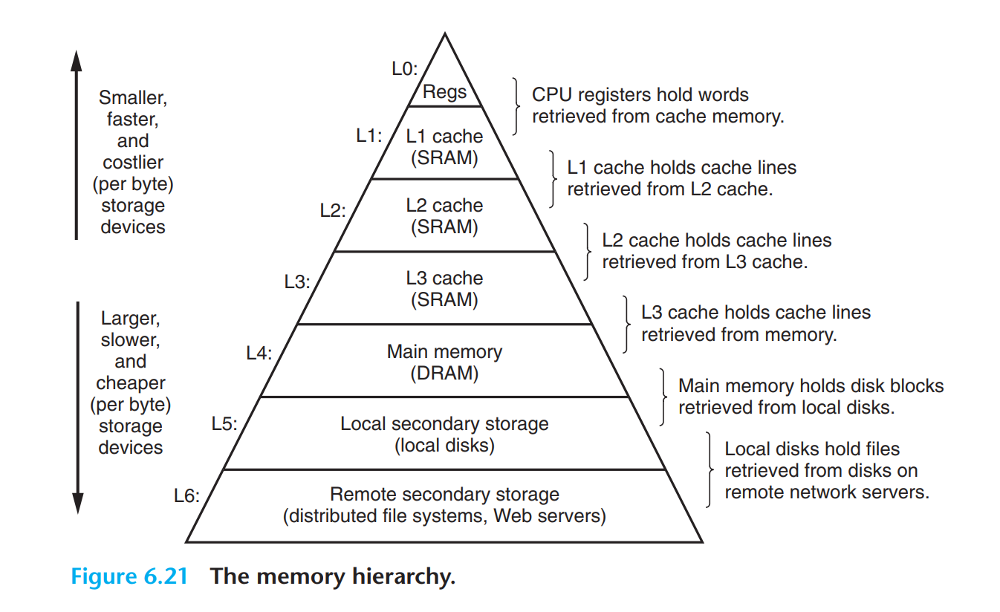
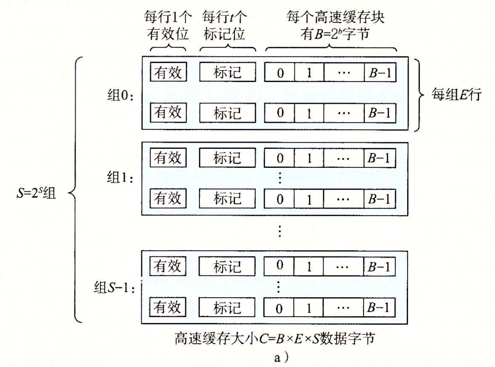
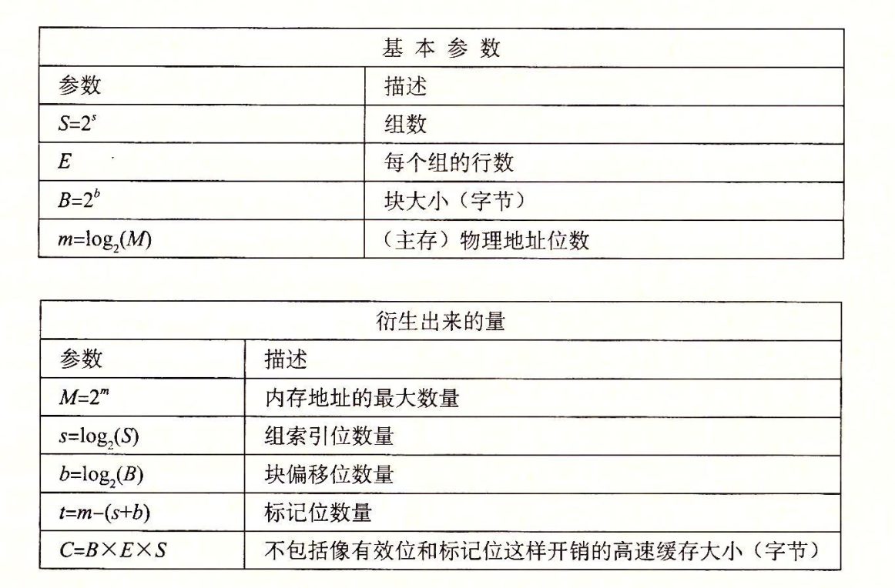
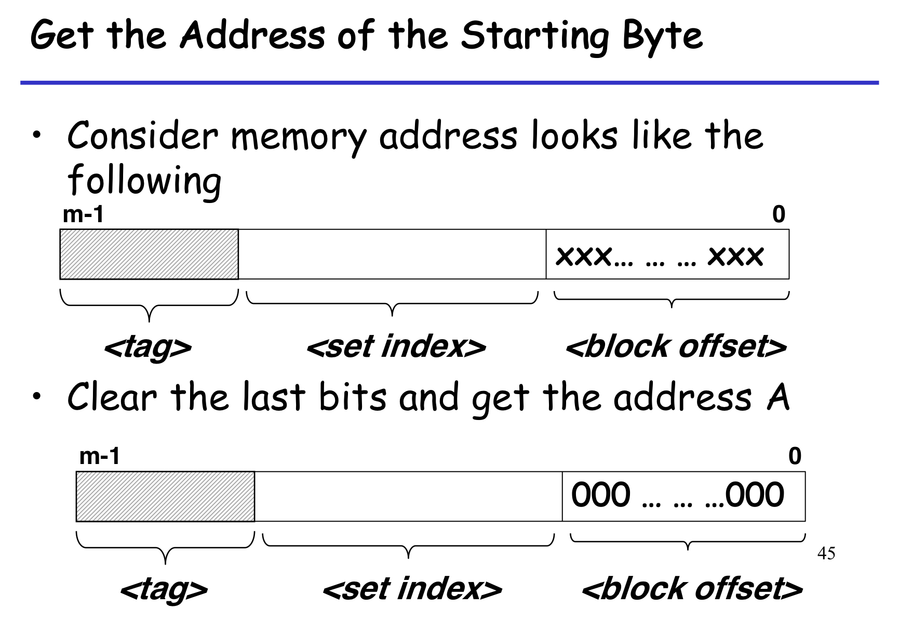
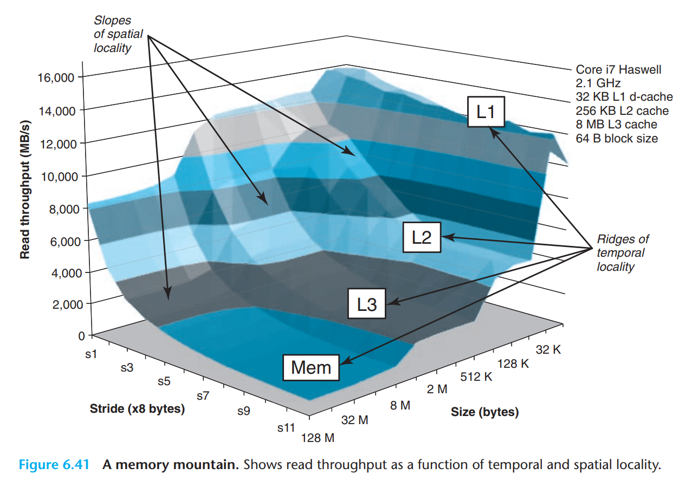
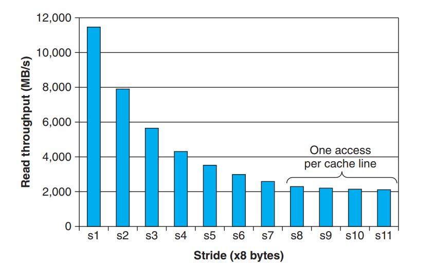

# Memory Hierarchy

> Author: Wei xinpeng
>
> Date: 2021.4.19



## RAM

> random access memory 随机访问存储器

SRAM（static）静态比动态快，但价格昂贵。不需要刷新，对噪声干扰不敏感。但晶体管更多，功耗大。

DRAM（dynamic）主要用作主存。需要刷新，会在10~100ms内失去电荷。


## cache

> 两种解释
>
> 1. 位于k层的更快更小的存储设备作为位于更大更慢的存储设备的缓存。
> 2. cache memory L1 L2 L3高速缓存

### 访问数据

#### Miss

1. Cold miss: 第k层缓存是空的。
2. Conflict miss: 多个k+1层的块映射到了k层的一个块上。
3. Capacity miss: 工作集的大小超过了缓存的大小。

### cache memory



cache memory的物理表示，由$S=2^s$个**集合**组成，每个集合里有E**行**，每行由一个标志位，标志这行是否有数据，t个tag位和存储了$B=2^b$个字节（一个**块block**）的存储区域组成。

**attention: 上图中最后是B个byte，前面valid和tag都是bit。**




对于一个物理内存地址（比如32位64位）：将其分为三部分：tag、set index、block offset

tag的位数由后两个决定，set index表示该数据在cache memory的哪一个集合（一共有$2^s$个集合，所以可以用s个二进制位来标识每一个集合），block offset表示在block中从哪一个byte开始读（每个block有$2^b$个字节，所以可以用b个二进制位来表示每一个字节）（至于读几位，就由指令来决定，movq、movl...）。剩下的位构成tag，用来标识这一个地址。因为有可能不同的内存中的数据（不同地址）映射到同一行。

#### 用直接映射高速缓存演示一次数据访问

> Direct-mapped cache 每个集合只有一行

1. 选择集合，通过读取set index位找到那个集合（行），检查valid位。
2. 比较tag：比较tag和集合（行）的tag位。
3. 找到起始位置：读取block set找到访问起始位置。

#### 迁移block

当没有在cache中找到时（miss），就要去下一级的存储中找，并迁移一整个block到这一级的cache中（充分利用locality）



比如找上图第一个地址时没有找到，那么就将其block offset位全部置0，然后去内存（main memeory，这里还是考虑direct-mapped）中找到这个地址，然后将数据迁移到cache memory中的对应**行**的block的第一个字节，重复若干次（一般高速缓存的block大小为64bytes，也就是要重复64次），直到将这行的block填满。

> 这里解释一下为什么要置0：假设不置0，那么就不能充分利用locality，你只能取小于64个bytes的数据，你也许会问，从这个miss的数据开始，还取64个bytes不行吗？确实不行，因为这样**会导致set index的变化**，你要存到其它集合去了，这显然是不行的。
>
> 「将cache和main memory的映射想象成一个hash。」——CSAPP

### Associative Cache

即每个set可以有多个line。

首先按照set位找set，再比较每一行的valid bit，若设置为1，再去比较该行的tag位。

> 名词解释：4-way associative 每个set有4路

#### fully

全相连，只有一个组，减少了set选择，直接比较tag。所以任何内存block都可以放置到任何cache block中。

### write

#### write hits

> 即待写入的块已经被加载到了cache中

1. write through

   cache更新，并且直接将这块cache block写到memory中。

2. write back

   延迟memory的写入，直到该块被evict才进行写入。

   需要维护一个dirty bit表示该块是否被写过。

#### write misses

> 即待写入的块还没被加载到cache中

1. write-allocate

   先加载到cache中再写。

2. 直接写到内存里。

**现代处理器往往采用`write back`与`write allocate`的组合。**

## Cache friendly code

1. 对局部变量的反复利用是好的，因为他们会存储在寄存器中。
2. 步长为1的引用模式是好的，因为存储器会将内存存储为连续的块。

## 存储器山

测试程序核心部分:

```cpp
int test(int elementsSize, int stride) {
    int acc;
    for (int i = 0; i < elementSize; i += stride) {
        acc += data[i];
    }
}
```

使用不同的elementsSize（测试集大小）和stride（步长）。

先dry run一遍test，让即将被访问的data放到L3，L2，L1 cache里。

> 即使evict也没关系，比如如果测试集大小大于L1 cache，小于L2 cache，那么我期望的效果就是主要的开销在从L2到L1转移block，而不是从更低的存储（比如主存）上转移，如果不dry run，那么就会发生这种情况。

再测量test的**吞吐**（访问的元素个数（测试集大小/步长）/CPU cycle）绘制存储器山。



### 如何测量Lx cache的大小以及cache line的大小

Q1: 测量Lx cache的大小。

A: 使用相同的步长不同的Size（沿着Stride轴切）。观察吞吐量drop的点，即对应各级cache的大小。

比如测试集大小小于32k的时候，所有的数据都可以放在L1里。测试集大小小于256k的时候，所有的数据都可以放在L2里。etc.

> 测试集是一块连续的空间保证了这一点。防止了set index相同的evict。

Q: 测试集大小大于L2 size小于L3的size时，主要的时间都消耗在L2和L3之间的迁移。为什么L1和L2的迁移不重要了？

A: 因为顺序访问，当L1 miss的时候L2一定会miss。dry run使得数据在L3里，但L2和L1中的数据肯定是要被evict掉的。

Q2: 测量L1 cache line的大小。

A: 使用相同的测试集大小（沿着Size轴切）。观察吞吐量drop的点。



其实这是均匀下降的，这很好理解，假设cache line是8 bytes = 64 bit。那么S1的时候每8次read才会触发一次miss，S2的时候每4次read就会触发一次。不过S大于8之后的平缓可以说明每次read都会触发一次miss。