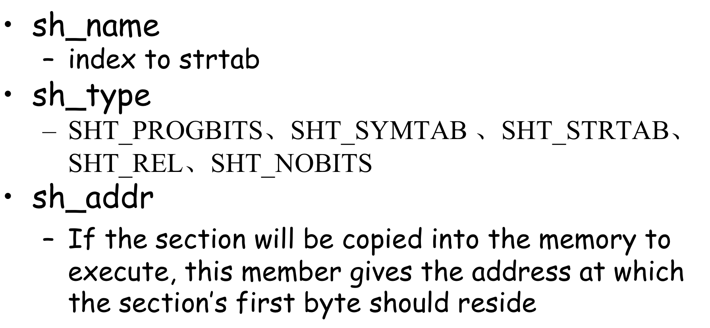
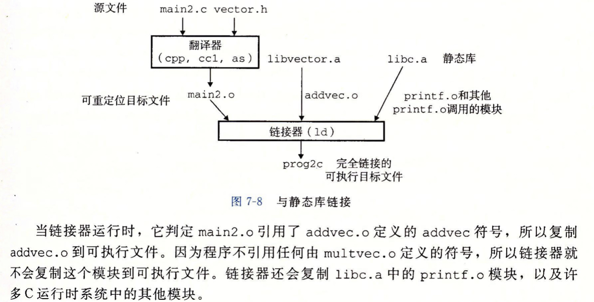
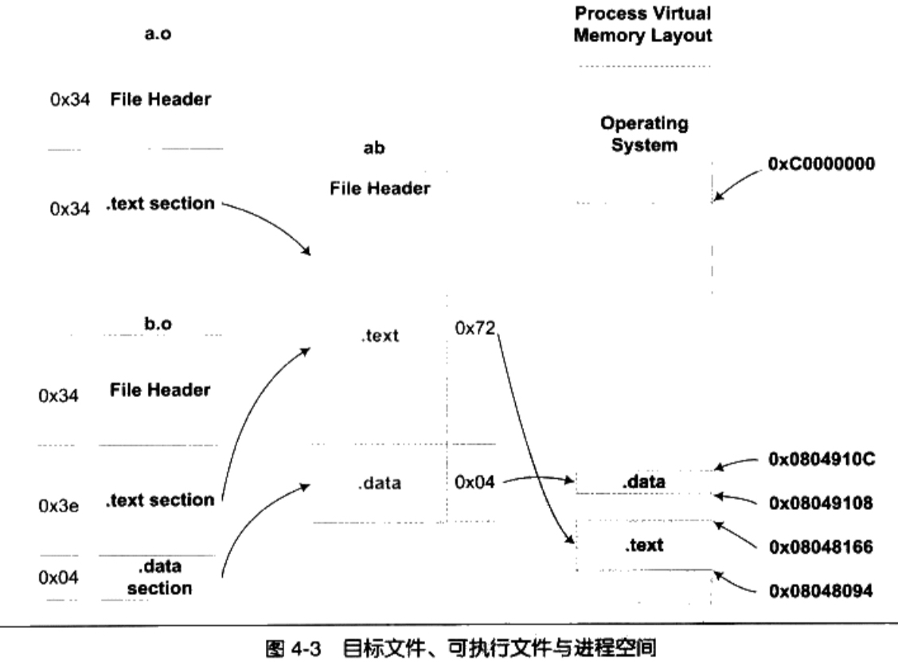
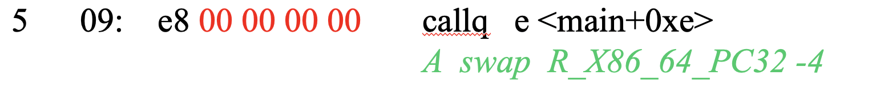
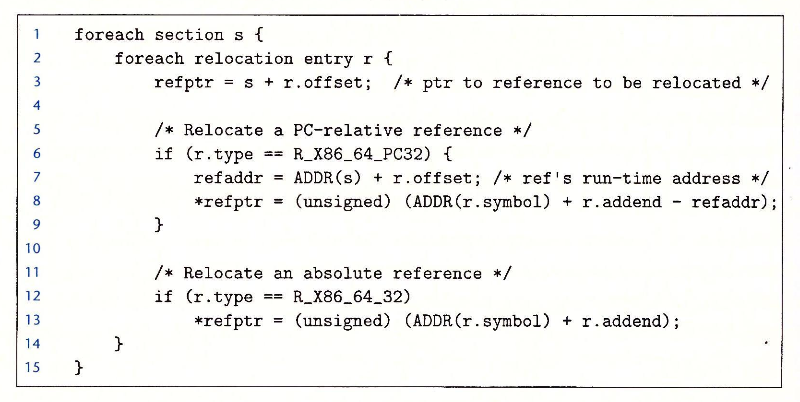
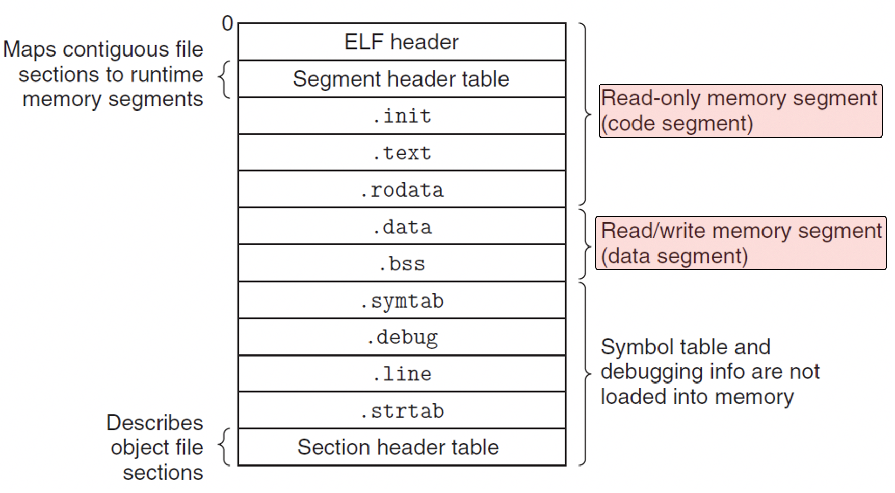
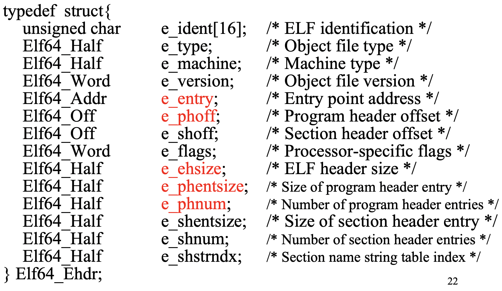

# Linking

> 在三个阶段可以做
>
> 1. Compile time By compiler
> 2. Load time By loader
> 3. Run time By program

## before linking

编译器和汇编器将C代码变成可重定位目标文件(包括共享目标文件)

> 共享目标文件是一类特殊的可重定位目标文件，可以在加载or运行时被动态地加载进内存并链接。

## 静态链接

linux ld (static linker)

input: 一组可重定位目标文件 + 命令行参数

output: 一个完全链接的，可加载和运行的可执行目标文件

### ELF

> Executable and Linkable Format (ELF)


#### Header


Notice that

- e_shoff    section header table offset
- e_phoff   program header table offset

More details


#### Section Header Table

一个section header的数组。每个section header描述一个section。

> 可以通过`readelf -S`查看section header


More details



- sh_addr    往内存中copy时内存中的地址


- sh_offset    在file中的偏移

#### Section


##### String Table

将ELF文件中的所有string首尾相接放在一起，包括symtab，debug section中的符号表，header section table,program header table中每一个section的名字等。

原来需要使用string的地方改为存放StringTable中的index，这样可以很好解决string变长的问题，字符串也可以共享节省空间。

##### Symbol Table

> 通过`readelf -s`显示symbol table中的entries

###### includes

1. 定义的全局变量

   - Nonstatic functions
   - Nonstatic variable

2. 引用的全局变量

   定义在其他文件中的变量。

3. local symbol

   static functions and variables

###### 构造过程

Compiler找出所有symbol（符号解析）并导出到.s文件中，Assembler使用这些symbol制作symbol table。

symbol Table包含一个Symbol数组。

###### Symbol数据结构


Explanation

```
Symbol table '.symtab' contains 11 entries:
   Num:    Value          Size Type    Bind   Vis      Ndx Name
     0: 0000000000000000     0 NOTYPE  LOCAL  DEFAULT  UND 
     1: 0000000000000000     0 FILE    LOCAL  DEFAULT  ABS test.c
   ...
     9: 0000000000000000    30 FUNC    GLOBAL DEFAULT    1 main
    10: 000000000000001e    24 FUNC    GLOBAL DEFAULT    1 sum
```

an output from readelf

- name 指向.strtab中的字符串

- bind 本地or全局

- size	symbol的大小，比如函数的大小、全局数组的大小等。

- section    section header Table的索引，表明这个object属于哪个section。

  Ndx=1表示.text，3表示.data

  还有三个伪节，section header Table中是没有的。

  ABS 不该被重定位的符号。见例`... ABS test.c`

  UNDEF 未定义的符号。

  COMMON 还未分配位置的未初始化的数据。

  > 
  >
  > why do we need distinguish them?
  >
  > 

- value    对于可重定位目标文件，表示object在其对应section中的位置（offset）。对于可执行文件，表示object的运行时地址。

e.g.


注意，对于COMMON，因为其在ELF文件中没有空间，所以Value实际上会被浪费掉，所以用Value的位置来放**alignment**对齐。

### 符号解析

> 由编译器compiler完成，它会向assembler输出每个全局符号，而assembler会将这信息encoding在可重定位目标文件的符号表里

强全局符号：函数和已初始化的全局变量。

弱全局符号：未初始化的全局变量。

#### 多重定义符号

1. 不允许有多个同名的强全局符号。
2. 一个强全局符号与多个弱符号同名，选取强符号。
3. 多个弱符号同名，任意选取一个。

`-fno-common`会告诉链接器，遇到多重定义的全局符号时触发错误。

### 静态库

静态库以一种存档（archive）的特殊文件格式（`.a`）存放在磁盘中，存档（archive）是一组连接起来的可重定位目标文件的集合。

在链接时，链接器将只复制**被程序引用**的目标模块。



#### 操作静态库

```bash
gcc -c addvec.c multvec.c
ar rcs libvector.a addvec.o mulvec.o

gcc -c main.c
gcc -static -o prog main.o ./libvector.a
# OR
gcc -static -o prog main.o -L. -lvector # look libvector.a in current `.` directory
```

### Relocate

效果：

> 跳转指令最常用的是PC-relative编码，即将 **目标指令的地址** 与 **紧跟在跳转指令后面的指令** 地址之间的差作为编码。即 （%rip + 编码）才是真实要跳转的地址。%rip是紧跟在跳转指令后面的指令，因为早年CPU会先更新PC的值。

e.g.


#### Relocate procedure

See on textbook P479-P481

分两步（其实这才是linking的部分，这种分两步的链接被称作 Two-pass Linking）：

第一步：合并相同类型的节。（包括data、text、符号表等）这一步完成时，每条指令和全局变量（符号表中的符号）都有唯一运行时内存地址了。将其填到符号表里。

e.g. from "程序员的自我修养"



第二步：符号解析与重定位

符号解析前面已经讲过了，这里主要讨论重定位。

In detail, 做第一步，确定所有地址(virtual address) => 遍历所有重定位条目 => 对于每条，先利用symbol => 去符号表中找到真实地址 => 再利用offset找到其在ELF中的位置（引用这个需要重定位的符号的地方） => 用真实地址替换原来的0x000000

> 即使对于bss和COM（其实合并完符号表就没有COM了），虽然没有bss段，但符号表里还有这个符号，也就有其地址。

#### 重定位条目

> 可以通过`readelf -r`查看relocation table中的条目
>
> 汇编器碰到每个位置未知的目标引用时就会生成一个重定位条目

两种entry

- 已初始化数据的重定位条目放在`rel.data`

  

- 代码的重定位条目放在`rel.text`

  

重定位条目的数据结构


- offset    在.text或者.data section中的偏移

  > Symbol Table中的symbol也有offset（value），这两者有何区别？
  >
  > Symbol中的offset是符号在其所属section中的偏移。符号有什么？函数（在text中），变量（在data中）。且重定位第一步做完后该值就被替换成真实地址了。
  >
  > relo的offset是引用在所属section中的偏移，对于变量（在data中），与symbol的offset相同。对于代码中的引用，分布在汇编码中。

- symbol    在symbol table中的index

- addend    将`ADDR(r.symbol)+r.addend`填入重定位的地址。

- type

  R_X86_64_PC32    32位PC相对寻址

  R_X86_64_32    32位绝对寻址

  ......

  两种寻址方式的重定位方法不同，算法如下

  

  这里refptr就是引用这些符号的地址。ADDR(s)表示这个section开始的地址（此处虽然已经做了section合并，但这里的s应指的是原本的section，因为offset是相对那个的）

### In conclusion

编译器（Compiler）将每个.c文件生成汇编代码，同时进行符号解析。

汇编器（assembler）将汇编代码变成机器码（包含一些0x000000），同时构造符号表与重定位条目表，生成ELF文件即`.o`文件。

链接器（linker）将各个.o文件的section进行合并，合并完成后进行重定位。

## executable object file



ELF header



Segment Header Table(program header Table)

主要描述了可执行文件连续的片被映射到连续的内存段，这种映射关系。包括flags(RO, RW)，文件中的offset，加载到内存时的vaddr，alignment等。


## 动态链接

> Load时链接
>
> Run时链接

相比静态链接的优势：

1. 对库函数的修改需要每一个app重新链接。
2. 可执行文件中的重复代码。（比如很多文件里都有printf）
3. 内存中的重复代码。（直接由上一条导致，这些可执行文件加载到内存中后就会导致这个问题）

