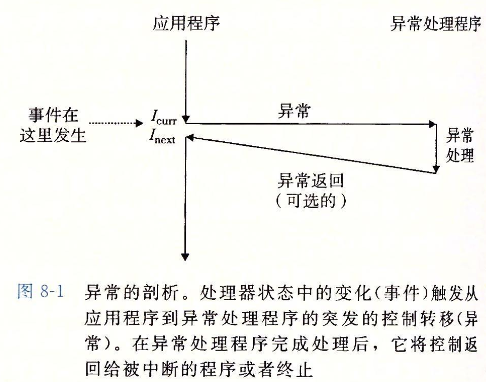
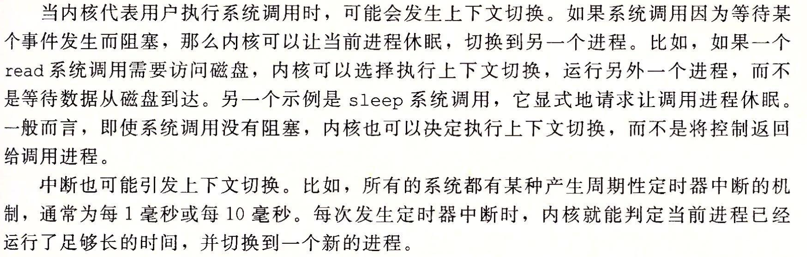
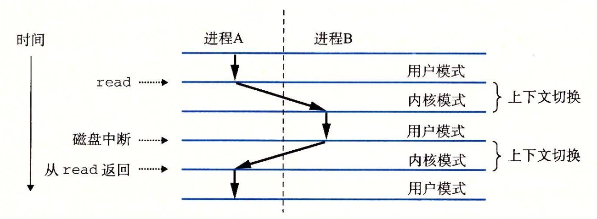

# exceptional control flow

## 异常分类


- Trap是有意的异常，是执行系统调用（system call）的结果。
- Interrupt的讨论见下。

## 系统调用

当程序想要请求内核服务时可以使用，（比如读写文件，创建子进程等等）

一些常见的系统调用


使用`syscall n`来调用，实际过程中几乎没有必要这么做，对于大多数系统调用，标准c库提供了一组方便的包装函数。

我们将系统调用和它们相关联的包装函数都称为**系统级函数**。

### 错误处理

系统调用返回时，-4095~-1之间的负数返回值表明发生了错误，对应于负的errno

`strerror(errno)`返回一个文本串，描述了和某个errno相关联的错误。

[关于errno](https://blog.csdn.net/scaleqiao/article/details/46056349#) from csdn

- errno被定义在/usr/include/bits/errno.h文件中

  > 一些常见的errno
  >
  > errno 0: Success
  > errno 1: Operation not permitted  `#define EPERM 1 /* Operation not permitted */`
  > errno 2: No such file or directory  `#define ENOENT 2 /* No such file or directory */`
  > errno 3: No such process `#define ESRCH 3 /* No such process */`
  > errno 4: Interrupted system call	
  > errno 5: Input/output error
  > errno 6: No such device or address
  > errno 7: Argument list too long
  > errno 8: Exec format error
  > errno 9: Bad file descriptor
  > errno 10: No child processes
  > errno 11: Resource temporarily unavailable
  > ...

- errno是一个整型变量，当系统调用和一些库函数发生错误时会通过**设置errno**的值来告诉调用者出了什么问题

- errno是线程安全的，在一个线程中设置它，不会影响别的线程对它的使用。errno是thread-local的，也就是每个线程都有一个。

## 进程控制(8.4)

### 进程(8.2)

系统中每个程序都运行在某个进程的上下文（context）中，上下文是由程序正确运行所需的状态组成的，包括**内存中的代码和数据**，它的**栈**和**通用目的寄存器**的内容，**程序计数器**、**环境变量**、**打开文件描述符的集合**。

#### 并发流

进程是轮流使用CPU的，当一个进程的逻辑控制流的执行时间在时间上与另一个流重叠（overlap），称为并发流（concurrency flow）。而并行流（parallel flow）是并发流的一个子集，如果两个流并发的运行在不同处理器核上。

#### 用户态与内核态

用户态only can通过中断（interrupt）、错误（fault）、或者trapping system call进入内核态。

##### What is interrupt?

[Ref: What's the differences between signal and interrupt?](https://pediaa.com/what-is-the-difference-between-signal-and-interrupt/)

「An interrupt is an event that occurs externally by components other than the CPU. It notifies the CPU about some kind of an external event.」

> e.g.
>
> An I/O device such as a networking device can send an interrupt to indicate the received data packets
>
> A timer can notify a timeout event to the CPU. 

通知CPU的方式是通过向CPU芯片上的一个引脚发信号（不是这章里花了很多篇幅导论的signal，只是一个高电压信号而已），所以只需要一个高压电信号，CPU就可以把控制流从用户态切换到内核态（其实是调用中断处理程序）（实际上控制寄存器中有一个位来表示进程所处的模式）



##### Signal&Interrupt

详细参考见上。

Main idea: Signal is triggered by CPU. Interrupt is triggered by externally by components other than the CPU.

「Signal是用来模拟interrupt的软件机制。」—— from TA

#### Context switch



Q：比如一个While(1)的循环，是怎么被切出来的呢？

A：首先，有个硬件timer会记录这个逻辑控制流运行的时间，当它发现它已经运行了很久了，比如1ms，那它就会发送一个中断给CPU，CPU收到这个中断，进入中断处理函数，这个中断的中断处理函数就是调度到其他进程。

Q：调用read函数，这是一个慢系统调用，等待读写磁盘的时候肯定会被切走，那之后磁盘读完了，怎么回到我这个进程呢？

A：见下图，磁盘读完的时候同样会触发中断，进入中断处理函数，然后回到之前调用read的进程。



### 进程状态

- Running 运行

  > 在CPU上执行或等待被内核调度

- Stopped 停止

  > 收到SIGSTOP, SIGTSTP, SIGTTIN, SIGTTOU等信号时，进程执行被挂起，不会被调度，直到收到SIGCONT信号

- terminated 终止

  > 1. 收到信号被终止。
  > 2. 从main函数返回。
  > 3. 调用exit函数。

### 获取进程ID

```c
pid_t getpid(void);//返回调用进程的PID
pid_t getppid(void);//返回调用进程父进程的PID
```

### 创建终止进程

```c
void exit(int status);//以status退出状态来终止进程
```

```c
pid_t fork(void);//创建一个子进程
//在父进程中返回子进程PID，在子进程中返回0
```

### 回收子进程

一个终止（terminated）了但还未被回收（reaped）的进程成为僵尸（zombie）进程。

如果一个父进程终止了，内核会安排`init`（PID=1）进程成为它的孤儿进程的养父。

```c
/*
* pid: 等待集合
* pid > 0等待进程ID为pid的子进程终止
* pid = -1等待集合为父进程所有的子进程
* options：返回选项
* WNOHANG: 如果等待集合中的任何子进程都没有终止，立即返回
* waitpid对于 *已终止* 和 *已停止* 的子进程处理可以通过这个参数来指定
* 见课本P517
* statusp指向status，记录着导致返回的状态信息
* 见课本P517
*/
pid_t waitpid(pid_t pid, int *statusp, int options);//如果调用进程没有子进程，那么waitpid返回-1，如果waitpid被一个信号中断，那么它返回-1
pid_t wait(int *statusp);//等价于 waitpid(-1, &status, 0)
```

### 进程休眠

```c
unsigned int sleep(unsigned int secs);//让一个进程休眠指定的秒数
//正常返回0，被信号打断过早返回则返回剩下要休眠的秒数
int pause(void);//让进程休眠直到该进程被信号打断
```

### 加载并运行程序

```c
int execve(const char *filename, const char *argv[], const char *envp[]);
//execve在当前进程的上下文中加载并运行一个程序
//filename为可执行目标文件，并带有参数列表argv和环境变量envp
//如果运行正常不返回，如果有错误返回-1
```

### 程序和进程的区别


> 「进程是执行中程序的一个具体的实例」

## 信号(8.5)

linux信号


### 进程组

Unix发送信号的机制基于进程组（process group），默认的一个子进程和它的父进程属于一个进程组

```c
pid_t getpgrp(void);//返回当前进程的进程组
int setpgid(pid_t pid, pid_t pgid);//改变进程pid，成功返回0， 错误返回1
//将pid进程的进程组改为pgid
//若pid为0，则使用当前进程pid（调用这个函数的进程）
//若pgid为0，那么就用pid指定 **进程** 的pid作为进程组ID
```

对于shell，shell会为**每个执行的一行命令**建立一个建立一个**job**，并且为每一个job建立一个独立的进程组，进程组ID通常设置为job中的父进程的ID。

同一时刻最多只有一个前台的job和 0~n 个后台的job。

键盘上输入`Ctrl + C`会导致内核发送一个`SIGINT`信号到前台进程组中的**每个进程**。

### 发送信号

- ```bash
  linux> /bin/kill -number_of_signal_type process_ID
  ```

  如果process_ID为负值，则向进程组号为绝对值process_ID中的每一个进程发送信号。

- ```c
  int kill(pid_t pid, int sig);//成功返回0，错误返回-1
  //pid > 0 发给pid进程
  //pid = 0 发给调用进程（使用这个函数的进程）所在进程组中的每个进程
  //pid < 0 发给|pid|进程组中的每个进程
  ```

### 接受信号


> Attention: 从**系统调用返回**或完成一次**context switch**
>
> 它只选择处理一个信号
>
> 转储内存：记录内存文件写到磁盘上用来debug
>
> SIGSTOP和SIGKILL的默认行为是不能修改的

### 处理信号

```c
typedef void (*sighandler_t)(int);//sighandler_t是一个函数指针，指向的函数有一个int参数
sighandler_t signal(int signum, sighandler_t handler);
//返回前一个handler如果设置成功，若出错则为SIG_ERR，不设置errno
//若handler为SIG_IGN，则忽略signum信号
//若handler为SIG_DFL，则恢复默认行为
```

> 关于父子进程对于信号处理函数的绑定
>
> 当一个进程调用fork时，因为子进程在开始时复制父进程的存储映像，信号捕捉函数的地址在子进程中是有意义的，所以子进程继承父进程的信号处理方式。
>
> 当子进程调用exec后，因为exec运行新的程序后会覆盖从父进程继承来的存储映像，那么信号捕捉函数在新程序中已无意义，所以exec会将原先设置为要捕捉的信号都更改为默认动作。

### 阻塞和解除阻塞信号

```c
int sigprocmask(int how, const sigset_t *set, sigset_t *oldset);//改变当前的阻塞信号集合，取决于how
//SIG_BLOCK 把set中的信号添加到blocked中（blocked = blocked | set）
//SIG_UNBLOCK 从blocked中删除set中的信号（blocked = blocked & ~set）
//SIG_SETMASK blocked = set
//如果oldset不空，将之前的blocked保存在oldset中
int setemptyset(segset_t *set);//将set初始化为空集合
int sigfillset(sigset_t *set);//将所有的信号加入set
int sigaddset(sigset_t *set, int signum);//将signum添加到set
int sigdelset(sigset_t *set, int signum);//从 sigdelset中删除signum
//上述函数如果成功返回0，出错则返回-1
```

```c
int sigismember(const sigset_t *set, int signum);
//判断signum是不是set的成员，是返回1，不是返回0，出错返回-1
```

## 信号处理编程

### Guide lines

+ G0 编写尽可能简单的信号处理函数。

  > 比如设置一个全局变量后立刻返回，主程序检查这个变量，并处理。

+ G1 只调用异步安全的函数

+ G2 进入处理程序时保存errno，处理程序调用返回时前恢复它。

  > 许多异步安全的函数会在出错时设置errno，这会影响依赖errno的程序其他部分。

+ G3 访问全局数据结构时，阻塞所有其它信号。

+ G4 用`volatile`声明全局变量。

  > 这告诉编译器不要缓存（寄存器优化）这个变量（比如存在寄存器里）

+ G5 用`sig_atomic_t`声明标志。e.g. `volatile sig_atomic_t flag;`

  > 这可以保证对这个变量的读和写是原子的

### Race

父进程和子进程哪个先执行会影响到执行结果

```c
int sigsuspend(const sigset_t *mask);
//使用mask替换当前的阻塞集合，然后挂起该进程，直到收到一个信号
//如果要运行处理程序，那么它就在处理程序结束后恢复原有的阻塞集合
/*  等价于下述代码的不可中断版本  */
sigprocmask(SIG_SETMASK, &mask, &prev);
pause();
sigprocmask(SIG_SETMASK, &prev, NULL);
```