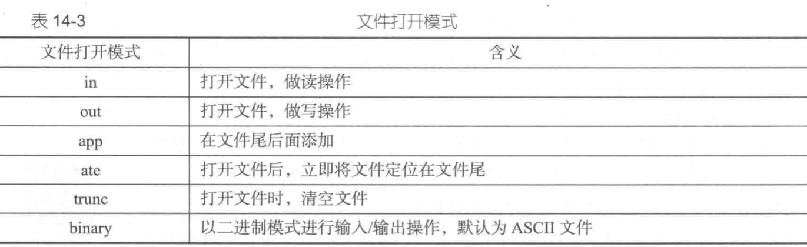
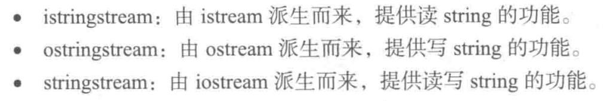

# C(from C primer)

## 缓冲

1. 完全缓冲：缓冲区满时被清空（内容发送至其目的地），通常在文件输入中，缓冲区大小取决于系统。
2. 行缓冲：遇到一个换行符时将被清空缓冲区。
>[ANSI C](https://baike.baidu.com/item/ANSI%20C标准/6044290?fr=aladdin)指定应该对输入进行缓冲。[K&R](https://www.cnblogs.com/huangjacky/archive/2012/05/04/2482529.html)则将选择权留给了编译器的编写者。
## 标准输入输出

`printf() scanf()`
`getchar() putchar()`
`gets() puts()`

## 输入输出重定向：

将`stdin`，`stdout`流分配至文件。让数据读入函数从该流中服务数据，而不关心流是从何处获取其数据。
`>`：输出流重定向
`<`：输入流重定向
重定向运算符将 **一个可执行程序(exe)** 与 **一个数据文件** 连接起来。可以同时使用。
example：将输入流重定向至某txt文件。
```
/Users/diannao/Desktop/computer_science/clion_project/se_test_2020/cmake-build-debug/se_test_2020 < /Users/diannao/Desktop/computer_science/clion_project/se_test_2020/data.txt
```

## 文件操作

### 文件视图


### 标准文件

C自动为您打开3个文件，分别为标准输入(standard input)，（一般默认为键盘）标准输出(standard output)（一般默认为显示器），标准错误输出。
### 文件处理函数

#### 打开关闭

`FILE* fopen("文件路径","文件打开模式")`返回file pointer。

`fclose(FILE *fp)`关闭由fp指定的文件。

#### 读写单个字符

`getc(FILE *fp) putc(char ch,FILE *fpout)`与`getchar() putchar()`非常像，但要指定文件指针。
标准文件指针

| 标准文件 | 文件指针 | 一般设备 |
|:--------:|:--------:|:--------:|
| 标准输入 |   stdin  |   键盘   |
| 标准输出 |  stdout  |  显示器  |
| 标准错误 |  stderr  |  显示器  |

#### 读写多个字符

```c
size_t fread(void *ptr, size_t size, size_t nmemb, FILE *stream);
//ptr指向读入内容
//这是要读取的每个元素的大小，以字节为单位。
//这是元素的个数，每个元素的大小为 size 字节。一共读取size * nmemb个字节。
size_t fwrite(const void *ptr, size_t size, size_t nmemb, FILE *stream);
//ptr指向写入内容
//这是要写入的每个元素的大小，以字节为单位。
//这是元素的个数，每个元素的大小为 size 字节。一共写入size * nmemb个字节。
```

#### 格式化输入输出

`fprintf(FILE *fin,"内容") fscanf(FILE *fout,"内容")`

#### 读写一行

`fgets(char *A,int max,FILE *fp)`
读取它遇到的第一个换行字符的后面，或者读取比字符串少一个字符或者读取到文件结尾，然后再末尾添加一个空字符构成一个字符串。
如果`fgets()`函数在达到最大数目前读完了一整行，它将在字符串的空字符前添加一个换行符。

>与`gets(char *str)`的区别：`gets()`不读入换行符，当它读入换行符，它会将字符数组的末尾置'\0'。而`fgets()`读入换行符后，会将该位置为换行符，再将该位的下一位置为`\0`。

`fputs(char *A,FILE *fp)`
将字符串地址所指的字符串写入指定的文件。

## C++(from textbook)
c++的输入输出是基于对象的
### 标准类型数据输出 
**cout对象**
`<<`流插入运算符返回值是第一个参数的引用，所以流插入运算符允许连续的使用。
>流插入运算符能自行识别数据类型，并根据类型解释内存单元的信息。但在输出指针的值（即指针指向内容地址）时，对于除字符串外的其他类型，可以直接输出。比如
```c++
int a=5,*p=&a;
cout<<p;
```
>将输出a的地址，但字符串却不行，它会直接输出字符串的内容，所以要进行强制类型转换。像下面这样`cout<<(void*)p`
`cout.put(char c).put(char c)`可以连续调用。

### 标准类型数据输入
`>>`流提取运算符同样返回第一个运算对象的引用，(EOF会返回false)，跳过输入流中的空白字符（空格，tab，回车）。
`cin.get()`类似`getchar()`，从当前输入流对象读入一个字符，包括空白字符和**EOF**
`cin.get(char &c)`将输入流下一个字符存储在参数中。
`cin.get(char *str,int max,char c)`读入数组str中，输入达到max-1个数字时终止或读到了c字符终止。
`cin.getline(char *str,int max,char c)`与它的唯一区别是get()将结束符留在输入流中，而geiline()则将结束符从输入流中删除。

### 基于文件的输入输出

从标准输入输出流`cin,cout`转变为文件流
输入文件流对象(ifstream)
输出文件流对象(ofstream)
输入/输出文件流对象(fstream)

1. 定义一个文件流对象
   ```c++
   ifstream infile;
   ```
2. 打开文件
   ```c++
   infile.open("路径",ifstream::in);
   //或用构造函数直接打开
   ifstream infile("路径",ifstream::in);
   //filename 也可以以string提供
   //以输入输出方式打开
   fstream iofile("路径",fstream::in|fstream::out);
   ```
   
3. 文件操作
   ```c++
   int num;
   infile>>num;//从infile读入
   outfile<<num;//写入outfile
   ```
4. 关闭文件
   ```c++
   file.close();
   ```

文件同样可以使用`getline()`进行读写

```cpp
istream& getline (istream& is, string& str, char delim);
istream& getline (istream& is, string& str);
//从is中读取，存入str中，碰到delim停止，若不提供delim，则以`\n`为delim
```

[Read file line by line using ifstream in C++](https://stackoverflow.com/questions/7868936/read-file-line-by-line-using-ifstream-in-c)

### 基于字符串的输入输出



#### 格式化字符串

```c++
std::ostringstream ss;
ss << "My age is " << age;
std::string str = ss.str();
```

> << means append from stream
>
> \>\> means extract from stream

#### 格式化输入

> 类似实现scanf("format", ...)

e.g.

```cpp
std::string str = ":12341+414112=absca";
std::stringstream ss(str);
int v1, v2;
char col, op, eq;
std::string var;
ss >> col >> v1 >> op >> v2 >> eq >> var;
std::cout << v1 << " " << v2 << " " << var << std::endl;
```

> Tip
>
> - 流运算符会保留里面的东西，所以如果你要用一个流对象格式化多个字符串，中间要使用`stringstream_instance.str(std::string())`or`stringstream_instance.str("")`
> - space会帮你跳过，所以不用用一个char space来读入空格。

### 二进制文件读写

#### c++ function

二进制文件不能使用从流中读写数据的方式，读写需要用到下面的函数。

```c++
ostream & write(char *buffer, int count);
//将buffer所指向的count个字节的内容写入文件
//写入位置由ofstream维护
//返回调用这个函数的对象，比如obj.write(...) 返回obj，要写文件，那应该是个ofstream
```

```c++
istream & read(char *buffer, int count);
//从文件中读指针位置（由istream维护）开始读取count个字节
```

#### 应用场景

可以直接将**类**写入文件。

比如可以将学生类写入文件

```c++
class Cstudent{
public:
  char name[20];
  int age;
};
```

这样方便读入文件后进行操作。

解释：如果以文本格式写入文件，学生信息可能长这样

```
Alice 20
Bob 19
...
```

这样读入文件时，每个学生名字长度不固定，其实是不好操作的。但是二进制读写的话，可以直接读入一个类。

> 写入

```c++
Cstudent s;
ofstream outFile("students.dat", ios::out | ios::binary);
cin >> s.name >> s.age;
outFile.write((char*)&s, sizeof(s));
```

> 读

```c++
Cstudent s;
ifstream inFile("student.dat", ios::in|ios::binary);
inFile.read((char *)&s, sizeof(s));
cout << s.name << s.age;//直接操作类
```

## I/O Tips

- [What is the difference between endl and \n in C++?](https://www.educative.io/edpresso/what-is-the-difference-between-endl-and-n-in-cpp)

main idea: endl will flush the output buffer

from stack overflow

```cpp
std::ostream os;
os << std::endl; // more concise
os << '\n' << std::flush; // more explicit about flushing
```

Those two lines have the exact same effect.
