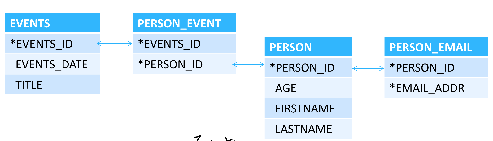
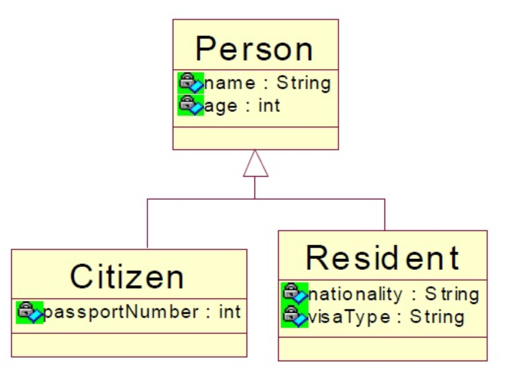
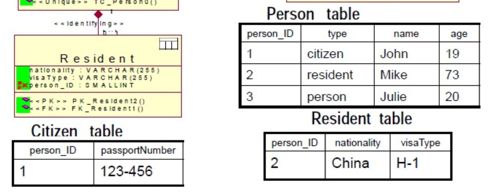
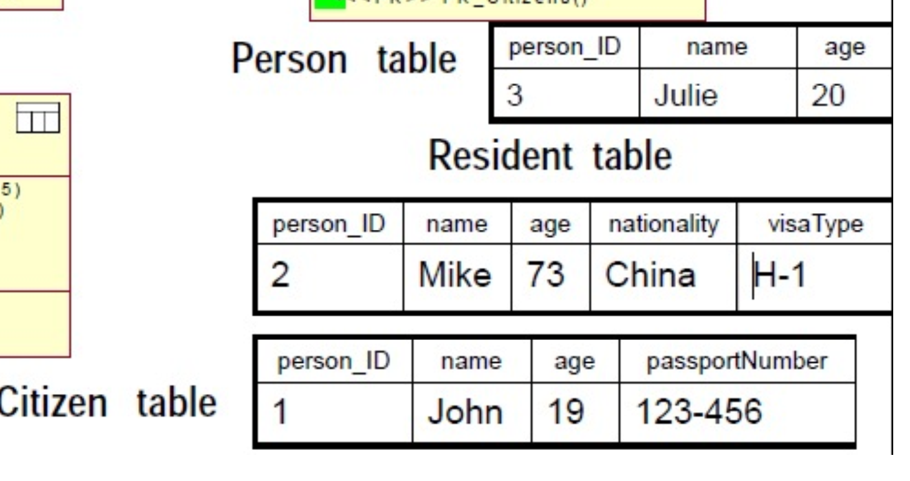
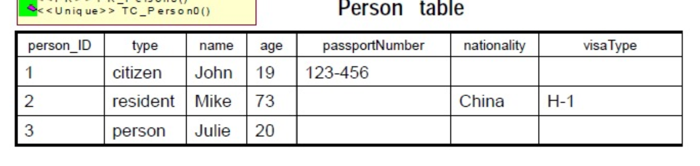

# Accessing DB

# JDBC

What is jdbc?

Java Database Connectivity Java数据库连接。

数据库有不同的实现（cpp，c......），java提供了标准API，用户面向这些API编程。数据库驱动即把这些api翻译成cpp、c之类的数据库私有api调用。

## jdbcTemplete

[参考博客](https://www.cnblogs.com/wangyujun/p/10687780.html)，直接通过写SQL语句来访问数据库。我的bookstores的迭代二，即commit（见下），便采用了这种方式。

> ca4ff23de06fdf635aa9ba50de8d4fa2f3196066

## ORM

> Object/Relation Mapping 对象关系映射

### Motivation

为什么要用ORM？

1. 粒度。传统数据库中一张表对应java中的一个类，但有时会出现多张表对应一个类，比如order和orderItem，这时就需要ORM。

   

   比如多对多关系，必须要再加一张表（PERSON_EVENT）将其表示为两个一对多关系才能在关系型数据库中存储。

2. 继承。

3. 标识。数据库中以主键区分不同记录，java中以地址区分不同对象。两者有可能不匹配，即多个对象标识同一条记录。

4. 关联。

5. 数据导航。

#### 继承

继承关系如何在关系型数据库中存储

> 考虑如下继承关系



1. Joined table

   

   Person_table中存储这个人的种类，通过这个种类关联到子类的额外信息存储的表。

   缺点，每次存储都需要关联操作。

2. Table per class

   

   不管继承关系，当成不同的类存储。

   Cons: 查找需要查三张表。

3. Single table

   

   冗余数据多，字段数量多。

### Hibernate VS Spring Jpa

> ref link:
>
> [What is the difference between Hibernate and Spring Data JPA](https://stackoverflow.com/questions/23862994/what-is-the-difference-between-hibernate-and-spring-data-jpa)
>
> [Spring boot Jpa: hibernate as default?](https://stackoverflow.com/questions/41902856/spring-boot-jpa-hibernate-as-default)

main points:

1. Hibernate is a JPA implementation.
2. Spring Data JPA is a JPA data access abstraction.
3. Spring Data JPA cannot work without a JPA provider.
4. The default provider is Hibernate.

### Hibernate

通过entity类操作数据库。

#### entity类写法

> entity类要实现getter和setter

```java
@Entity//告诉Hibernate来托管这个类
@Table(name = "EVENTS")//对应的数据库表名
public class Event {
    private Long id;
    private String title;
    private Date date;

    private Set<Person> participants = new HashSet<>();

    public Event() {
        // this form used by Hibernate 要写一个空的构造函数
    }

    public Event(String title, Date date) {
        // for application use, to create new events
        this.title = title;
        this.date = date;
    }

    @Id//标识主键
    @GeneratedValue(generator = "increment")//自增类型
    @GenericGenerator(name = "increment", strategy = "increment")
    public Long getId() {
        return id;
    }

    private void setId(Long id) {
        this.id = id;
    }

    @Temporal(TemporalType.TIMESTAMP)//java中的Date和数据库的时间不一样
    @Column(name = "EVENT_DATE")//属性名与数据库列名不一致
    public Date getDate() {
        return date;
    }

    public void setDate(Date date) {
        this.date = date;
    }

    public String getTitle() {
        return title;
    }

    public void setTitle(String title) {
        this.title = title;
    }

    //注解要么都在Getter方法上，要么都在属性上，不能混用
    @ManyToMany(cascade = {CascadeType.ALL}, fetch = FetchType.EAGER)
  	//多对多，级联操作注解，person和它关联的event要不要一起存，一起删
    @JoinTable(name = "PERSON_EVENT",
            joinColumns = @JoinColumn(name = "event_id", referencedColumnName = "id"),
            inverseJoinColumns = @JoinColumn(name = "person_id", referencedColumnName = "id"))
    public Set<Person> getParticipants() {
        return participants;
    }

    public void setParticipants(Set<Person> participants) {
        this.participants = participants;
    }

}
```

##### 不同的关联映射写法


```java
//person <--> event 多对多映射
@ManyToMany(cascade = {CascadeType.ALL}, fetch = FetchType.EAGER)
//多对多，级联操作注解，person和它关联的event要不要一起存，一起删
@JoinTable(name = "PERSON_EVENT",//关联表，上图中的表2
        joinColumns = @JoinColumn(name = "event_id", referencedColumnName = "id"),//event_id在引用我的id
        inverseJoinColumns = @JoinColumn(name = "person_id", referencedColumnName = "id"))//person_id在引用对面的id
public Set<Person> getParticipants() {
    return participants;
}
```

```java
//person --> person_email 一对多映射
@ElementCollection//下面属性是一个集合
@CollectionTable( name="PERSON_EMAIL",//且这个集合来自于这张表
		joinColumns = {@JoinColumn(name = "PERSON_ID", referencedColumnName = "id")})//那张表的personID映射我这张表的id
@Column(name="EMAIL_ADDRESS")
public List<String> getEmailAddresses() {
		return emailAddresses;
}
```

#### Config

```xml
<property name="connection.driver_class">com.mysql.cj.jdbc.Driver</property>
<property name="connection.url">jdbc:mysql://localhost:3306/ormsample</property>数据库
<property name="connection.username">root</property>
<property name="connection.password">reins2011!</property>
```

#### session

Hibernate通过session与数据库交互。

```java
//在示例中这些语句都是写在servelet中的
//获取session
Session session = HibernateUtil.getSessionFactory().openSession();
//开启事物，在事物中进行操作
session.beginTransaction();
/* 在内存中对类进行一些设置 */
session.save(t);
session.getTransaction().commit();//提交事物
```

#### object states

Hibernate定义并支持下面三种对象状态

- Transient 临时的

  刚刚通过new运算实例化但还没被session关联起来的对象。可以通过session.save将其关联起来。

- Persistent 持久的

  持久的对象在数据库中有对应数据和标识符。

- Detached 脱离的

  对象已经被持久化过了，但与其关联的session被关闭了。

Hibernate需要一个助手类来产生session，不同的项目都使用这个助手类即可。

```java
public class HibernateUtil {
    private static final SessionFactory sessionFactory = buildSessionFactory();//单例

    private static SessionFactory buildSessionFactory() {
//        try {
//            // Create the SessionFactory from hibernate.cfg.xml
//            return new Configuration().configure().buildSessionFactory(); }
//        catch (Throwable ex) {
//            // Make sure you log the exception, as it might be
//            System.err.println("Initial SessionFactory creation failed." + ex);
//            throw new ExceptionInInitializerError(ex);
//        }

        // A SessionFactory is set up once for an application!
        final StandardServiceRegistry registry = new StandardServiceRegistryBuilder()
                .configure() // configures settings from hibernate.cfg.xml
                .build();
        try {
            return new MetadataSources(registry).buildMetadata().buildSessionFactory();
        } catch (Exception e) {
            // The registry would be destroyed by the SessionFactory, but we had trouble building the SessionFactory
            // so destroy it manually.
            StandardServiceRegistryBuilder.destroy(registry);
            throw new ExceptionInInitializerError(e);
        }
    }

    public static SessionFactory getSessionFactory() {//实现一个静态方法，用来获取session
        return sessionFactory;
    }
}
```

### Spring JPA

#### entity类写法

SpringJPA的写法与Hibernate类似

```java
@Entity
@Table(name = "events", schema = "ormsample")
@JsonIgnoreProperties(value = {"handler","hibernateLazyInitializer","fieldHandler"})//防止循环依赖
@JsonIdentityInfo(//主键及主键的生成策略是什么
        generator = ObjectIdGenerators.PropertyGenerator.class,
        property = "eventId")
public class Event {
    private int eventId;
    private String title;
    private Timestamp eventDate;

    @Id
    @Column(name = "id")
    @GeneratedValue(strategy = GenerationType.IDENTITY)
    public int getEventId() {
        return eventId;
    }

    public void setEventId(int eventId) {
        this.eventId = eventId;
    }

    @Basic
    @Column(name = "title")
    public String getTitle() {
        return title;
    }

    public void setTitle(String title) {
        this.title = title;
    }

    @Basic
    @Column(name = "EVENT_DATE")
    public Timestamp getEventDate() {
        return eventDate;
    }

    public void setEventDate(Timestamp eventDate) {
        this.eventDate = eventDate;
    }

    @Override
    public boolean equals(Object o) {
        if (this == o) return true;
        if (o == null || getClass() != o.getClass()) return false;

        Event that = (Event) o;

        if (eventId != that.eventId) return false;
        if (title != null ? !title.equals(that.title) : that.title != null) return false;
        if (eventDate != null ? !eventDate.equals(that.eventDate) : that.eventDate != null) 
          return false;

        return true;
    }

    @Override
    public int hashCode() {
        int result = eventId;
        result = 31 * result + (title != null ? title.hashCode() : 0);
        result = 31 * result + (eventDate != null ? eventDate.hashCode() : 0);
        return result;
    }

    private List<Person> participants;

    @ManyToMany(fetch = FetchType.LAZY)//java EE标准规定的annotation，因此和Hibernate中的一样
    @JoinTable(name = "PERSON_EVENT",joinColumns = @JoinColumn(name = "EVENT_ID"),
            inverseJoinColumns = @JoinColumn(name = "PERSON_ID"))
    public List<Person> getParticipants() {
        return participants;
    }

    public void setParticipants(List<Person> participants) {
        this.participants = participants;
    }
}
```

#### annotation

1. `@Column`作用在实体的简单属性上面，简单属性就是String，Integer等类型，体现在数据库表格上面就是一个字段。

2. `@JoinColumn` 作用在实体的复杂属性上面，复杂属性就是别的实体（Entity），体现在数据库表格上面就是一个外键。

3. `@Transient`表示该属性并非一个到数据库表的字段的映射，ORM框架将忽略该属性。比如这个属性存在MongoDB中。

4. `@Basic`用于持久类属性，如果你在实体类属性上不加@Basic注解，它也会自动加上@Basic，并使用默认值。

5. `@GeneratedValue`

    JPA提供的四种标准用法为TABLE,SEQUENCE,IDENTITY,AUTO.

    - TABLE：使用一个特定的数据库表格来保存主键。


    - SEQUENCE：根据底层数据库的序列来生成主键，条件是数据库支持序列。

    - IDENTITY：主键由数据库自动生成（主要是自动增长型）

    - AUTO：主键由程序控制。

#### 关联映射

##### 双向与单向

- 单向关联指具有关联关系的实体对象之间的加载关系是单向的。它意味着，在具有关联关系的两个实体对象中，只有一个实体对象可以访问对方。比如bookstore中，从order、cartItem都可以访问到User，但不能从User访问到order等。

+ 双向关联指具有关联关系的实体对象之间的加载关系是双向的。它意味着，在具有关联关系的两个实体对象中，彼此都可以访问对方。比如Event和People中，从event可以访问到people，从people也可以访问到event。


Ref:[单向关系中的JoinColumn](https://blog.csdn.net/yingevil/article/details/6875421)

> Main idea:
>
> 在单向关系中没有mappedBy,主控方相当于拥有指向另一方的外键的一方。
>
> 1. 一对一和多对一的@JoinColumn注解的都是在“主控方”，都是本表指向外表的外键名称。
> 2. 一对多的@JoinColumn注解在“被控方”，即一的一方，指的是外表中指向本表的外键名称。

##### XToY

> prerequisite:
>
> [@JoinColumn @JoinTable](https://blog.csdn.net/Hommiee/article/details/106466838)
>
> ```java
> //@joinColumn的作用是声明关联关系，即一对一，一对多，多对一等
> @JoinColumn(name = "当前表的字段", referencedColumnName = "引用表对应的字段，如果不注明，默认就是引用表的主键")
> ```
>
> @joinTable一般与@ManyToMany关系连用，具体使用见7。

1. [@OneToOne](https://www.baeldung.com/jpa-one-to-one)

   ```java
   //一对一关系
   @OneToOne
   @JoinColumn(name="本表中指向另一个表的外键")
   ```

2. [@ManyToMany](https://www.baeldung.com/jpa-many-to-many)的写法可以参照上面的例子（摘要见下）。其中@JoinTable解释见1

   

   ```java
   //event <---> person 多对多关系，数据库中需要额外维护一张对应关系表
   @ManyToMany(fetch = FetchType.LAZY)//java EE标准规定的annotation，因此和Hibernate中的一样
   @JoinTable(name = "PERSON_EVENT",joinColumns = @JoinColumn(name = "EVENT_ID"),
           inverseJoinColumns = @JoinColumn(name = "PERSON_ID"))
   //name：数据库里的中间关系表名(blog_tag_relation)
   //joinColumns：当前表在关系表的链接字段
   //inverseJoinColumn：另一张表在关系表的链接字段
   public List<Person> getParticipants() {
     return participants;
   }
   ```

3. [mappedBy](https://www.baeldung.com/jpa-joincolumn-vs-mappedby) 单向关联关系中没有mappedBy

   数据库中一对多的**双向关联关系**，关联关系总是被**多方维护的**，即外键在多方，我们在单方对象的`@OneToMany(mappedBy="xxx")`中把关系的维护交给多方对象的属性去维护关系。mappedBy的属性值是关联类的对应属性名。
   
   而一对多的**单向关联关系**，虽然外键还在多方，但一方可以通过@JoinColumn(name="另一个表指向本表的外键")来表示。考虑bookstore的例子，User和Order是单向一对多关系，可以在User类中定义下述属性。详见[单向关系中的JoinColumn](https://blog.csdn.net/yingevil/article/details/6875421)
   
   ```java
   @OneToMany
   @JoinColumn(name = "user_id")
   private List<Order> orderList;
   ```
   
   注意：如果不使用@JoinColumn，就会生成一张中间表。

#### CascadeType 级联操作

[JPA概念解析：CascadeType（各种级联操作）详解。](https://blog.csdn.net/u011726984/article/details/72625783)

- CascadeType.REMOVE
   Cascade remove operation，级联删除操作。
   删除当前实体时，与它有映射关系的实体也会跟着被删除。
- CascadeType.MERGE
   Cascade merge operation，级联更新（合并）操作。
   当Student中的数据改变，会相应地更新Course中的数据。
- CascadeType.DETACH
   Cascade detach operation，级联脱管/游离操作。
   如果你要删除一个实体，但是它有外键无法删除，你就需要这个级联权限了。它会撤销所有相关的外键关联。
- CascadeType.ALL
   Cascade all operations，清晰明确，拥有以上所有级联操作权限。

> One problem: 在写年度报告的后端的遇到的，当我parent entity的主键使用自己定义的主键，没有使用`@GeneratedValues`，child entity的主键是自动生成的，级联插入的时候会导致数据项为空，即插入(1, null, null, ...)这样的数据项

#### Lazy fetch

懒加载要解决的问题是，有一些类的属性是直接从数据库中加载还是当用户查看这个属性时再加载。比如多张表关联时，（event加载时要不要加载参加这个person的event），或者一张表的大属性（只有当用户查看头像时才加载头像）。

[两种懒加载方式](https://blog.csdn.net/weixin_37968613/article/details/100771942)

1. `		@OneToMany(mappedBy = "cId", fetch = FetchType.LAZY)`
2. `	@Basic(fetch = FetchType.LAZY)`

##### VS FetchMode

@Fetch(FetchMode.JOIN/SELECT)

[ref](https://stackoverflow.com/a/25821758/16598178)

- FetchType (Lazy/Eager) tells whether we want entity to be loaded eagerly or lazy, when there's call in code.

- FetchMode (Select/Join) tells whether we want our entitity to be loaded with additional select or in one query with join or subselect.

FetchMode往往在@OneToMany关系中，假设User对应很多Order，如果是Select，那么就会执行（当你访问这个column的时候才会执行）

```sql
select ... from Order o where o.user_id = ...
```

从而产生n个查询（如果你有n个User）

> that's the N+1 Problem in ORM

如果是Join，那么就会执行

```sql
select ... from User u join Order o on u.id = o.user_id where u.id = ...
```

从而只需要一条语句。

Q：看起来Join一定是Eager的呀？那么FetchType还怎么起作用呢？

A：from [ref](https://stackoverflow.com/a/61430192/16598178)

If a field is not annotated with `@Fetch`, then the default `FetchMode` for this field depends on a `FetchType` and how the query is done:

- `FetchType.LAZY` => `FetchMode.SELECT`
- FetchType.EAGER
    - getting by ID (`Session.get`) => `FetchMode.JOIN`
    - JPQL query => `FetchMode.SELECT`
    - Criteria API query => `FetchMode.SELECT`

#### Repository

SpringJPA方便之处在于它帮你实现了`JpaRepository`，所以你的repository只需要extends这个类即可

> Mongodb也有对应的 MongoRepository

```java
public interface UserRepository extends JpaRepository<User,Integer>//User表示数据库中的元素，Interger是主键类型，这里要写类，因此不能用int，要用Interger
{
}
```

而这个类已经提供了一些查询和修改操作，具体见[Spring doc](https://docs.spring.io/spring-data/jpa/docs/current/api/org/springframework/data/jpa/repository/JpaRepository.html)


##### Derived Query Methods

除了上面这些函数，还有一些不用写@Query就可以用的函数：[Derived Query Methods in Spring Data JPA Repositories](https://www.baeldung.com/spring-data-derived-queries)只需要在repository中声明即可。

- spring支持可以find属性的属性 [ref-link](https://docs.spring.io/spring-data/jpa/docs/2.5.2/reference/html/#repositories.query-methods.query-property-expressions)

  e.g.

  ```java
  List<Person> findByAddressZipCode(ZipCode zipCode);
  ```

  算法逻辑：先找Person下的AddressZipCode，如果没有，将单词按驼峰进行分解为AddressZip和Code，直到找到。

  避免歧义（比如既有AddressZip又有Address的ZipCode）可以使用下划线进行人为的分割`findByAddress_ZipCode`。

##### flush 持久化

修改Entity操作后，需要save这个Entity，但此时也不会将这个Entity存入DB中，如果需要立刻持久化到DB中，要使用`saveAndFlush(Entity entity)`。

##### getById VS findById

[difference between getById VS findById](https://szymonkrajewski.pl/the-practical-difference-between-findby-and-getby-in-repositories/): findById返回一个Optional，然后可以用Optional判断是否存在，getById返回一个entity的**引用**，这很关键，这意味着你在transactional外面调用这个引用会报no session。

这里再多解释一下no session这个报错，如果你在transactional调用get方法get没从数据库里读出来的东西，比如lazy加载的东西，或是上面提到的entity的引用，就会报这个错。

解决方法：eager，application.propertites里加spring.jpa.open-in-view=true

##### Projection

[Spring Data JPA Projections](https://www.baeldung.com/spring-data-jpa-projections)

当我们不需要一个entity的所有属性时，可以使用投影操作。

### application.properties

`spring.jpa.properties.hibernate.hbm2ddl.auto=update`

使用hibernate生成database schema

### Query

- HQL = Hibernate Query language
- JPQL（Java Presistence Query Language ）是EJB3.0中的JPA造出来的对象查询语言。JPQL是完全面向对象的，具备继承、多态和关联等特性。

#### [Syntax](https://www.onlinetutorialspoint.com/hibernate/hibernate-query-language-hql-select.html#:~:text=Hibernate%20Query%20Language%20%28HQL%29%20%3A%201%20HQL%20is,HQL%20looks%20like%20SQL%20only.%20More%20items...%20)

[深入HQL学习以及HQL和SQL的区别](https://blog.csdn.net/qq_28633249/article/details/77884062)

