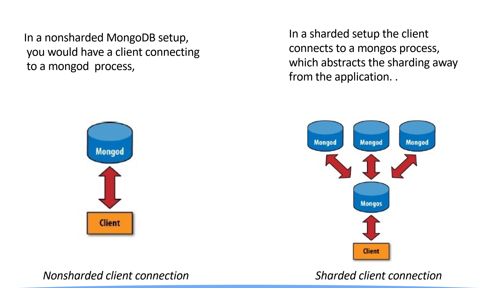
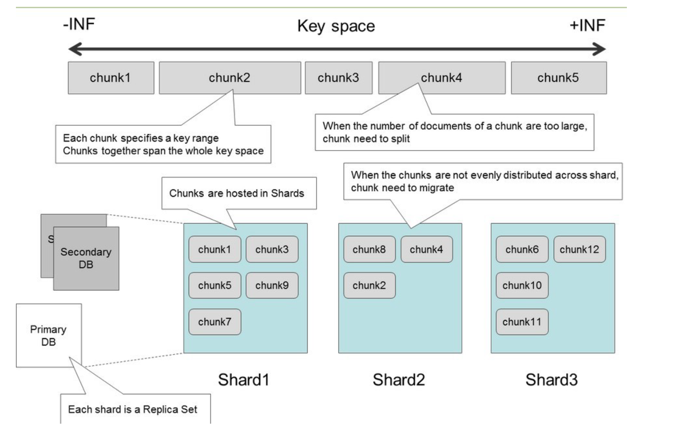

# NoSQL Note

## NoSQL

not only SQL

支持不严格的schema

### big data

read from multiple disks at once

1. solve hardware failure

   avoid data loss through replication

   - RAID 五块硬盘抑或，到第六块硬盘

2. we need to combine the data in some way

   data read from one disk may need to be combined with the data from any of the other 99 disks

   join, ...

What if we distribute the data of RDBMS into multiple physical machines?

- problem of single table

  1. the table will be locked when transaction being executed
  2. shared lock allows other threads to read but not write the table
  3. excluded lock denies any access form other threads

  => 性能很差

- 将table水平切分

  不同的表schema相同

  e.g. table_student into two tables table_student1 and table_student2

  管理复杂度高

- 垂直切分

  将data存到不同的表中，表间具有complementary schemas

- 水平分区 partition

- 垂直分区

Also SQL db无法应对半结构化数据。

是否有这个字段与这个字段是否可为null不同，导致schema约束放松。

One example in MongoDB:


### 数据类型

结构化数据：**结构化数据指的是由二维表结构来逻辑表达和实现的数据，严格遵循数据格式与长度规范，也称作为行数据。**

非结构化数据：**数据结构不规则或不完整，没有任何预定义的数据模型，不方便用二维逻辑表来表现的数据。**

半结构化数据：**不符合二维逻辑这种数据模型结构，但是包含相关标记，用来分割语义元素以及对记录和字段进行分层**。常见的半结构化数据有`XML`和`JSON`。

### 与SQL的区别

> Ref:https://www.cnblogs.com/xrq730/p/11039384.htm

- 常见的NoSQL类型

  

  1. 列式数据。

     对应的nosql：HBase,BigTable等。

  2. 文档数据库。

     对应的nosql：CouchDB, MongoDb

     旨在将半结构化数据存储为文档，通常采用 JSON 或 XML 格式。与传统关系数据库不同的是，每个 NoSQL 文档的架构是不同的，可让您更加灵活地整理和存储应用程序数据并减少可选值所需的存储。

     典型应用场景：存储类似JSON格式的内容，可对某些字段建立索引功能，是最像关系型的数据库。

  3. 图数据库。

     可存储顶点以及称为边缘的直接链路。图形数据库可以在 SQL 和 NoSQL 数据库上构建。顶点和边缘可以拥有各自的相关属性。

     典型应用场景：社交网络，推荐系统等。专注于构建关系图谱，善于处理大量复杂、互连接、低结构化的数据，数据往往变化迅速，且查询频繁。

  4. 内存键值存储。

     典型应用场景：内容缓存，主要用于处理大量数据的高访问负载，也用于一些日志系统等等。

  ### How to choose

  

  1. 非关系型数据库都是通过牺牲了ACID特性来获取更高的性能的，假设两张表之间有比较强的一致性需求，那么这类数据是不适合放在非关系型数据库中的。
  2. 

## MongoDB

### differences with RBDMS

> RDBMS: relational Database management system

|   数据库   |               数据库               |
| :--------: | :--------------------------------: |
| 表格 table |    集合 collection(schema-free)    |
|   行 row   |           文档  document           |
| 列 column  |            字段  field             |
|    主键    | 主键 (MongoDB 提供了 key  为 _id ) |

### document

document包含一个或多个key-value对

键值对是有序的

类型敏感，大小写敏感

```json
{"foo":3}
{"foo":"3"}
{"Foo":3}
```

document不能包含相同的key

嵌套document

### collection

为什么要把document放到不同的collection里？

### sharding



可以add more machines to handle逐渐增加的load和data size



每一个document会有一个Key，将key分成一个个chunk，将不同的chunk存到不同的物理机上。

如果大量的主键都落到某台物理机上，数据存储不平衡->约定chunk大小，超过某个大小，分裂为C1，C2。

MongoDB通过迁移chunk来保证最小chunk的server和最多chunk的server的差小于等于2。可以通过设置关闭（自己写调度程序适配你的应用场景，比如热数据的server chunk少一点）。

### manipulate

https://blog.csdn.net/weixin_43239068/article/details/108531171

启动 brew services start mongodb-community@5.0

关闭 brew services stop mongodb

`mongosh` 进入mongo shell。

`show dbs`

`use $db_name`

`db` 查看当前使用的db

`show tables` `show collections` 

`db.dropDatabase()`

`db.createCollection(name)`

`db.collection.drop()`

执行脚本：[Write Scripts for `mongosh`()](https://docs.mongodb.com/mongodb-shell/write-scripts/#write-scripts-for-mongosh)

#### integrate with spring

[official: Spring Boot Integration with MongoDB Tutorial](https://www.mongodb.com/compatibility/spring-boot)

mongodb也可以像spring jpa一样直接根据annotation建库，但是根据[Spring Boot + MongoDB+create collection from stackoverflow](https://stackoverflow.com/questions/61243601/spring-boot-mongodbcreate-collection)

> New collection won't be created until you insert at least one document. Refer the document

- [Binary文件存储](https://www.baeldung.com/spring-boot-mongodb-upload-file)

## redis

### prepare

[Mac安装Redis，原来就是这么简单](https://blog.csdn.net/realize_dream/article/details/106227622)

启动redis server 

```bash
redis-server
# or using homebrew
brew services start redis
```

启动redis client

```bash
redis-cli -h 127.0.0.1 -p 6379
```

关闭redis

```bash
redis-cli shutdown
# or using homebrew
brew services stop redis
```

### manipulate

ref-link

- [详细介绍redis from csdn](https://blog.csdn.net/liqingtx/article/details/60330555)

#### 基本操作

[redis-cli操作](https://redis.io/topics/rediscli)

```java
redis-cli [--raw]
```


```bash
keys pattern
# keys * 查看数据库中所有的键
select db_number
# 选择数据库，redis默认有0-15一共16个数据库，默认是第0个
# from Stack Overflow 一个redis实例最好只使用一个数据库
```

#### 数据类型

Redis作为KV数据库，key的类型都是string，value的类型有以下五种。

##### [string](https://www.runoob.com/redis/redis-strings.html)

string 是 redis 最基本的类型，你可以理解成与 Memcached 一模一样的类型，一个 key 对应一个 value。

```
SET key value
GET key
```

##### [hash](https://www.runoob.com/redis/redis-hashes.html)

Redis hash 是一个 string 类型的 field 和 value 的映射表，hash 特别适合用于存储对象。

```
HMSET hash_key field1 value1 field2 value2 ... fieldn valuen
HGET hash_key field_i
HGETALL hash_key
```

##### [list](https://www.runoob.com/redis/redis-lists.html)

Redis列表是简单的字符串列表，按照插入顺序排序。你可以添加一个元素到列表的头部（左边）或者尾部（右边）

```
LPUSH list_key value1 [value2]
RPUSH list_key value [value2]
LPOP list_key
RPOP list_key
```

##### [set](https://www.runoob.com/redis/redis-sets.html)

Redis 的 Set 是 String 类型的无序集合。集合成员是唯一的，这就意味着集合中不能出现重复的数据。

Redis 中集合是通过哈希表实现的，所以添加，删除，查找的复杂度都是 O(1)。

集合还可以取交集、取并集、取差集等等。

```
SADD set_key member1 [member2]
SREM key member1 [member2]
```

##### [sorted set](https://www.runoob.com/redis/redis-sorted-sets.html)

Redis 有序集合和集合一样也是 string 类型元素的集合,且不允许重复的成员。

不同的是每个元素都会关联一个 double 类型的分数。redis 正是通过分数来为集合中的成员进行从小到大的排序。

```
ZADD sorted_set_key score1 member1 [score2 member2]
ZREM key member [member ...]
```

#### 持久化

redis提供了两种持久化的方式，分别是RDB（Redis DataBase）和AOF（Append Only File）。

RDB，简而言之，就是在不同的时间点，将redis存储的数据生成快照并存储到磁盘等介质上；

AOF，则是换了一个角度来实现持久化，那就是将redis执行过的所有写指令记录下来，在下次redis重新启动时，只要把这些写指令从前到后再重复执行一遍，就可以实现数据恢复了。

其实RDB和AOF两种方式也可以同时使用，在这种情况下，如果redis重启的话，则会优先采用AOF方式来进行数据恢复，这是因为AOF方式的数据恢复完整度更高。

如果你没有数据持久化的需求，也完全可以关闭RDB和AOF方式，这样的话，redis将变成一个纯内存数据库，就像memcache一样。

## Neo4j

关系型数据库处理多对多关系时无法直接表示，需要增加一张表。

- Relational Databases Lack Relationships

- NoSQL Databases Lack Relationships

GRAPH DB embrace Relationship

### data model

nodes relationships properties labels

#### query

Cypher

[official doc about cypher](https://neo4j.com/developer/cypher/)

[cheat sheet](https://memgraph.com/blog/cypher-cheat-sheet)

```cypher
MATCH (a:Person)-[:KNOWS]->(b)-[:KNOWS]->(c), (a)-[:KNOWS]->(c) //不加箭头即查找双向关系
WHERE a.name = 'Jim'
RETURN b, c
```

三个应用运行在5个服务器上，5个服务器运行在三个物理机上，三个物理机放在两个机架上，每个机架有一个loadbanlancer，三个app访问3个DB（一个master，两个slave）

关系型数据库：


其中每一组多对多关系都有一张额外的表。

图数据库：


```cypher
MATCH	(user:User)-[*1..5]-(asset:Asset)
WHERE	user.name = 'User	3' AND	asset.status = 'down' RETURN DISTINCT asset
```

```cypher
(user)-[:USER_OF]->(app)
(user)-[:USER_OF]->(app)-[:USES]->(database)	
(user)-[:USER_OF]->(app)-[:USES]->(database)-[:SLAVE_OF]->(another-database)
(user)-[:USER_OF]->(app)-[:RUNS_ON]->(vm)
(user)-[:USER_OF]->(app)-[:RUNS_ON]->(vm)-[:HOSTED_BY]->(server)
(user)-[:USER_OF]->(app)-[:RUNS_ON]->(vm)-[:HOSTED_BY]->(server)-[:IN]->(rack)
(user)-[:USER_OF]->(app)-[:RUNS_ON]->(vm)-[:HOSTED_BY]->(server)-[:IN]->(rack)<-[:IN]-(load-balancer)
```

### building graph db app

> begin from p20

### db internals

separate stores for nodes, relation-ships, labels, and properties

node只记住第一个关系，第一个属性


### Log-Structured DB

#### 数据存储格式

- 按行存

支持事务处理C，U，D

```
row1 row2 row3 ...
t1 p1 b1 t2 p2 b2 t3 p3 b3 ...
```

- 按列存

支持分析处理，大量scan，analysis操作

```
t1 t2 t3 p1 p2 p3 b1 b2 b3 ...
```

+ 实现

1. 存两份，一份按列存，一份按行存

   > 空间，一致性，需要SQL解析器，访问不同存储

2. 事务多时按行存，分析多时按列存

   > 需要转换


