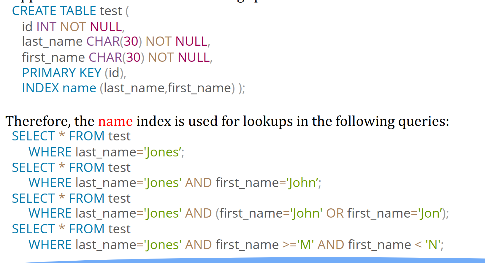
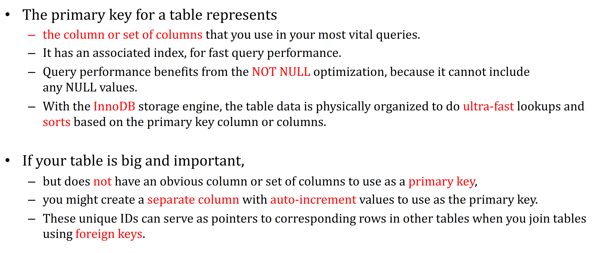

# SQL Database Note

> Author: Wei Xinpeng
>
> [HW 参考链接](http://leevj.com/post_wukan/2019-09-18-%E6%95%B0%E6%8D%AE%E5%BA%93%C2%B7%E5%AE%9E%E9%AA%8C%E4%B8%80/)
>
> [MySQL glossary](https://dev.mysql.com/doc/refman/8.0/en/glossary.html)

## 关系型数据库概念

主键：指能够通过某个字段唯一区分出不同的记录，这个字段被称为*主键*。还可以使用多个列作为联合主键。

## MySQL manipulation

在MySQL中，为了区分MySQL的关键字与普通字符，MySQL引入了一个反引号「 ` 」。

```bash
mysql database_name # connect to a database
mysql -u user_name --password(-p) database_name # Connect to a database, user will be prompted for a password
mysql -h database_host database_name # Connect to a database on another host
```

### 显示数据库列表

`show databases;`

### 创建数据库

`create database 数据库名;`

### 删除数据库

`drop database 数据库名;`

### 选择数据库

`use 数据库名;`

### 显示数据库中的所有表

`show tables;`

### 显示数据表的属性

`show columns from 数据表名;`

`describe table;`

### 删除数据表

`drop table 数据表名;`

### 执行sql文件

> 若要让该文件中的sql在某个table中执行，要先要use那个数据库

`source 路径.sql;`

路径为相对路径，且路径中不需要带引号，转义`\`等。比如`web app`文件夹直接写就好。

## SQL syntax

> What is SQL?
>
> SQL = Structured Query Language 结构化查询语言
>
> **The following is Mysql's syntax.**

SQL是大小写不敏感的

### 建表

```sql
create table name_of_table (
	ID char(5),
	name varchar(20),
  dept_name varchar(20),
  salary numeric(8,2)
  primary key(ID), -- 声明主键，也可以有多个
  foreign key(dept_name) references department -- 外键dept_name关联department表
);
```

### 插入

```sql
INSERT INTO <表名> (字段1, 字段2, ...) VALUES (值1, 值2, ...);
```

### 删除

```sql
DELETE FROM table_name
WHERE [condition];
```

### 更新

```sql
UPDATE table_name
SET column1 = value1, column2 = value2...., columnN = valueN
WHERE [condition];
```

### query

#### 基本格式

```sql
select A1,A2,...,An -- 选取A1, A2,...,An `*` 意味着所有属性
from r1,r2,...,rn -- 表r1
where P -- 谓词
```

select会返回一张表

#### table expression

> ref: [pg table expressions](https://www.postgresql.org/docs/current/queries-table-expressions.html)

A *table expression* computes a table. The table expression contains a `FROM` clause that is optionally followed by `WHERE`, `GROUP BY`, and `HAVING` clauses.

##### From

```sql
FROM table_reference [, table_reference [, ...]]
```

A table reference can be a table name (possibly schema-qualified), or a **derived table** such as a subquery, a `JOIN` construct, or complex combinations of these.

###### join

> 外键查询即需要它

```sql
-- 选出所有学生，同时返回班级名称
SELECT s.id, s.name, s.class_id, c.name class_name, s.gender, s.score
FROM students s -- 确定主表
INNER JOIN classes c -- 需要连接的表
ON s.class_id = c.id; -- 连接条件
```


```sql
INNER JOIN
```


```sql
FULL OUTER JOIN
```


```sql
RIGHT OUTER JOIN
```


```sql
LEFT OUTER JOIN
```


##### where

```sql
WHERE search_condition
```

search_condition is any value expression that returns a value of type `boolean`.

```sql
where dept_name = 'Comp.Sci.'
-- 可以使用 and or not
-- 比较符 < <= > => = <>

-- string匹配
where name like '%dar%' -- % 代表任意串
where name like '_dar_' -- _ 代表任意单个字符
```


#### Tips

```sql
select distinct ...-- 去除重复项
select all ...-- 保留重复项（默认）
```

```sql
select salary/12 as monthly_salary -- 语句中可以出现运算符，as 用来重命名
```

```sql
order by Ai -- 对select的表，按照Ai属性排序
order by A1,A2 -- 可以按照多个列排，如果第一列相等，按第二列排
```

#### 投影查询

```sql
select A1 别名, A2 别名,..., A3 别名 -- Ai代表属性，也就是列也可以不写别名
```

#### 多表查询

```sql
select *
from r1, r2 -- 返回r1 x r2，即笛卡尔积

-- 可以通过写别名来区分不同表中相同的属性
select
	students.id sid,
	teachers.id tid
from students, teachers;

-- 还可以对表起别名
select
	s.id sid,
	t.id tid
from students s, teachers t;
```

#### 嵌套查询

```sql
select A1,A2,...,An -- 选取A1, A2,...,An `*` 意味着所有属性
from (select ...) -- 因为select其实返回的也是表
where A1 in (select...)
where A1 not in (select...)
```

#### limit and offset

`LIMIT` and `OFFSET` allow you to retrieve just a portion of the rows that are generated by the rest of the query.

```sql
SELECT select_list
    FROM table_expression
    [ ORDER BY ... ]
    [ LIMIT { number | ALL } ] [ OFFSET number ]
```


### 集合操作

```sql
(select ...) union (select ...) -- R1并R2
(select ...) intersect (select ...) -- R1交R2
(select ...) except (select ...) -- R1除R2
-- 上面的集合操作默认会去除重复项
-- 可以加上 all(union all) 保留重复项
```

### 合计函数

```sql
avg() -- average value	
min() -- minimum value	
max() -- maximum value	
sum() -- sum of value
count() -- number of value
select avg(salary) from instructor where dept_name = 'Comp. Sci.'; -- 平均，会返回一个一行一列的表
```

#### 选取应用合计函数的组

```sql
select dept_name, avg (salary) as avg_salary
from instructor
group by dept_name
having avg(salsry) > 20
-- 按照dept_name分组，计算每一组的avg(salary)
-- 出现在select中的 不在合计函数中的属性，必须出现在group by中
-- having与where的区别，where在group前
```

### View

某些情况下不适宜给所有的user看到所有的逻辑模型。比如普通用户和管理员。

相当于用一个QUERY语句取表的一部分。

也可以通过

```sql
create view v as <query expression>
-- query is any legal SQL expression
-- 仅存储表达式，因此并不减少执行时间
-- e.g.

```

#### Materialized Views

将view进行物理上存储，即会把view中涉及到达的数据copy一遍。

#### update view

通过view更新因为涉及到写，会出各种问题。。。还是不要通过View update了吧。。。

**View 只读**

### Transaction（事务）ACID

事务由一组query、update等操作组成。这组SQL语句执行完后，再将改动从内存写到硬盘。

事务只能导致如下的结果

- Commit work

  所有的更新被持久的转移到数据库中。

- Rollback work

  如果某条指令出错了，事务中的所有语句都不会执行（即更改数据库）。

#### Atomic

事务边界划分

#### Isolation

加锁机制

#### Integrity Constraints（完整性约束）

- not null

- primary key

- unique

  ```sql
  unique(A1, A2, A3,...);
  ```

- check(P) P是一个谓词

  ```sql
  semester varchar(6);
  check(semester in ("FALL", "Winter", "Spring","Summer"));-- 约束semester取值
  ```

- 外键约束

  声明的外键必须在另一表中的对应列出现。

如果在事务过程中违反一致性约束

解决方案：defer约束性检查，将其移到事务执行完成再检查。

#### Durability

提交后必须持久化到数据库中。

### assert（断言）

```sql
create assertion <assertion-name> check (<prediction>)
```

### Built-in Data Types in SQL

- date

  ```sql
  date 2005-7-27
  ```

- time

  ```sql
  time '09:00:30'         time '09:00:30.75'
  ```

- timestamp

- interval

#### Large-Object Types

photos,videos,CAD files,etc.

- blob binary large object
- clob character large boject

实际在mysql中存的是对应文件的ref。对应文件存在mysql维护的另一个数据目录中。

### User-Defined Types

```sql
create type Dollars as numeric(12,2) final
```

### Index 索引

### Authorization

### function

“business logic” to be stored in the database and executed from SQL statements

```sql
create function dept_count (dept_name varchar(20))
	returns integer
begin 
	declare d_count  integer;
  select count (*) into d_count
  from instructor where instructor.dept_name = dept_name return d_count;
end
```

Pros：

使用SQL写函数。在SQL中执行。相比将数据读入Tomcat再处理，效率更高。

Edge Computing 边缘计算，数据在哪里产生，就在哪里处理。

Cons：

可迁移性变差。不同数据库方言不同。

其它应用也可以调用这个函数。

SQL结构化，不是面向对象的。

### Table function

The SQL standard supports functions that can return tables as results; such functions are called **table functions**。

### procedure

### trigger

自动执行当某种modification被执行时。

### normalization

第一范式：每列保持原子性。

## Optimization

> from RR

1. Full table scan should be avoided.

2. NULL value judgement for fields in the where clause should be avoided.

   NOT NULL USE 0,-1,default value.

   会使索引失效

3. Avoid use the != or <> operators.

4. Avoid using OR use join instead.

5. IN and NOT IN should also be used carefully.

6. Use `full-text search` rather `like`

7. Don't abuse indexes

   ↑ 充分利用索引，又不要滥用索引（增加增删改时间）。

8. Try to use numeric fields.

   多用数值类型，再考虑字符类型。

9. 使用varchar类型。

10. Don't fetch all the fields.(select * from...) 复杂查询用DTO，不要把全部字段都拿出来。

11. 分页在后端做。

12. 使用临时表来保存中间结果。

13. 一些SQL query操作应该加上nolock。

    - A query result for "insert delete or change"
    - if the queried table is frequently split
    - Temporary tables is better than nolock

14. select的where中写函数，会使得index失效。

Mysql 慢查询

slow query

---

> from chp

### index

primary index(clustered index): 在主键上建的索引。

secondary index:In `InnoDB`, each record in a secondary index contains the primary key columns for the row, as well as the columns specified for the secondary index. `InnoDB` uses this primary key value to search for the row in the clustered index.

> from stackoverflow
>
> **Primary index:**
>
> A primary index is an index on a set of fields that includes the unique primary key for the field and is guaranteed not to contain duplicates. Also Called a **Clustered index**. eg. Employee ID can be Example of it.
>
> **Secondary index:**
>
> A Secondary index is an index that is not a primary index and may have duplicates. eg. Employee name can be example of it. Because Employee name can have similar values.

pro：没索引时，mysql必须扫描全表。

cons: 不必要的索引占时间空间，增加了插入，更新，删除的代价因为要更新索引。

> why index on primary key since we seldom search by primary key?
>
> 其他表的外键会引用主键。

大部分索引都是用Btree存储，除了spatial data（地图数据，经度，维度，海拔，在什么投影下）使用Rtree。InnoDB使用反转list进行全文搜索。

memory table（内存表）同样支持hash index。

#### hash VS B-Tree index

B-tree index可以用来比较比如>, <, = ..., between. 和LIKE的比较如果LIKE的表达式是一个常量或者**不以通配符开头**。

hash index只能用来相等比较，它们不能用来做比较。不能用来做range query。

前缀索引：某列太大 char（1000）或者blob，仅使用前缀n个char建索引。

多列索引：组合索引，mysql最多支持16列索引。query 搜索时先搜第一列，再搜前两列，再搜前三列。。。无法仅搜第二列。



何时不建索引

- 在小表上建索引意义不大，$\log n$ 与$n$在比较大时才会有显著优势。

- 涉及到很多行操作的query没必要索引。
- 该不该建索引？考虑1kw用户，在age上建索引，age取值只有[0,100]（取值大量重复），或者age可能为null。

### primary key optimization



UUID：场景：多台服务器多张表负载均衡，自增ID会重复。cons：16bytes太大，建索引太占空间；区分不出谁先插入，谁后插入。

### foreign key optimization

将不常用的数据分到一张新的表（这样加载到内存里可以加载多一些row）

### optimizing database structure

- 最小化IO
- 将相关的数据放在一起
- 数据增多的情况下保持性能

#### Optimizing Data Size

- Table Columns

  使用efficient data type e.g. mediumint is better than int because it use 25% less space

  声明NOT NULL if possible（会增加一个bit位标识是否为空）

- Row Format

  COMPACT DYNAMIC COMPRESSED

  decreases row storage space at the cost of increasing CPU use for some operations

  [ROW_FORMAT - COMPRESSED vs COMPACT vs DYNAMIC](https://dba.stackexchange.com/questions/69789/row-format-compressed-vs-compact-vs-dynamic) from stackexchange

- Indexes

- Joins

  分表后，不同表中的相同信息应该使用同样的数据格式 speed up join

  保持列名简单，因此你可以在不同的table间使用相同的name，比如一个叫customer的table，把一个列命名为name而不是customer_name

- Normalization 范式化（衡量数据间的冗余度，数据冗余未必是坏事，会导致join操作增加）

  冗余 cons

  - 浪费存储空间
  - 同步问题

  类比面向对象设计中的导出属性：order的price（可以通过内容算出来）
  
- Optimizing for Numeric Data

  对于unique id或者其他可以表示成string或number的value

  prefer numeric column

  - 大 numeric value相比对应的string可以存的更小，因此transfer和比较更快。
  - 从db中获取数据比从text file中获取数据要快。
  - db中的数据相比text file存的更紧凑，因此访问它们disk access更少。
  - avoid 解析text file中的行和列的边界等等。

- Optimizing for Character and String Types

  - 使用binary collation order for更快的比较和排序操作。

  - 比较来自不同列的value时，将那些列声明为同种character set和collation以避免query中的转换。

  - 小于8kb的column，用binary VARCHAR而不是blob。

    group by和order by会产生临时表，这些临时表会使用内存引擎（如果原表中不包含BLOB列）

  - 表中包含很多query不经常访问的列。

    将这些列存到一张新表中，这样MYSQL从row中获取value时一个block中可以包含更多的列。

- Optimizing for BLOB Types

  - blob先压缩。

### buffering & caching

> 从26页开始

- table_open_cache 放table的handler

- InnoDB_buffer Data index block

- 配置InnoDB buffer size

  增加或减少innodb_buffer_pool_size，操作以Chunk进行，Chunk size由innodb_buffer_pool_chunk_size configuration option确定，buffer pool size必须

- 将buffer分成多个实例可以提升并发性。

- set innodb_buffer_pool_instances configuration option 为[1,64]

  > option takes effect only when you set innodb_buffer_pool_size to a size of 1GB or more

- 新加入的表被插到LRU list的中间部分（到LRU tail list的3/8）。

  > 隐式得将LRU list分成两个部分

- PreFetch(read-ahead)

  prefetch multiple pages in the buffer pool异步地。

  InnoDB使用两个预测算法：Linear/Random read-ahead

- Buffer pool flush

  如果dirty page比例reach到了一个low water mark，发生flush。

- save and restore

  InnoDB会将每个buffer pool的most used recently pages存储，在server shutdown的时候，并且在启动时先恢复这些数据，较少warmup时间。

- MyISAM

  index block：

  data block no special cache,使用naive file sys cache。

- Restructuring a Key Cache

  不要轻易修改key_buffer_size，会导致缓存重建。

- 缓存prepared statement

- Stored programs（存储过程，函数，trigger，event等）（why we need stored procedure? 减少网络IO，数据就近读取，就近处理，cons：业务逻辑不具备可移植性。）

  server存储整个program body。

  ↑ mysql server维护
