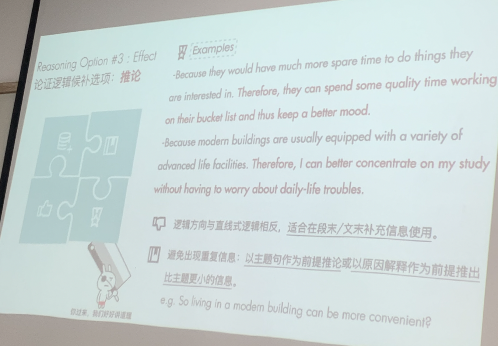
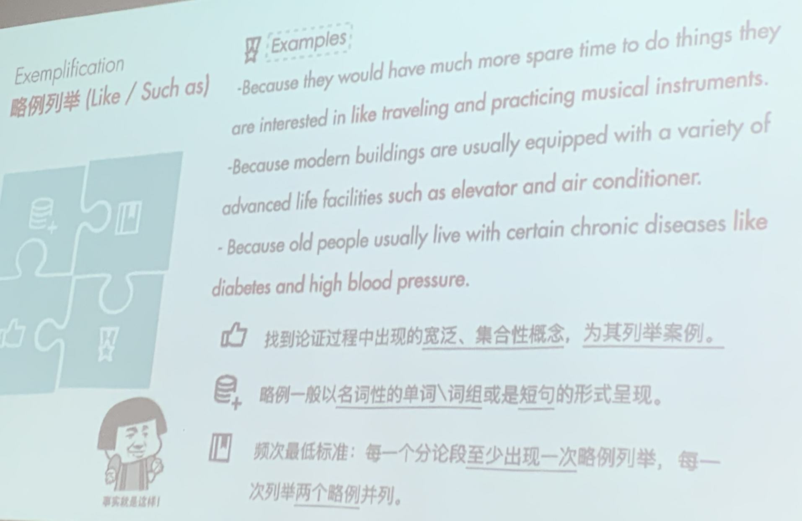
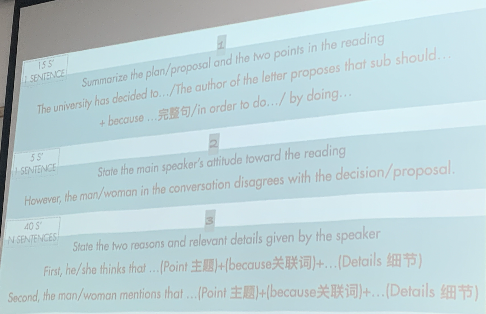
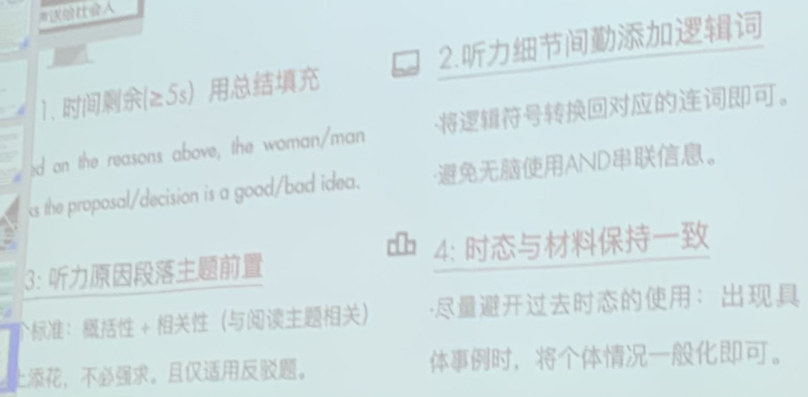
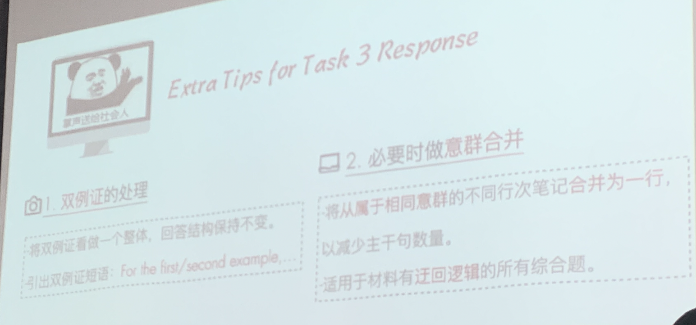
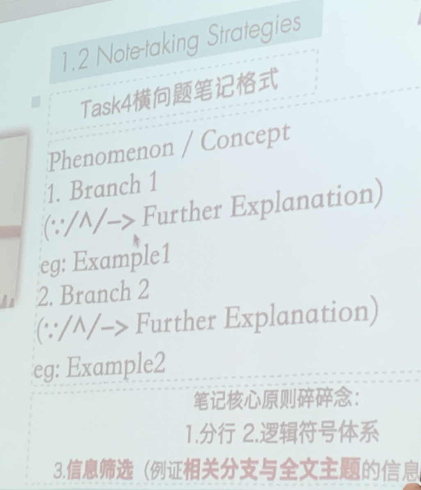
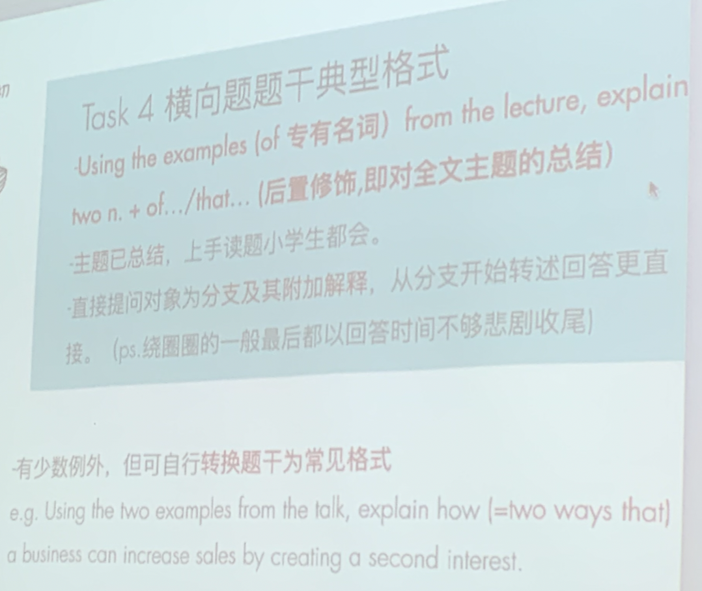
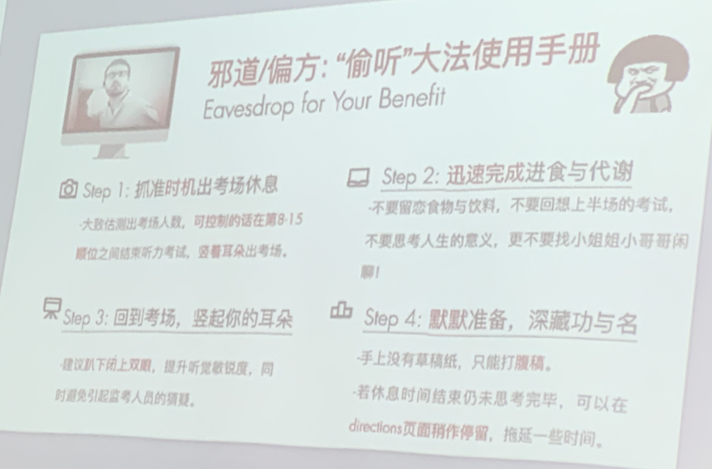

# speaking

> hard only 5% can > 24
>
> 新老题号对应：
>
> 1 <——> 2
>
> 2 <——> 3
>
> 3 <——> 4
>
> 4 <——> 6

## basic information

独立口语题 prepare:15s Reply:45s 第一题

综合口语题 preare:20~30s Reply:60s

### rating rubrics

基本：音量适中，口齿清晰。

核心：语速适中，语言流畅。

进阶：语音地道，语调自然。

**流利度 & 语速 IMPORTANT！！**

少重复！！停顿宁愿用拖音不要重复。跟读。

pronunciation 跟siri对话。

### language use

正确 > 合适 > 逼格NO

- 正确：大的语法问题（句法），小的时态问题，三单等 don't care too much

- 合适 = 准确 + 地道

  地道不是追求俚语，而是符合外国人的使用习惯，**积累！！**

- 逼格NO：不要那么formal，追求高级词汇，长难句，“从简！！”

## TASK1

Independent speaking

- “一边倒”
- 直线式逻辑 类似综合口语T2的听力部分逻辑
- 举例子用 such as / like 不要for example

### 观点构思

- 一切以好想理由，好组织语言（避免专业词汇）为前提，而不是这个理由，立场是不是高大上。
- 理由不要高大上，高立意，要通俗接地气，**贴近个人，贴近生活**。
- 观点要general一些，方便说细节。

### 常用构思

- Angle1 **relationship / interpersonal stuff “人际”**
  - socialize / make friends
  - communicate / interact / cooperate
  - improve relationship / friendship / kinship / term spirit
- Angle2 **fun / relax**
  - Have fun / enjoy
  - interest / curiousity
  - relieve stress
- Angle3 **Learn stuff**
  - Learn skills / knowledge (academic / cultural info & facts)
  - improve / lower learning efficiency / motivation
  - learn lessons
- Angle4 **Health**
  - improve physical health / body condition
  - prevent mental health problem(较严重) / keep good mentality
  - security / personal safety
- Angle5 **convenience**
  - save time / save effort
  - bring inconvenience
  - readliy accessible / have access to ...
- Angle6 **Money / Job**
  - save money / economical / costly
  - earn money / make profits
  - find a decent job

### 论证逻辑

#### 原因解释

Highly Recommended！！

结果（主题，如果是利弊题，那就可以是advantage/disvantage）+ because 原因解释

> e.g.
>
> Firstly,after retiring,old people can better enjoy the rest of their lives.Because they would have much more spare time to do things they're interested in.
>
> Firstly,the auditors may disrupt university students' learning environment.Because the auditing people may do things that are irrelevant to the class which may cause major distraction in class.

#### 对比

话题中存在对比对象时，especailly preference题

**不要讲重复的东西，强迫自己说陈述句**


#### 推导（向外）

Not so recommended.主要用来说完了没话说的时候再补一句话。

以主题句为前提继续推导可能的后果。



一般向外推一句即可，防止偏离主题过多。

### 举例



### Fiona 独立口语

独立口语结构：

Major Point

Topic sentence  > That is because . . .

Explanation > 

Anecdate

Comparison

说出一句话，不可被拆分，不断问自己why

## TASK2

1. reading 45' ~ 50' —— school's announcement & proposal in a letter
2. listening 60' ~ 80' ——Agree/Disagree/neutral view(seldom)
3. Pre:30s Reply:60s

### 阅读笔记

Decision/proposal

1.point 1 (don't need details)

2.point 2 (don't need details)

记实词：优先：名词，动词。其次：形容词，副词

不用记虚词except：介词（避免说的时候语法错误），连词（逻辑关系词）

### 听力笔记

A/D

1.point 1 / detail 1

2.point2 / detail 2

注意：1.筛选信息，忽略无关信息。2.合理分行，一行一个意群。3.逻辑过渡符号使用。

### 回答

如果听力采用归纳式逻辑，那么可以在回答中将最后的观点提前。

#### 反驳题回答模板



#### 同意题回答模板

时态与材料保持一致。


### Tips



## TASK3

1. reading 50' 对专有名词的抽象解释。
2. listening 90'~110' 专有名词的具体例证。
3. speaking 回答。P：30s R：60s

### 阅读笔记

阅读内容包括：background+definition+detail（顺序不一定固定，背景，细节解释信息可能缺失）

笔记：标题首字母+（本质名词（optional））

先扫标题，带着标题扫读原文（顺序阅读，不要不过意思的读），找到第一句带着标题的句子。

定义句（短，完整抄，长，速记）

之后的内容有时间就看。

### 听力结构

记录**新信息**

**无特定结构:cry:**

- 关注分行合理性，逻辑符号添加。

- **删减重复信息，无关信息（例证，引入部分尤为多见）。IMPORTANT！！**

- **要记到阅读对应的细节部分！！**

  

### 回答


> refers to 本质名词 + 定义句 的连接需要注意，要使用非谓语等形式，或者plan B ...,which means...
>
> **回答时注意时态！！**

### 双例证



## TASK4

1. listening 90s ~ 120s

   讲座节选（学术性话题）1.现象 2.概述 3.理论

2. speaking P:20s R:60s

**仔细审题！！（题干）**

两种材料结构

### 横向结构(more than 90%)

判断依据：看是否出现2个小主题？

```
	phenomenon / concept
		/			\
branch1				branch2 <---看这层
	 |					|
example1			example2
```

#### 笔记结构



- further explanation 注意和主旨的逻辑关系。
- 来不及就不讲附加解释。

#### 题干格式



how = two ways that ...

why = two reasons that ...

#### 回答模板


**不要说全文主旨（但要记，原因见下）**

> Problem:Using points and examples from the lecture, explain two strategies salespeople use to address customer concerns.
>
> One strategy salespeople use to address customer concerns is 非谓语 / 从句 + ...
>
> Another strategy salespeople use to address customer concerns is 非谓语 / 从句 + ...

#### Tips


### 纵向结构

```
 hypothesis / concept
 		|
 		|
 		|
experinmant / examples
```


#### 回答模板


- 对于concept类的题，跟task3采用一样的方法作答。


## 笔记符号体系

介词：with->w	without->w/	to->2	for->4	btw->between	ard->around	ab->about	fr->from

单词：1.辅音记录法。（need training）2.记单词前一半。（easy to forget）

逻辑连接词：

- $\because$  原因解释。
- $\to$ 结果推导。
- ^ 对比转折。
- 【】 例证举例。
- （）插入语，解释说明。
- $\downarrow$ 先后关系。
- +并列关系。

My symbol

符号：hundreds/thousands of 几百/几k

## 发音

- 连词弱读：because，but，so，to等的元音发成 |ə|

- a+s/m/f/n a要发成|æ| chance,can't,ask,after,advantage

- 重读闭音节中的o |а| hot dog policy

- 元音+t+元音 |t|->|d| latter

- R 卷舌音

- ile `|l|`not `|ail|` e.g. mobile fragile

- /s/ + t,p,k + 元音

  "浊化" 变成`|d| |b| |g|`

  stand sky spy discussion

## Tip

- 少用绝对化词汇，比如totally，always（替换成usually），no（替换成barely）等。

- 不要用100%的语气。比如 he will do sth。使用would

  > 英语中过去式会降低语气
  >
  > can——could may——might will——would
  >
  > I was wondering if I could (have a deadline extentsion)?
  
- 机经——考前几天就练机经上的题——命中率20%

- 偷听大法

  1 听力考试结束后，剩3、4分钟不要立即提交，听考场内有无其他同学已经开始独立口语作答。

  2 若没听到，还有机会 ↓

  

