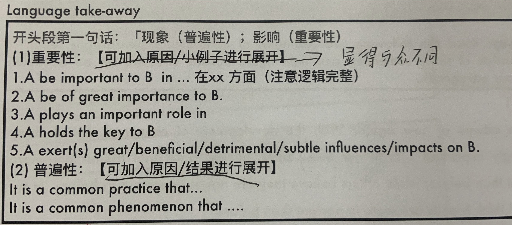
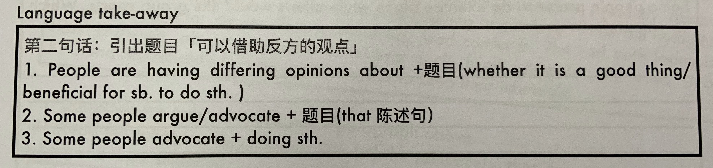
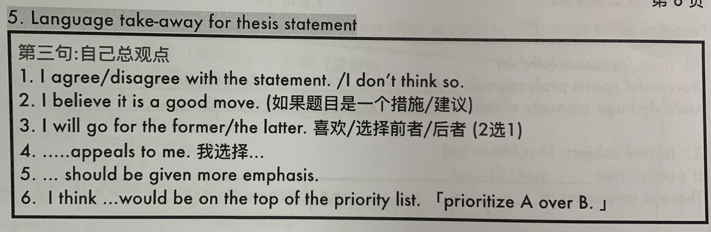
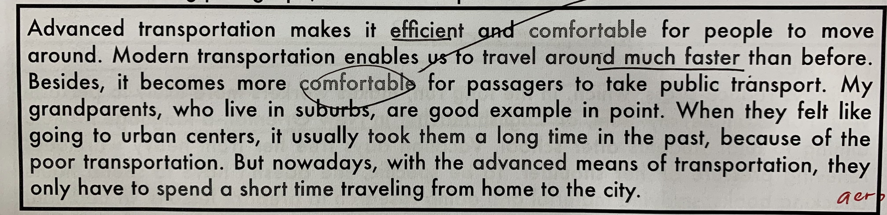
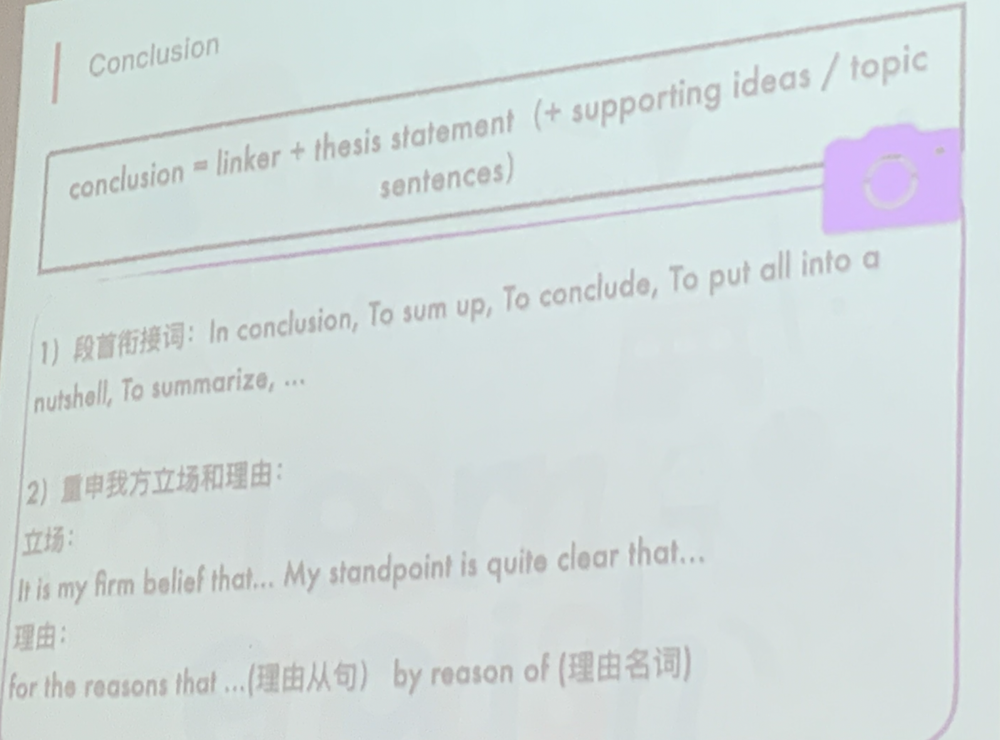
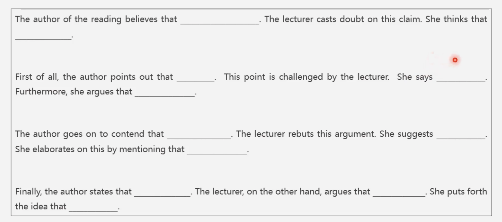

# writing

## language use

### consistent facility

积累不要整段的记，记好词好句。

### syntactic variety

句式多样，各种句型都有。

### appropriate word choice

> my [quizlet set](https://quizlet.com/_a2ed6u?x=1jqt&i=3tkgqs) of good phrases and sentences

选词准确。

1. 查 **搭配词典、英英词典**。
2. 正确使用一些 **高级词**。

### idiomaticity

地道。

- 短语，词组。
- functional expressions 功能性表达
- discourse marker 语篇标记
- 俚语
- ...

### grammar

- 大小写
- 三单
- 拼写
- 时态
- 单复数
- 词性
- 是否及物

## 语言输入

language use >> 技巧

**积累！！**

范文书，外刊，[procon.org](https://www.procon.org)

- step1 材料。
- step2 内容结构。看TS，detail，example，explanation如何展开。
- step3 语言 好词好句，记note。
- step4 仿写。
- step5 立刻刷题，**一例套多题**

# independent writing

- 要举例
- 推荐字数 400
- 段落安排4~5段

**不要离题**

- 不要搞错题型，有没有不要写成该不该
- 不要推翻题目限制（背景，条件）

## before writing（typing）

- Analyze topic and question type

  两类题：

  1. 该不该 价值判断题找

  2. 有没有 现象证明题

     问有没有，不要写该不该做。

- Brainstorming ideas for both stances

  两方都考虑

  1. 哪个好写
  2. 哪个理由充足
  3. 让步转折可以用

- Organizing essay structure

## structure

两种基本结构

### totally agree

- introduction
- Body 1
- Body 2
- Body 3 (optional)
- Conclusion paragraph

### Concession Rebuttal

- introduction
- Body 1
- Body 2
- Concession & Rebuttal (Although...)

## Brainstorming ideas

- 理由不要交叉。
- 好展开，易于翻译。

价值判断，找后果，如果做了这件事，会有什么后果。

现象证明，找前因，是什么促使/阻碍这件事的发生。

### 公用理由

#### 安全与健康

安全：

Ensure / guarantee / promise / threaten /undermine / pose threat to one's safety

crime rate / potential criminals / offenders carrying weapons / accident

健康：

- Physical health: lead a sedentary life: obesity / stiff shoulders / pain in back & neck / sore neck / disease (coronary heart disease, diabetes) / (for children) bone & muscle development / fatigue / dry eyes
- mental health (not think of something unhealthy): relieve & reduce stress & pressure / relax and unwind / recharge batteries

others：

undergo / experience stress and pressure

alter one's stress level

distract us from daily worries and concerns （忘却生活的烦恼）

frustrate and disturb

be overwhelmed by heavy workload**s**

#### 效率与方便

方便：

Convenient / convenience ( save time and energy / easy to access / accessible / attainable anytime / anywhere )

效率：

Boost / enhance / maximize / raise / increase / improve efficiency & productivity / facilitate sth / doing sth

other

the trouble of commuting for a long distance 长距离通勤

#### 经济与金钱

经济：

Boost / encourage / stimulate / the economic development

reduce poverty / fight against homelessness and starvation / reduce crime rate

金钱：

save money	ease / lighten / relieve / lift / remove financial burden	bring down / cut cost

income raise (a better living standard) / generate profits

#### 亲情与友情

strengthen parent-kid relationship / tighten family bond & connection

make more friends / Expand & grow & develop social network

expand circle of friends

#### 学习与工作

信息：

know better about oneself	find out one's passion / pursuit / interest / talent

develop one's talent	stimulate / foster interest in & love of	fulfill / realize / develop one's potential

Know better about world	broaden one's horizon	better grasp / understanding of sth	enlarge one's scope of knowledge	expand one's outlook

技能：

Sharpen / acquire / obtain / attain / upgrade / hone skills	expertise  major-related & soft skills: communication skills social skills interpersonal skills

academic performance	score presentation report

independence optimism persistence cooperation perseverance

others:

pursue a vocation based on his talent and interest

### 拆分法

1. 选出题干中可以用来拆分的对象。（往往是名词）
2. 确定拆分标准。程度/时间/领域/等级...
3. 为拆分对象构思理由。
4. 确定立场和文章结构。

衍生：下定义（给形容词下定义，e.g. It is difficult for a teacher to be both popular and effective in helping students in learning ）

### 单一类

- 价值判断 找公用理由。
- 现象证明 拆分法

主体段结构：

A+ A+ A+(optional)

A+ A+ A-(though...but)

### 比较类

- 提及所有选项

  找比较优势，人无我有，人有我优

- 文章结构

  - 抬高自己（每段都对比）
  - 贬低对方（B-,A+）

主体段结构

#### 二选一

A>B A>B A>B(optional)

B- A+ （内容不能交叉，比如说B-对mental health有害，A+说对mental health有利）

A>B A>B A-/b+ (though...but...)

B- A+ A-(though...but...)

#### 三选一

三选一通常是有目的选择，`为了达到什么`，通常是比较方案。

除了前面的共同理由，还可以从

- 解决根本问题。address the root cause of （如果选项中有`话聊`，比如什么spend more time talking with children之类的，选择这个，因为想要解决问题，必须先搞清楚问题是什么，有话聊才能搞清楚问题是什么）
- (B-, C-) unwanted / unexpected outcome
- 可行性（time/money）
- 覆盖范围（效果长期/短期，受益的群体大小）

A>B A>C / A>B,C

B- C-(可以用共同的弊端) A+（不能与前面的弊端重合）

#### 现象比较（古今）

从以下四个维度想理由

- 科技发展

  Internet

  google search / video games / online shopping (amazon) / social media (twitter / facebook / instagram ) / online courses (coursera)

  Money

  income increase / 

  本领域的科技突破 artificial intelligence machine learning ...

- 环境污染

  也不一定是污染，也可能是环境变好。

- 观念扭转

  prioritize  attach more importance to

- 福利完善（政府政策）

  government involvement

  law / policy / program （举一些这些方面的具体事例）

  investment / fund (free-interest loan / improve infrastructure)

### 特殊类

#### 绝对词

- 按照单一类的写法写

- 否定绝对词（因此一定是disagree）

  结构

  - 承认合理性（去掉绝对词下的合理性）
  - 反驳绝对性（找反例，找弊端）

#### TODO 类

> In order to help children do well in school, parents should limit children's time spent on TV.
>
> 与价值判断的区别，不是问你是否要limit children's time spent on TV，而是在为了help children的前提下。

找到 cause & effect

> 上例：limit children's time spent on TV --> do well in school

- 反驳cause，drawbacks of the cause
- 反驳effect，does the cause necessarily lead to the effect?
- 给出替代方案

### conclusion

三种分论点逻辑：

- 利弊 A -> 好处 / 坏处
- 因果
- 现象本身

## writing (typing)

### introductory paragraph

三句话

- hook
- paraphrase the topic
- 表明立场

#### background sentence

- discuss theme-related 现象
- discuss the importance / meaning of the theme (Recommended)

**不要纠结、尽量general**

#### paraphrase the topic

改写题目（抄一遍也行）

- find synonym (Good but hard)

- change sentence structure

  改变句子主语

  - n / pron
  - formal subject (it is / there be) 形式主语
  - gerund（doing） / infinitive（to do）

借助反方的观点

#### thesis statement

### body

#### Topic sentence

Not too specific,not too general.

**Transition words + topic + controlling idea**

Transition words:

首先：To begin with / Initially / First of all / First and foremost

其次：What's more / In addition / Furthermore / Moreover

最后：last but not least / Finally / Eventually

两段式：For one thing... For another...

Topic: 问题

为了避免重复：代词 / 指代替换   变换词性   同义词 / 近义词

##### sentence structure

##### make TS longer

- 句型variety

... is so adj when it comes to ...

> Firstly, government funding for art is so necessary when it comes to creating more job opportunities.

... hardly can ... without v-ing ...

> Finally, hardly can students expand their horizons without traveling abroad.
>
> Finally, students can hardly expand their horizons without traveling aborad.

- <del>废话</del>

It goes without any doubt that ...

It is an undeniable fact that ...

We are always aware that ...

Our society abounds with the example to demonstrate the viewpoint that ...

**Well-developed=details+examples+reasons**

#### details

- example VS detail

- 方法

  **对词语进行具象化展开**

e.g.

What means *advanced transportation*, *Efficient* and *Comfortable* ?

#### reasons & explanations

> 细节——积累 范文书，google，综合写作的语料

##### cause-effect pattern

- one cause --- multiple effects
  - step1 从TS中找到 A->B 的因果关系。
  - step2 将B拆分为B1,B2 ... ,并构建A->B1,A->B2,A->B3的逻辑链。
  - step3 start typing

- multiple causes --- one effects

  - step1 从TS中找到A->B的因果关系。
  - step2 将A拆分为A1, A2, A3。并构建A1->B,A2->B,A3->B的逻辑链。
  - step3 start typing

- one cause --- one effect

  - logic chain

    利用逆推避免逻辑断层。

  > Not Recommended，因为需要很长的逻辑链

##### Compare & Contrast

structrue

- 1.TS   2.A->B  3.-A(多选的话，其他的选项)->-B  4.

##### 怎么写example

将说理的核心环节具体化就成了example

- strictions --> smart phone are prohibited during work time
- fewer interruptions --> wouldn't be disturbed by messages,notifications or feeds on social media when preparing lessons

##### Conclusion

拆因、拆果、对比。

#### Concession & rebuttal

> 增加word count，让development更完善。

- 利用反方观点让步。

- 要做转折，“以退为进”。

- 语气削弱。适当展开。

##### 方案一

让步：自己的weakness，转折：solution。

模板句：

Admittedly, a minority of individuals tend to believe that ...

This is because ... (同样要适当展开这个观点)

However,this problem can be easily adddressed when / if ...

##### 方案二

让步：反方advantage，但是alternative。

模板句：

Admittedly, a minority of individuals tend to believe that ...

However, such a goal can be achieved by using other methods,such as ...

为了让逻辑更流畅，前两段尽量阐述对方观点的不足。

##### 方案三

> Not Recommended

换个角度，找到对方说法的漏洞，错误，弊端。

### concluding paragraph

> 同样功能性>大于装饰性

- linker
- thesis statement（supporting idea / topic sentence）

不要写新东西。

# integrated writing

- “阅读”与“听力”大概率两种关系：1.互反。2.问题与解决方案。
- 阅读文章结构总分——一个开头段交代立场，三个主体段给出论点。
- 字数150~225，多写不扣分

Scoring rubrics:要点对应，按点给分。不能少信息！

## 阅读

三分钟大概可以每段读两遍。

开头段：重点读首尾句，总结中心论点为**关于\*\*的三个\*\*** (reasons/solutions/benefits/arguments...)

主体段：读论证细节，理解论证逻辑，思考听力可以在哪些方面反驳。

阅读为听力服务，听力中听到和阅读重复的内容可以不记，听力取反即可。

不要抄连续超过10个词（会被Erater怀疑没看懂文章）

## 听力

听力要记录细节！！包括：

- 逻辑链

- 例子

- 数据

  数字：论证观点的数字，年份等无关紧要的数据不用记。

- 细节

  平行结构，多个短例证，听不全，至少听两个，加 ‘some other 名词’。

听力内容推荐写原文，推荐听到什么写什么。

### 笔记

斜着缩近，表示换句。

逻辑符号敏感，可以自己加（比如因果，分层）。

符号简写时间长可以训练，时间短尽量用本能。

## essay template

开头段：According to the reading material, the author presents the three reasons to prove that...... However,the [professor] in the listening argues that none of the reasons is convincing.

The first/second/final reason mentioned by the author is that ......(写1.5句，1是阅读中的观点，0.5句是被听力中反驳的地方，逻辑链上的一环，原因，条件，结果等等).The professor(in the listening), however, argues that......

### 一些模板的替换

[黎老师综合写作模板](../写作/黎老师综合写作模板.md)

- Additionally, the author points out that ...   The speaker, in contrast, mentions that ... 

### 主体段要点

主题段找两个点：

- 解释+细节
- 解释+例子
- 分层
- 对比
- 解释+数据
- （逻辑链）解释
