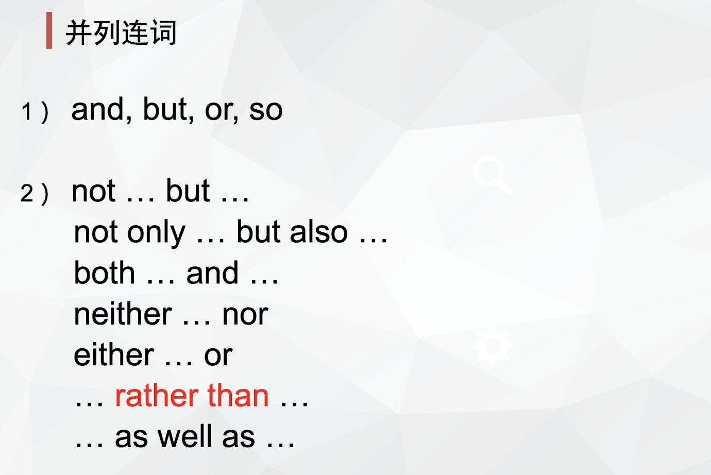
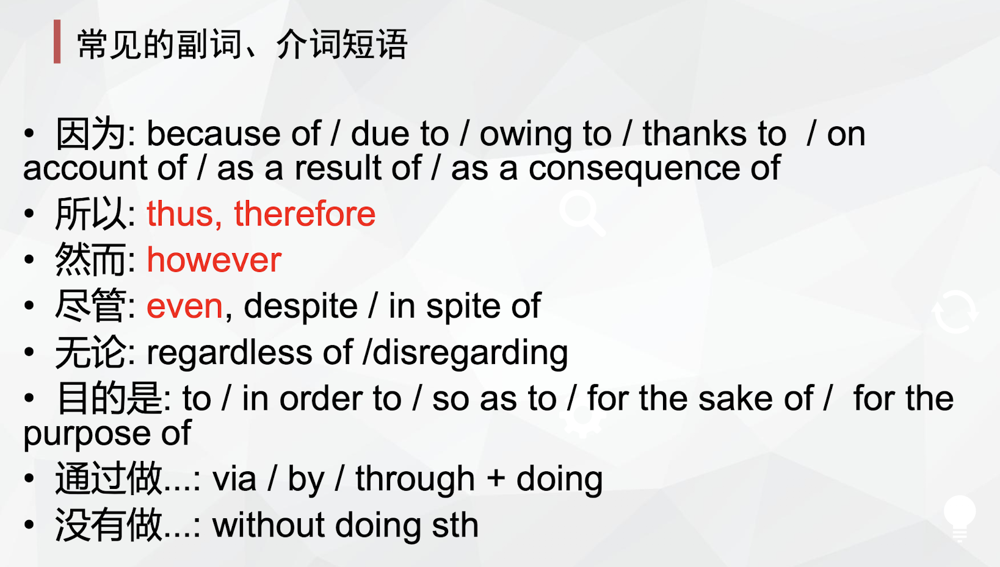
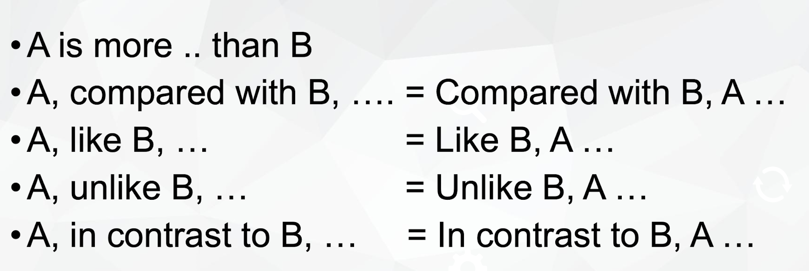
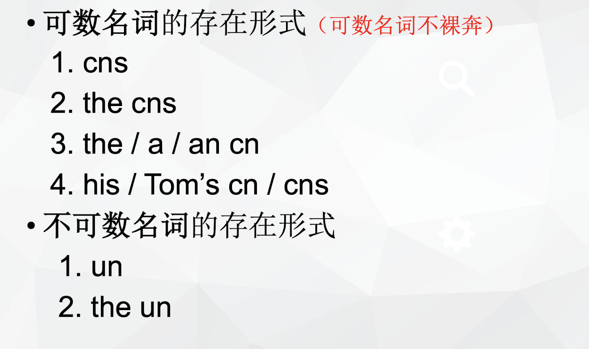
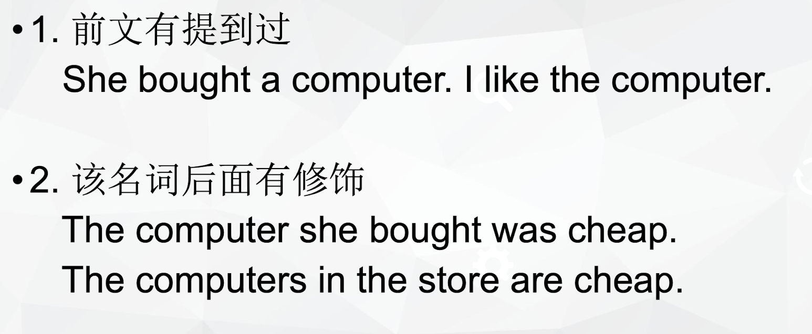

# polish your writing

> Based on @托福写作黎老师PPT

## 句子结构

### 并列结构

- 并列连词前后语法结构要一致。

- 副词，介词短语不是并列结构。conj VS prep & adv

  

- 并列连词后不能加逗号，前面可加可不加

### 比较结构

- 比较对象要对等。

  

## 非谓语动词

### 分词作状语

#### 伴随状语

Doing / done, SVO. 分词做伴随状语，是伴随主语的动作，分词动作先，谓语动作后。

SVO, doing.

- 分词做伴随状语，是伴随主语的动作，谓语动作先，分词动作后

  e.g. Students enter the classroom, carrying their books.

- 分词做结果状语，是整个句子的结果。

   e.g. Students enter the classroom, surprising their teacher.

## 介词短语

prep. + doing / n (不能加句子), SVO.

e.g. By communicating efficiently with others, employees can win support and assistance.

### with / without 结构

> 在句中表状态或说明背景情况　该结构常做**伴随**、方式、**原因**、条件等状语。

## 形容词短语作后置定语

adj短语作后置定语，修饰前面的n，可以和定语从句互换。

e.g. The qualities significant in applying for careers have been valued and highlighted currently.

## 插入语

- 删去，句子语法仍然正确。
-  结构形式多样，如：名词（同位语做插入语）、副词、介词短语、状语从句（状语从句做插入语）、非限定性定语从句等。

### 插入位置

- 本身放在主语前面的结构，插在了主语的后面。
-  补充在任何突然想解释说明的部分后面(阅读中较多，和平常学的非谓语、从句等一样)

## 时态

时态的核心是具体这个动作是什么时候就用什么时态，一个句子的时态可以不同。

e.g. She said the sun rises from the east.

## 主谓一致

- 仅一个un（不可数名词）或to do或doing, 谓语单数；但用and并列，谓语复数。

### 就近原则

- not only A but also B   + verb
- neither A nor B            + verb
- either A or B                + verb
- A or B                          + verb

## 词语

### 名词

#### 不可裸奔！！

##### the

### 代词

- 代词是指代名词的词 ，尽量不指代句子。

- 相同的代词指代相同的对象。

  e.g.   Teachers impart knowledge to students and they are their best friends. （不够好）

  改：Teachers, who impart knowledge to students, are their best friends.

- 代词能让文章语言和逻辑更紧凑。

## 倒装

### 全部倒装

> 把谓语（含be）全部放在主语之前

表示地点状语置于句首，句子发生全倒装 （主谓一致）

### 半倒装

> 只把助动词或情态动词放在主语之前
>
> 常用的助动词：be， have， has， do， does，did
>
> 常用的情态动词：will， should，shall，must，would

- 否定副词/介词短语放在句首 + 半倒装

  > never, seldom, rarely, barely, scarcely, hardly, little, neither, nor, under no circumstances, on no occasion, in no case

  e.g. Under no circumstances can people be excluded from junk food.

  特殊的否定词：Not only +半倒装，but also 正常&完整的句子

  Not only will they hone their skills, but (also) they can cultivate their personalities.

- Only + 介词短语 / 副词 /  状语从句 + 半倒装

  e.g. Only when students do internships can they apply knowledge into practice.

- so/such … that结构中so/such置于句首，发生半倒装

  原：

  主 谓 so      + adj / adv   + that 结果状语从句

  主 谓 such  +    n            + that 结果状语从句

  He is so honest that his subordinates admire him. 

  -> So honest is he that his subordinates admire him.

  He is such an honest person that his subordinates admire him.

  -> Such an honest person is he that his subordinates admire him.