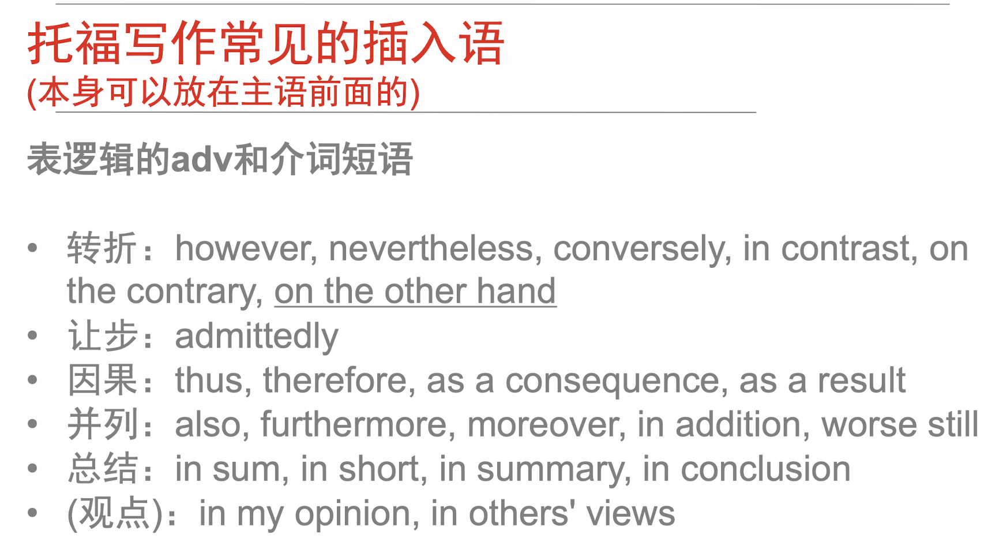
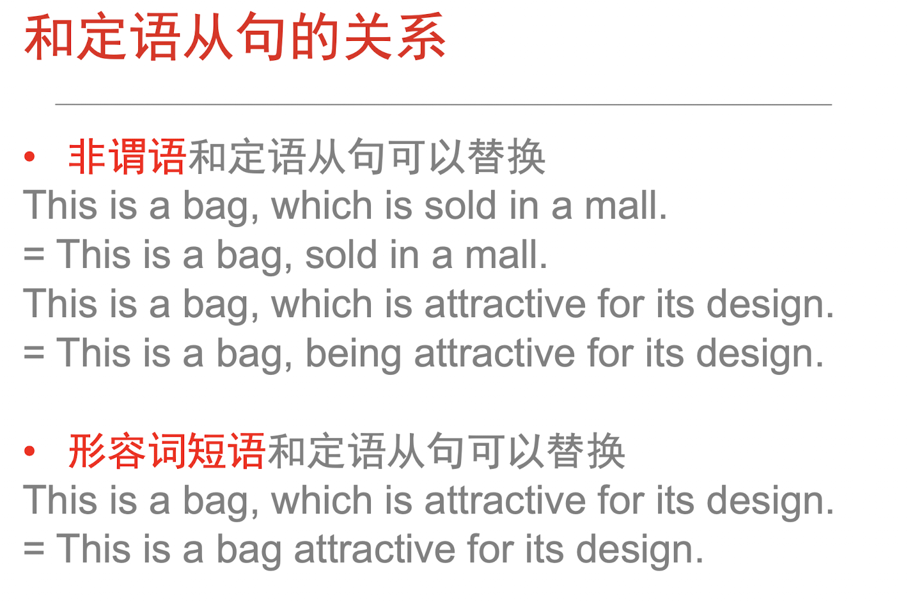
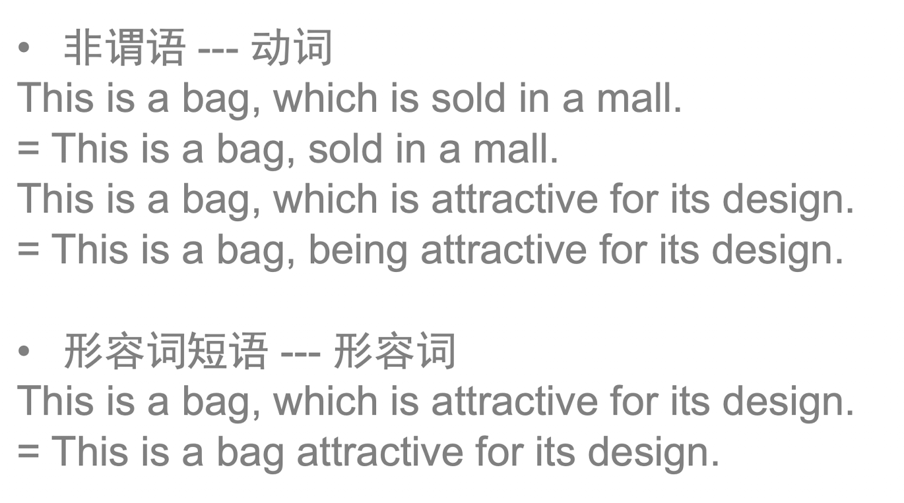
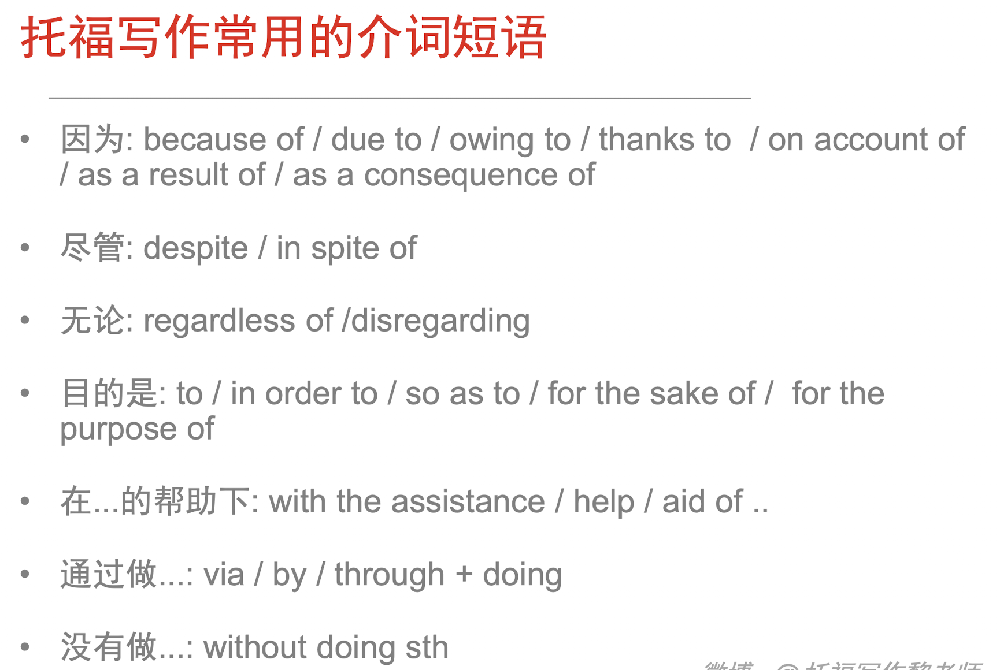

# polish your writing

> Based on @托福写作黎老师PPT

# 基本概念

## 句子结构

### 并列结构

- 并列连词前后语法结构要一致。

- 副词，介词短语不是并列结构。conj VS prep & adv

  

- 并列连词后不能加逗号，前面可加可不加

### 比较结构

- 比较对象要对等。

  

## 非谓语动词

### 分词作状语

#### 伴随状语

Doing / done, SVO. 分词做伴随状语，是伴随主语的动作，分词动作先，谓语动作后。

SVO, doing.

- 分词做伴随状语，是伴随主语的动作，谓语动作先，分词动作后

  e.g. Students enter the classroom, carrying their books.

- 分词做结果状语，是整个句子的结果。

   e.g. Students enter the classroom, surprising their teacher.

## 介词短语

prep. + doing / n (不能加句子), SVO.

e.g. By communicating efficiently with others, employees can win support and assistance.

### with / without 结构

> 在句中表状态或说明背景情况　该结构常做**伴随**、方式、**原因**、条件等状语。

e.g.

（形容词短语）With numerous careers available in cities, everyone can pursue a career based on his talent and interest.

（介词短语）With a supermarket in the vicinity, people can purchase food and other necessities conveniently.

（to do）With much homework to complete, students undergo and experience pressure.

（done）With much emphasis placed on academic learning rather than health, current educational system places students as victims.

## 形容词短语作后置定语

adj短语作后置定语，修饰前面的n，可以和定语从句互换。

e.g. The qualities significant in applying for careers have been valued and highlighted currently.

## 插入语

- 删去，句子语法仍然正确。
-  结构形式多样，如：名词（同位语做插入语）、副词、介词短语、状语从句（状语从句做插入语）、非限定性定语从句等。

### 插入位置

- 本身放在主语前面的结构，插在了主语的后面。

  

-  补充在任何突然想解释说明的部分后面(阅读中较多，和平常学的非谓语、从句等一样)

## 时态

时态的核心是具体这个动作是什么时候就用什么时态，一个句子的时态可以不同。

e.g. She said the sun rises from the east.

## 主谓一致

- 仅一个un（不可数名词）或to do或doing, 谓语单数；但用and并列，谓语复数。

### 就近原则

- not only A but also B   + verb
- neither A nor B            + verb
- either A or B                + verb
- A or B                          + verb

## 词语

### 名词

#### 不可裸奔！！

##### the

### 代词

- 代词是指代名词的词 ，尽量不指代句子。

- 相同的代词指代相同的对象。

  e.g.   Teachers impart knowledge to students and they are their best friends. （不够好）

  改：Teachers, who impart knowledge to students, are their best friends.

- 代词能让文章语言和逻辑更紧凑。

## 倒装

### 全部倒装

> 把谓语（含be）全部放在主语之前

表示地点状语置于句首，句子发生全倒装 （主谓一致）

e.g. In front of computers sits a student.

### 半倒装

> 只把助动词或情态动词放在主语之前
>
> 常用的助动词：be， have， has， do， does，did
>
> 常用的情态动词：will， should，shall，must，would

- 否定副词/介词短语放在句首 + 半倒装

  > never, seldom, rarely, barely, scarcely, hardly, little, neither, nor, under no circumstances, on no occasion, in no case

  e.g. Under no circumstances can people be excluded from junk food.

  特殊的否定词：Not only +半倒装，but also 正常&完整的句子

  Not only will they hone their skills, but (also) they can cultivate their personalities.

- Only + 介词短语 / 副词 /  状语从句 + 半倒装

  e.g.

  Only then did she realize the significance of health.

  Only by using the Internet can we explore the widest range of information.

  Only when students do internships can they apply knowledge into practice.

- so/such … that结构中so/such置于句首，发生半倒装

  原：

  主 谓 so + adj / adv   + that 结果状语从句

  主 谓 such  +  n  + that 结果状语从句

  He is so honest that his subordinates admire him. 

  -> So honest is he that his subordinates admire him.

  He is such an honest person that his subordinates admire him.

  -> Such an honest person is he that his subordinates admire him.

## 状语从句

### 时间状语从句

- 在从句中用一般现在时表示将来

  I will speak to him when he arrives. NOT ... when he will arive

### 条件状语从句

- 从句中也用一般现在时表示将来

  If it rains tomorrow, I will take my umbrella.

# 如何长难句

## 句子开头

- 非人名词主语

  e.g. Students can acquire more expertise under the requirement of various small assignments.

  被动 More expertise can be acquired under the requirement of various small assignments.

  谓语的名词形式 The adoption of new concepts will place reseachers as beneficiaries.

- Ving做主语

  e.g. Teachers should supplement other reading materials to ensure a thorough understanding of knowledge. 

  Supplementing other reading materials ensures a thorough understanding of knowledge.

- It做形式主语

  e.g. Parents' assistance and disagreement will perfect teaching approaches, which is significant.

  It is significant to receive the assistance and the disagreement from parents, with the purpose of perfecting teaching approaches.

  从主语从句转化来 That doing sth is adj. --> It is adj to do sth.

  It is adj for sb to do ...

  It is adj of sb to do ...

- 给主语戴帽子

  - 介词短语

    with复合结构

    With the knowledge and expertise of nutrition, students will distract themselves from consuming junk food / nutritionally-deficient food.

  - 非谓语

    **避免垂悬分词情况，主句的主语必须是分词动作的发出者**

    Facing the updating issues of iPhone, Steven Jobs would discuss and confer with other co-workers.

  - 状语从句省略

    > 满足两个条件才可省略
    >
    > 1. 从句和主句的主语一样。
    > 2. 从句谓语中有be动词。
    >
    > 常见于时间，地点，条件及让步状语从句中。

    When / After / Because / If / Though + ving/ved, SVO.

    与分词作状语区别，这个需要连接词（When，After，Because，etc）

## 分词对于名词的修饰

> from 张满胜《英语语法新思维高级教程》：分词能否替换定语从句，主要看
>
> 1. 先行词在定语从句中作主语。
>
>    e.g.The person I saw last night is my teacher.不能替换为分词 The person seeing last night is my teacher.
>
> 2. 分词动作的时间是否与句子谓语的时间一致，一致则能造句，不一致则不能造句。
>
>    e.g. Do you know the boy who broke the window? -> Do you know the boy breaking the window?
>
>    就会表达这样的意思: Do you know the boy who is breaking the windows?就会显得十分奇怪。
>
>    同理，Do you know the fire which broke out yesterday? 不能写作 Do you know the fire breaking out yesterday?
>
>    **一般若从句谓语动作发生的时间先于主句，则不能简化为分词**
>
> 3. 定语从句有情态动词时不能替换。

### 修饰名词

- n + Ving/Ved

> 是否需要逗号:
>
> 放在句中：If the participle or participial phrase comes in the middle of a sentence, **it should be set off with commas only if the information is not essential to the meaning of the sentence**.
>
> 放在句首则需要comma
>
> from @托福写作黎老师 建议托福写作中都加上逗号。。。还是听上面那个吧，毕竟Google上查到Purdue说的

<del>找到有多个定语的名词</del>也不能说定语，因为很多是状语，叫修饰吧。

e.g. 竞争在市场上非常激烈，因为市场上有很多人才和专家。-> 市场

Competition is fierce in the market, saturated with talents and experts.（原因状语）

每个人都渴望(crave)亲密(intimate)并和谐的(harmonious )人际关系，这样的关系是可以通过各种方法建立(establish)并维系(maintain)的。-> 关系

Everyone craves the intimate and harmonious interpersonal relationship, (which can be) established and maintained with various ways.（根据语法书，这种说法就不是很好，因为有情态动词）

- 如果n是主语，可以 Ving/Ved, n ... (但这种方式作定语的话更像是非限制性定语从句，限制性定语从句还是不要把Ving提前吧)

e.g. 被老板的开明所鼓励，Google的员工会投入工作的项目

Motivated and stimulated by their superior's open-mindedness, workers in Google will show their depth of commitment in projects.(原因状语)

Challenged by students due to his mistake, a teacher will undergo / experience depression.(原因状语)

Established in doing exercises, a wide friend circle can alter one's stress level.（定语，但总觉得有点奇怪，因为这应该是个限制性定语从句）

### 放在句尾

Whole sentence, Ving/Ved

<del>定语从句修饰整个句子</del>暂时还没搞明白这是分词作结果状语还是定语从句简化为分词，反正大都有一点因果逻辑关系。

e.g.  Doing diversified assignments can function as an effective approach for students to acquire knowledge in various fields, placing them as beneficiaries.

Frequent communication can be accessible in a gym, enabling people to reduce their pressure in personal and professional life.

## 妙用形容词短语

[形容词短语作后置定语](##形容词短语作后置定语)

more examples:

- People need expertise applicable in community activities.
- Characteristics significant in the competitiveness of students have been valued and highlightened nowdays.

**形容词短语，分词作定语替换定语从句**

**形容词短语和分词的区别**

## 妙用介词短语

- [with / without 结构](###with / without 结构)

- in terms of ...  在...的方面

## 巧用插入语

[基本概念](##插入语)

## 同位语

n1, n2 

（n2通常用来扣题）

e.g. Choosing organic food, another method conductive to our environment, can be easily achieved by each citizen.

Success, the objective everyone strives for, can be achieved by perseverance and diligence.ß

e.g. Willingness to accept others' ideas, therefore, will help people win the support and assistance from them, the core contributors to success.
