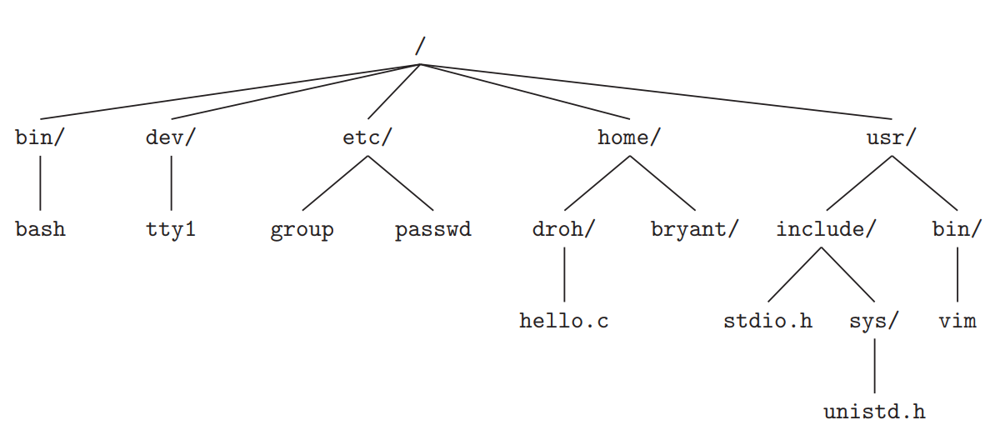
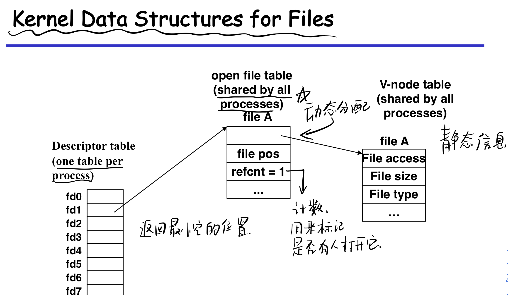
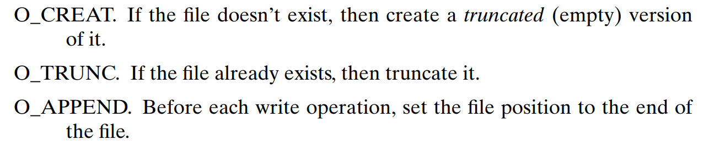
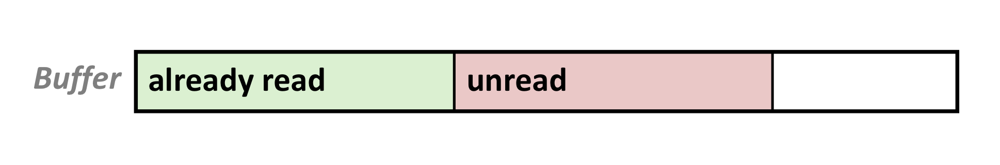
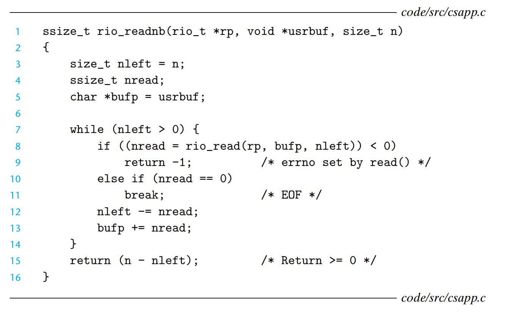
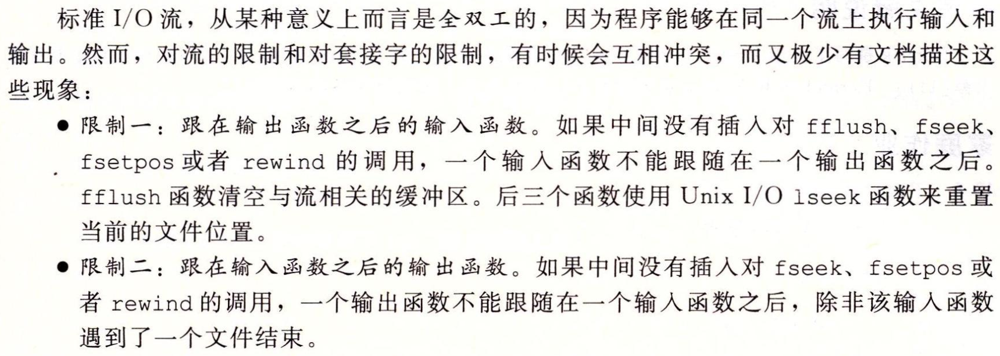
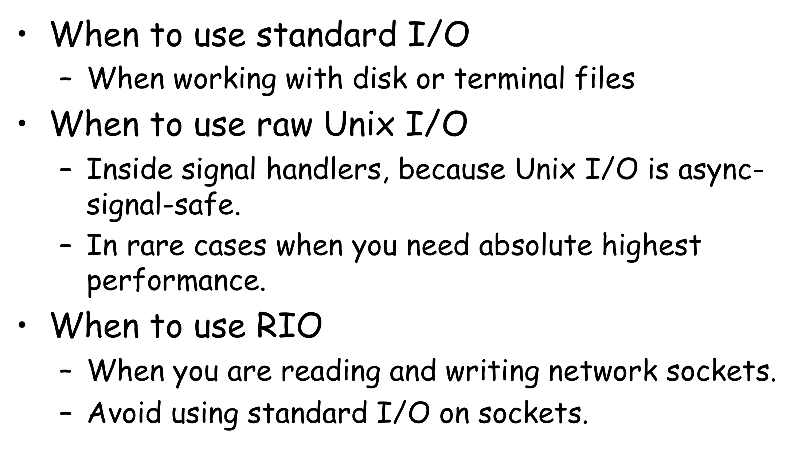

# Unix I/O note

> Author:Wei Xinpeng

## File

- Unix file是一串m字节的序列。

- 所有的I/O设备都被模型化为文件，比如 network、disk、terminal。

- 所有的input和output被当做reading&writing适当的文件。

  > Pros:使得所有input output操作以一种标准的，一致的方式执行。

### File type

- regular file

  1. text file 文本文件：仅包括ascii和Unicode字符。

     for linux，text file是一个文本行序列，每一行由字符序列和一个 newline character `\n` 组成。

  2. binary file 二进制文件：everything else

- directory

  1. an array of links,each link 将一个文件名映射到一个文件（这个文件也有可能是另一个directory）。
  2. 每个目录至少含有两个条目：`.`dot which means current directory `..`dot dot which means parent directory

  Linux directory hierarchy

  

- socket: see details in ch11 note
- named pipes 命名通道
- symbolic links 符号链接

### File data structure



#### descriptor table

每个进程有其独立的descriptor table。由process维护。

#### File table

kernel维护，包含当前file position，refcnt记录有多少descriptor指向它，当refcnt为0时kernel就把它删了，指向v-node table中对应file的指针。

#### v-node table

kernal维护，包含大部分的文件元数据（metadata）见<a>读取文件元数据</a>

#### 打开一个文件两次

两个fd，两个open file table，**记录各自的file pos**，指向同一个v-node table


#### 父子进程文件

descriptor table因为是process维护的，所以会复制一份，其余不复制。


### Open Files

```c
/* 打开文件，返回file descriptor，注意，这个descriptor是进程中没有打开的最小描述符 */
/* 如果打开成功，出错返回-1 */
int open(char *filename, int flags, mode_t mode);
//flags:O_RDONLY 只读 O_WRONLY 只写 O_RDWR 读写 这三个必须有一个
```

另外几个flag



mode_t mode 访问权限位，*谁*能做什么


另外，每个进程都有一个umask，可以通过umask函数设置，当使用一个带mode参数的open函数打开文件时，文件的mode会被设置为`mode&~mask`。

> 每个进程默认会打开三个文件：STDIN_FILENO （fd = 0）标准输入 STDOUT_FILENO （fd = 1）标准输出 STDERR_FILENO（fd = 2）标准错误
>
> 这意味着那张descriptor table上的前三位一开始就被占了，所以你打开的文件是从3开始的。

### Close Files

- kernel 会释放文件打开时创建的数据结构

- 恢复descriptor至一个所有available的descriptor的pool

  下一次open时会使用这个pool中最小的descriptor

```c
int close(int fd);//0 if OK, -1 on error
```

### Read&Write

read：从当前的file position k复制m个bytes到memory，将k加m。如果文件没有m个bytes，就触发EOF（end-of-file）。

> 注意：文件中并没有EOF这样一个字符

```c
/* if OK，返回读到的bytes if EOF 返回0 if error 返回-1 */
ssize_t read(int fd, void *buf, size_t count);
//从fd读至多count个字节到buf
```

```c
/* if OK, 返回写入的字节数 if error 返回-1 */
ssize_t write(int fd, const void *buf, size_t count);
//将buf写入至多count个字节到fd
```

> Attention:size_t是unsigned long ssize_t 是long，因为要返回-1

### 读取文件metadata

```c
int stat(const char *filename, struct stat *buf);//从filename读取
int fstat(int fd, struct stat *buf);//从file descriptor读取
```

What is struct stat?


值得关注的：1. mode_t st_mode  => 文件权限和file type，mode_t是一个unsigned int，用bit位表示这些信息。 2. st_size 文件大小。

可以通过`S_ISREG(stat.st_mode) S_ISDIR(stat.st_mode ` 查看文件类型，具体见 `<sys/stat.h>`

### 读取目录内容

```c
DIR *opendir(const char *name);
//接受文件路径，返回一个directory stream，directory stream is a list of directory entry
int closedir(DIR *dirp);
//0 if OK -1 on error
struct dirent *readdir(DIR *drip);
//返回directory stream中指向下一个directory entry的指针
```

What is directory entry?

```c
struct dirent {
  ino_t d_ino;//ino_t是unsigned long. file's serial number
  char d_name[256];//filename
};
```

> [What is file's serial number?](https://stackoverflow.com/questions/42316213/whats-file-serial-number)
>
> 有点类似于v-node table中元素

### 文件重定向

```c
int dup2(int oldfd, int newfd);
//将descriptor table中的newfd指向oldfd指向的文件
```

e.g.


## I/O function

### RIO

#### unbuffered Input and Output

unbuffer means **no application-level buffering**

```c
ssize_t rio_readn(int fd, void *userbuf, size_t count);
ssize_t rio_writen(int fd, void *usebuf, size_t count);
//return 成功读写的字节数 0 if EOF -1 on error
```

实现：


主要解决的问题：

1. 处理read和write因为ENITR返回，将其重启（EINTR产生原因：当阻塞于某个 *慢系统调用* 的一个进程捕获某个信号且相应信号处理函数返回时，该系统调用可能返回一个EINTR错误，表示被中断的系统调用）

2. short count，实际读的比想要读的少。

   > 产生short count的原因：
   >
   > 1. 碰到EOF。
   > 2. 从terminal中读取。
   > 3. 从网络socket中读取。

#### buffered Input and Output

##### buffered read

Solution:使用Unix read一次读取block of bytes。用户再从buffer中input。> refill when buffer is empty



```c
struct rio_t {
  int rio_fd;//file descriptor
  int rio_cnt;//buffer中未读的字节数
  char *rio_bufptr;//指向buffer中下一个unread byte
  char rio_buf[RIO_BUFSIZE];//buffer
};
```

使用buffer后的file层次：


```c
/* 将一个rio_t初始化，即和一个file descriptor关联起来 */
void rio_readinitb(rio_t *rp, int fd) {
  rp -> rio_fd = fd;
  rp -> rio_cnt = 0;
  rp -> rio_bufptr = rp -> rio_buf;
}
```

```c
ssize_t rio_readlineb(rio_t *rp, void *userbuf, size_t maxlen);
ssize_t rio_readnb(rio_t *rp, void *userbuf, size_t maxlen);
```

implementation:

readlineb和readnb中使用的内部函数


1. 主要作用：从buffer中读取n个字符，返回读到的字符数，如果n大于buffer中还剩下的，就把buffer里还剩下的全读了。
2. 检查buffer是否空了，如果空了，使用read将其填满（因为有short count，不一定填满，但只尝试一次，填不满就算了，如果碰到EINTR，rio_cnt还小于0，因此还会再调用read）


读入一行。读到换行符时或读完maxlen时终止，返回读到的字符数（不包括换行符）

注意：将换行符的下一个换成了`\0`，因此只能读到maxlen-1要给`\0`留位置。



尝试读入n个字符，返回读到的实际字符数。

### Standard I/O

可以参考<a href="/Users/weixinpeng/Desktop/computer_science/数据结构/luogu_shujia/学习笔记/I:O.md">之前写的一篇I/O笔记</a>

- 将文件模型化为stream，具体为file descriptor和memory中的buffer。

- buffer flush当碰到'\n'或者使用fflush(fd)强制刷新。刷新即意味着从buffer写到fd中。

## 我们应该使用什么I/O function

Unix I/O

Pros:

1. 最底层的I/O函数。
2. 可以访问文件metadata。
3. 异步安全，可以在信号处理函数中使用。

Cons:

1. 经常short counts，处理起来很tricky。
2. 高效的读写需要使用buffer，实现一个buffer也很tricky。

RIO和标准IO很好的解决了上面两个问题。

标准IO

Cons：

1. 无法访问元数据。

2. 不是异步安全的。

3. 不适用于网络编程。

   > why:
   >
   > 
   >
   > > 亲身经历，确实会导致一些诡异的事情。
   > >
   > > 关于FILE的详细讨论和标准IO缓冲区的详细讨论见[C语言FILE结构体以及缓冲区深入探讨](https://blog.csdn.net/u014507230/article/details/45313931)

### How to choose



