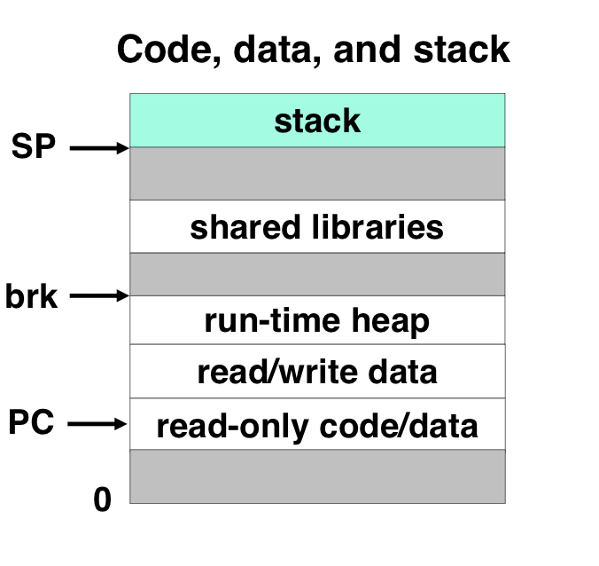
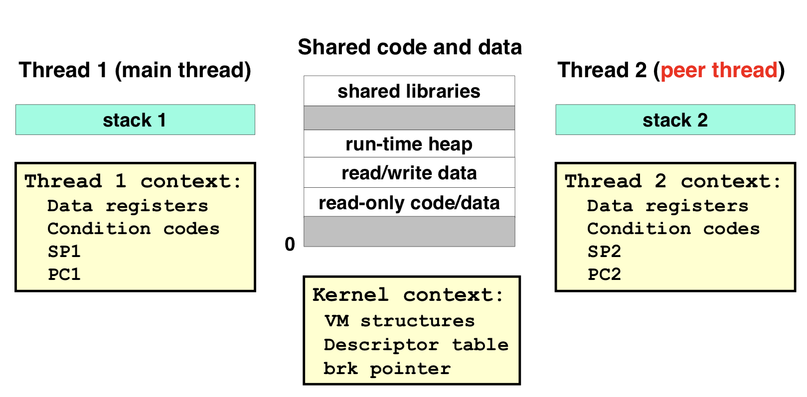
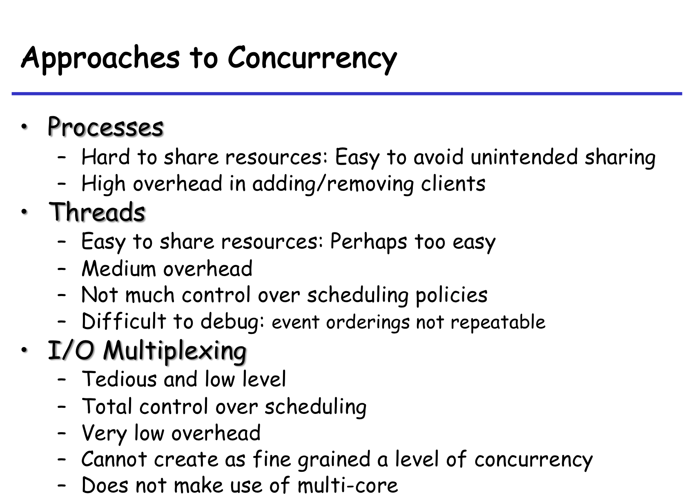

# Concurrent Programming

## Thread

### Process VS Thread

Process包括process context（进程上下文）、code、data和stack。

> process context包括两部分
>
> 1. Program Context
>
>    寄存器、状态码、栈指针、程序计数器等。
>
> 2. Kernel Context
>
>    VM structure、Descriptor table（文件表）、brk pointer
>
> Code data and stack
>
> 

Process还可以被看作 thread + code、data、kernel text

每一个thread有其独立的逻辑控制流（一系列的PC的值），有自己的thread ID，如上图所示，有自己的栈、寄存器、条件码、PC等。

thread的调度由kernel完成，其实实际上kernel的调度是以thread为单位的。

### Posix thread

> What is Posix? Portable Operating System Interface
>
> 可移植操作系统接口，是IEEE为要在各种UNIX操作系统上运行软件，而定义API的一系列互相关联的标准的总称。

## I/O multiplexing

## 三种方式比较

## 同步

### 信号量

#### PV操作

`P(s)` 若s非零，将s减1后立即返回。若为0，挂起该进程。

`V(s)` 将s加1，并唤醒一个被挂起的进程。
