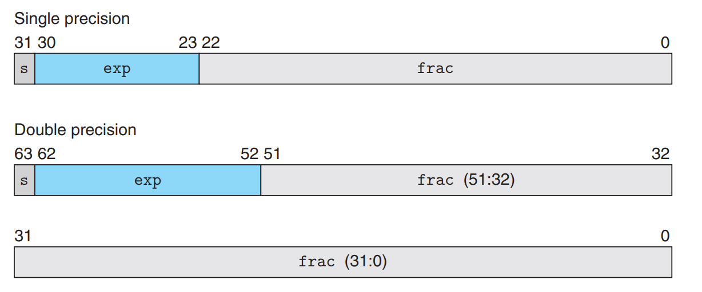
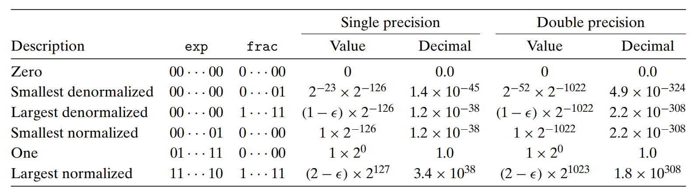

[toc]
# chapter2

## 整数

### 补码

two's complement

### 转换

无符号数转为补码
当无符号数大于补码最大值时：u => u - $2^w$
补码转为无符号数
补码小于0时：u => u + $2^w$

### (un)signed number in C

当执行一个运算时，如果它的一个运算数是有符号的而另一个是无符号的，那么C语言会隐式地将有符号数强制类型转换为无符号数，并假设这两个数都是非负的。

### 位数扩展

无符号数拓展：高位补0
补码的拓展：符号扩展

>移位运算符 左移统一补0
右移 对于无符号数，采用逻辑右移，即补0
对于补码，采用算术右移，即符号扩展

> attention
> (unsigned int) short_t <=> (unsigned int)(int) short_t
> 这种既改变大小又改变符号的强制类型转换 是先改变大小再改变符号的。位数扩展时要当心。
### 截断

无符号数截断为w位 u => u mod $2^w$
补码截断为w位 u => U2T( u mod $2^w$ ) 即先执行无符号截断再转换

### 无符号数加法

define: $+_w^u$ 把整数和$x+y$截断为$w$位的结果
$x + y$ 溢出时为 $x + y - 2^w$

模数加法：$x+y=(x+y)$ mod $2^w$

检测无符号数加法中的溢出：
$s = x + y$
当且仅当 $s<x$ or $y$ 时溢出

>模数加法构成了阿贝尔群，而对于每个值$x$，必然有某个值$-^u_wx$满足$-^u_wx+^u_wx=0$

无符号逆元$-_w^ux$为：
$x$ if(x=0) 
$2^w - x$  if(x>0)

### 补码加法

正溢出：两个正数相加大于最大值
$x + y - 2^w$
负溢出：两个负数相加小于最小值
$x+y+2^w$
检测补码加法中的溢出
正溢出：$x>0,y>0\quad \&\& \quad s\le0$
负溢出：$x<0,y<0\quad \&\& \quad s\ge0$
补码的非$-^t_wx$为：
$Tmin_w$  (if x=Tmin_w)
$-x$  (if x>Tmin_w)

>求位级补码非时的两种方法
>1. -x => ~x+1
>2. 设k为x非0的最右边的位，即$x=[x_{w-1}, x_{w-2}, ...1,0,...0 ]$则-x => x=[ ~ x_{w-1}, ~ x_{w-2}, ...1,0,...0 ]

### 减法

众所周知 *减是加的逆运算*，因此理论上只要有了加法，减法就自然而然了。因此：
$x-y<=>x+(-y)$
无符号与有符号的区别：因为**C中的运算都是针对 位 的，而有无符号只是对位的解释不同而已** 
而 $-y$ 的位的表示是按照补码的，因此无符号下该值是十分大的，当 $x<y$ 时，$x+(-y)$便会溢出

### 除法


## 浮点数

### 二进制小数

二进制点左边的数字的权形如 $2^i$，右边的数字的权形如 $\frac{1}{2^i}$。

$b = \sum_{i=-n}^{m}2^i\times b_i$

### IEEE浮点表示

$V=(-1)^s\times M\times2^E$ 

s:符号位:  1 for 负数    0 for 正数

M:尾数:  一个二进制小数，范围是 1 ~ $2-\epsilon$（规格化） or 0 ~ $1-\epsilon$（非规格化）

E:阶码:  对浮点数进行加权，权重为2的E次幂

> 单精度、双精度浮点数的位级表示
>
> 

偏置(Bias=$2^{k-1}-1$ float 2^7-1=127 double 2^10-1=1023)

1. 规格化的值——exp的值既不是全0也不是全1

   阶码：E = e - Bias e的范围是1 ~ 2^8-2=254，因此E的范围是-126 ~ 127 （以float为例）

   M=1+f    f为用二进制表示的小数 range: 1 ~ $2-\epsilon$

2. 非规格化——exp的值全是0

   阶码：E = 1 - Bias  -126 for single and -1022 for double

   M=f  range: 0 ~ $1-\epsilon$

3. 特殊值——阶码全是1

   当 f 全为0时得到的值表示无穷

   f 非0时 表示"NAN(not a number)"



## bit lab

```c
int bitCount(int x) {
    int m4 = 0x1 | (0x1<<8) | (0x1<<16) | (0x1<<24);
    int m1 = 0xFF; 
    int s4 = (x&m4) + ((x>>1)&m4) + ((x>>2)&m4) + ((x>>3)&m4) + ((x>>4)&m4) + ((x>>5)&m4) + ((x>>6)&m4) + ((x>>7)&m4);
    int s1 = (s4&m1) + ((s4>>8)&m1) + ((s4>>16)&m1) + ((s4>>24)&m1);
    return s1;
}
//copyLSB - set all bits of result to least significant bit of x
int copyLSB(int x) {
  int LSB = x & 1;
  return ~LSB + 1;
}
//bang - Compute !x without using !
int bang(int x) {
  //if a number is none zero, its or it complement's sign bit must be 1
  int sign = (x | (~x + 1))>>31;
  return sign + 1;
}
//divpwr2 - Compute x/(2^n), for 0 <= n <= 30
int divpwr2(int x, int n) {
  int sign = ~(x >> 31)+1;
  return (x + ((sign<<n)+(~sign+1)))>>n;
}
//fitsBits - return 1 if x can be represented as an n-bit, two's complement integer.
int fitsBits(int x, int n) {
  int mask = x >> 31;//a mask used to check the first 33-n bits of x
  return !((x >> (n + (~0))) ^ mask);
}
//isGreater - if x > y  then return 1, else return 0 
int isGreater(int x, int y) {
  int difference = y + (~x+1);

  //use an integer to identify the polarity of x, y and y-x
  //0 is non-negative while 1 is negative
  int signx = (x >> 31) & 1;
  int signy = (y >> 31) & 1;
  int signdif = ((difference)>>31) & 1;

  //when overflow, x and y are of different polarity. what we need is y-x < 0 in normal case and y-x > 0 when overflow.
  int condition1 = signdif;
  int condition2 = (signx ^ signy) & (signy ^ signdif);
  
  return condition1 ^ condition2;
}
//isNonNegative - return 1 if x >= 0, return 0 otherwise 
int isNonNegative(int x) {
  int sign = x >> 31;
  return sign + 1;
}
//isNotEqual - return 0 if x == y, and 1 otherwise 
int isNotEqual(int x, int y) {
  int isnotequal = x ^ y;
  return !!isnotequal;
}
//isPower2 - returns 1 if x is a power of 2, and 0 otherwise
int isPower2(int x) {
  //check the polarity of x to get rid of negative numbers
  int sign = (x >> 31) & 1;

  //bitcount
  int temp = 0x55|(0x55<<8);
  int mask1 = temp|(temp<<16);
  int temp1 = 0x33|(0x33<<8);
  int mask2 = temp1|(temp1<<16);
  int temp2 = 0x0f|(0x0f<<8);
  int mask3 = temp2|(temp2<<16);
  int mask4 = 0xff|(0xff<<16);
  int mask5 = 0xff|(0xff<<8);
  
  int answer = (x&mask1) + ((x>>1) & mask1);
  int answer1 = (answer&mask2) + ((answer>>2) & mask2);
  int answer2 = (answer1&mask3) + ((answer1>>4) & mask3);
  int answer3 = (answer2&mask4) + ((answer2>>8) & mask4);
  int answer4 = (answer3&mask5) + ((answer3>>16) & mask5);
  //now answer4 is the number of 1 in x

  int ispower = answer4 + (~0);
  return !ispower & !sign;
}
//leastBitPos - return a mask that marks the position of the
int leastBitPos(int x) {
  return (x ^ (x + (~0))) & x;
}
//logicalShift - shift x to the right by n, using a logical shift
int logicalShift(int x, int n) {
  int mask = (1 << (32 + (~n+1))) + (~0);
  return (x >> n) & mask;
}
/* satAdd - adds two numbers but when positive overflow occurs, returns
 *          maximum possible value, and when negative overflow occurs,
 *          it returns minimum positive value.
 */
int satAdd(int x, int y) {
  /*add two number and limit the sum within the range of integer*/
  int sum = x + y;

  //use three integer to represent the polarity of x, y and x+y
  //1 is negative, 0 is positive
  int signx = (x >> 31) & 1;
  int signy = (y >> 31) & 1;
  int signsum = (sum >> 31) & 1;
  
  //overflow occurs when x and y are of the same polarity and the sign of sum is different from those of x and y
  int overflow = (!(signx ^ signy)) & (signx ^ signsum);

  //when overflow, right shift sum for 31 bits and turn it to corresponding possible value
  int shift = (overflow << 5) + (~overflow+1);
  return (sum >> shift) ^ (overflow << 31);
}
//tc2sm - Convert from two's complement to sign-magnitude where the MSB is the sign bit
int tc2sm(int x) {
  //get the sign and the absolute value
  int sign = x >> 31;
  int absolute = (x ^ sign) + (~sign + 1);

  return ((sign & 1) << 31) + absolute;
}
```

!(a^b) <=> a==b
