# ch4 note

little-endian:
内存中存放数据：小（小地址）端（数据结束的地方（低位数据））放置。

> ICS1 quiz3又一次栽在了这上面。
>
> 为什么要小端放置呢？
>
> ```
> +----------------+
> | 0xfffff1039558 | 假设这是返回地址
> +----------------+
> 								 |__%rsp
> ```
>
> 其实只有字节大于1的数字要倒着放。（比如返回地址）
>
> [What is the advantage of little endian format?](https://softwareengineering.stackexchange.com/questions/95556/what-is-the-advantage-of-little-endian-format)
>
> 小端法的一些体现：
>
> 对于`int *`取内容，它会把指针指向的内存倒着解释。
>
> ```c
> char c[] = "3456";
> int *p = c;
> // 0x33 0x34 0x35 0x36
> printf("%x", *p);
> ```
>
> 打印结果为 36353433，即内存地址最小的33是数字最低位，内存地址最大的36是数字最高位。

- Example:

  `rmmovq %rsp, 0x123456789abcd(%rdx)`

  - rmmovq: 40

  - %rsp: 4

  - %rdx: 2
  
  而`0x123456789abcd`要小端放置，所以应为`cdab896745230100`
  
  因此最终的二进制码为：`4042cdab896745230100` 因为地址是从左到右变大的，所以满足**小地址放低位数据**。

继续想一想会有一点小问题，栈不是倒着长的吗？那地址不是从左到右变小的吗？

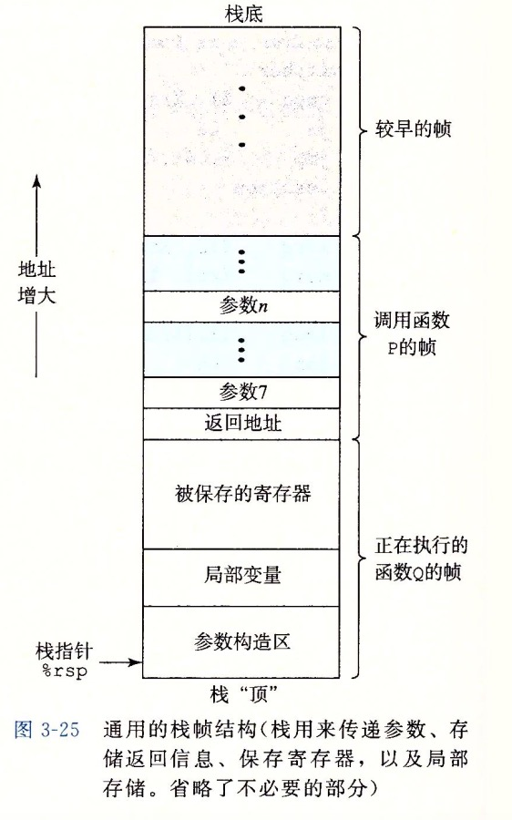

其实并没有这个问题，实际上正因为栈是这样的结构，因此指令（或者说代码）在栈（或者说内存）中其实是倒着放的（即在上面那张图里是从右向左放的，即movq的第一个字节在右下）。这样能够保证指令一条一条地址是逐渐增大的。（为什么指令一条一条地址是逐渐增大的？？？你随便`disas`一个函数，看看左边的地址不就知道了:sweat_smile::sweat_smile:）至于倒放，想一想你的`attack lab `，你顺序的填入`movl $cookie, %edx`的机器码到栈中。用上面这种图来看，这种填法其实相当于 _从右到左，从下到上_ 的填入。再想一想你是怎么填入返回地址的，`78 dc 61 55 00 00 00 00`，这样其实就保证了**小地址放低位数据**。

内存其实是长这样的，地址从下到上增大，栈朝_地址低_的方向增长也可以从图中很明显的看出来。

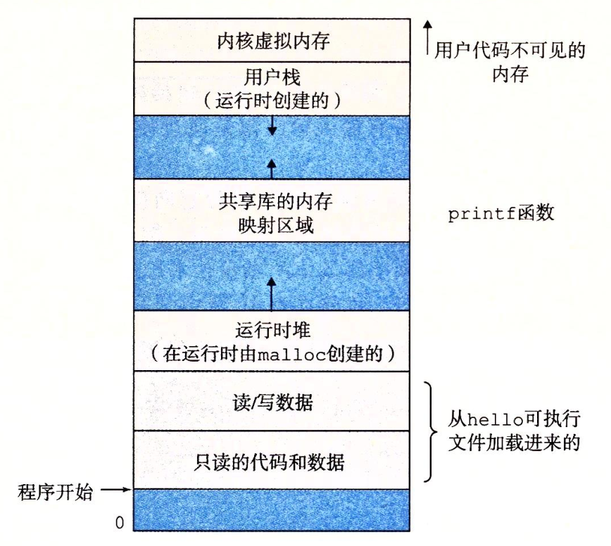


## HCL

多路复用器


```verilog
word Out = [
  s: A;
  1: B;
];
```

求A、B、C中的最小值

```verilog
word Min3 = [
  A <= B && A <= C: A;
  B <= C: B;
  1: C;
];
```

集合关系

```verilog
bool s1 = code in {2, 3};
bool s2 = code in {1, 3};
//code是一个两位的信号 00 01 10 11
```

## 存储器与时钟

组合电路不存储任何信息，它们只是简单地相应输入信号，产生输出。

存储设备都是由时钟控制的，时钟是一个周期性信号，决定什么时候将新值记载到设备中。

1. 时钟寄存器（流水线中不同阶段间的寄存器）。比如条件码寄存器和程序计数器。

2. 随机访问存储器（包括内存，寄存器文件）。

   寄存器文件：两个读端口，一个写端口。读数据类似组合电路，写数据则由时钟信号控制，只在时钟上升沿才将值写入。内存也是如此。
   
   **attention**Y86的寄存器文件包含两个写端口，一个写来自M（访问内存）阶段的数据，一个写来自E（执行）阶段的数据。

## ISA

### 程序员可见的状态

1. Program counter

   PC：记录下一条指令的地址。

2. Register File

   15个程序寄存器

3. Condition Code

   三个一位（one bit）的条件码：OF:overflow ZF:zero SF:negative

4. Status Code

   |  1   |                 AOK  程序运行正常                 |
   | :--: | :-----------------------------------------------: |
   |  2   |                HLT  执行了halt指令                |
   |  3   | ADR  访问非法内存（取指or读写数据时超过最大地址） |
   |  4   |                INS  遇到了非法指令                |

5. Memory

### SEQ

#### Y86指令

1. pushq %rsp会将%rsp的旧值压如栈中。

> 解释：pushq会将valA的值压入栈中，而valA的值是rsp的原始值，如果rA是rsp的话，valB读取rsp的值并通过alu更新（-8）后变为valE的值会写回rsp。

2. popq %rsp会将%rsp置为栈中的弹出的数值。 

>  解释：<del>我们的寄存器只有一个写口</del>Y86的寄存器有两个写口，而popq在写回阶段要写两个寄存器——%rA（来自valM）和%rsp（来自valE），但我们的策略依旧是先写rsp（即valM这在流水线的转发实现中也有体现）再写rA（即valE）这使得如果rA即为rsp那么会写入从内存中读出来的值。

3. 访问栈中的数据到底要不要`+-8`

> call、ret、popq、pushq会访问栈中数据
>
> 运行时栈是从高地址往低地址变化的。而内存可以理解为一个大数组，因此如果写入或读取8个字节的数据，会读或写M[1~8]的值。
>
> call将返回地址入栈，等价于push。push会写入，因此要减8，然后写入8个字节。
>
> popq读取栈中的值，因此不用减8，直接读取，然后将rsp-8的值写入。
>
> ret因为是一个函数结束，此时rsp指向M[0]的位置，因此直接读取M[1~8]即为返回地址。
>
> 

## PIPE

### 流水线实现

fetch --> decode --> execute --> memory --> write back

[流水线总结](流水线总结.pdf)

注意一下write back阶段干了什么：

1. 写回

2. 写处理器的stat

   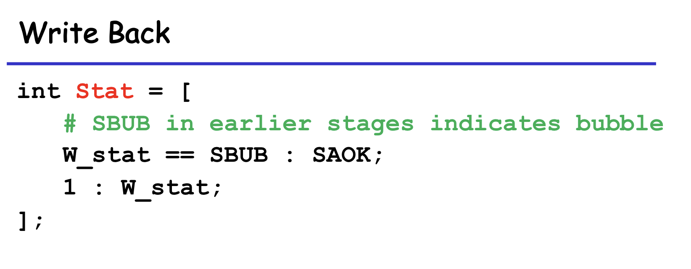

### 控制逻辑

Overall Trigger

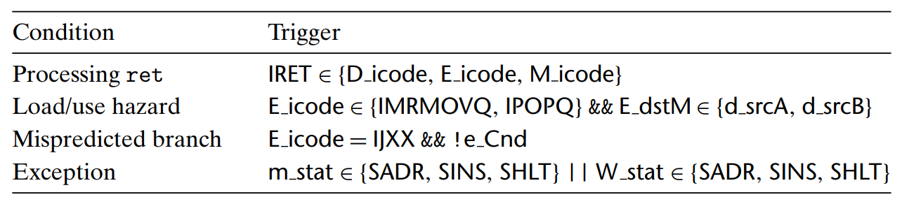

Overall solution


1. load/use hazard

   触发条件：popq和mrmovq处于execute（执行）阶段时，读取该寄存器的指令位于decode（解码）阶段。

   解决方案：让读取寄存器的指令停止在decode阶段，并往下一个周期的执行阶段中插一个bubble。

   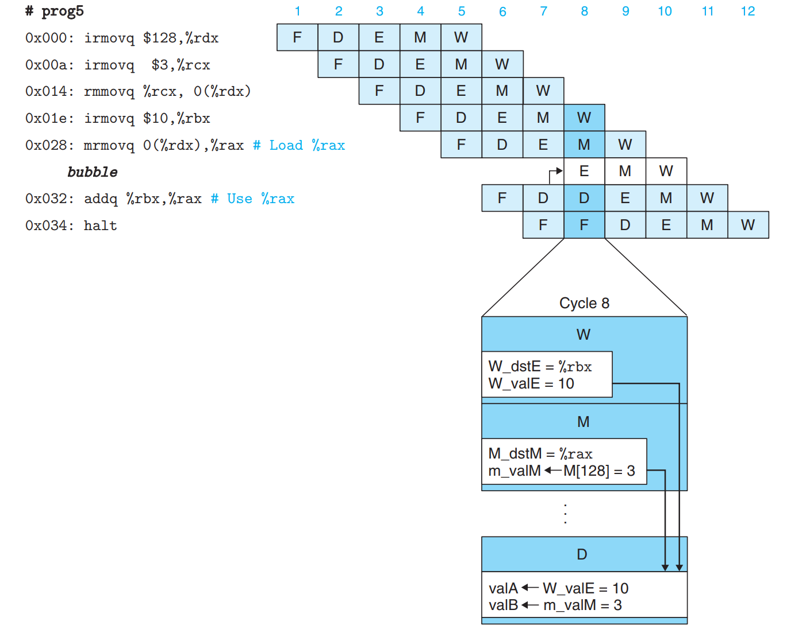

2. 处理ret

   触发条件：fetch阶段读取到一个ret

   解决方案：注意，因为我们不能往fetch插入气泡，因此之后每个fetch阶段都会从读ret的下一条指令，然后再在decode插入气泡，如此重复三次。

   > 为什么读同一条指令，predPC不会被更新吗？实际上F寄存器会暂停三个时钟周期。这意味着它的predPC会保留三个周期不变。

   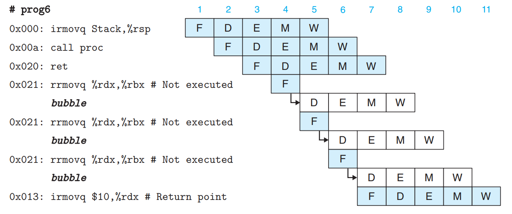

3. 预测错误的分支。

   触发条件：在jxx的execute阶段发现不应该跳转。

   解决方案：此时流水线中已经误读入了两条指令。在jxx进入memory阶段时，会将正确的nextPC转发到fetch阶段，所以此时fetch中已经是正确的指令，而execute和decode中是不正确的指令，因此只要往execute和decode插入bubble即可解决预测错误。

   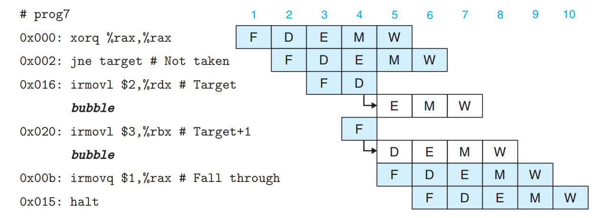

4. 异常

   流水线寄存器中包含一个状态码stat，当发生异常时，记录状态码，并好像无事发生一般继续执行，直到**该stat到达访存**时。

   触发条件：m_stat$\in${ADR,INS,HLT} || W_stat$\in${ADR,INS,HLT}

   > 其实只有两个地方会更新stat
   >
   > 
   >
   > 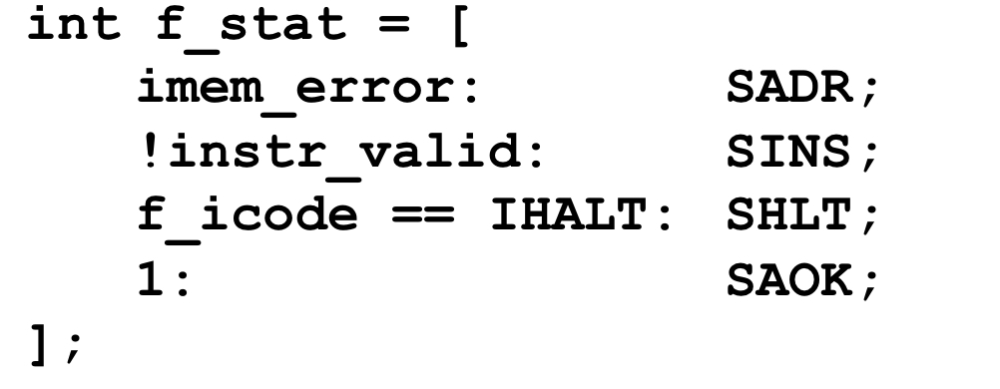

   1. 禁止execute阶段的指令写cc

      

   2. 向访问内存阶段中插入bubble，禁止向数据内存写入。

      

      可以看到，pushq的访问内存阶段出现了访问非法地址错误后，addq无法更新cc且addq和irmovq都在内存阶段被插了bubble。

### stall和bubble硬件实现

暂停信号设为1时，寄存器不在时钟上升沿更新。

气泡信号设为1时，将icode设为INOP，其余操作不同的流水线寄存器不同。

> 解释一下什么是流水线寄存器，下面那张图每个大寄存器前面的字母表示了这是什么流水线寄存器。（W，M，...)

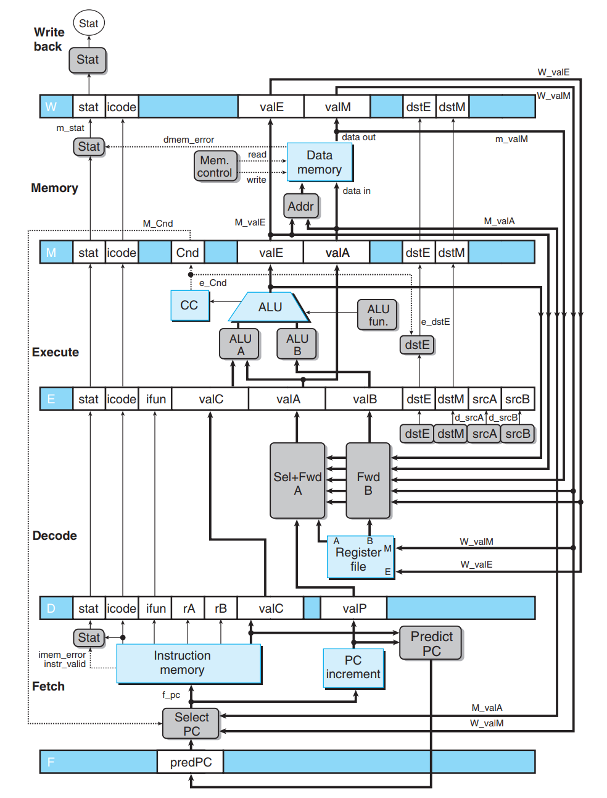

### 控制条件组合

只有可能发生两种组合，我们可以直接将对应处理方案的寄存器状态相加来判断是否需要处理。

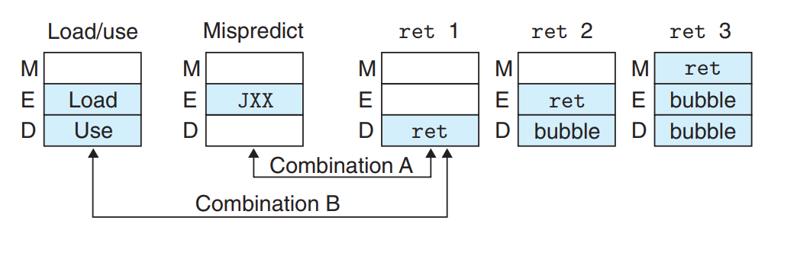

1. A不需要特殊处理，因为虽然分支预测错误要要求取值阶段正常取指而不是暂停，但因为反正取指阶段取的指来自转发，因此也就暂不暂停无所谓了。之后ret就被bubble掉一切正常。

Pipeline Control总体HCL设计


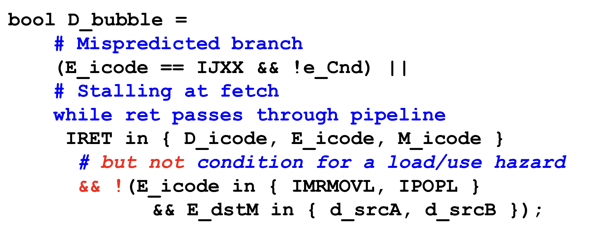


