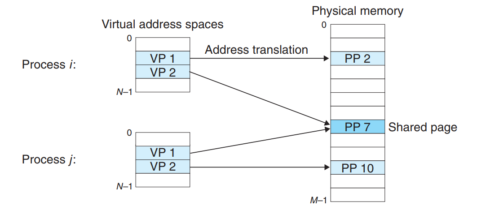
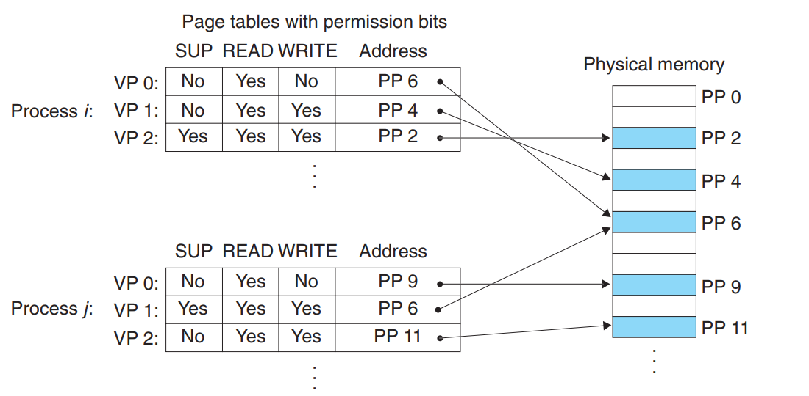
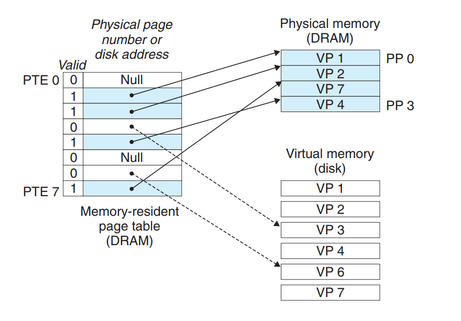
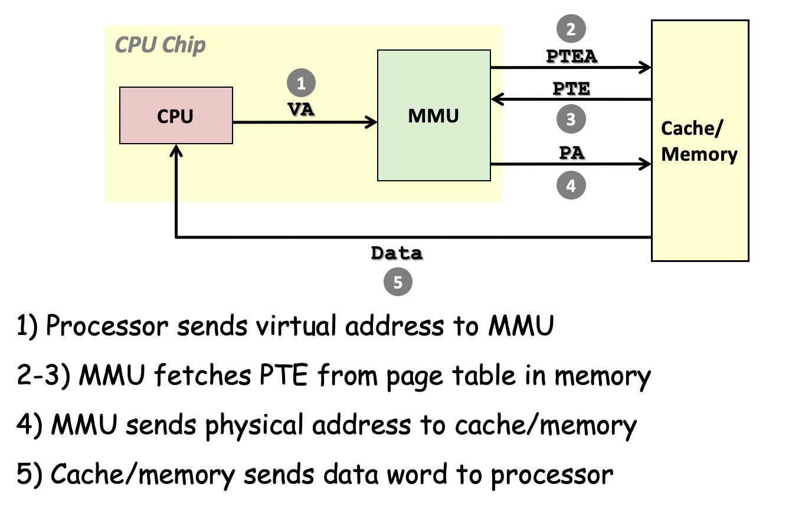
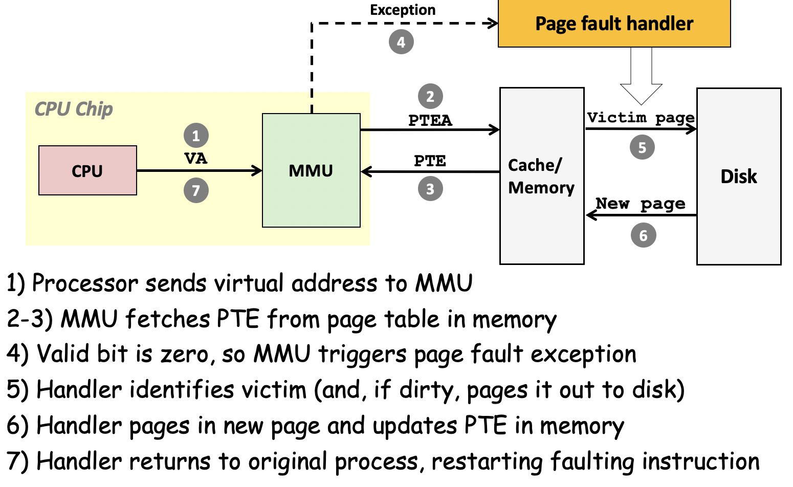
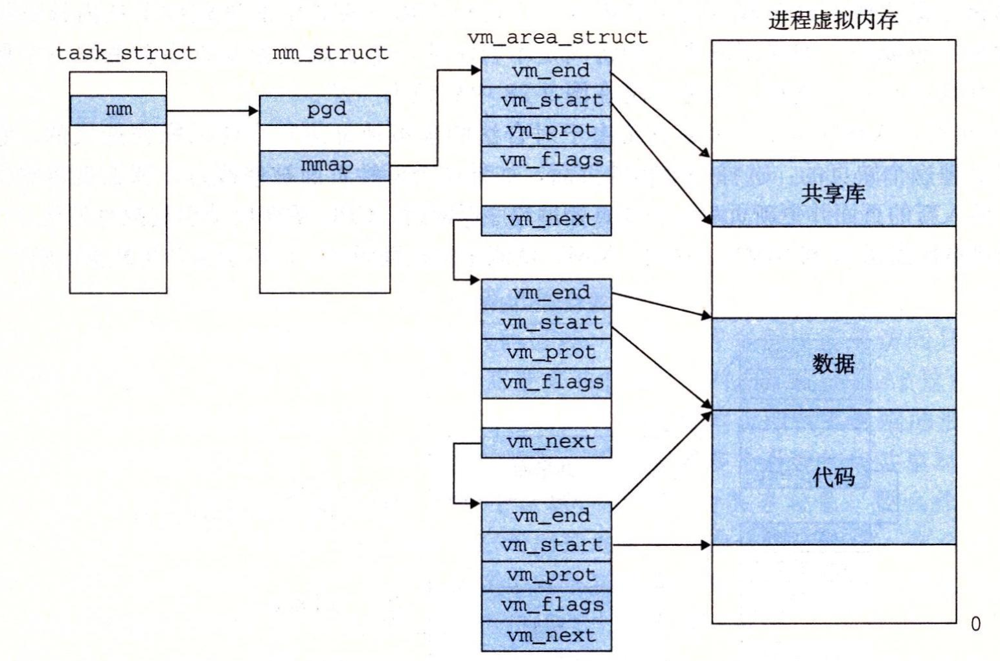
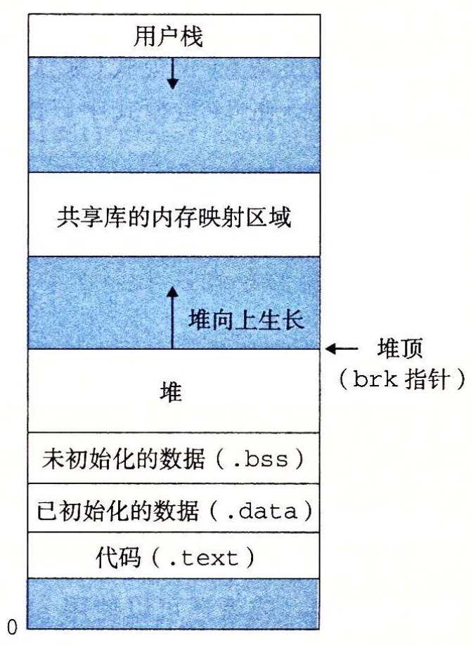
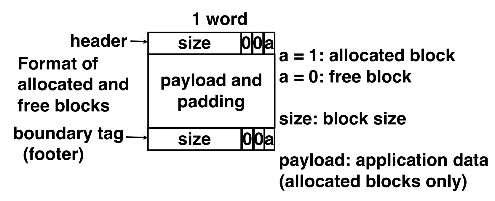
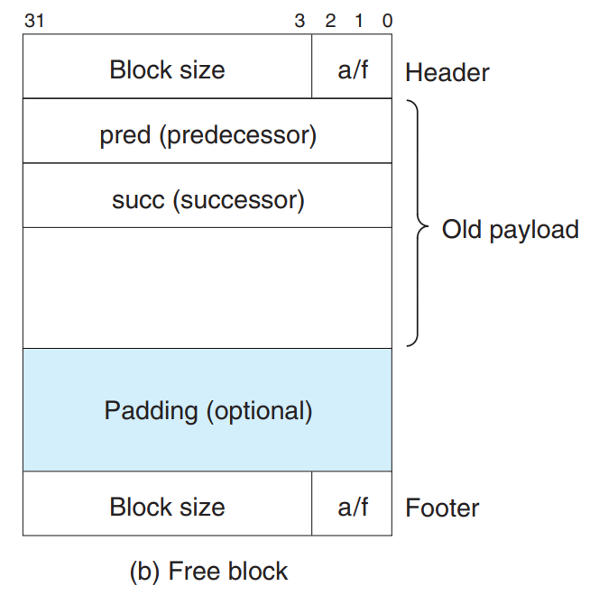

# Virtual Memory

## motivation

Why we need Virtual Memory?

1. 使用主存作为一个disk的缓存。

   

   DRAM比SRAM慢1000倍，disk比DRAM慢100000倍，因此不命中（miss）的cost是巨大的。

   因此虚拟内存被组织为一个放在磁盘上的数组，每个byte有一个唯一的虚拟地址，作为数组的索引。而这个数组的一部分被**缓存**在了主存中。在主存和disk之间也是一块一块的传递数据，这就是`页`。

   

   一个`页`可能有三种状态，未分配的，分配但缓存在主存中的，分配且被缓存到主存中的。

   虚拟地址空间：{0,1,2,...,N-1}，N由地址的位数决定，$N = 2^n$，比如32位或64位操作系统。

   物理地址空间：{0,1,2,...,M-1}，M不要求是2的幂。

   数据对象（字节） VS 它的属性（地址）

   > 每个数据对象可以有多个属性，即每个主存上的字节可以有一个物理地址和多个虚拟地址。

2. 简化内存管理。每个进程看到的相同的线性空间。

   OS为每个进程提供了独立的页表，因此也提供了一个独立的地址空间。

   这可以简化链接，简化加载，简化共享，简化内存分配。

   

3. 内存保护的工具。

   隔离地址空间，每个进程无法影响其他的进程，User的程序无法获取内核态的信息。

   implementation:在PTE上加一些额外的许可位。

   

   违反这些许可条件，CPU会报 segmentation fault。

虚拟内存的实现需要软硬件联合提供，包括OS，MMU（memory management unit）中的地址翻译硬件以及存放在物理内存中的页表（操作系统负责维护页表的内容）。

## 页表



虚拟地址空间的**每个页**在页表中都有一个条目（PTE，Page Table Entry）。每个PTE由一个valid bit（表示是否缓存在主存中），和后面的地址组成。如果

- valid bit为1 则地址为这个页在主存中的地址。
- valid bit为0 但页已经被分配，则地址为在disk中的地址。
- valid bit为0且页未分配，则为null。

## Address translation

> 本质上来说，地址翻译是将一个N元素的虚拟地址空间中的元素和一个M元素的物理地址空间的元素的映射。


- VPN    virtual page number
- PPN    physical page number
- VPO    virtual page offset
- PPO    physical page offset

VPN作为查询页表的index，比如一个虚地址的VPN是0x0f，那么对应的页表项就是`Table[15]`。

### page Hit



两次内存读写：

1. 通过PTEA（页表条目地址）找到虚拟地址对应的页表条目（将整个条目读回MMU），读出对应的物理地址。

2. 用物理地址访问内存。

### page fault



触发条件：当 利用页表条目地址 读回的页表条目的valid bit是0时。

**需要更新页表**。

### TLB

利用TLB减少对内存的读取，加速。

> read L1 4cycle，L2，L3，main memory even worse，but with TLB we can finish translating in ONE cycle


与Chapter 6中cache的原理类似，将VPN分成两部分，tag和index，index的位数由TLB有多少组决定

> 比如有16组，那么就需要 $2^4=16$，4个bit位

先用index找到 TLB[index] 再对比tag位，然后看valid bit位，如果都满足，将TLB[index]中的PPN取出。

TLB[index]应为如下格式

| Tag  | PPN  | Valid |
| :--: | :--: | :---: |

TLB是页表的一部分，每个进程的页表是不一样的，切换进程时要刷新TLB（valid bit置0）

## 多级页表

> Why do we need it?
>
> 考虑32位虚拟地址空间，每个页4kb，也就是$2^{12}$，那么就需要$2^{20}$个PTE，假设每个PTE 4 bytes，那么每个进程就需要1M * 4byte = 4MB的页表，64位就更夸张了。

每一级页表的页表项存下一级页表的首地址，直到最后一级页表存PPN。


### 翻译过程


## Linux虚拟内存系统

区域（段）：区域是已经存在着的虚拟内存的连续片。

e.g. 代码段，数据段，堆，共享库，用户栈

每个虚拟页都属于某个段。

### VMA



- pgd：第一级页表的基址（内核运行这个进程时，就将其放在CR3控制寄存器中）
- vm_start, vm_end：段的起，终位置
- vm_prot：这个段内所有页的读写权限
- vm_flags：这个区域的页是否与其他进程共享（还有一些其他信息）

### memory mapping


### COW

> COW stands for copy on write


## Dynamic memory Allocation

堆紧接在未初始化的数据区域后开始，并向上（更高的地址）生长。



操作系统为每个进程维护一个brk指向堆的顶部。

### C functions

```c
void *malloc(size_t size);
void *calloc(size_t size);
void free(void* ptr);//注意，free后ptr仍指向被释放了的块
```

```c
void* sbrk(intptr_t incr);
//通过将brk指针增加incr来扩展和收缩堆，成功返回旧的brk的值，失败返回-1并将errno置为ENOMEM
//如果incr为0就返回当前brk的值
//incr的返回值指向新堆顶向上abs(incr)字节处
```

### performance

#### throughput

吞吐率 = 单位时间内完成的请求数

e.g. 1s内完成500个分配请求和500个释放请求，则吞吐率为 1000次/秒

#### memory utilization

有效载荷 payload：程序请求一个p字节的块则已分配块的有效载荷是p（已分配块实际大小会因为满足对齐要求等等大于p）

聚集有效载荷 $P_k = \sum$当前所有有效载荷

经过k次请求，峰值利用率 = （$max_{i\le k}P_i/H_k$） H_k为当前堆的大小，which is单调变大的（因为free并不会使堆大小变小）。

##### 影响内存利用率的因素

- 内部空隙

  block size和payload size的差别，由对齐要求、为了便于管理加上的一些头尾字

  仅与之前request序列有关，易于度量

- 外部空隙

  堆里有足够的空间，但这些空间不连续，即没有single big enough block。

### implementation

#### 隐式空闲链表

##### format



header：占一个字，也就是4个字节

1. 表示这个分配的块有多大。attention：block size Not payload size

   这样free的时候仅凭一个pointer就可以知道要free多少空间。

2. 表示这个块是否被分配。

   因为双字对齐要求（即分配的块的大小必须是8的倍数（以字节为单位）），因此size的后三位一定是0，因此可以用一个位bit来表示这个块是否被分配了。

footer：仅有头部是单向链表，无法解决合并时判断前一个块是否是空闲块。

footer是header的副本，也包含了块的大小和是否被分配bit。

> Cons: 每个块都要保存8个byte的header和footer数据，造成很大的内存开销。
>
> Possible optimization：footer当且仅当合并时前面的块是空闲块时会用到，如果将这一信息（即前面的块是否被分配bit）存在header的低位空余位中，那么**已分配块**便不需要footer。（因此如果发现前一个块是已分配块就不需要知道它的大小，反正不会合并）**未分配块**自然仍需要，因为要知道它的大小。

##### 寻找插入的位置

###### First Fit

从list的头开始找。找到第一个满足条件的块。

pros：趋向将大的空闲块保留在链表的后面。

cons：会在链表起始处留下小空闲块的“碎片”。增加了对较大块的搜索时间。

###### Next Fit

从上一次查询结束的地方开始搜索。

相比First Fit，运行快，但内存利用率低。

###### Best Fit

检查所有空闲块，找到适合所需大小的最小的空闲块。

##### 分配空闲块

1. 直接使用整个空闲块。---> 造成大量内部碎片
2. 分割。将空闲块分成两个部分，第一部分变成分配块，第二部分变成一个新的空闲块。

##### 获取额外堆内存

如果找不到合适的空闲块，使用sbrk函数向内核请求额外的堆内存。

##### 合并（coalescing）

合并相邻的空闲块

1. 立即合并

   每个块被释放时执行。

2. 推迟合并

   等到稍晚时执行。e.g.某个请求分配失败时扫描整个堆统一合并。

#### 显式空闲链表

Motivation：我们其实并不关心已经分配了的块，但隐式链表需要将这些块都遍历一遍。

Solution：将空闲块组织为显式的链表。即构造一个把各个空闲块链起来的表。


我们仍需要header和footer，因为我们要做合并。

因为空闲块的body是不需要使用的，因此可以在空闲块的主体中包含一个前驱和后继指针



这可以使得First Fit的分配时间从$O(块总数)$减少为$O(空闲块总数)$

##### free

free的时间复杂度与实现策略有关

###### LIFO

新插入的free block放在free list的开头。

Pros: 简单并且插入只需常量时间。

Con: 内存碎片较多。

###### address-ordered-policy

free block list按照地址排序。

Pros: 内存碎片较少。

Con: 插入需要搜索。

#### 分离空闲链表

##### 简单分离存储

看书吧。。。好像不是很实用的亚子。。。

##### 分离适配

> GNU malloc package的实现方式

每个大小类有一个空闲链表，显示or隐式，这个链表中的空闲块都是这个大小类的成员。

分配：

1. 找到待分配size对应的大小类及其对应的空闲链表。
2. 做first fit，如果找到了，就（optional）分割它，并把剩余的部分插入其所属的空闲链表中。
3. 如果没找到，就找一个更大的大小类，如此重复。
4. 如果找遍了都没找到，向操作系统申请额外的内存，从这个内存中分配一个块，将剩余部分放置在适当的大小类中。（初始情况也是如此）

free：

释放一个块时，执行合并，并将结果放置到对应的空闲链表中。

