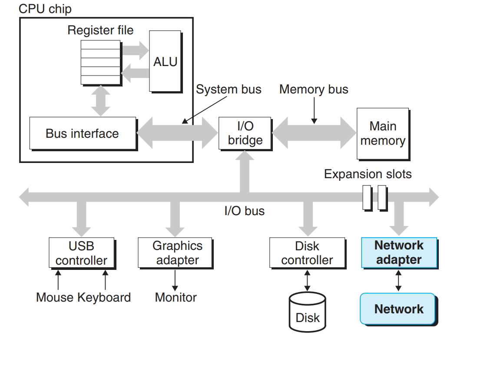

# ch11

> Author: Wei Xinpeng
>
> Date: 2021.4.20

## computer network

### host

对于每一台主机来说，网络只是一种I/O设备。通过插到I/O总线扩展槽的适配器（网卡，拥有全球唯一的48位MAC地址，MAC地址，记录了生产厂商，协议等）



### LAN

> local area network 局域网，在一个建筑或校园范围内。
>
> 迄今为止，最流行的局域网技术是以太网（Ethernet）

#### 以太网段（segment）


由一些网线和集线器（hub）组成，跨越一些小区域，某建筑物的一个房间或者一个楼层。

集线器不加分辨的将从一个端口上收到的每个位复制到其他所有端口上。

一台主机可以发送一段位（称为帧frame）到这个网段内的其他任何主机。

#### 桥接以太网（bridged Ethernet）


桥会学习哪个主机可以通过哪个端口（port）到达。

### WAN

> wide area network 广域网

多个不兼容的局域网可以通过路由器router（specialized computer）连接起来。


### Internet protocol

由host和router中的protocol software实现。

1. 提供了一种命名规范。

   uniform format for host address

2. 提供了一种发送机制。

   发送的Packet包括头（header）和有效载荷（payload）


### IP internet


#### TCP/IP

TCP => Transmission Control Protocol IP => Internet protocol

是一个协议族。IP协议提供基本的命名方法和传送机制。这种传递机制能够从一台因特网主机往其他主机发送包，但这种机制死不可靠的，即不会回复丢失的包。

UDP => Unreliable datagram protocol稍微扩展了IP协议，使得包可以在进程间而不是主机间传送。

TCP则是一个构建在IP上的复杂协议，提供了进程间可靠的、双向的连接。

---

来自工训赛的一点笔记并进行了扩充。

#### 网络基础知识

1. [统一资源定位符 URL(Uniform Resource Locator)](https://baike.baidu.com/item/%E7%BB%9F%E4%B8%80%E8%B5%84%E6%BA%90%E5%AE%9A%E4%BD%8D%E7%B3%BB%E7%BB%9F/5937042?fromtitle=URL&fromid=110640&fr=aladdin)

   > `[协议类型]://[访问资源需要的凭证信息]@[服务器地址]:[端口号]/[资源层级UNIX文件路径][文件名]?[查询]#[片段ID]`

2. 域名 Domain name:由一串用点分隔的名字组成的Internet上某一台计算机或计算机组的名称。

   

3. IP地址:因特网上的每台计算机和其它设备都规定了一个唯一的地址，叫做“IP地址”。

   32位无符号整数，通常以点分十进制（将32位分成四段，每一段0 ~ 255）表示。

   `0xca7828bc = 202.120.40.188`

4. DNS(Damain name system):互联网的一项服务，因为IP地址不方便记忆，因此人们设计出域名，并通过DNS将IP地址与域名相互映射。

   其中映射关系可以1对1，多对一，最普遍的是M-N

5. FQDN(Fully Qualified Domain name):
   FQDN = Hostname + Domain name

   >e.g. 一个公司申请了域名`comp.com`，这时候有一台主机名为web，则可以使用`web.comp.com`得到这个主机IP。若还有两台提供邮件和OA服务的主机cmail，oa，则这时候可以用以下FQDN：
   >`cmail.comp.com`
   >`oa.comp.com`

6. NAT:同个公司，家庭，教室内主机对外通信时，把私有IP转换为公有IP地址。所以你使用百度搜索本机IP查到的IP是公网IP，而通过`设置`，`ifconfig`，`python socket`等得到的是局域网IP，也就是路由器给你分配的IP。

7. Linux/MacOS下 /etc/hosts文件的配置
   `ip fqdn [alias]...`
   第一列为主机ip地址，第二列为主机fqdn地址，第三列以后为别名，可以省略，否则至少要包含hostname

---

## socket 编程

套接字（socket）连接的endpoint，有相应的套接字地址，由一个因特网地址和一个16位的端口（[What is port](https://blog.csdn.net/cto_51/article/details/10086745)）组成。`IPaddress（对应host）:port（对应process）`

> 有一些well-known port 比如http使用80，smtp使用25 查看`/etc/services`查看6w+个port

一个连接则由它两端的（server and client）的套接字地址唯一确定。

对于内核来说，socket是internet连接的endpoint，而对于一个program来说，socket是从网络读写的描述符（descriptor）。*Unix对于文件I/O和网络I/O采用同样的抽象。*

### functions

```c
struct sockaddr_in {
  uint16_t sin_family;//always AF_INET表示正在使用32位IP地址
  uint16_t sin_port;//端口号
  struct in_addr;//32位IP地址
  unsigned char sin_zero[8];//为了保持和sockaddr对齐
};
//为了解决当时c语言没有void*指针的问题，程序将对应特定协议的指针强制类型转换成这个通用结构
struct sockaddr {
  uint16_t sin_family;
  char sa_data[14];
};
```

```c
/* 将主机名/主机地址，服务名/端口号的字符串转化为socket address */
int getaddinfo(const char *const, const char *service, const struct addrinfo *hints, struct addinfo **result);
//若出错，返回非0的errno
//给定host（可以是域名，数字地址（比如点分十进制））和service（可以是服务名（如http），也可以是十进制端口号，因为一些端口预留给了一些service，比如80对应HTTP）
//hint用来用来控制返回的addinfo链表的结构
//返回result，对应于一个指向addrinfo结构（中间有sockaddr，见下)的链表
```


**其中`ai_addr`指针指向一个`sockaddr`结构（即有端口号和ip）**

```c
/* 将一个套接字地址转换为主机和服务名字符串 */
int getnameinfo(const struct sockaddr* sa, socklent_t salen, char *host, size_t hostlen, char *service, size_t servlen, int flags);
//若出错，返回非0的errno
//sa指向大小为salon字节的sockaddr
//host为返回的主机名 hostlen是buffer的长度
//service是返回的服务名，servlen是buffer的长度
```

#### 连接函数

```c
/* 使套接字成为连接的一个端点，返回一个套接字描述符 */
/* 这些参数都可以用getaddinfo生成 */
int socket(int domain, int type, int protocol);

/* 将clientfd与套接字地址为addr的服务器建立一个连接 */
/* 会阻塞，一直到连接成功，返回1；或是发生错误，返回0 */
/* 如果成功，clientfd就是连接好的套接字对 */
int connect(int clientfd, const struct sockaddr* addr,socklen_t addrlen);

/* 服务器使用，将addr中的套接字地址与sockfd联系起来 */
int bind(int sockfd, const struct sockaddr* addr, socklen_t addrlen);

/* 将sockfd从主动套接字转化为一个监听套接字 */
int listen(int sockfd, int backlog);

/* addr是客户端的套接字地址，listenfd是监听描述符，返回一个已连接描述符 */
int accept(int listenfd, struct sockaddr* addr, int *addrlen);
```

#### 连接过程

client端想要连接`hostname:port`，则先用`getaddinfo`获得一个addrinfo的链表，然后遍历这个链表，对于每一项，先用socket函数建立socket描述符，再尝试用connect将该描述符连接至`hostname:port`，如果成功，返回该描述符。然后将这个描述符当成文件描述符进行读写，与客户端交流。

server端可以服务`hostname:port`来的请求，先用`getaddrinfo`获得`hostname:port`的addinfo（如果将hostname设为NULL，则表示可以接受任何IP的请求），遍历这个链表，对于每一项，先用socket函数建立socket描述符，然后用bind将其与`hostname:port`联系起来，（表示这个listenfd可以连接哪些ip来的请求），再用listen将其转化为监听套接字。

> 总的来说，getaddinfo可以认为有两个作用，1 将hostname和port转化为二进制数据（socket address），再生成了一些繁琐的参数信息可以让上面那几（5）个函数调用，所以总体思路都是先getaddinfo，然后遍历这张表，生成socket，再把这些socket和hostname:port联系起来。

## proxy

What is a proxy?


Why we need proxy?

Caching,logging,anonymization,filtering,transcoding......tremendous usage!!


