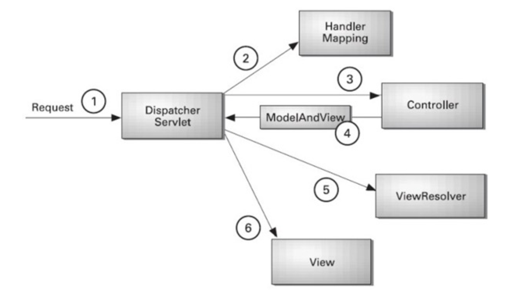
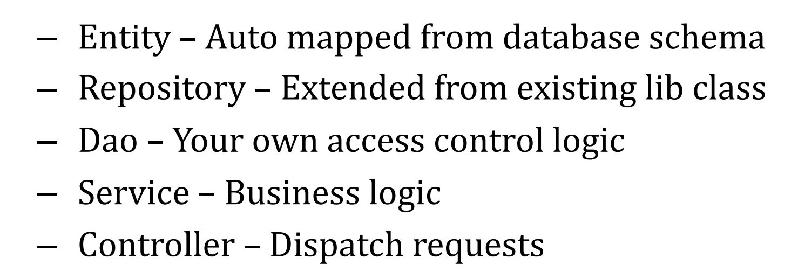

# spring Note

## annotation

> 每个框架自己定义

annotation不影响字节码，框架（比如spring）在加载字节码的时候处理这些annotation，加入一些字节码。

### annotation & explanation

- Controller

  `@RestController` VS `@Controller`，`@RestController`会将java对象转化成JSON然后返回client。

- Mapping

  其实每种HTTP method都有一种，但`@RequestMapping("/{id}")`即可匹配所有的请求（为了体现RestFul API一般不用这个通配的）

  - @GetMapping
  - @PutMapping
  - @PostMapping
  - @DeleteMapping
  - ...

  配合上面这些Mapping的annotation

  - @RequestParam & @RequestBody

    [Spring @RequestParam Annotation](https://www.baeldung.com/spring-request-param) 

    [Spring’s RequestBody and ResponseBody Annotations](https://www.baeldung.com/spring-request-response-body)

    @RequestParam会接收来自 URL中的param，和responsebody中的form data（比如form-data和x-www-form-urlencoded数据 两种的不同见[四种常见的 POST 提交数据方式](https://imququ.com/post/four-ways-to-post-data-in-http.html)）其中有两种接收方式，直接接收，比如`@RequestParam String username`就是直接找URL中的 username=var 或者form中的`key:username, value:usernameValue`，如果前后端变量名一样，可以不在@后写(name="username")。还有一种就是用Map接受form数据，经试验，不能接受URL中的数据。

    > 网上资料有说RequestParam处理参数的方式就是将URL中的参数和form中的参数搞成一个Map。

    @RequestBody会接受HTTP request body中的参数，可以拿Map或者Entity接受application/json。或者直接拿个String把整个body以String的形式读入（比如json读进来就是裸的 {...} ）。但是其他 application/form-data，application/x-www-form-urlencoded，application/plain都会报错。（似乎可以通过设置produces属性来选择接受的application类型，但没试过）

    你也可以在函数里同时使用@RequestParam和@RequestBody两种东西，比较好的方法是Param取URL中的数据，Body取json中的数据。两种一起使用可以会出现的问题[Spring MVC - Why not able to use @RequestBody and @RequestParam together](https://stackoverflow.com/questions/19468572/spring-mvc-why-not-able-to-use-requestbody-and-requestparam-together) 经过检验前面的使用方法不会出现这样的问题。

  - @PathVariable

    [Spring @PathVariable Annotation](https://www.baeldung.com/spring-pathvariable)

- Lombok

  @Data  提供了 `@ToString`, `@EqualsAndHashCode`, `@Getter` on all fields, `@Setter` on all non-final fields, and `@RequiredArgsConstructor` 方法。

  @AllArgsConstructor 全参数构造函数

  @EqualsAndHashCode 提供了equal和hashcode方法

CORS（Cross-origin resource sharing） filter

`@CrossOrigin` 解决跨域问题。

## 序列化

### 概念

序列化：把对象转化为可传输的字节序列过程称为序列化。

反序列化：把字节序列还原为对象的过程称为反序列化。

为什么需要序列化

- 序列化最终的目的是为了对象可以跨平台存储，和进行网络传输。而我们进行跨平台存储和网络传输的方式就是IO，而我们的IO支持的数据格式就是字节数组。
- 因为我们单方面的只把对象转成字节数组还不行，因为没有规则的字节数组我们是没办法把对象的本来面目还原回来的，所以我们必须在把对象转成字节数组的时候就制定一种规则（序列化），那么我们从IO流里面读出数据的时候再以这种规则把对象还原回来（反序列化）。

- 如果我们要把一栋房子从一个地方运输到另一个地方去，序列化就是我把房子拆成一个个的砖块放到车子里，然后留下一张房子原来结构的图纸，反序列化就是我们把房子运输到了目的地以后，根据图纸把一块块砖头还原成房子原来面目的过程

什么时候使用序列化

- 凡是需要进行“跨平台存储”和”网络传输”的数据，都需要进行序列化。
- 本质上存储和网络传输都需要经过把一个对象状态保存成一种跨平台识别的字节格式，然后其他的平台才可以通过字节信息解析还原对象信息。

## spring MVC

### MVC

>  MVC stands for Model View Controller

前端视图View（maybe React.js or Vue.js），后端业务逻辑Model（maybe java or Django），各自发出的请求，由中间的Controller进行传递（将哪个Model显示在哪个View上，servelet就充当了一个这样的角色），接受前端HTTP请求，选择调哪个服务（service），从而实现前端与后端解耦。

MVC也可以全部在后端：比如Servlet返回html（`return "<html>"`）页面，或者通过JSP。把View放在后端。

### spring MVC

 

1. dispatcher拦截所有的http请求并进行分发。（分发逻辑写在xml文件里）
2. 查找annotation或者xml文件。
3. 来了一个请求后，通过2，我们知道该将这个请求交由哪个Controller处理。
4. Controller返回一个ModelAndView，通过ViewResolver解析这个东西。
5. 最后返回前端View。

### Layered Architecture

> 分层依据

### RESTful API

[RESTful API 设计指南（from Ruan YiFeng）](https://www.ruanyifeng.com/blog/2014/05/restful_api.html)

HTTP方法使用

RESTful API中将HTTP作为应用层协议。

- GET（SELECT）：从服务器取出资源（一项或多项）。
- POST（CREATE）：在服务器新建一个资源。
- PUT（UPDATE）：在服务器更新资源（客户端提供改变后的完整资源）。
- PATCH（UPDATE）：在服务器更新资源（客户端提供改变的属性）。
- DELETE（DELETE）：从服务器删除资源。

> POST与PUT的区别：
>
> POST方法不具备幂等性，即多次提交会产生多个记录。

状态码：

- 200 OK - [GET]：服务器成功返回用户请求的数据，该操作是幂等的（Idempotent）。
- 201 CREATED - [POST/PUT/PATCH]：用户新建或修改数据成功。
- 202 Accepted - [*]：表示一个请求已经进入后台排队（异步任务）
- 204 NO CONTENT - [DELETE]：用户删除数据成功。
- 400 INVALID REQUEST - [POST/PUT/PATCH]：用户发出的请求有错误，服务器没有进行新建或修改数据的操作，该操作是幂等的。
- 401 Unauthorized - [*]：表示用户没有权限（令牌、用户名、密码错误）。
- 403 Forbidden - [*] 表示用户得到授权（与401错误相对），但是访问是被禁止的。
- 404 NOT FOUND - [*]：用户发出的请求针对的是不存在的记录，服务器没有进行操作，该操作是幂等的。
- 406 Not Acceptable - [GET]：用户请求的格式不可得（比如用户请求JSON格式，但是只有XML格式）。
- 410 Gone -[GET]：用户请求的资源被永久删除，且不会再得到的。
- 422 Unprocesable entity - [POST/PUT/PATCH] 当创建一个对象时，发生一个验证错误。
- 500 INTERNAL SERVER ERROR - [*]：服务器发生错误，用户将无法判断发出的请求是否成功。
