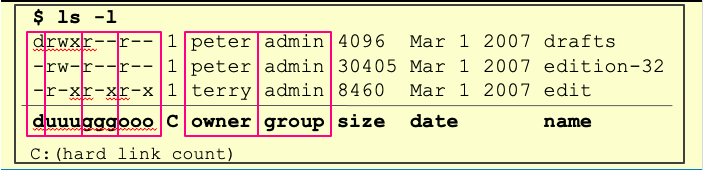

# SHELL & LINUX

> ref:
>
> [阮一峰bash教程](https://wangdoc.com/bash/)

## shell

> dash means `-`

### 命令基本格式

`command flag 参数`参数只有一个单词，如果想要输入词组，需使用"",flag是命令的一些选项，starts with dash -

### 一些特殊的文件夹
`.` current direcotry 
`..` parent directory
`~` current user's home directory
`cd -` to the previous directory you are in 

### getting help
**on linux** `command-name --help`
**both on linux and Mac OS** `man conmand-name`
**[TLDR pages](https://tldr.sh)** Simplified and community-driven man pages usage:直接在终端中输入 `tldr + cmd`
### basic Info
#### 输入输出重定向

change stream input and stream output 
`>`:change stream output
`<`:change stream input

```shell
$ echo hello > hello.txt
$ cat < hello.txt > hello2.txt 
//equivalent to cp command
```
`>>` means append	`>`will overwrite


还有一个冷门的类似特性是 进程替换（process substitution）， `<( CMD )` 会执行 `CMD` 并将结果输出到一个临时文件中，并将 `<( CMD )` 替换成临时文件名。这在我们希望返回值通过文件而不是STDIN传递时很有用。例如， `diff <(ls foo) <(ls bar)`: 会显示文件夹 foo 和 bar 中文件的区别

#### pipe

The `|` 使得 output of one is the input of another.
`ls -l / | tail -n1`
将ls -l的内容输入到tail中，而tail输出尾部10行
常与`xargs`搭配使用

#### ctrl+l

control+l can clear the terinmal(actually not clear just go to the top of it)

#### ;

`;` 在同一行执行多个命令

### commands

- `ls`

  - `ls -l`
    
  - `ls *.c (*.cpp)`

- `mv`move  `cp`copy  the_previous_path -> the_path_you_want

- `echo` write argument to the standard output 

- `which` 在$PATH中，查找系统命令的位置（shell built in command是查不到的）

  > shell执行命令的基本途径，先找是否是shell built in command 再去PATH中找是否有这条命令

- `mkdir -p` -p 确保目录名称存在，不存在的就建一个。

  > mkdir -p wxp/test 在工作目录下的wxp目录中建立一个test目录，若不加-p，则若wxp不存在，便会报错。

- `find` find path -option 

  > 将当前目录及其子目录下所有文件后缀为 .c 的文件列出来:
  > \# find . -name "*.c"

- `locate` 定位指定文件

- `crontab`   ref: [Linux Crontab 定时任务](https://www.runoob.com/w3cnote/linux-crontab-tasks.html)    [Linux crontab 命令](https://www.runoob.com/linux/linux-comm-crontab.html)

  别忘了输出重定向，crontab默认会将输出信息（包括error message）发送至mail文件夹中，比如`/var/mail`（我的mac） 或者 `/var/spool/mail`。

  

  */3  每过3分钟/小时/...

  /path/to/script要写绝对路径，且script中的命令要写绝对路径，比如`/usr/bin/du`，写文件的话文件尽量也写绝对路径。

  > ubuntu的mail好像没有，导致邮件发不出去。
  >
  > 可以用这个查看`grep CRON /var/log/syslog` 输出来debug。毕竟这玩意儿的stderr会发到邮件里，而邮件文件夹很可能找不到。。。

- `du` disk usage用于查看目录或文件大小。ref: [du](https://www.runoob.com/linux/linux-comm-du.html)

  du -sh * 查看当前目录下所有文件夹的大小（可以用来找大文件）

- [查看进程](https://www.linuxprobe.com/linux-look-process.html)

- df 显示所有文件系统和它们的磁盘使用情况（-h以 human readable的方式）。

- grep 字符串匹配。

  grep "search_pattern" path/to/file 找到文件中包含这个字符串的东西，并高亮输出。

  也可以通过管道输入 ... | grep "search_pattern"

## shell script

> most is based on BASH

### Shebang 行

> sharp means `#` bang means `!`

#!（空格可有可无）脚本解释器的位置（也可以是perl或者Python） 放在.sh的第一行。

然后就可以在终端中直接用`./file.sh`调用脚本。

如果没有，就需要自己指定，或者将使用`$SHELL`执行该脚本。

### 变量

1. `''`定义的字符串为原意字符串 `""`定义的字符串会进行转义 \` \` 反引号中可以输入bash的命令（可以用`$(cmd)`替换，而且后者更好，因为它可以嵌套命令`$(... $())`）
> Be careful about the SPACE
2. 使用已定义过的变量 `$var`

   此时会做直接替换，所以如果这是个字符串，要用`"$var"`防止字符串中有引号。

3. 特殊的变量：
   argument|refer
   :---:|:---:
   \$0|脚本名
   \$1 ~ \$9|脚本参数
   \$@|脚本所有参数
   !!|完整的上一条命令
   \$_|上一条命令的最后一个参数
   \$?|前一个命令的返回值（0表示正常，其他非零表示不正常）true 1 false 0

### 使用命令执行结果

当您通过 `$( CMD )` 这样的方式来执行CMD 这个命令时，然后它的输出结果会替换掉 `$( CMD )` 。例如，如果执行 for file in `$(ls)` ，shell首先将调用ls ，然后遍历得到的这些返回值。

> 和c等比较不同的是，ls或者cat等命令的输出不是返回值对于bash来说命令的返回值和命令的输出

### 正则表达式

1. 通配   ？匹配一个字符 * 匹配任意个字符
   e.t. `ls *.php` `rm foo?`

2. 花括号 `{}` 一系列命令有公共子串时，可以通过花括号展开它们。
   >e.t. cp /path/to/project/{foo,bar,baz}.sh /newpath
   会展开为
   cp /path/to/project/foo.sh /path/to/project/bar
   sh /path/to/project/baz.sh /newpath


## Linux

- [apt VS apt-get](https://blog.csdn.net/liudsl/article/details/79200134)

  apt 命令的引入就是为了解决命令过于分散的问题，它包括了 apt-get 命令出现以来使用最广泛的功能选项，以及 apt-cache 和 apt-config 命令中很少用到的功能。

  - `apt` 可以看作 `apt-get` 和 `apt-cache` 命令的子集, 可以为包管理提供必要的命令选项。
  - `apt-get` 虽然没被弃用，但作为普通用户，还是应该首先使用 apt。

- [.bashrc VS .bash_profile](https://linuxize.com/post/bashrc-vs-bash-profile/)

  When invoked as an interactive login shell, Bash looks for the `/etc/profile` file, and if the [file exists](https://linuxize.com/post/bash-check-if-file-exists/) , it runs the commands listed in the file. Then Bash searches for `~/.bash_profile`, `~/.bash_login`, and `~/.profile` files, in the listed order, and executes commands from the first readable file found.

  When Bash is invoked as an interactive non-login shell, it reads and executes commands from `~/.bashrc`, if that file exists, and it is readable.

  > login shell, interactive shell, non-interactive shell etc. Also check the link above.

- apt-get update VS upgrade VS dist-upgrade

  update: 当执行apt-get update时，update重点更新的是来自软件源的软件包的索引记录(即index files)。

  upgrade：当执行apt-get upgrade时，upgrade是根据update更新的索引记录来下载并更新软件包。

  dist-upgrade:当执行apt-get dist-upgrade时，除了拥有upgrade的全部功能外，dist-upgrade会比upgrade更智能地处理需要更新的软件包的依赖关系。

- ubuntu查看当前版本。

  [lsb_release](https://ipcmen.com/lsb_release) -a （-a是查看全部信息）

  cat /etc/os-release

- Ctrl+Alt+F1和terminal的区别。

## 问题处理方案

1. apt-get install时碰到unmet的package，就把那些报错的package一个个apt-get。

2. [Ubuntu输入密码后无法进入桌面，但是可以ctrl+alt+f1进入命令行界面](https://blog.csdn.net/e01528/article/details/79532932)
3. [dpkg 被中断、sudo apt-get upgrade失败](https://blog.csdn.net/weixin_44649870/article/details/89636997)
4. 升级Ubuntu
   1. [Ubuntu全盘备份与恢复，亲自总结，实测可靠](https://blog.csdn.net/sinat_27554409/article/details/78227496)
   2. [如何安全的从ubuntu16.04升级到18.04？](https://blog.csdn.net/a850565178/article/details/107517874)
5. [Ubuntu挂载硬盘](https://zhuanlan.zhihu.com/p/35774442)

