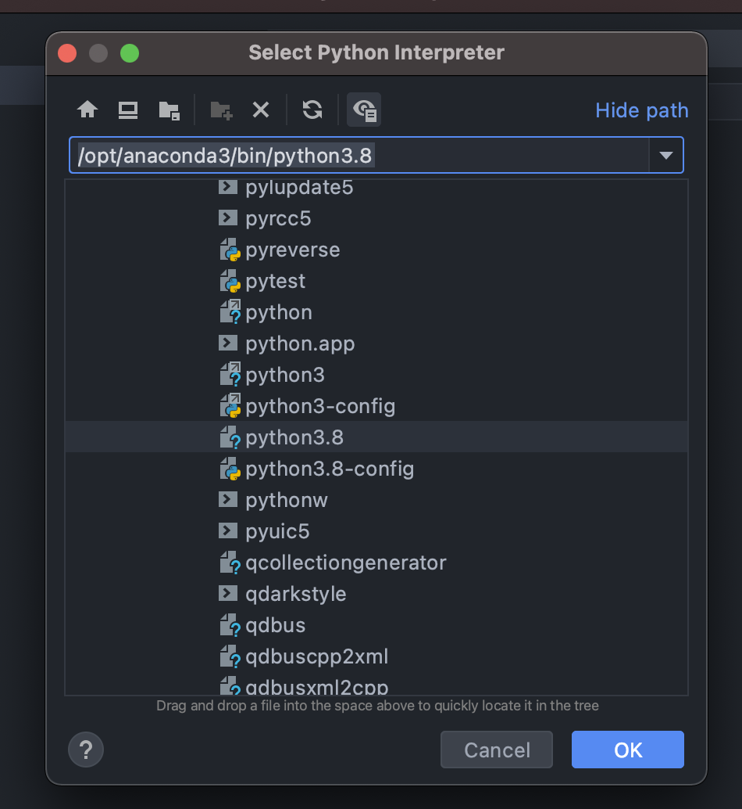
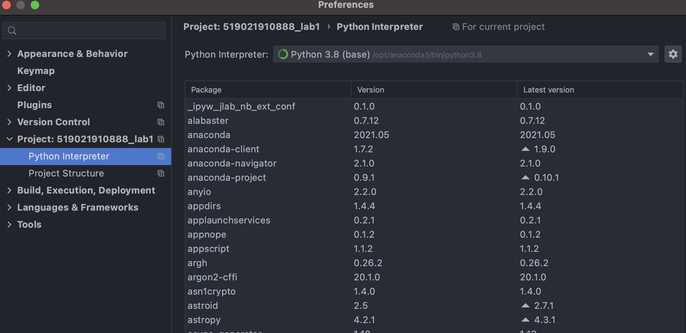

# python

## Python Concept

- `CPython` is the *original* Python implementation. It is implemented in C.

- `IronPython` - **C# implementation of python**, targeting the .NET framework

- `Ruby Python` - works with Ruby platform

- `Anaconda Python` - **Distribution of python and R programming languages for scientific computing** like, *data science, machine learning, artificial intelligence, deep learning, handling large volume of data* etc. Numerous number of *libraries like, scikit-learn, tensorflow, pytorch, numba, pandas, jupyter, numpy, matplotlib etc.* are available with this package

  > It bundles CPython with several packages, especially ones that are useful for scientific computing

- `Stackless` - **Python for Concurrency**

### pip install vs conda install

Pip installs Python packages whereas conda installs packages which may contain software written in any language. For example, before using pip, a Python interpreter must be installed via a system package manager or by downloading and running an installer. Conda on the other hand can install Python packages as well as the Python interpreter directly.

## setup

pycharm中使用anaconda

1. 新建project时，选择previous interpreter

   

2. add interpreter中找到anaconda的python

   




也可以直接在设置中更改python的interpreter。



Q1:conda的作用是什么呢？

conda的作用是什么呢？其实就是venv+pip的作用，也就是虚拟环境+包管理。

conda将几乎所有的工具、第三方包都当作package进行管理，甚至包括python 和conda自身。Anaconda是一个打包的集合，里面预装好了conda、某个版本的python、各种packages等。

### Conda

conda list 查看安装了哪些包

conda env list 查看当前都有哪些虚拟环境

conda create -n your_env_name python=x.x [包名，比如numpy]   以python x.x创建虚拟环境，并安装这些包（也可以之后再安装），我的新环境似乎会自动安装pip，所以之后都用pip即可

conda activate environment_name  激活某个虚拟环境

conda deactivate  退出当前环境回到base

conda remove --name environment_name --all   删除环境包括其所有的包

## basic

注释：#

块注释：'''...''' """..."""

### 获取帮助

直接命令行中输入 dir(对象) 返回这个对象的属性和方法

help(函数名)

### import

```python
import math #导入库，使用库中的函数math.sqrt()
from math import sqrt #可直接使用sqrt()，但有可能导致名字冲突
import 库 as 库的别名
```

more advanced:

1. `import module_name`

   在这种情况下，Python会在两个地方寻找这个模块，第一是sys.path，第二就是运行文件所在的目录。

   > 最好不要用上述方法导入同目录下的文件！因为这可能会出错。
   >
   > e.g.
   >
   > ./m1.py:
   >
   > ```python
   > from pk1 import md1
   > ```
   >
   > ./pk1/md1.py
   >
   > ```python
   > import md2
   > ```
   >
   > 此时直接运行m1.py就会报错，因为它引用了md1，md1直接引用了md2，但是md2不在它的目录下。改成下面这样就可以：
   >
   > ```python
   > from . import md2
   > ```

2. `from package_name import module_name`

#### 总结

对于非运行入口文件：需要使用相对导入

运行入口文件：个人理解：直接可以python filename.py执行的文件，里面类似脚本一样会写一些可以直接执行的东西

因为非运行入口文件是要被其他文件用来导入的，所以需要相对导入以避免上面所述的那种情况。

Q：运行入口文件是否可以相对导入呢？e.g.

```python
from .pk1 import md1
md1.foo()
```

A：可以，但是不能使用`python m1.py`直接运行。

直接运行会报错：`ModuleNotFoundError: No module named '_main_.pk1'; '__main__' is not a package`

要到当前m1文件的parent目录下运行`python -m parent_directory_name.m1`

> 因为m1.py中的`from .Branch import m3`中的`.` ，解释器并不知道是哪一个package。使用`python -m Tree.m1`，解释器就知道`.`对应的是Tree这个package。 

### 添加路径

sys.path

- 临时加入路径：

```python
import sys
sys.path.append('$path')
# NOTE: you cannot use ~ for /Users/weixinpeng
```

- 永久加入路径

使用pth文件，在 site-packages 文件（可以查看sys.path找到改文件夹的位置，比如对于我的prp环境，改文件夹的位置就在`/opt/anaconda3/envs/prp/lib/python3.8/site-packages`）中创建 .pth文件，将模块的路径写进去，一行一个路径。

### 输出重定向

```python
import sys
f = open('output.txt', 'a')
sys.stdout = f
sys.stderr = f
print("hello",file=f)
f.close()
```

### exception handling

```python
try:
    # some commands
except (TypeError, ZeroDivisionError): # handle specific Error
except Exception as e: # handle rest Error
else: # if the code block inside the try can run without Error, else will be excuted
```

### 执行系统指令

1. os.system('$cmd')

    > deprecated since version 2.6. Subprocess is the right module to use. from [here](https://unix.stackexchange.com/questions/238180/execute-shell-commands-in-python)

2. subprocess

### vscode中禁用一些报错

1. [pyright](https://stackoverflow.com/questions/57335636/is-it-possible-to-ignore-pyright-checking-for-one-line)
2. [pylint](https://stackoverflow.com/questions/25610009/how-to-comment-document-uses-of-pylint-in-line-options)

## 算符

### 三目运算符

```python
# [on_true] if [expression] else [on_false] 
min = a if a < b else b
```

### is vs ==

is checks two objects' memory address

== check two objects' content

### :=

assignment expression

introduced after python3.8

## 内置类型

### static type checking

> since python3.6
>
> Python’s type hints are for the developer, not for the runtime. By the time your program runs, all the type information has been **erased**.
>
> In vscode, you should enable the static analysis by setting `Python.Analysis.TypeCheckingMode`

```python
from typing import Dict, List
dict_of_users: Dict[int,str]
list_of_users: List[str]
```

#### Union and Optional

```python
from typing import Optional, Union
user_id: Optional[int]
user_id = None # valid
user_id = 3 # also vald
```

### primitive type

> you can use `type()` to check

int, float, complex(2+3j), str, bool

#### maxium float

float('inf')

### tuple

#### concatenate tuples

```python
my_tuple_1 = (11, 14, 0, 78, 33, 11)
my_tuple_2 = (10, 78, 0, 56, 8, 34)
my_result = my_tuple_1 + my_tuple_2 # (11, 14, 0, 78, 33, 11, 10, 78, 0, 56, 8, 34)
```


### list

- 访问最后一个元素 `list_var[-1]` (`list_var[-n]`等价于`list_var[len(list_var) - n]`)

- list append的性能比numpy的好

- `len(list_var)`获取list长度

#### CRUD

```python
# get
index_of_value = list.index(value)
# delete
del list[idx]
del list[start_idx:end_idx] # delete a slice of elements
list.remove(value)
list.pop(idx) # remove the element at idx and return it
```

#### list comprehensions

> 列表推导

`newList = [ expression(element) for element in oldList if condition ] `

##### generator expressions

`(expression(element) for element in oldList if condition)`

this will be lazy execution

#### map

`list(map(lambda_expression, list_variable))`

需要用list再collect回一个list

[map vs list comprehensions](https://stackoverflow.com/a/1247490/16598178)

1. `map` may be microscopically faster if you **don't use lambda** and use the same function(e.g. int()) in map and list comp
2. list comp is faster in other cases and pythonistas consider them more direct and clearer

#### convert to set

`set(list)` convert a list into set(remove duplicate elements)

#### filter

simliar to map, but the lambda expression should return a boolean

#### sorted

`sorted(iterable, key=lambda)`

return a sorted list

> if you call list.sort, the original list would be modified

### dict

#### initialization

```python
Dic = {"One" : 7, "Two" : 10, "Three" : 45, "Four" : 23, "Five" : 77 }
Dic = dict(One = 70, Two = 45, Three = 75, Four = 83, Five = 9 )
Dic = ["One", "Two", "Three"]
new = dict.fromkeys(Dic) # all the value would be None
```

#### iterate

```python
for key in dict_var:
for value in dict_var.values():
for key, value in dict_var.items():
```

#### CRUD

```python
# check if a key exists
if key in dict
# get
get(key)
[key]
setdefault(key, default_value) # if the key exists, return its value, else insert key with the default_value and return it
# delete
del dict[key]
dict.pop('key', 'desired_value') # if no 'desired_value' being specified, it will raise a KeyError
```

#### merge

```python
# after 3.9.0
c = a | b # a, b are both dict
```

### itertools

#### chain

```python
def chain(*iterables):
     for it in iterables:
       for each in it:
           yield each
```

I often use `chain.from_iterable()`

```python
a = [[1, 2], [3, 4, 5]]
print(list(chain.from_iterable(a)))
# [1, 2, 3, 4, 5]
```

### string

格式化字符串：

1. `f'{v1} content {v2} content {v3}'`
2. `{}.format()`

## 循环

1. for

```python
for it in list_variable:
  pass
# 一次遍历两个元素
it = iter(list_variable)
for item in it:
	print(item, next(it))
```

2. how to break nested loops in python

    > [ref](https://medium.com/techtofreedom/5-ways-to-break-out-of-nested-loops-in-python-4c505d34ace7)

    1. use function (use return to break nested loops)

    2. throw exception

    3. itertools.product() (avoid nested loops)

        ```python
        a = [1, 2]
        c = {5: 50, 6: 60}
        list(itertools.product(enumerate(a), c.items()))
        # [((0, 1), (5, 50)), ((0, 1), (6, 60)), ((1, 2), (5, 50)), ((1, 2), (6, 60))]
        ```

    4. for-else

        ```python
        for i in range(5):
            for j in range(5):
                if j == 2 and i == 0:
                    break
            else:  # only execute when it's no break in the inner loop
                continue
            break
        ```


## 条件与分支

1. 条件

In python: `and`  is  `&&`, `or`  is  `||`,  `!` is not

if expression in one line: `A if some_condition else B `

how to check if a variable is true: `if variable` and `if not variable`

> better than  `if variable == True`  or `if variable is True` from [here](https://switowski.com/blog/checking-for-true-or-false)


## 函数

给函数参数注解

```python
def add(x:int, y:int) -> int:
    return x + y
```

python解释器不会对这些注解添加任何的语义。它们不会被类型检查，运行时跟没有加注解之前的效果也没有任何差距。 然而，对于那些阅读源码的人来讲就很有帮助啦。

### 传参

position argument，keyword argument

keyword arguments must be after position arguments.

### 变长参数

`*args` 以一个array的形式传入

`**kwargs` 以一个dict的形式传入

### lambda表达式


## concurrency

[GIL impact](https://realpython.com/python-gil/#the-impact-on-multi-threaded-python-programs)

> main idea
>
> 1. IO密集型任务可以很好的利用multi-thread
> 2. CPU密集型任务会变得比single-thread更慢，因为拿锁放锁。

solution:

1. 使用Process，每个process会有单独的interpreter，但是process本身的开销也很大
2. GIL只存在于CPython中，所以可以使用其他的python解释器，比如Jython，PyPy等。

### asyncio

#### explanation

async IO is a **single-threaded, single-process** design: it uses **cooperative multitasking**. So coroutines (a central feature of async IO) can be scheduled concurrently, but they are not inherently concurrent.

## IO

```python
f = open('file_name', 'mode')
f.write(str)
f.writelines(List[str])
for line in f:
    do_something_with_this_line
```

### mode

|          Mode          |  r   |  r+  |  w   |  w+  |  a   |  a+  |
| :--------------------: | :--: | :--: | :--: | :--: | :--: | :--: |
|          Read          |  +   |  +   |      |  +   |      |  +   |
|         Write          |      |  +   |  +   |  +   |  +   |  +   |
|         Create         |      |      |  +   |  +   |  +   |  +   |
|         Cover          |      |      |  +   |  +   |      |      |
| Point in the beginning |  +   |  +   |  +   |  +   |      |      |
|    Point in the end    |      |      |      |      |  +   |  +   |

## OOP

### None

how to check if an object it None, use `is` and `is not`. Because if you def your own `__eq__` method, something wrong might happen if you use `==`  or `!=`

### dataclass

> [official doc](https://docs.python.org/3/library/dataclasses.html)

类似java中的lambok，通过装饰器的方法自动帮你实现一些函数，比如`__init__, __eq__, __repr__, etc`

1. 如何定义一个field，它的值是基于其他field的: [post-init-processing](https://docs.python.org/3/library/dataclasses.html#post-init-processing)
2. 定义一个immutable的class: [stackoverflow](https://stackoverflow.com/a/58992808/16598178)

# Key word

## pass

占位语句，比如在Python中定义一个空函数会报错，但还没想好这个函数要干嘛，那么就可以在函数体里写上pass

```python
def fun():
  pass
```

## with

```python
with expression [as variable]:
    with-block
```

with 语句适用于对资源进行访问的场合，确保不管使用过程中是否发生异常都会执行必要的“清理”操作，释放资源，比如文件使用后自动关闭、线程中锁的自动获取和释放等。
