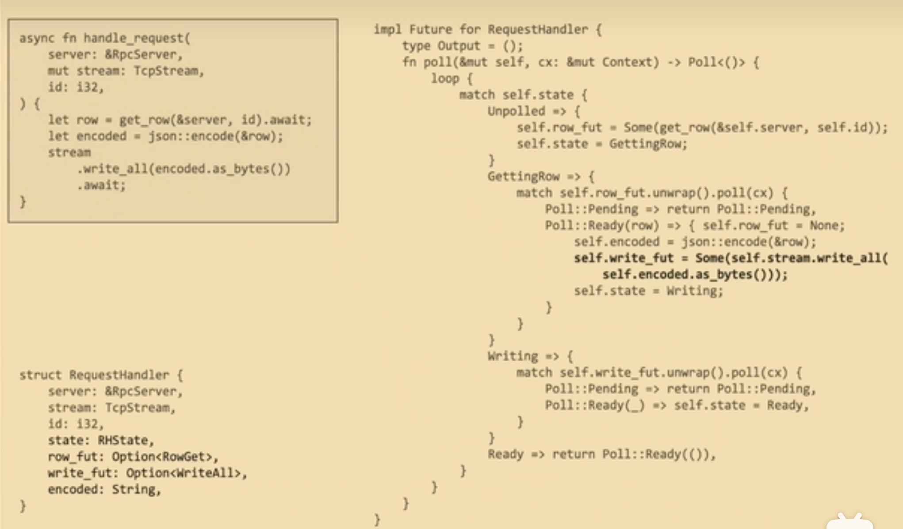

# Rust

> ref: https://course.rs/
>
> search doc: docs.rs/{Crate you want to look for}

## cargo

`cargo new project_name`

等价于`cargo new project_name --bin`，--bin是binary的缩写，代表着二进制程序

> Rust 有两种类型的包: 库包和二进制包，前者是我们经常使用的依赖包，用于被其它包所引入，而后者是一个应用服务，可以编译成二进制可执行文件进行运行。You may refer to [here](#包和模块) for details.

`cargo run`

首先对项目编译，然后再运行，等同于两个指令

`cargo build` + `./target/debug/world_hello`

默认情况是运行debug模式，编译速度快，但编译器不加任何优化。`--release`参数来编译进行优化。

`cargo check`

它的作用很简单：快速的检查一下代码能否编译通过。因此该命令速度会非常快，能节省大量的编译时间。

`cargo test`

它会在 `src/` 底下的文件寻找单元测试，也会在 `tests/` 目录下寻找集成测试。

`cargo clean`

Remove generated artifacts.

### feature


### Cargo.toml

`Cargo.toml` 

是 `cargo` 特有的**项目数据描述文件**。它存储了项目的所有元配置信息，如果 Rust 开发者希望 Rust 项目能够按照期望的方式进行构建、测试和运行，那么，必须按照合理的方式构建 `Cargo.toml`。

`Cargo.lock`

是 `cargo` 工具根据同一项目的 `toml` 文件生成的**项目依赖详细清单**，因此我们一般不用修改它，只需要对着 `Cargo.toml` 文件撸就行了。

> 什么情况下该把 `Cargo.lock` 上传到 git 仓库里？很简单，当你的项目是一个可运行的程序时，就上传 `Cargo.lock`，如果是一个依赖库项目，那么请把它添加到 `.gitignore` 中

```toml
[package]
name = "world_hello"	#project's name
version = "0.1.0"	#new project's default version is 0.1.0
edition = "2021"	#Rust's version
[dependencies]
rand = "0.3"
hammer = { version = "0.5.0"}	#基于 Rust 官方仓库 crates.io，通过版本说明来描述
color = { git = "https://github.com/bjz/color-rs" }	#基于项目源代码的 git 仓库地址，通过 URL 来描述
geometry = { path = "crates/geometry" }	#基于本地项目的绝对路径或者相对路径，通过类 Unix 模式的路径来描述
```

## Project Architecture

### 包和模块

- **Package**：可以理解为项目工程，包含有独立的Cargo.toml文件。

  > 一个 `Package` 只能包含**一个**库(library)类型的包，但是可以包含**多个**二进制可执行类型的包。

- **工作空间workspace**：对于大型项目，可以进一步将多个包联合在一起，组织成工作空间

- **包Crate**：包是一个独立的可编译单元，它编译后会生成一个可执行文件或者一个库（对应main或者lib）。

- **模块Module**：可以一个文件多个模块，也可以一个文件一个模块，模块可以被认为是真实项目中的代码组织单元

Rust 出于安全的考虑，默认情况下，所有的类型都是私有化的，包括函数、方法、结构体、枚举、常量，是的，就连模块本身也是私有化的。

- 将结构体设置为 `pub`，但它的所有字段依然是私有的
- 将枚举设置为 `pub`，它的所有字段也将对外可见

#### 模块

```rust
mod mod_name {
  fn private_function() {
    ...
  }
  pub fn public_function() {
    ...
  }
  fn foo() {
    private_function() // 同一模块可以访问其他项即使它是私有的
  }
}
```

##### 声明与定义

可以在mod.rs中声明模块`mod mod_name;`

> 这句话的作用是告诉 Rust 从另一个和模块 `mod_name` 同名的文件中（`mod_name.rs`或者`mod_name/mod.rs`）加载该模块的内容。
>
> 相当于
>
> ```
> mod mod_name {
> 	content_of_mod_name.rs
> }
> ```

然后在`mod_name.rs`或者`mod_name/mod.rs`中实现你的模块。

Q：为什么我们要显示的声明mod？

A：[ref](https://www.sheshbabu.com/posts/rust-module-system/)

我们需要告诉compiler项目结构。如果没有mod，我们在文件系统和compiler中看到的项目结构是不一样的：


添加mod.rs后：


比如在main中调用health_route.rs中的函数，通过`routes::health_route::print_health_route();`

想在user_route.rs中调用user_model.rs的函数，通过`crate::models::user_model::print_user_model();`

可以通过use简化路径

```rust
use crate::models::user_model::print_user_model;

pub fn print_user_route() {
  print_user_model();
  println!("user_route");
}
```

#### 外部依赖

Dependencies added to `Cargo.toml` are available globally to all modules inside the project. We don’t need to explicitly import or declare anything to use a dependency.

### project layout

```
.
├── Cargo.toml
├── Cargo.lock
├── src
│   ├── main.rs
│   ├── lib.rs
│   └── bin
│       └── main1.rs
│       └── main2.rs
├── tests
│   └── some_integration_tests.rs
├── benches
│   └── simple_bench.rs
└── examples
    └── simple_example.rs
```

1. 一个project可以有多个二进制包，放在bin目录下，通过`cargo run --bin file_name.rs`区分。

2. Cargo 知道，如果一个 `Package` 包含有 `src/lib.rs`，意味它包含有一个库类型的包 `package_name`，该包的根文件是 `src/lib.rs`。

   > 为什么既需要lib包，也需要二进制包，二进制包生成可执行文件，需要它毋庸置疑，但是lib包也需要，lib包的作用是可以让其他人调用，而你的二进制包也依赖它来找到你写的mod之类的东西。
   >
   > 然后bin通过`use lib-name::mod_name/fun_name/...`之类的方法引用你写的模块。

   库类型的包内部互相引用可以通过**绝对路径**和**相对路径**，绝对路径即是`crate::...`，相对路径。

3. 库的名称由`Cargo.toml`中的`package`项中的name决定。

#### use

可以使用use来缩短路径

> Usually a `use` declaration is used to shorten the path required to refer to a module item from [Rust Reference](https://doc.rust-lang.org/reference/items/use-declarations.html)
>
> 这意味着实际上use和其他语言的import实际上是不相同的。

pub use：当外部的模块项 `A` 被引入到当前模块中时，它的可见性自动被设置为私有的，如果你希望允许其它外部代码引用我们的模块项 `A`，那么可以对它进行再导出。

[rust course](https://course.rs/basic/crate-module/use.html#%E5%BC%95%E5%85%A5%E9%A1%B9%E5%86%8D%E5%AF%BC%E5%87%BA)

### workspace

根：

若一个 `package` 的 `Cargo.toml` 包含了`[package]` 的同时又包含了 `[workspace]` 部分，则该 `package` 被称为工作空间的根 `package`。

虚拟清单：

若一个 `Cargo.toml` 有 `[workspace]` 但是没有 `[package]` 部分，则它是虚拟清单类型的工作空间。

工作空间的几个关键点在于:

- 所有的 `package` 共享同一个 `Cargo.lock` 文件，该文件位于工作空间的根目录中
- 所有的 `package` 共享同一个[输出目录](https://course.rs/cargo/guide/build-cache.html)，该目录默认的名称是 `target` ，位于工作空间根目录下
- 只有工作空间根目录的 `Cargo.toml` 才能包含 `[patch]`, `[replace]` 和 `[profile.*]`，而成员的 `Cargo.toml` 中的相应部分将被自动忽略

## 所有权

1. Rust 中每一个值都 `有且只有` 一个所有者(变量)
2. 当所有者(变量)离开作用域范围时，这个值将被丢弃(free)

### 浅拷贝（类似）

对于堆中的变量，改变所有权更像是std::move()，这样原来的拥有者就没有改变量的所有权了。

### 深拷贝

可以使用`clone()`来执行深拷贝，即完整地将堆上的变量复制了一遍。

栈上的变量都是深拷贝，比如

```rust
let x = 5;
let y = x;
println!("x is {} y is {}", x, y);
//output is x is 5 y is 5
let arr = [0;1000];
let arr1 = arr;	//even array on stack is deep copy
```

> Rust 有一个叫做 `Copy` 的特征，可以用在类似整型这样在栈中存储的类型。如果一个类型拥有 `Copy` 特征，一个旧的变量在被赋值给其他变量后仍然可用。
>
> 作为一个通用的规则：**任何基本类型的组合可以是 `Copy` 的，不需要分配内存或某种形式资源的类型是 `Copy` 的**
>
> special case：元组，当且仅当其包含的类型也都是 `Copy` 的时候。比如，`(i32, i32)` 是 `Copy` 的，但 `(i32, String)` 就不是。

### 引用和借用

常规引用是一个指针类型，指向了对象存储的内存地址。

&取引用，*解引用，但是这样定义的引用是不能修改的。

```rust
let x = 5;	//x = 5
let y = &x;	//*y = 5
```

#### 可变引用

```rust
let mut s = String::from("hello");
some_function(&mut s);
```

- **同一作用域，特定数据只能有一个可变引用，但可以有多个不可变引用**

- **可变引用和不可变引用不能同时存在**

#### 引用的作用域

注意，引用的作用域 `s` 从创建开始，一直持续到它最后一次使用的地方。

> 这个跟变量的作用域有所不同，变量的作用域从创建持续到某一个花括号 `}`

## 生命周期

**函数的返回值如果是一个引用类型，那么它的生命周期只会来源于**：

- 函数参数的生命周期
- 函数体中某个新建引用的生命周期

1. **每一个引用参数都会获得独自的生命周期**

   例如一个引用参数的函数就有一个生命周期标注: `fn foo<'a>(x: &'a i32)`，两个引用参数的有两个生命周期标注:`fn foo<'a, 'b>(x: &'a i32, y: &'b i32)`, 依此类推。

2. **若只有一个输入生命周期(函数参数中只有一个引用类型)，那么该生命周期会被赋给所有的输出生命周期**，也就是所有返回值的生命周期都等于该输入生命周期

   例如函数 `fn foo(x: &i32) -> &i32`，`x` 参数的生命周期会被自动赋给返回值 `&i32`，因此该函数等同于 `fn foo<'a>(x: &'a i32) -> &'a i32`

3. **若存在多个输入生命周期，且其中一个是 `&self` 或 `&mut self`，则 `&self` 的生命周期被赋给所有的输出生命周期**

   拥有 `&self` 形式的参数，说明该函数是一个 `方法`，该规则让方法的使用便利度大幅提升。

## 多线程并发编程

### 创建线程

```rust
thread::spawn(move || {});
//返回一个JoinHandle
//move可以让所有权从一个线程转移到另一个线程
//如果没有move并且使用原线程中没有copy特征的对象，因为生命周期不能确定，所以可能出现该线程已经结束了，变量已经被释放了，另一个线程还没有开始执行之类的问题
```

- 线程内部代码使用闭包来执行

- `main` 线程一旦结束，程序就立刻结束，因此需要保持它的存活，直到其它子线程完成自己的任务

  handle.join()可以让当前线程阻塞

### 消息同步

标准库：`std::sync::mpsc`：multiple receiver one sender

```rust
// 创建一个消息通道, 返回一个元组：(发送者，接收者)
let (tx, rx) = mpsc::channel();
thread::spawn(move || {
  // 发送一个数字1, send方法返回Result<T,E>，通过unwrap进行快速错误处理
  tx.send(1).unwrap();
  // 下面代码将报错，因为编译器自动推导出通道传递的值是i32类型，那么Option<i32>类型将产生不匹配错误
  // 因为内部是泛型实现，一旦类型被推导确定，该通道就只能传递对应类型的值
  // tx.send(Some(1)).unwrap()
});

// 在主线程中接收子线程发送的消息并输出
println!("receive {}", rx.recv().unwrap());
```

1. send有可能返回错误：当这条msg没有被任何人接收。

   同理，当发送者关闭时，recv也会收到一个错误。

2. rx.rect()会阻塞当前线程，直到读取到值或者通道被关闭

   可以使用`try_rect()`方法，当通道中没有值时，它会立刻返回一个错误

#### 所有权

- 若值的类型实现了Copy特征，则直接复制一份该值。
- 若没有Copy，则所有权会被转移到接收端。

#### 多发送者

首先要对发送者进行clone，然后每隔线程使用一个tx

#### 同步通道

之前的都是异步通道，与异步通道相反，同步通道**发送消息是阻塞的，只有在消息被接收后才解除阻塞**。

### Send trait

- 实现`Send`的类型可以在线程间安全的传递其所有权
- 实现`Sync`的类型可以在线程间安全的共享(通过引用)

> 所以一个实现了Sync的类型它的引用一定是Send的

## 异步编程

### lecture

> [Rust异步函数的一生](https://www.bilibili.com/video/BV1R94y1m756)

1. Future

    A Future is a computation that progresses asynchronously.

    ```rust
    trait Future {
        type Output;
        fn poll(Self: Pin<&mut Self>, cx: &mut Context) -> Poll<Self::Output> {}
    }
    enum Poll<T>{
        Pending, // waiting for some outer events
        Ready<T>, // the computation is completely done and here is the result
    }
    ```

    Future does nothing unless it's polled

2. life of async fn

    

3. async相比state machine的优势

    可以处理一些自引用的问题：比如上图中加粗的那行：实际上没法重复引用自己的这个字段，需要用智能指针或者一些其他东西做中间层

    更少的内存占用：row_fut, write_fut, encoded可以overlap

### Introduction

- **Future 在 Rust 中是惰性的**，只有在被轮询(`poll`)时才会运行， 因此丢弃一个 `future` 会阻止它未来再被运行, 你可以将`Future`理解为一个在未来某个时间点被调度执行的任务。
- **Async 在 Rust 中使用开销是零**， 意味着只有你能看到的代码(自己的代码)才有性能损耗，你看不到的(`async` 内部实现)都没有性能损耗，例如，你可以无需分配任何堆内存、也无需任何动态分发来使用 `async` ，这对于热点路径的性能有非常大的好处，正是得益于此，Rust 的异步编程性能才会这么高。

> 目前主流的 `async` 运行时几乎都使用了多线程实现，相比单线程虽然增加了并发表现，但是对于执行性能会有所损失，因为多线程实现会有同步和切换上的性能开销，若你需要极致的顺序执行性能，那么 `async` 目前并不是一个好的选择。
>
> [async VS 多线程](https://course.rs/async/getting-started.html#rust-async-vs-%E5%A4%9A%E7%BA%BF%E7%A8%8B)
>
> `OS` 线程非常适合少量任务并发，因为线程的创建和上下文切换是非常昂贵的，甚至于空闲的线程都会消耗系统资源。虽说线程池可以有效的降低性能损耗，但是也无法彻底解决问题。当然，线程模型也有其优点，例如它不会破坏你的代码逻辑和编程模型，你之前的顺序代码，经过少量修改适配后依然可以在新线程中直接运行，同时在某些操作系统中，你还可以改变线程的优先级，这对于实现驱动程序或延迟敏感的应用(例如硬实时系统)很有帮助。
>
> - CPU密集型任务，例如并行计算，使用线程将更有优势。
> - 高并发更适合 `IO` 密集型任务，例如 web 服务器、数据库连接等等网络服务，因为这些任务绝大部分时间都处于等待状态，如果使用多线程，那线程大量时间会处于无所事事的状态，再加上线程上下文切换的高昂代价，让多线程做 `IO` 密集任务变成了一件非常奢侈的事。

### Overview

```rust
async fn sing_song(song: Song) { /* ... */ }	//异步函数返回值是Future，需要使用执行器（executor）来执行
async fn learn_and_sing() {
    // 这里使用`.await`来等待学歌的完成，但是并不会阻塞当前线程，该线程在学歌的任务`.await`后，完全可以去执行跳舞的任务
    let song = learn_song().await;

    // 唱歌必须要在学歌之后
    sing_song(song).await;
}

async fn async_main() {
    let f1 = learn_and_sing();
    let f2 = dance();

    // `join!`可以并发的处理和等待多个`Future`，若`learn_and_sing Future`被阻塞，那`dance Future`可以拿过线程的所有权继续执行。若`dance`也变成阻塞状态，那`learn_and_sing`又可以再次拿回线程所有权，继续执行。
    // 若两个都被阻塞，那么`async main`会变成阻塞状态，然后让出线程所有权，并将其交给`main`函数中的`block_on`执行器
    futures::join!(f1, f2);
}

fn main() {
    block_on(async_main());
}
```

### Future执行与任务调度

Future is a trait

> 调度本质就是一个executor，里面有一个receiver，然后每个task都有一个sender，wake就是将自己发到receiver的queue里。

执行器会管理一批 `Future` (最外层的 `ascyn` 函数)，然后通过不停地 `poll` 推动它们直到完成。 最开始，执行器会先 `poll` 一次 `Future` ，后面就不会主动去 `poll` 了，而是等待 `Future` 通过调用 `wake` 函数来通知它可以继续，它才会继续去 `poll` 。这种**wake 通知然后 poll**的方式会不断重复，直到 `Future` 完成。

> Q：谁会调用wake呢？
>
> A：I/O multiplexing

当任务实现了 `ArcWake` 特征后，它就变成了 `Waker` ，在调用 `wake()` 对其唤醒后会将任务复制一份所有权( `Arc` )，然后将其发送到任务通道中。最后我们的执行器将从通道中获取任务，然后进行 `poll` 执行。

### async/await

#### async

有两种使用方式，第一种`async fn`第二种`async {}`，两种都返回一个impl Future。

async和其他future是lazy的，它直到run才会执行，而最常用的两种run的方式就是`.await`和`poll`。

当使用多线程 `Future` 执行器( `executor` )（[参见](#introduction)）时， `Future` 可能会在线程间被移动，因此 `async` 语句块中的变量必须要能在线程间传递。 至于 `Future` 会在线程间移动的原因是：它内部的任何`.await`都可能导致它被切换到一个新线程上去执行。

### stream

> we usually StreamExt since it's an extension trait for `Stream`s that provides a variety of convenient combinator functions. [ref](https://docs.rs/futures/0.3.21/futures/stream/trait.StreamExt.html)

stream在完成前可以产生多个值。

若无数据，返回`Poll::Pending`, 若有数据，返回 `Poll::Ready(Some(x))`, `Stream`完成则返回 `Poll::Ready(None)`。

## tokio

> 因此我们需要一个运行时来将这些特性实现的代码运行起来。
>
> 异步运行时是由 Rust 社区提供的，它们的核心是一个 `reactor` 和一个或多个 `executor`(执行器):
>
> - `reactor` 用于提供外部事件的订阅机制，例如 `I/O` 、进程间通信、定时器等
> - `executor` 在上一章我们有过深入介绍，它用于调度和执行相应的任务( `Future` )
>
> 使用异步编程，无法立即完成的操作会被切到后台去等待，因此当前线程不会被阻塞，它会接着执行其它的操作。一旦之前的操作准备好可以继续执行后，它会通知执行器，然后执行器会调度它并从上次离开的点继续执行。

tokio就是这样一个运行时

一个函数可以通过async fn的方式标记为异步函数。

```rust
async fn say_to_world() -> String {
    String::from("world")
}
```

上面会返回一个Future

> 实际上返回的是一个实现了 `Future` 特征的匿名类型: `impl Future<Output = String>`

该Future会在未来某个时间点被执行，然后最终获取到真是的返回值String。

```rust
#[tokio::main]	//这个宏会将async fn main 隐式的转换为 fn main 的同时还对整个异步运行时进行了初始化
async fn main() {	//只有async函数中才能使用await
    println!("hello");
}
```

### 创建异步任务

- 一个 Tokio 任务是一个异步的绿色线程，它们通过 `tokio::spawn` 进行创建，该函数会返回一个 `JoinHandle` 类型的句柄，调用者可以使用该句柄跟创建的任务进行交互。

- spawn函数的参数是一个async语句块，该语句块可以返回一个值。JoinHandle.await会返回一个Result，若spawn正常结束，则返回一个`Ok(T)`，错误则返回`Err`。

- 任务是调度器管理的执行单元，spawn生成的任务会提交给调度器，然后它负责调度执行。

  > 执行任务的线程未必是创建任务的线程，任务完全有可能运行在另一个不同的线程上，而且任务在生成后，它还可能会在线程间被移动。

## distinguish

### Self VS self

self: current object.

Self: type of the current object.
