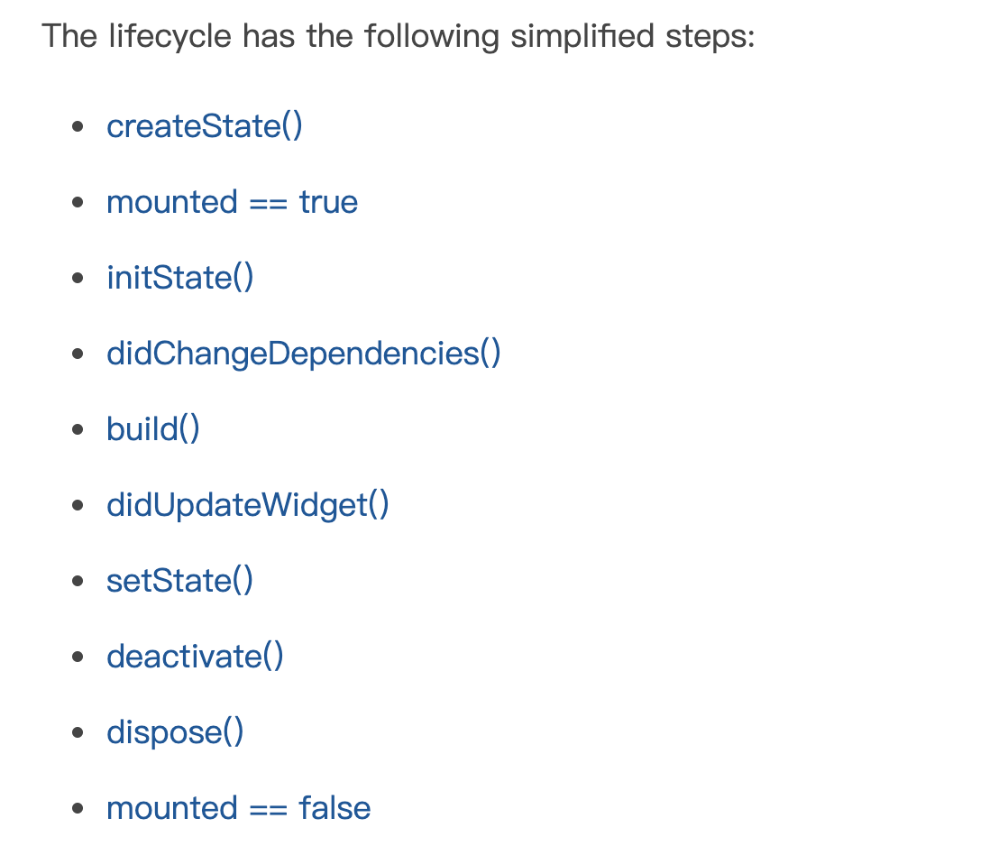

# flutter Note

[flutter sdk](https://api.flutter.dev/index.html)

[Cookbook: Useful Flutter samples](https://flutter.dev/docs/cookbook)

外部package：https://pub.dartlang.org/flutter/

## layout

[Understanding constraints](https://flutter.dev/docs/development/ui/layout/constraints)


- A widget gets its own **constraints** from its **parent**. A *constraint* is just a set of 4 doubles: a minimum and maximum width, and a minimum and maximum height.
- Then the widget goes through its own list of **children**. One by one, the widget tells its children what their **constraints** are (which can be different for each child), and then asks each child what size it wants to be.
- Then, the widget positions its **children** (horizontally in the `x` axis, and vertically in the `y` axis), one by one.
- And, finally, the widget tells its parent about its own **size** (within the original constraints, of course).  可见widget的实际大小由它的child size，自己的属性设置（提供了设置大小属性的widget），共同决定，当然size的最终结果要在constraints之内。

屏幕要求它子元素必须占满整个屏幕，所以比如直接返回container(100*100)仍然会占满。加上center后，就是center占满整个屏幕，container作为center的child，就可以任意大小（center没有对它施加constraints）。

ConstrainedBox给从父亲那继承来的constraints加上了额外的要求，传个它的儿子，但比如一个ConstrainedBox在screen下，那么它就被要求占满屏幕，从而忽略constraints属性。

一些限制大小的widget

- Container() 要求孩子不大于它父亲传给它的constraint

  Container会要求自己的孩子也占满自己，如果没有padding的话。

- ConstrainedBox(maxWidth: ,minWidth: ,maxHeight: ,minHeight:) 给孩子加上额外的constraint

- UnconstrainedBox() 没有constraint给它的孩子

- Row与Column 也没有constraint给它的孩子

- 如果使用Expanded，Expanded的size由其余孩子的大小决定，Expanded包裹的widget的大小会被忽略。

Tight vs. loose constraints

Tight: 让widget的max... min... 一样大。

loose: 让widget的min... 变为0。


[Tutorials: First steps with Flutter - Part 2: Building layouts](https://pusher.com/tutorials/flutter-building-layouts/)

[row-column-cheat-sheet](https://medium.com/jlouage/flutter-row-column-cheat-sheet-78c38d242041) (similar to CSS flex box)

## widget

flutter中大部分东西都是widget，包括对齐，填充，布局等等。

widget主要工作是提供一个`build()`方法来描述如何根据其他较低级别的widget来显示自己。

widget分stateless与stateful两种。

### life cycle



## Theme

[ThemeData class](https://api.flutter.dev/flutter/material/ThemeData-class.html)

# Dart Note

[Dart语言概览](https://dart.cn/guides/language/language-tour)

[online dart execute](https://dartpad.cn/?null_safety=true)

## 风格指南

ref: [Effective Dart](https://dart.cn/guides/language/effective-dart)

1. Classes（类名）、 enums（枚举类型）、 typedefs（类型定义）、以及 type parameters（类型参数）应该把每个单词的首字母都大写（包含第一个单词），不使用分隔符。
2. 在库，包，文件夹，源文件中使用 lowercase_with_underscores 方式命名。
3. 类成员、顶级定义、变量、参数以及命名参数等 *除了*第一个单词，每个单词首字母都应大写，并且不使用分隔符。
4. 使用 `lowerCamelCase` 来命名常量，包括枚举的值。

### philosophy

- 任何你能放在一个variable（变量）中的东西是一个object（对象），每一个对象都是一个类（class）的实例，数字，函数和null都是对象（object）。

- Dart 支持泛型，比如 `List<int>`（表示一组由 int 对象组成的列表）或 `List<Object>`（表示一组由任何类型对象组成的列表）

- Dart 支持顶级函数（例如 `main` 方法），同时还支持定义属于类或对象的函数（即 *静态* 和 *实例方法*）。你还可以在函数中定义函数（*嵌套* 或 *局部函数*）。


## basic

注释：//

## 基本类型

### String

format string: 'string${variable}string'

## 变量

`var variable_name;`

变量声明后加上问号（?）表示为可空。

> Dart支持类型推断，因此大多数变量不需要显式地指定类型：

如果确认某个变量值不会更改：`final variable_name;`

final只可被赋值一次。

const and final

var vs dynamic vs final: 

**dynamic:** can change TYPE of the variable, & can change VALUE of the variable later in code.

**var:** *can't change* TYPE of the variable, but can change VALUE of the variable later in code.（类似cpp里的auto）

> if you don't initialize it in declaration,var seems also a dynamic which means that you can change its TYPE

**final:** *can't change* TYPE of the variable, & *can't change* VALUE of the variable later in code.

### 函数

箭头函数 => 用于仅包含一条语句的函数。

(var) => function_body

> 上式等价于 (var) {return function_body;}
>
> 所以dart中的箭头函数和java，cpp中的lambda表达式有区别。准确的说，这不是lambda表达式，而是一种语法糖。

传参：两种参数：必要参数和可选参数，可选参数可以是**命名的**和**位置的**。

命名参数：

调用：调用函数时，可以使用 `参数名: 参数值` 的形式来指定命名参数。

定义：定义函数时，使用 `{param1, param2, …}` 来指定命名参数。

既有必须参数，又有可选参数时，可选参数需用`参数名：参数值`的形式传入，必须参数直接按位置传入。

```dart
void enableFlags({bool? bold, bool? hidden}) {...}
//如果一个参数不能是null，提供一个默认值。
//前面的bool类型也可以去掉
```

### 类

类中私有变量：以下划线开头为其命名。

构造函数

> 构造函数的语法糖：
>
> ```dart
> class A{
> 	final int a;
> 	A(this.a);
> 	//等价于
> 	A(a): a=a{};
> }
> ```

执行顺序：总的来说，这三者的调用顺序如下：初始化列表 => 父类的无参数构造函数 => 当前类的构造函数

必须初始化

getter & setter

实例对象的每一个属性都有一个隐式的 Getter 方法，如果为非 final 属性的话还会有一个 Setter 方法

```dart
int get speed => _speed;

class Rectangle {
  double left, top, width, height;

  Rectangle(this.left, this.top, this.width, this.height);

  // 定义两个计算产生的属性：right 和 bottom。
  double get right => left + width;
  set right(double value) => left = value - width;
  double get bottom => top + height;
  set bottom(double value) => top = value - height;
}
```

每个类都会实现`toString()`方法。

```dart
class Bicycle {
  int cadence;
  int speed;
  int gear;
  //构造函数
  Bicycle(this.cadence, this.speed, this.gear);//等价于
  /*
	Bicycle(int cadence, int speed, int gear) {
  	this.cadence = cadence;
    this.speed = speed;
 		this.gear = gear;
	}
	*/
  //可选参数的构造函数
  Rectangle({this.origin = const Point(0, 0), this.width = 0, this.height = 0});
  //可选命名参数需用大括号括起来
}
//外部调用该构造
var rec = Rectangle(origin: const Point(10, 10), width: 10, height: 10);
var rec = Rectangle(width: 10);
```

抽象类

```dart
abstract class Shape {
  
}
```

#### 继承

Dart 支持单继承。

##### 重写类成员

子类可以重写父类的实例方法（包括 [操作符](https://dart.cn/guides/language/language-tour#_operators)）、 Getter 以及 Setter 方法。你可以使用 `@override` 注解来表示你重写了一个成员：

#### mixin

> Mixin 是一种在多重继承中复用某个类中代码的方法模式。

```dart
class PilotedCraft extends Spacecraft with Piloted {
  //自此，PilotedCraft 类中就包含了 astronauts 字段以及 describeCrew() 方法。
}
```

#### 接口

Dart 没有 `interface` 关键字。相反，所有的类都隐式定义了一个接口。因此，任意类都可以作为接口被实现。

```dart
class MockSpaceship implements Spacecraft {
  // ···
}
```

### 异步

Dart对异步的支持

1. 声明一个 `Future` 时，`Dart` 会将异步任务的函数执行体放入`event queue`，然后立即返回，后续的代码继续同步执行。
2. 当**同步执行的代码执行完毕**后，`event queue`会按照加入`event queue`的顺序（即声明顺序），依次取出事件，最后同步执行 `Future` 的函数体及后续的操作。

定义一个异步的函数，在函数名后，函数体前加上关键字 async

```dart
Future<void> main() async { ··· }
```

异步函数会返回一个Future对象——Future\<T\>，其中 T是函数返回的类型。

await关键字

> 只能在async函数中调用

之后调用异步函数时，如果想要让这个**函数执行完**再执行之后的代码，就在函数调用前加上await，这会返回一个complete的Future对象。
