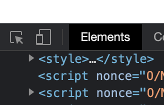

This note is based on [tutorials for Web developers](https://developer.mozilla.org/en-US/docs/Web/Tutorials), SJTU SE2321-1。
## Tips
1. 简言之，文件名中应使用连字符。谷歌搜索引擎把连字符当作单词的分隔符， 但不会识别下划线。基于此，最好在一开始就养成习惯，**文件夹和文件名使用小写，用短横线而不是空格来分隔。** 可以避免许多问题。

## HTML
注释 `<!--  -->`
原意字符|等价字符引用
:---:|:---:
<|`&lt;`
"|`&quot;`
'|`&apos;`
&|`&amp;`
\||`&gt;`
> <a hrel="https://validator.w3.org/">HTML调试</a>

基本格式


### 标签

HTML的标签不区分大小写
### 元素

[HTML元素参考](https://developer.mozilla.org/zh-CN/docs/Web/HTML/Element)

   - [块级元素](https://developer.mozilla.org/zh-CN/docs/Web/HTML/Block-level_elements)——相对于其前面的内容它会出现在新的一行，其后的内容也会被挤到下一行展现。
   - [内联元素](https://developer.mozilla.org/zh-CN/docs/Web/HTML/Inline_elements)——通常出现在块级元素中并环绕文档内容的一小部分，而不是一整个段落或者一组内容。内联元素不会导致文本换行
   - 空元素（只有一个标签，通常用来在此元素所在位置插入/嵌入一些东西） ``

### 元数据

添加在`<head>`中，包括`<title> <meta>等等`
meta:
- name content 其中`name="description" content=""`会显示在搜索引擎的搜索页面中  查看页面源码时还有可能看到`og:image og:description twitter:title`之类的name，当你在 Facebook或者Twitter 上链接到 MDN 时，该链接将显示一个图像和描述：这为用户提供更丰富的体验。
- charset 设置页面编码，比如`utf-8`

link:添加图标，样式表等

### 元素的属性


- 属性名称（属性名称与元素名以及属性名称之间有空格）
- 属性值在引号之中 单引号双引号皆可，但不可以混用，且双引号中可以嵌套单引号
- 布尔属性。该属性只有只可以有与其属性名一样的属性值，比如input的disabled
### 超链接
通过将文本或其他内容，比如<strong>图片</strong>转换为`<a>`内的元素来创建基本链接。`href`用来指定路径
超链接除了链接到文档外，还可以链接到HTML文档的特定部分
>`<a href="index.html#id">`链接到index文档id部分
`<a href="#id">`链接到本文档特定部分
其中id为元素的id属性值。
### 文字排版
1. 语义的重要性。使用`<strong>`与`<b>`、`<em>`与`<i>`的区别
2. `h1 ~ h6`标题
3. `p`表示文字内容
4. `ol`有序列表 `ul`无序列表 每一项为`li`
5. `dl`描述列表 每一项`dt`表示头，`dd`是具体描述，可以有多项。
6. `blockquote`块引用 `q`行内引用 `cite`属性里用URL来指向引用的资源 为引用添加链接 使用 `cite` 元素并用`a`附上链接
   
   > <p>According to the <a href="https://developer.mozilla.org/en-US/docs/Web/HTML/Element/blockquote"><cite>MDN blockquote page</cite></a></p>
7. `abbr`为网页添加缩略语，鼠标移至文字上遍会显示title中的内容。
   
   > <abbr title="超文本标记语言（Hyper text Markup Language）">HTML</abbr>
8. `sup`上标 `sub`下标
9. 代码
    <ul>
       <li><code>code</code> 标记计算机通用代码</li>
       <li><code>pre</code> 保留空白字符，如果您将文本包含在<code>pre</code>标签中，那么空白将会以与你在文本编辑器中看到的相同的方式渲染出来。</li>
       <li><code>var</code>标记具体变量名。
       <li><code>samp</code>标记程序输出</li>
    </ul> 
10. `br`段落中换行 `hr`文档中生成一条水平分割线
###  HTML布局
- `<main>` 存放每个页面独有的内容。每个页面上只能用一次 `<main>`，且直接位于 `<body>` 中。最好不要把它嵌套进其它元素。
- `<article>` 包围的内容即一篇文章，与页面其它部分无关（比如一篇博文）。
- `<section>` 与 `<article>` 类似，但 `<section>` 更适用于组织页面使其按功能（比如迷你地图、一组文章标题和摘要）分块。一般的最佳用法是：以 标题 作为开头；也可以把一篇 `<article>` 分成若干部分并分别置于不同的 `<section>` 中，也可以把一个区段 `<section>` 分成若干部分并分别置于不同的 `<article>` 中，取决于上下文。
- `<aside>` 包含一些间接信息（术语条目、作者简介、相关链接，等等）。
- `<header>` 是简介形式的内容。如果它是 `<body>` 的子元素，那么就是网站的全局页眉。如果它是 `<article>` 或 `<section>` 的子元素，那么它是这些部分特有的页眉（此 `<header>` 非彼 标题）。
- `<nav>` 包含页面主导航功能。其中不应包含二级链接等内容。
- `<footer>` 包含了页面的页脚部分。
- `div` 块级无语义元素 `span` 内联无语义元素 配合class属性使得CSS与JavaScript易于查询。

## CSS

[CSS参考](https://developer.mozilla.org/zh-CN/docs/Web/CSS/Reference) MDN

[CSS参考](https://www.w3school.com.cn/cssref/index.asp) W3school

> CSS: 层叠式样式表

三种方式插入样式表：
1. 外部引入css文件`<link rel="stylesheet" href="styles/producit.css">`
2. 内部样式表，写在html head中。
   ```html
   <head>
      <style>
         ...
      </style>
   </head>
   ```
3. inline style `<style="...">`

有优先级，有inline的不用另外两个的。对于内部与外部引入css文件，取决于谁在前面。(`<style>`和`<link rel="stylesheet">`谁在前面)

注释/*  */
基本格式


### 选择器种类

> css selector

|选择器名称|选择的内容|示例|
|:---:|:---:|:---:|
| 元素选择器（也称作标签或类型选择器） | 所有指定(该)类型的 HTML 元素  | p 选择 `<p>`  |
| ID 选择器 | 具有特定 ID 的元素（单一 HTML 页面中，每个 ID 只对应一个元素，一个元素只对应一个 ID） | #my-id 选择 `<p id="my-id">` 或 `<a id="my-id">`|
| 类选择器| 具有特定类的元素（单一页面中，一个类可以有多个实例）| .my-class 选择 `<p class="my-class">` 和 `<a class="my-class">` p.my-class 仅选择`<p class="my-class">`|
| 属性选择器 | 拥有特定属性的元素 | `img[src]` 选择 ``而不是 `` |
| 伪（Pseudo）类选择器 | 特定状态下的特定元素（比如鼠标指针悬停）| `a:hover` 仅在鼠标指针悬停在链接上时选择 `<a>`。|

- 多个选择器同样的样式：`p,a,ul`

- 包含选择：`p em`选中p中所有的em包括儿子孙子。。。 `p > em`选中p的直接的em儿子
- 相邻选择：`h1 + p`选中h1和紧邻h1的p
- 冲突时 更为具体的选择器会被采纳

1. 函数 `calc()`,`<transform> rotate()`
2. [@rules](https://developer.mozilla.org/en-US/docs/Web/CSS/At-rule)
3. css的布局是根据盒模型的每个占据页面空间的块都有
    - padding：即内边距，围绕着内容（比如段落）的空间。
    - border：即边框，紧接着内边距的线。
    - margin：即外边距，围绕元素外部的空间。
    

### 弹性体布局
[阮一峰的博客](http://www.ruanyifeng.com/blog/2015/07/flex-grammar.html) 骰子布局的例子很有借鉴意义


> 建议都去参考阮dl的博客吧
> 主要用到的对齐属性：`align-items` `justify-content` `align-self`
> 图片尽量用`<div>`罩起来。

设置了`display: flex`的父元素，被称为flex container。
容器中表现为柔性的盒子的元素称为`flex item`
#### 属性
- `flex-flow`是`flex-direction`和`flex-wrap`的缩写
  `flex-direction` 指定了内部元素是如何在flex中布局的。row column
  `flex-wrap` 指定flex单行显示还是多行显示。nowrap wrap
- `flex`可以指定最多三个不同的值的缩写属性
  `flex-grow` flex容器中剩余空间的多少应该分配给项目。是一个比例。
  `flex-shrink` 超出空间时该如何收缩。
  `flex-basis`  flex 元素在主轴方向上的初始大小。
- `align-items` 
  - 默认的值是 stretch，其会使所有 flex 项沿着交叉轴的方向拉伸以填充父容器。如果父容器在交叉轴方向上没有固定宽度（即高度），则所有 flex 项将变得与最长的 flex 项一样长（即高度保持一致）。我们的第一个例子在默认情况下得到相等的高度的列的原因。
  - 我们使用的 center 值会使这些项保持其原有的高度，但是会在交叉轴居中。这就是那些按钮垂直居中的原因。
- `justify-content` 控制 flex 项在主轴上的位置。
   - 默认值是 flex-start，这会使所有 flex 项都位于主轴的开始处。
   - 也可以用 flex-end 来让 flex 项到结尾处。
   - center 在 justify-content 里也是可用的，可以让 flex 项在主轴居中。
   - 而我们上面用到的值 space-around 是很有用的——它会使所有 flex 项沿着主轴均匀地分布，在任意一端都会留有一点空间。
   - 还有一个值是 space-between，它和 space-around 非常相似，只是它不会在两端留下任何空间。
- 弹性盒子也有可以改变 flex 项的布局位置的功能，而不会影响到源顺序（即 dom 树里元素的顺序）。
  order 默认的 order 值是 0。order 值大的 flex 项比 order 值小的在显示顺序中更靠后。相同 order 值的 flex 项按源顺序显示。
### fontawesome
在网页中使用fontawesome：
1. 到[fontawesome官网](https://fontawesome.com)官网上找到你的个人主页，找到**fontawesome CDN**，将该CDN加入你的html文件的head中。
2. 搜索你想要的icon，复制其html，比如这样`<i class="fas fa-file-invoice-dollar"></i>`，加入到你想要加入的地方。

### 修改CSS的一些经验

很多框架会有一些默认的CSS，而且会有特定的class名，要改变这些CSS首先要找到其对应的class和CSS文件定义了这个你要更改的属性（因为CSS会取描述最准确的那个，所以仅找到class然后加一个对应的CSS往往是不够的，因为会有class1 > class2 class3 {...}这样，所以尽量找到默认CSS的名字（有可能是less文件之类的））然后添加对应的CSS项。

如何快速找到某个组件的CSS，以Google Chrome为例：

1. 先用这个箭头选择组件。



2. 利用这个，点击下面对应的选项，找到对应属性所在的css文件。

   

3. 有些样式是特定动作下才能生效的比如`:hov`，这时就可以用 Force element state选项。

   

## Web API

- load

当整个页面及所有依赖资源如样式表和图片都已完成加载时，将触发`load`事件。

- Document: DOMContentLoaded 事件

当纯HTML被完全加载以及解析时，**`DOMContentLoaded`** 事件会被触发，而不必等待样式表，图片或者子框架完成加载。

## dom

### 获取元素

`var x = document.getElementById("id_name")`
`var y = x.getElementsByTagName("P")`这说明document get后的返回值也是一棵dom树。
`var x = document.getElementsByClassName("intro");`
`getElementsByTagName()` 方法返回 `HTMLCollection` 对象。

### 动态改变html

> 先要获取dom中的元素，再调用元素的方法

#### 改变html的值

`document.getElementById(id).innerHTML=新的 HTML`

#### 改变html的属性

`document.getElementById(id).attribute=新属性值`

> attribute即为html元素的属性值 比如更改图片就改变img中的src

#### 改变css

`document.getElementById(id).style.property=新样式`

### 添加节点

```javascript
//先创建节点
var para = document.createElement("p");
//再将该节点加到其他节点中
//添加新元素到尾部
//element是父节点
element.appendChild(para);
//添加新元素到头部
element.insertBefore(para);
//替换元素
element.replaceChild(new_nodw, previous_node)
```

#### 移除节点

```javascript
node = document.getElementById("id");
parent.removeChild(node);
```

### 事件

事件是html元素的属性

1. 直接写
   `document.getElementById(id).onclick=function()`
2. 使用dom分配
   `document.getElementById("myBtn").onclick=function(){displayDate()};`

#### 事件监听

`element.addEventListener(event, function, useCapture);`

- 可以向一个元素添加多个事件句柄。
- 可以向同个元素添加多个同类型的事件句柄，如：两个 "click" 事件。
- 可以向任何 DOM 对象添加事件监听，不仅仅是 HTML 元素。如： window 对象。
- **使用 addEventListener() 方法时, JavaScript 从 HTML 标记中分离开来，可读性更强， 在没有控制HTML标记时也可以添加事件监听。**

function

1. 无参数直接传递 `element.addEventListener("click", myFunction)` 外部实现myfunction
2. 有参数使用匿名函数传递 `element.addEventListener("click", function(){ myFunction(p1, p2); });`

[HTML DOM event list](https://www.runoob.com/jsref/dom-obj-event.html)
