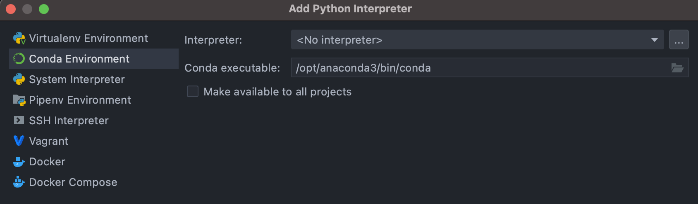
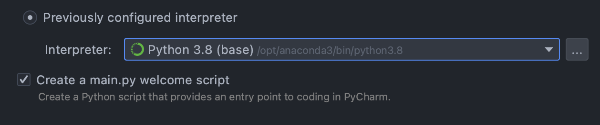

# python

## Python Concept

- `CPython` is the *original* Python implementation. It is implemented in C.

- `IronPython` - **C# implementation of python**, targeting the .NET framework

- `Ruby Python` - works with Ruby platform

- `Anaconda Python` - **Distribution of python and R programming languages for scientific computing** like, *data science, machine learning, artificial intelligence, deep learning, handling large volume of data* etc. Numerous number of *libraries like, scikit-learn, tensorflow, pytorch, numba, pandas, jupyter, numpy, matplotlib etc.* are available with this package

  > It bundles CPython with several packages, especially ones that are useful for scientific computing

- `Stackless` - **Python for Concurrency**

### pip install vs conda install

Pip installs Python packages whereas conda installs packages which may contain software written in any language. For example, before using pip, a Python interpreter must be installed via a system package manager or by downloading and running an installer. Conda on the other hand can install Python packages as well as the Python interpreter directly.

## setup

pycharm中使用anaconda

1. 新建project时，选择previous interpreter

   

2. add interpreter中找到anaconda的python

   




也可以直接在设置中更改python的interpreter。


Q1:conda的作用是什么呢？

conda的作用是什么呢？其实就是venv+pip的作用，也就是虚拟环境+包管理。

conda将几乎所有的工具、第三方包都当作package进行管理，甚至包括python 和conda自身。Anaconda是一个打包的集合，里面预装好了conda、某个版本的python、各种packages等。

### Conda

conda list 查看安装了哪些包

conda env list 查看当前都有哪些虚拟环境

conda create -n your_env_name python=x.x [包名，比如numpy]   以python x.x创建虚拟环境，并安装这些包（也可以之后再安装），我的新环境似乎会自动安装pip，所以之后都用pip即可

conda activate environment_name  激活某个虚拟环境

conda deactivate  退出当前环境回到base

conda remove --name environment_name --all   删除环境包括其所有的包

## basic

注释：#

块注释：'''...''' """..."""

### 获取帮助

直接命令行中输入 dir(对象) 返回这个对象的属性和方法

help(函数名)

### import

```python
import math #导入库，使用库中的函数math.sqrt()
from math import sqrt #可直接使用sqrt()，但有可能导致名字冲突
import 库 as 库的别名
```

more advanced:

1. `import module_name`

   在这种情况下，Python会在两个地方寻找这个模块，第一是sys.path，第二就是运行文件所在的目录。

   > 最好不要用上述方法导入同目录下的文件！因为这可能会出错。
   >
   > e.g.
   >
   > ./m1.py:
   >
   > ```python
   > from pk1 import md1
   > ```
   >
   > ./pk1/md1.py
   >
   > ```python
   > import md2
   > ```
   >
   > 此时直接运行m1.py就会报错，因为它引用了md1，md1直接引用了md2，但是md2不在它的目录下。改成下面这样就可以：
   >
   > ```python
   > from . import md2
   > ```

2. `from package_name import module_name`

#### 总结

对于非运行入口文件：需要使用相对导入

运行入口文件：个人理解：直接可以python filename.py执行的文件，里面类似脚本一样会写一些可以直接执行的东西

因为非运行入口文件是要被其他文件用来导入的，所以需要相对导入以避免上面所述的那种情况。

Q：运行入口文件是否可以相对导入呢？e.g.

```python
from .pk1 import md1
md1.foo()
```

A：可以，但是不能使用`python m1.py`直接运行。

直接运行会报错：`ModuleNotFoundError: No module named '_main_.pk1'; '__main__' is not a package`

要到当前m1文件的parent目录下运行`python -m parent_directory_name.m1`

> 因为m1.py中的`from .Branch import m3`中的`.` ，解释器并不知道是哪一个package。使用`python -m Tree.m1`，解释器就知道`.`对应的是Tree这个package。 

### 添加路径

sys.path

- 临时加入路径：

```python
import sys
sys.path.append('$path')
# NOTE: you cannot use ~ for /Users/weixinpeng
```

- 永久加入路径

使用pth文件，在 site-packages 文件（可以查看sys.path找到改文件夹的位置，比如对于我的prp环境，改文件夹的位置就在`/opt/anaconda3/envs/prp/lib/python3.8/site-packages`）中创建 .pth文件，将模块的路径写进去，一行一个路径。

### 输出重定向

```python
import sys
f = open('output.txt', 'a')
sys.stdout = f
sys.stderr = f
print("hello",file=f)
f.close()
```

### exception handling

```python
try:
    # some commands
except (TypeError, ZeroDivisionError): # handle specific Error
except Exception as e: # handle rest Error
else: # if the code block inside the try can run without Error, else will be excuted
```


### 执行系统指令

1. os.system('$cmd')

    > deprecated since version 2.6. Subprocess is the right module to use. from [here](https://unix.stackexchange.com/questions/238180/execute-shell-commands-in-python)

2. subprocess

## 内置类型

### list

访问最后一个元素 `list_var[-1]` (`list_var[-n]`等价于`list_var[len(list_var) - n]`)

list append的性能比numpy的好

`len(list_var)`获取list长度

#### list comprehensions

> 列表推导

`newList = [ expression(element) for element in oldList if condition ] `

#### map

`list(map(lambda_expression, list_variable))`

需要用list再collect回一个list

#### filter

simliar to map, but the lambda expression should return a boolean

### dict

#### 遍历

```python
for key in dict_var:
for value in dict_var.values():
for key, value in dict_var.items():
```

### string

格式化字符串：

1. `f'{v1} content {v2} content {v3}'`
2. `{}.format()`

## 循环

1. for

```python
for it in list_variable:
  pass
# 一次遍历两个元素
it = iter(list_variable)
for item in it:
	print(item, next(it))
```

## 条件与分支

1. 条件

In python: `and`  is  `&&`, `or`  is  `||`,  `!` is not

if expression in one line: `A if some_condition else B `

how to check if a variable is true: `if variable` and `if not variable`

> better than  `if variable == True`  or `if variable is True` from [here](https://switowski.com/blog/checking-for-true-or-false)


## 函数

给函数参数注解

```python
def add(x:int, y:int) -> int:
    return x + y
```

python解释器不会对这些注解添加任何的语义。它们不会被类型检查，运行时跟没有加注解之前的效果也没有任何差距。 然而，对于那些阅读源码的人来讲就很有帮助啦。

### 传参

position argument，keyword argument

keyword arguments must be after position arguments.

### 变长参数

`*args` 以一个array的形式传入

`**kwargs` 以一个dict的形式传入

### lambda表达式


# Key word

## pass

占位语句，比如在Python中定义一个空函数会报错，但还没想好这个函数要干嘛，那么就可以在函数体里写上pass

```python
def fun():
  pass
```

## with

```python
with expression [as variable]:
    with-block
```

with 语句适用于对资源进行访问的场合，确保不管使用过程中是否发生异常都会执行必要的“清理”操作，释放资源，比如文件使用后自动关闭、线程中锁的自动获取和释放等。


